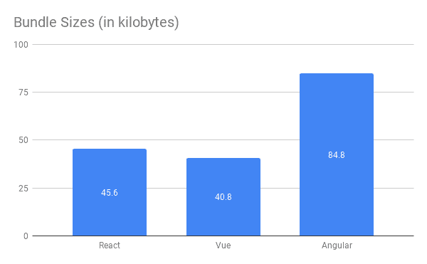
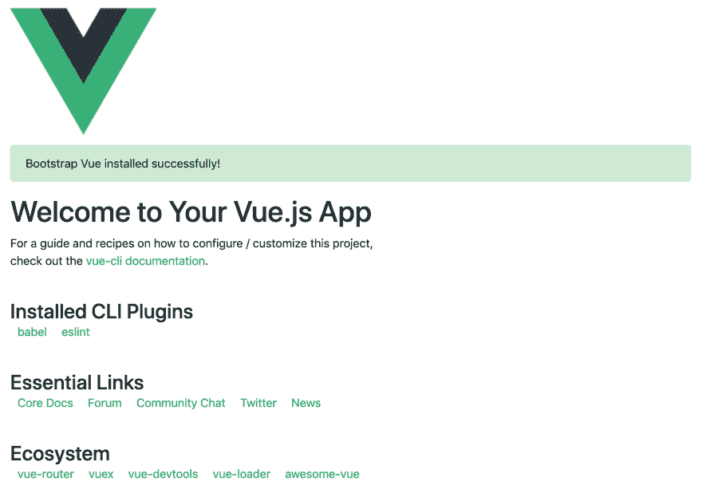
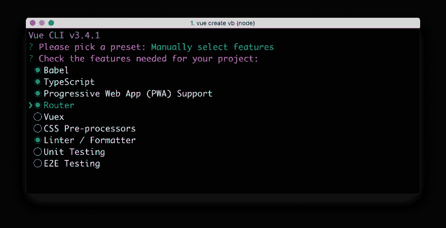
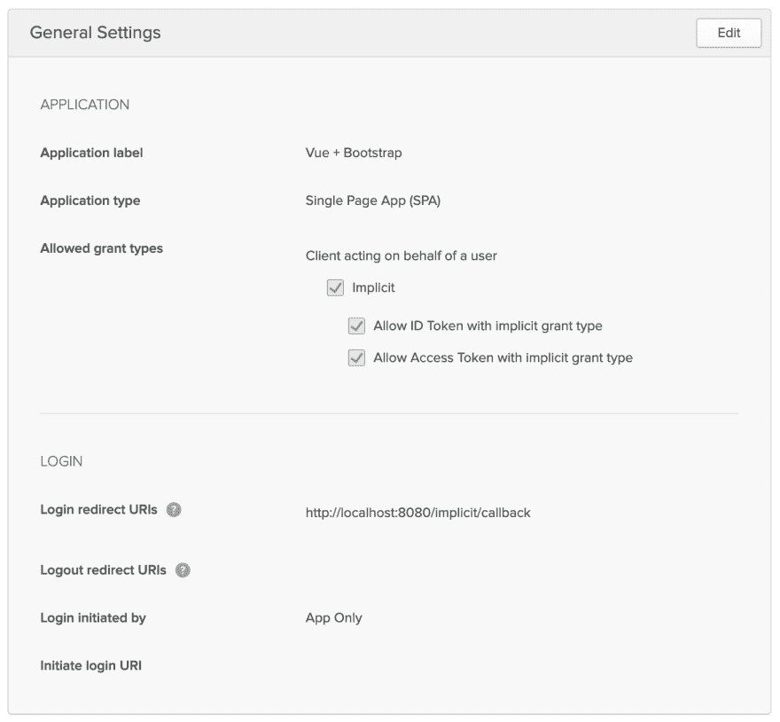
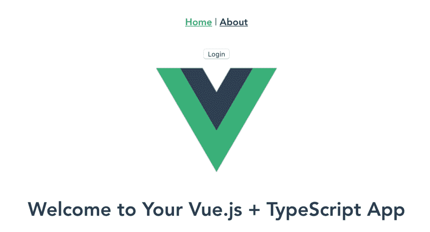

# 将 Schematics 与 Vue 配合使用，并在 5 分钟内添加身份验证

> 原文：<https://dev.to/oktadev/use-schematics-with-vue-and-add-authentication-in-5-minutes-42cm>

Schematics 是 Angular 团队提供的一个工具，它允许您使用代码操作项目。您可以创建文件，更新现有文件，并向任何具有`package.json`文件的项目添加依赖项。没错，Schematics 不只是针对有角度的项目！

在这篇文章中，我将向您展示如何使用 Schematics 来修改用 Vue CLI 创建的项目。为什么是 Vue？因为它快速高效。它的默认束尺寸小于 Angular 和 React too！

[](https://res.cloudinary.com/practicaldev/image/fetch/s--JafAcQBC--/c_limit%2Cf_auto%2Cfl_progressive%2Cq_auto%2Cw_880/https://developer.okta.com/assets-jekyll/blog/vue-schematics/bundle-sizes-cb93a16b1e7d7cfc3e060b7f18d6cbbdd2bec3ba92c4de2d6898d818fa8fdd00.png)

参见[JavaScript 框架的基线成本](https://blog.uncommon.is/the-baseline-costs-of-javascript-frameworks-f768e2865d4a)了解更多关于 Vue 速度的信息。我也认为 Vue 激发了《连线》杂志的一篇文章很酷:[挑战谷歌和脸书的独立 JavaScript 开发者](https://www.wired.com/story/the-solo-javascript-developer-challenging-google-facebook/)。

Bootstrap 是一个流行的 CSS 框架，Vue 通过 [BootstrapVue](https://bootstrap-vue.js.org/) 支持它。在本教程中，您将学习如何创建集成 BootstrapVue 的原理图。这是一个简单的例子，我将包括单元测试和集成测试技巧。

## 原理图:用代码操纵项目

Angular DevKit 是 GitHub 上的 [Angular CLI 项目的一部分。DevKit 提供了可用于管理、开发、部署和分析代码的库。DevKit 有一个`schematics-cli`命令行工具，可以用来创建自己的原理图。](https://github.com/angular/angular-cli)

要创建 Schematics 项目，首先安装 Schematics CLI:

```
npm i -g @angular-devkit/schematics-cli@0.13.4 
```

然后运行`schematics`创建一个新的空项目。将其命名为`bvi`作为 Bootstrap Vue Installer 的缩写。

```
schematics blank --name=bvi 
```

这将创建一个`bvi`目录并安装项目的依赖项。有一个`bvi/package.json`处理你的项目的依赖关系。还有一个`src/collection.json`，它定义了原理图的元数据。

```
{  "$schema":  "../node_modules/@angular-devkit/schematics/collection-schema.json",  "schematics":  {  "bvi":  {  "description":  "A blank schematic.",  "factory":  "./bvi/index#bvi"  }  }  } 
```

你可以看到`bvi`示意图指向`src/bvi/index.ts`中的一个工厂功能。打开它，你会看到下面的内容:

```
import { Rule, SchematicContext, Tree } from '@angular-devkit/schematics';

export function bvi(_options: any): Rule {
  return (tree: Tree, _context: SchematicContext) => {
    return tree;
  };
} 
```

`src/bvi/index_spec.ts`还有一个测试。

```
import { Tree } from '@angular-devkit/schematics';
import { SchematicTestRunner } from '@angular-devkit/schematics/testing';
import * as path from 'path';

const collectionPath = path.join(__dirname, '../collection.json');

describe('bvi', () => {
  it('works', () => {
    const runner = new SchematicTestRunner('schematics', collectionPath);
    const tree = runner.runSchematic('bvi', {}, Tree.empty());

    expect(tree.files).toEqual([]);
  });
}); 
```

Schematics 的一个优点是它们不会对文件系统执行任何直接操作。相反，您指定针对`Tree`的动作。`Tree`是一个数据结构，包含一组已经存在的文件和一个暂存区(包含新的/更新的代码的文件)。

## 用 Vue 构建原理图

如果你熟悉原理图，你可能见过它们被用来操纵角度项目。Schematics 对 Angular 有很好的支持，但是如果你编码正确，它们可以在任何项目上运行！你可以只寻找`package.json`和一个通用的文件结构，而不是寻找角度细节。生成项目的 CLI 工具使这变得容易得多，因为您知道文件将在哪里创建。

## 添加与原理图的依赖关系

[BootstrapVue 文档](https://bootstrap-vue.js.org/docs)提供安装说明。这些是您将使用`bvi`原理图自动完成的步骤。

1.  `npm i bootstrap-vue bootstrap`
2.  导入并注册`BootstrapVue`插件
3.  导入引导程序的 CSS 文件

您可以使用 [Schematics 实用程序](https://nitayneeman.github.io/schematics-utilities/)来自动添加依赖关系，等等。

首先打开一个终端窗口，在您创建的`bvi`项目中安装`schematic-utilities`。

```
npm i schematics-utilities 
```

更改`src/bvi/index.ts`以添加`bootstrap`和`bootstrap-vue`作为`addDependencies()`函数的依赖项。从 main 函数调用此方法。

```
import { Rule, SchematicContext, Tree } from '@angular-devkit/schematics';
import { addPackageJsonDependency, NodeDependency, NodeDependencyType } from 'schematics-utilities';

function addDependencies(host: Tree): Tree {
  const dependencies: NodeDependency[] = [
    { type: NodeDependencyType.Default, version: '4.3.1', name: 'bootstrap' },
    { type: NodeDependencyType.Default, version: '2.0.0-rc.13', name: 'bootstrap-vue' }
  ];
  dependencies.forEach(dependency => addPackageJsonDependency(host, dependency));
  return host;
}

export function bvi(_options: any): Rule {
  return (tree: Tree, _context: SchematicContext) => {
    addDependencies(tree);
    return tree;
  };
} 
```

## 创建、复制和更新文件

创建一个`src/bvi/templates/src`目录。您将在这个目录中创建模板，这些模板已经有了必要的引导 Vue 导入和初始化。

添加一个`App.vue`模板，并将下面的引导代码放入其中。

```
<template>
  <div id="app" class="container">
    
    <b-alert variant="success" show>Bootstrap Vue installed successfully!</b-alert>
    <HelloWorld msg="Welcome to Your Vue.js App"/>
  </div>
</template>

<script>
import HelloWorld from './components/HelloWorld.vue'

export default {
  name: 'app',
  components: {
    HelloWorld
  }
}
</script> 
```

在 Bootstrap Vue 导入和注册的同一个目录下创建一个`main.js`文件。

```
import Vue from 'vue'
import App from './App.vue'
import BootstrapVue from 'bootstrap-vue'
import 'bootstrap/dist/css/bootstrap.css'
import 'bootstrap-vue/dist/bootstrap-vue.css'

Vue.use(BootstrapVue)
Vue.config.productionTip = false

new Vue({
  render: h => h(App),
}).$mount('#app') 
```

修改`src/bvi/index.ts`中的`bvi()`函数，复制这些模板并覆盖现有文件。

```
import { Rule, SchematicContext, Tree, apply, url, template, move, forEach, FileEntry, mergeWith, MergeStrategy } from '@angular-devkit/schematics';
import { addPackageJsonDependency, NodeDependency, NodeDependencyType } from 'schematics-utilities';
import { normalize } from 'path';

function addDependencies(host: Tree): Tree {
  const dependencies: NodeDependency[] = [
    { type: NodeDependencyType.Default, version: '4.3.1', name: 'bootstrap' },
    { type: NodeDependencyType.Default, version: '2.0.0-rc.13', name: 'bootstrap-vue' }
  ];
  dependencies.forEach(dependency => addPackageJsonDependency(host, dependency));
  return host;
}

export function bvi(_options: any): Rule {
  return (tree: Tree, _context: SchematicContext) => {
    addDependencies(tree);

    const movePath = normalize('./src');
    const templateSource = apply(url('./templates/src'), [
      template({..._options}),
      move(movePath),
      // fix for https://github.com/angular/angular-cli/issues/11337
      forEach((fileEntry: FileEntry) => {
        if (tree.exists(fileEntry.path)) {
          tree.overwrite(fileEntry.path, fileEntry.content);
        }
        return fileEntry;
      }),
    ]);
    const rule = mergeWith(templateSource, MergeStrategy.Overwrite);
    return rule(tree, _context);
  };
} 
```

## 测试您的 BootstrapVue 安装程序

为了向`package.json`添加依赖项，您必须在您的测试中提供一个。幸运的是，TypeScript 2.9 添加了 JSON 导入，因此您可以创建一个可测试版本的`package.json`(由 Vue CLI 生成)并在运行测试之前将其添加到`Tree`。

在`bvi/tsconfig.json`文件中，在编译器选项下，添加这两行:

```
{  "compilerOptions":  {  "resolveJsonModule":  true,  "esModuleInterop":  true  }  } 
```

在与`index_spec.ts`相同的目录下创建`vue-pkg.json`。

```
{  "name":  "bvi-test",  "version":  "0.1.0",  "private":  true,  "dependencies":  {  "vue":  "^2.6.6"  },  "devDependencies":  {  "@vue/cli-plugin-babel":  "^3.4.0",  "@vue/cli-plugin-eslint":  "^3.4.0",  "@vue/cli-service":  "^3.4.0",  "babel-eslint":  "^10.0.1",  "eslint":  "^5.8.0",  "eslint-plugin-vue":  "^5.0.0",  "vue-template-compiler":  "^2.5.21"  }  } 
```

现在您可以在您的测试中导入这个文件，并将它添加到一个`UnitTestTree`中。这允许您验证文件及其内容是否已创建。修改`src/bvi/index_spec.ts`以匹配下面的代码。

```
import { HostTree } from '@angular-devkit/schematics';
import { SchematicTestRunner, UnitTestTree } from '@angular-devkit/schematics/testing';
import * as path from 'path';
import packageJson from './vue-pkg.json';

const collectionPath = path.join(__dirname, '../collection.json');

describe('bvi', () => {
  it('works', () => {
    const tree = new UnitTestTree(new HostTree);
    tree.create('/package.json', JSON.stringify(packageJson));

    const runner = new SchematicTestRunner('schematics', collectionPath);
    runner.runSchematic('bvi', {}, tree);

    expect(tree.files.length).toEqual(3);
    expect(tree.files.sort()).toEqual(['/package.json', '/src/App.vue', '/src/main.js']);

    const mainContent = tree.readContent('/src/main.js');
    expect(mainContent).toContain(`Vue.use(BootstrapVue)`);
  });
}); 
```

奔跑吧，当一切都过去的时候，尽情欢乐吧！

## 验证您的 Vue 原理图作品

您可以通过使用 Vue CLI 的默认值创建一个新的 Vue 项目、安装您的原理图并运行它来验证您的原理图是否有效。

如果您还没有安装 Vue CLI，请从安装开始。

```
npm i -g @vue/cli@3.4.1 
```

运行`vue create test`并选择**默认**预设。

运行`npm link /path/to/bvi`来安装你的 BootstapVue 安装程序。您可能需要调整`bvi`项目的路径以适应您的系统。

```
cd test npm link ../bvi 
```

运行`schematics bvi:bvi`，你应该会看到文件正在更新。

```
UPDATE /package.json (956 bytes)
UPDATE /src/App.vue (393 bytes)
UPDATE /src/main.js (287 bytes) 
```

运行`npm install`，然后运行`npm run serve`，享受安装了 Bootstrap 的 Vue 应用程序带来的荣耀！

[](https://res.cloudinary.com/practicaldev/image/fetch/s--fZK0YunA--/c_limit%2Cf_auto%2Cfl_progressive%2Cq_auto%2Cw_880/https://developer.okta.com/assets-jekyll/blog/vue-schematics/vue-with-bootstrap-f2017b117c7acac4c5401ea69d04d808aaf821762e2e8f8276e380c8272148b6.png)

## 带棱角的示意图

Angular CLI 基于原理图，其 PWA 和 Angular Material 模块也是如此。我不会在这里深入讨论特定角度的原理图，你可以阅读[使用角度原理图来简化你的生活](https://dev.to/blog/2019/02/13/angular-schematics)来了解。

本教程包括如何添加提示，如何发布您的原理图的信息，它引用了我帮助开发的一个 [OktaDev Schematics](https://github.com/oktadeveloper/schematics) 项目。这个项目的持续集成使用一个 [`test-app.sh`](https://github.com/oktadeveloper/schematics/blob/master/test-app.sh) 脚本，该脚本使用每个框架各自的 CLI 创建项目。例如，下面的脚本测试创建一个新的 Vue CLI 项目，并安装原理图。

```
elif ["$1" == "vue"] || ["$1" == "v"]
then config=$(cat <<EOF {
  "useConfigFiles": true,
  "plugins": {
    "@vue/cli-plugin-babel": {},
    "@vue/cli-plugin-eslint": {
      "config": "base",
      "lintOn": [
        "save"
      ]
    },
    "@vue/cli-plugin-unit-jest": {}
  },
  "router": true,
  "routerHistoryMode": true
} EOF )
  vue create vue-app -i "$config"
  cd vue-app
  npm install ../../oktadev*.tgz
  schematics @oktadev/schematics:add-auth --issuer=$issuer --clientId=$clientId
  npm run test:unit
fi 
```

这个项目也支持支持 TypeScript 的 Vue 项目。

有时间吗？让我向您展示如何创建一个 Vue + TypeScript 项目，并添加与 OIDC 和 Okta 的认证。

## 使用 Vue Schematics 添加 OpenID Connect 认证

运行`vue create vb`，选择**手动选择功能**，选择**打字稿**、 **PWA** 、**路由器**。

[](https://res.cloudinary.com/practicaldev/image/fetch/s--qqT5chyB--/c_limit%2Cf_auto%2Cfl_progressive%2Cq_auto%2Cw_880/https://developer.okta.com/assets-jekyll/blog/vue-schematics/vue-cli-features-f25068589b6ef5f056824403385796eaa398a4ab7f2fee4df2b8bdf9685d5ae8.png)

这个过程完成后，在 Okta 上创建一个 OIDC 应用程序。

### 在 Okta 上创建 OpenID Connect App

[登录](https://login.okta.com/?SAMLRequest=fc%2B7CsJAEAXQXvAflu1NNJUMeZBGELTx1a%2FrYILJTtyZGD%2FfSBRiYzlw77lMnD3rSj3Qc0ku0YtgrhU6S5fSXRN9PKxmS52l00nMpq6iBvJWCrfDe4ss6vStRe9aDzmGIZfo1jsgwyWDMzUyiIV9vt1AH4XGk5ClSvewUgMNa%2BYW%2FVj5jxhm9NLP67QQaSAMu64L6CYmsFSHlnzT4ZlLwTgcL6Sf8%2FeX9AU%3Dhttps://login.okta.com/?SAMLRequest=fc%2B7CsJAEAXQXvAflu1NNJUMeZBGELTx1a%2FrYILJTtyZGD%2FfSBRiYzlw77lMnD3rSj3Qc0ku0YtgrhU6S5fSXRN9PKxmS52l00nMpq6iBvJWCrfDe4ss6vStRe9aDzmGIZfo1jsgwyWDMzUyiIV9vt1AH4XGk5ClSvewUgMNa%2BYW%2FVj5jxhm9NLP67QQaSAMu64L6CYmsFSHlnzT4ZlLwTgcL6Sf8%2FeX9AU%3D)到您的 Okta 开发者账户，或者[注册](https://developer.okta.com/signup/)如果您没有账户)并导航到**应用** > **添加应用**。点击**单页 App** ，点击**下一个**，给 App 起一个你会记住的名字，点击**完成**。

下一个屏幕应该类似于下图:

[](https://res.cloudinary.com/practicaldev/image/fetch/s--mgLiuwWZ--/c_limit%2Cf_auto%2Cfl_progressive%2Cq_auto%2Cw_880/https://developer.okta.com/assets-jekyll/blog/vue-schematics/okta-oidc-settings-d9f111a9a7ccd0f618524b0c35abc31f573938a0fb915ee42936069d075fb306.png)

返回到您创建`vb`应用程序的终端窗口。导航到目录并运行应用程序，以确保它在端口 8080 上启动。

```
cd vb
npm run serve 
```

**提示:**如果它在端口 8081 上启动，那是因为您已经有一个进程在 8080 上运行。安装 [`fkill-cli`](https://github.com/sindresorhus/fkill-cli) 后可以用`fkill :8080`杀死进程。

停止该过程(Ctrl+C ),并使用以下命令将 OIDC 认证添加到您的应用程序中:

```
npm i @oktadev/schematics@0.7.2
schematics @oktadev/schematics:add-auth 
```

出现提示时，输入您的发行商(可以在 Okta 的仪表板中的 **API** > **授权服务器**下找到)和客户 ID。当安装完成后，运行`npm run serve`，你会惊奇地发现你的 Vue 应用已经通过了认证！

[](https://res.cloudinary.com/practicaldev/image/fetch/s--SlytjVi5--/c_limit%2Cf_auto%2Cfl_progressive%2Cq_auto%2Cw_880/https://developer.okta.com/assets-jekyll/blog/vue-schematics/vue-with-authentication-d0090cbfe342c65a2b645f03e52468e82b0ad0e274d5582ef722e68db7a4b371.png)

点击**登录**，输入你用来注册 Okta 的凭证，你将被重定向回你的应用。这一次，将显示一个**注销**按钮。

## 了解有关 Vue、原理图和安全认证的更多信息

我希望你喜欢学习如何为 Vue 创建原理图。我发现这个 API 非常容易使用，并且对它的测试支持感到惊喜。如果你想了解更多关于 Okta 的 Vue SDK，请看[它的文档](https://github.com/okta/okta-oidc-js/tree/master/packages/okta-vue)。

你可以在 GitHub 上找到本教程[的示例原理图。](https://github.com/oktadeveloper/vue-schematics-example)

我们已经在 Okta 开发者博客上写了一些关于 Schematics 和 Vue 的博文。你可能也会喜欢它们。

*   [使用角度示意图简化你的生活](https://developer.okta.com/blog/2019/02/13/angular-schematics)
*   [使用 Schematics with React 并在 5 分钟内添加 OpenID 连接验证](https://developer.okta.com/blog/2019/03/05/react-schematics)
*   [用 Vue.js 和节点](https://developer.okta.com/blog/2018/02/15/build-crud-app-vuejs-node)构建一个基本的 CRUD App
*   [用 Spring Boot 和 Vue.js 构建一个简单的 CRUD 应用](https://developer.okta.com/blog/2018/11/20/build-crud-spring-and-vue)
*   [与 Spring Boot 和 Vue 一起的美好发展](https://developer.okta.com/blog/2018/12/03/bootiful-spring-boot-java-vue-typescript)
*   [如果不是打字稿，就不性感](https://developer.okta.com/blog/2019/02/11/if-it-aint-typescript)

在 Twitter 上关注 [@oktadev](https://twitter.com/oktadev) 了解更多前沿技术，如 Schematics、Vue 和 TypeScript。我们还向我们的 [YouTube 频道](https://www.youtube.com/c/oktadev)发布截屏。