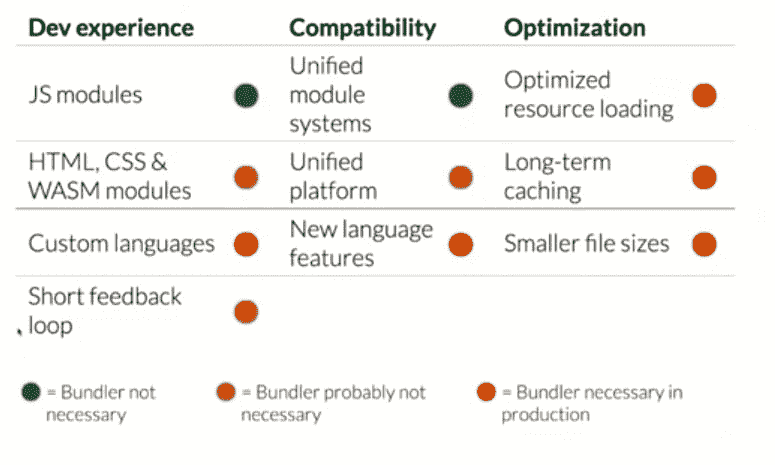

# 使用带有 Web 组件的平台

> 原文：<https://dev.to/grandemayta/use-the-platform-with-web-components-4cfi>

主流浏览器支持许多功能，如类、箭头函数、扩展运算符、模板文字、插入观察器、Web 组件，并且随着 es 模块的引入，我们可以在没有 Webpack 或 Rollup 等模块捆绑器的帮助下开发 Web 应用程序。

> Gabriel Mayta[@ grande Mayta](https://dev.to/grandemayta)随着 ES 模块的引入，也许我们不需要模块捆绑器了。
> 演职员表:约翰内斯·埃瓦尔德
> [#前端](https://twitter.com/hashtag/FrontEnd)[# JavaScript](https://twitter.com/hashtag/javascript)[# web developer](https://twitter.com/hashtag/webdeveloper)09:54am-02 2019 年 4 月[](https://twitter.com/intent/tweet?in_reply_to=1113016962483998720)[](https://twitter.com/intent/retweet?tweet_id=1113016962483998720)1[](https://twitter.com/intent/like?tweet_id=1113016962483998720)4

我知道你在想什么...空谈不值钱，给我看看代码！

所以我创建了一个存储库来与 Web 组件和 ES 模块共享我的测试。
我用 Github 的 API 开发了 3 个 Web 组件:

```
 <github-profile nickname="timbl"></github-profile>
    <github-repositories nickname="timbl"></github-repositories>
    <github-followers nickname="timbl"></github-followers> 
```

如您所见，我添加了昵称属性，我使用该属性从 Rest API 中检索数据。有了 WCs，您可以使用 html 模板来处理要用 JS 加载的标记片段。供您参考，模板内容不是由浏览器呈现的，但可以在以后或运行时实例化。
下面您可以找到个人资料模板:

```
 <template id="github-profile-template">
         <style>
            * {
                margin: 0;
                padding: 0;
                box-sizing: border-box;
            }

            div {
                display: inline-block;
                padding: 20px;
                width: 240px;
                height: 300px;
                border: 2px solid #f0f0f0;
                border-radius: 4px;
                overflow: hidden;
            }
            img {
                width: 100%;
                border-radius: 50%;
            }
            h1 {
                margin-top: 20px;
                font-size: 16px;
                color: #f0f0f0;
                text-transform: uppercase;
                text-align: center;
            }
        </style>
        <div>
            
            <h1></h1>
        </div>
    </template> 
```

下面你可以找到每个 WC 的 javascript 类，你可以看到模板是如何加载的:

### Github 简介