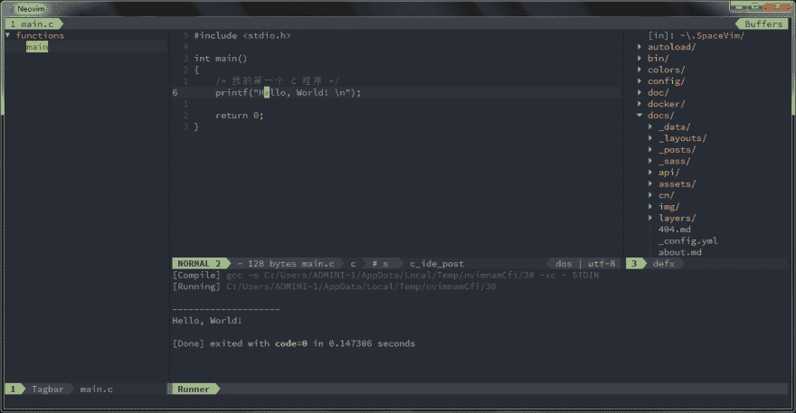

# 使用 Vim 作为 C/C++集成开发环境

> 原文：<https://dev.to/spacevim/use-vim-as-a-c-c-ide-525j>

# 使用 Vim 作为 C/C++ IDE

这是将 SpaceVim 用作 C/C++ IDE 的通用指南，包括层配置和使用。将涵盖以下每个部分:

*   启用语言层
*   代码完成
*   交替文件跳转
*   代码运行
*   代码格式
*   REPL 支持 ###启用语言层

要在 SpaceVim 中添加 C/C++语言支持，需要启用`lang#c`层。按`SPC f v d`打开 SpaceVim 配置文件，添加如下配置:

```
[[layers]]
  name = "lang#c" 
```

要了解更多信息，你可以阅读层文档。

### 代码补全

默认情况下，自动完成层是启用的，所以在加载`lang#c`层后，C/C++语言的代码补全应该可以正常工作。

### 交替文件跳转

要管理项目的替代文件，您可能需要在项目的根目录下创建一个`.project_alt.json`文件。

例如，将以下内容添加到`.project_alt.json`文件中:

```
{
  "*.c": {"alternate": "{}.h"},
  "*.h": {"alternate": "{}.c"}
} 
```

使用这种配置，您可以通过命令`:A`在替代文件之间跳转

### 代码运行

默认的代码运行键绑定是`SPC l r`。它将异步编译和运行当前文件。stdout 将显示在运行缓冲区中。

[](https://res.cloudinary.com/practicaldev/image/fetch/s--JukNKfzS--/c_limit%2Cf_auto%2Cfl_progressive%2Cq_auto%2Cw_880/https://user-images.githubusercontent.com/13142418/58743787-db2bee80-846a-11e9-9b19-17202ac542c9.png)

### 代码格式

格式层使用 neoformat 作为默认工具来格式化代码，它将格式化当前文件。并且默认的键绑定是`SPC b f`。

```
[[layers]]
  name = "format" 
```

### REPL 支持

用`SPC l s i`开始一个`igcc`次 REPL 过程。REPL 进程启动后，可以向下级进程发送代码，所有的键绑定都以`SPC l s`为前缀，包括发送行、发送选择甚至发送整个缓冲区。

[](https://res.cloudinary.com/practicaldev/image/fetch/s--CB-H9PZi--/c_limit%2Cf_auto%2Cfl_progressive%2Cq_auto%2Cw_880/https://user-images.githubusercontent.com/13142418/58744043-28aa5a80-846f-11e9-94c1-e6927696e662.png)