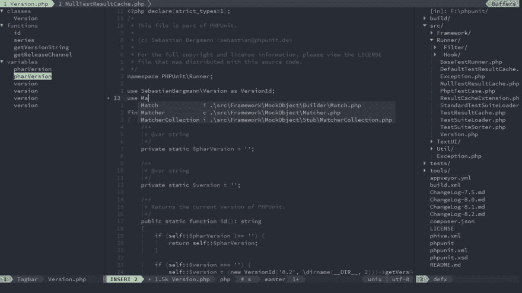
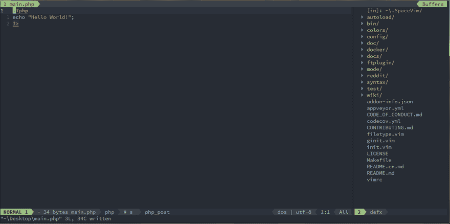
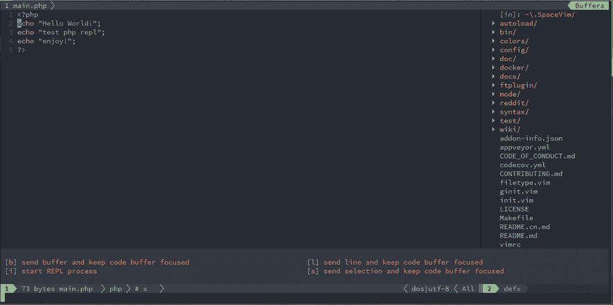

# 使用 Vim 作为 PHP IDE

> 原文：<https://dev.to/spacevim/use-vim-as-a-php-ide-1k7i>

# 使用 Vim 作为 PHP IDE

这是使用 SpaceVim 作为 PHP IDE 的通用指南，包括层配置和使用。将涵盖以下每个部分:

*   启用语言层
*   代码完成
*   语法林挺
*   跳转到测试文件
*   运行代码
*   代码格式
*   REPL 支持 ###启用语言层

要在 SpaceVim 中添加 PHP 语言支持，需要启用`lang#php`层。按`SPC f v d`打开 SpaceVim 配置文件，添加以下代码片段:

```
[[layers]]
  name = "lang#php" 
```

要了解更多信息，你可以阅读 lang#php 层文档。

### 代码补全

层将自动加载 PHP 插件，除非它在你的`init.toml`中被覆盖。完成菜单将在您键入时打开。

[](https://res.cloudinary.com/practicaldev/image/fetch/s--EvnmuV1y--/c_limit%2Cf_auto%2Cfl_progressive%2Cq_auto%2Cw_880/https://user-images.githubusercontent.com/13142418/57497567-c6948480-730a-11e9-95ec-e44bf6e79984.png)

### 语法林挺

默认情况下，棋盘格图层处于启用状态。该层通过 [neomake](https://github.com/neomake/neomake) 提供异步语法林挺。它将异步运行[诗篇](https://github.com/vimeo/psalm)。

要安装诗篇，您可能需要运行:

```
composer require --dev vimeo/psalm 
```

### 跳转到测试文件

要管理项目的替代文件，您可能需要在项目的根目录下创建一个`.project_alt.json`文件。

例如，将以下内容添加到`.project_alt.json`文件中:

```
{
  "src/*.php": {"alternate": "test/{}.php"},
  "test/*.php": {"alternate": "src/{}.php"}
} 
```

通过这种配置，您可以通过命令`:A`在源代码和测试文件之间跳转

### 运行代码

要运行当前脚本，您可以按`SPC l r`，一个分割窗口将被打开，脚本的输出将显示在该窗口中。它异步运行，不会阻塞您的 Vim。

[](https://res.cloudinary.com/practicaldev/image/fetch/s--b-HWU_ao--/c_limit%2Cf_auto%2Cfl_progressive%2Cq_66%2Cw_880/https://user-images.githubusercontent.com/13142418/57496602-79aeaf00-7306-11e9-8c18-32f00bd28307.gif)

### 代码格式化

默认情况下，格式层也是启用的。在这一层，你可以使用键绑定`SPC b f`来格式化当前的缓冲区。使用该功能前，请安装 PHP _ beautiier:

```
pear install PHP_Beautifier 
```

### REPL 支持

用`SPC l s i`开始一个`php -a`次 REPL 过程。REPL 进程启动后，你可以向下级进程发送代码。所有按键绑定都以`SPC l s`为前缀，包括发送行、发送选择甚至发送整个缓冲区。

[](https://res.cloudinary.com/practicaldev/image/fetch/s--HnHHBbbf--/c_limit%2Cf_auto%2Cfl_progressive%2Cq_66%2Cw_880/https://user-images.githubusercontent.com/13142418/57497156-0ce8e400-7309-11e9-8628-da42d6f8432e.gif)