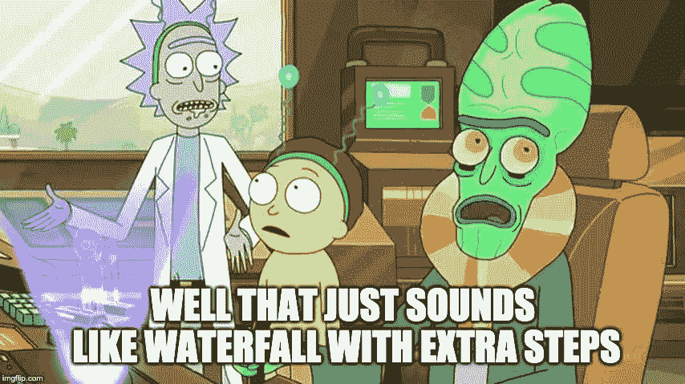

# 分解用户故事:垂直切片

> 原文：<https://dev.to/jan/user-stories-and-vertical-slicing-1dpo>

这是我的团队在我们的细化会议中一直致力于实现的一个概念。通过与我的朋友讨论一些一般的想法，我觉得我能够很好地将问题和解决方案概念化，并希望在这里扩展这种方法。

我在这里谈论的一切都深受杰夫·巴顿的《用户故事映射》一书的影响。我的团队一起阅读了这本书，每周集中阅读几章，并开会讨论这些想法，以及我们认为如何将它们应用到我们的流程中。这本书和方法非常有价值，一定要试一试！

# 用户故事

任何听说过或者实践过敏捷的人都会非常熟悉用户故事的概念。简单地说，一个用户故事从**最终用户的角度**描述了一个软件特性，因此得名！在一个用户故事中，你试图描述*这个故事是为谁*，*这个故事将会交付什么*，以及*为什么*首先是重要的。这一切都是为了传达将要创造的东西的价值。一个用户故事有接受标准，基本上是一组需要满足的需求，以便认为故事是完整的。

用户故事可以宽泛，没关系！当有意义时，开发团队可以并且应该将它们分解成可工作的块。

# 拆分用户故事，当前做法

开发人员通常通过思考如何实现来解决问题。考虑一个涉及多层系统的故事；您可能有一个表示层、一个业务逻辑或后端层、一个持久层，甚至更多！自然地，这导致了在这些层上水平地分割用户故事:一个前端故事，一个后端故事，一个数据库工作故事。

这种方法的主要问题是，依赖性是故事构建方式中固有的，因此，要实现任何实际价值都需要很长时间。对于潜在的几个 sprints，你没有任何可发布的东西给客户、利益相关者或用户看。*不能送一个半生不熟的蛋糕*。

此外，您还会引入技术债务，比如未准备好投入生产的特性的切换，以及当其他特性仍在开发时，部分特性需要工作的变通方法。估计故事的大小和可传达性并没有变得更容易，通过在每个水平切片上处理*整个*故事，你没有考虑到任何基于用户反馈的迭代，也没有为重新排列优先级留下空间。

# 回车，垂直切片！

首先也是最重要的，我们希望快速为用户和利益相关者增加价值。我们可以通过查看在前面提到的所有层中端到端(**垂直**)实现的独立部分，来完成更大的用户故事。确定每一部分的价值和风险，并相应地进行优先排序。

这种方法将让您更快地迭代，因为功能将到达最终用户，并允许他们提供反馈。未知性和依赖性不会阻碍更大功能的进展，因为仍然可以继续工作和部署。您的团队将能够更好地响应优先级的变化，从而使您更加敏捷。但是，最重要的是，您将更快地向利益相关者和最终用户交付可衡量的价值。

这相当抽象，是观念上的巨大变化！让我们用一个真实的例子来练习。

# 如何垂直切片一个故事

我在一个移动团队工作。在我们之前的 sprint 之前，我们得到了一个类似如下的故事:

> 作为一名用户，我想知道什么时候有更新，这样我就可以获得最新的功能和修复

验收标准包括:

*   主页上显示的横幅，表示有新的更新可用
*   对用户配置文件中现有的更新链接进行修饰，使其更加突出
*   横幅和现有链接都应该导航到显示最新更改的发行说明屏幕和下载更新的链接

这个故事并不太大，但是考虑到我们还有其他项目要做，所以不能在短时间内完成。不过，事实证明这确实是垂直分割故事的一个很好的实践！

作为一个团队，我们认识到我们可以快速增加价值，而无需交付整个故事。考虑到应用程序的当前状态，现有的更新链接直接导致下载，我们决定更新横幅为用户增加了最大的价值。通过使新横幅的行为与当前链接相同，横幅和发行说明屏幕是独立的，可以是单独的故事。同样，对当前链接的更改独立地增加了价值，因此成为一个单独的故事。这个“大”故事变成了三个小故事，我们可以分别优先处理！

无可否认，我们确实被冲昏了头脑。最初，我们创建了第四个故事，用于更新从横幅和链接到新的发行说明屏幕的导航。导航本身并没有真正独立于发布说明屏幕，所以将这个故事添加回发布说明的故事中是有意义的。

release notes 屏幕被重新优先化了(还没有被拉进 sprint)。从开发的角度来看，我们有小的、易于测试的、易于评审的代码块。从利益相关者的角度来看，我们已经在交付完整功能方面取得了进展，并且可以说已经实现了用户故事中设定的目标。

我们能够向最终用户交付可衡量的价值，而无需实施整个故事。

*不能送半个烤好的蛋糕，但可以送半个烤好的蛋糕*。

总的来说，我们的团队对结果非常满意。我们将继续实践和完善这个过程，并希望把它带给其他团队。

