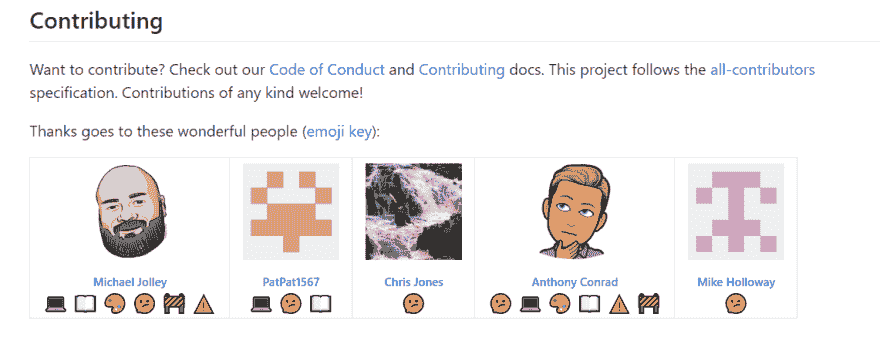

# 使用一个贡献行为准则来帮助其他人对公共存储库做出贡献

> 原文：<https://dev.to/michaeljolley/using-a-contributing-codeofconduct-to-assist-others-in-contributing-to-public-repositories-1l90>

似乎最近我每隔一天就在创建一个新的公共回购。一些人甚至收到了来自其他贡献者的请求。随着贡献者的名单开始增长，我意识到有一些东西是我，可能还有其他的库维护者想要提供的。所以，和往常一样，当我学到新东西时，我会写一篇博文。

我的目标是解释认可贡献者并为他们提供贡献和行为准则的好处。

## 投稿指南

在很大程度上，贡献者已经在我们的 [Twitch](https://twitch.tv/themichaeljolley) 流上看到了我的存储库，并且想要提供帮助。这个流的好处是，查看者可以看到我们用来提交拉请求的过程、我们的分支策略等等。然而，对于那些希望以后加入进来的人来说，他们的拉请求可能会被指向错误的分支，或者可能是另一个贡献者已经在处理的问题。

为了提供帮助，我在 GitHub 上搜索了一些文件。有几个很好的例子。一些是:

*   [紫齿](https://gist.github.com/PurpleBooth/b24679402957c63ec426)
*   [木偶](https://github.com/puppetlabs/puppet/blob/master/CONTRIBUTING.md)
*   [工厂机器人轨道](https://github.com/thoughtbot/factory_bot_rails/blob/master/CONTRIBUTING.md)

我修改了 thoughtbot 的 Factory Bot Rails 版本以满足我的需求，并将其添加到我所有的活动公共存储库中。你可以在我们的[鸟舍](https://github.com/MichaelJolley/aviary/blob/master/CONTRIBUTING.md)回购中看到一个例子。

至少，您的 CONTRIBUTING.md 应包括以下详细信息:

*   什么类型的捐款是允许的？(文档/代码/想法/测试/示例/等等。)
*   添加问题的说明
*   派生和提交拉式请求的说明

这些基本信息让潜在的贡献者对提交拉请求更有信心，减轻了他们因为使用错误的基础分支而被指责的恐惧。

## 行为准则

我承认我对这个有点了解。我不确定在本周之前我是否读过仓库的行为准则。当你期望人们做到最好和/或在参与公共回购社区时没有经历过不良行为的影响时，这很容易被忽视。但是我从未亲身经历过的事实并不意味着我应该忽略开发社区中确实存在的不良行为。事实上，不管我的个人经历如何，我希望每个人都能感受到被包容和安全，分享想法和合作。

在你的公共库中有一个 CODE_OF_CONDUCT.md 可以让潜在的贡献者提前知道社区和维护者会如何对待他们。 [Contributor Covenant](https://www.contributor-covenant.org/) 是为您的存储库制定行为准则的绝佳资源。

## 感谢贡献

我喜欢新的贡献者！当我收到通知说有人创建了一个问题，提交了一个 pull 请求，甚至只是分叉了存储库，这让我很开心。有几种方式可以表达对贡献者的爱，但我最近实施的一种方式是[所有贡献者](https://allcontributors.org/)规范。

当有人贡献时，我只需对某个问题或拉请求进行评论，所有贡献者机器人就会创建一个拉请求，在我们的 README.md 上向该人致谢。

我们的 VS 代码扩展的一个例子是:

不是所有的贡献都是代码。利用所有贡献者，我可以识别出所有贡献者，从想法、问题、文档、测试、例子等等。选项的完整列表可以在他们的表情符号键上找到。

这是一种有趣的方式，在该表扬的地方给予表扬，并鼓励其他人参与进来。

## 把麦克包起来

这就是我今天的 TED 演讲。你对如何帮助新的贡献者加入有什么想法吗？让我听听。