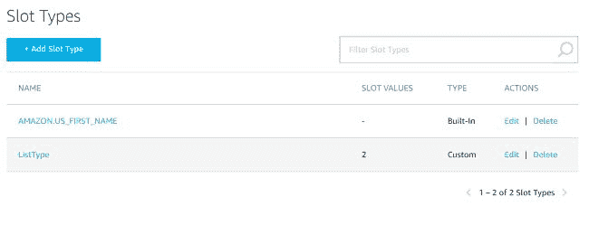
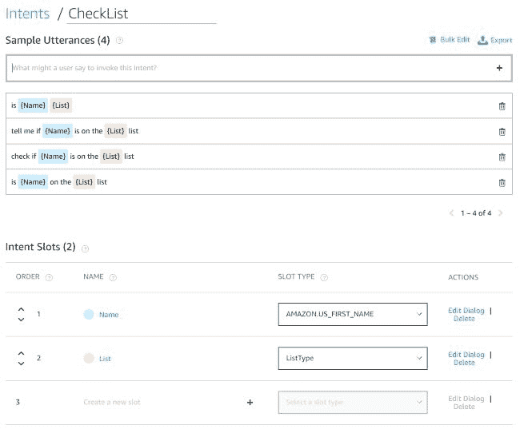

# 利用 Alexa 来扰乱你的孩子，为什么不呢？

> 原文：<https://dev.to/raymondcamden/using-alexa-to-mess-with-your-kids-because-why-not-fjo>

如你所知，我最近有点喜欢 Alexa([“为什么不把冰熊加入 Alexa？”](https://dev.to/raymondcamden/adding-ice-bear-to-alexa-because-why-not-2k6l))，主要是因为现在我已经可以在大约三十分钟内部署一项(公认简单的)技能了。此外，认证似乎也变得简单了许多。这也可能与我建立难以置信的简单技能有关，但我不会抱怨。对于今天的~~浪费时间~~非常有用的 Alexa 的例子，我已经建立了一个小技巧，唯一的目的是在这个美好的圣诞节期间逗逗我的孩子。

我的技能，“圣诞老人的名单”，让你问你的孩子是在淘气还是乖的名单上。“搞乱”方面来自于它总是给出肯定回答的事实。如果你的孩子调皮捣蛋，你只需问他们是否在淘气名单上。如果他们是你所知道的小天使，那么你会问他们是否在好的名单上。

为了做到这一点，你需要建立一个使用“老虎机”的技能。槽是你的短语中的变量。所以比如:

```
Is Carol on the nice list?
Is Jacob on the naughty list?
Is Weston on the naughty list?
Is Jane on the nice list? 
```

Enter fullscreen mode Exit fullscreen mode

在所有四个例子中，只有两件事情发生了变化——孩子的名字和列表的类型。先说名字。作为一个程序员，我需要指定名字吗？没有。Alexa 支持大量内置插槽类型，可以匹配各种不同类型的单词，包括姓名。你只需设置你的技能来监听一个特定类型的插槽，Alexa 会处理计算出来。然后，您的代码只需获得一个名称。

真正酷的是，如果你使用一个日期槽，它会将“明天”、“下周一”等内容转换成真正的日期对象。这真的让你的代码简单多了。

您可以在[参考文档](https://developer.amazon.com/docs/custom-skills/slot-type-reference.html)中看到所有不同的槽类型，但是您只需知道几乎每一个“广泛”的变量类别都已经包含在内，随时可供您使用。

调皮和乖呢？对于 Alexa 没有内置插槽的情况，你可以简单地创建一个自定义插槽，并列出选项。我的只有两个，所以做起来并不难。这里有一个来自 Alexa 开发者控制台的截图——你可以在这里看到我的两个插槽，每个插槽都有一个名称和类型。

[](https://res.cloudinary.com/practicaldev/image/fetch/s--TGpTl6iF--/c_limit%2Cf_auto%2Cfl_progressive%2Cq_auto%2Cw_880/https://static.raymondcamden.cimg/2018/12/sl1.jpg)

在定义了我的槽之后，我可以在我的示例话语中使用它们。请记住，一项技能有意图，这是与它交谈的广泛方式，示例话语描述了这些意图。我的技能只有一个意图(忽略内置的意图)，所以我简单地添加了那个意图并编写了一组话语。

[](https://res.cloudinary.com/practicaldev/image/fetch/s--LWeRHtOt--/c_limit%2Cf_auto%2Cfl_progressive%2Cq_auto%2Cw_880/https://static.raymondcamden.cimg/2018/12/sl2.jpg)

现在只剩下代码了。这是该技能的完整代码，托管在 [Webtask](https://webtask.io/) 上。

```
const NICE = [
  "Of course $NAME is on the nice list!",
  "Yes, $NAME is on the nice list!",
  "I'm happy to say that $NAME is on the nice list.",
  "$NAME is definitely on the nice list!"
];

const NAUGHTY = [
  "Unfortunately $NAME is on the naughty list.",
  "$NAME has been a bit naughty lately and is on the naughtly list sad to say.",
  "I'm sorry to say that $NAME is on the naughty list.",
  "Sadly, $NAME is on the naughty list."
]

/**
 * Returns a random integer between min (inclusive) and max (inclusive)
 * Using Math.round() will give you a non-uniform distribution!
 */
function getRandomInt(min, max) {
    return Math.floor(Math.random() * (max - min + 1)) + min;
}

/*
function getQuote() {
  return quotes[getRandomInt(0, quotes.length - 1)];
}
*/

/**
* @param context {WebtaskContext}
*/
module.exports = function(context, cb) {

  console.log('santaList called');
  console.log(context.body.request);

  let req = context.body.request;

  if(req.type === 'LaunchRequest') {

   let response = {
      "version": "1.0",
      "response" :{
        "shouldEndSession": true,
        "outputSpeech": {
          "type": "PlainText",
          "text": 'Ask Santa\'s List if your child is on the naughty or nice list!'
          }
        }
    };

    cb(null, response);

  }

  if(req.intent && req.intent.name === 'CheckList') {
    let name = req.intent.slots.Name.value;
    let list = req.intent.slots.List.value;

    let text;

    if(list === 'nice') {
      text = NICE[getRandomInt(0, NICE.length - 1)];
    } else {
      text = NAUGHTY[getRandomInt(0, NAUGHTY.length - 1)];
    }

    text = text.replace('$NAME', name);

    let response = {
      "version": "1.0",
      "response" :{
        "shouldEndSession": true,
        "outputSpeech": {
          "type": "PlainText",
          "text": text
          }
        }
    };

    cb(null, response);

  };

}; 
```

Enter fullscreen mode Exit fullscreen mode

一般来说，代码根据意图分为两个主要动作。第一个，`LaunchRequest`，处理只是做“Alexa，打开圣诞老人的清单”的人，我用它来提供如何使用的帮助。第二是乐趣所在。Alexa 将会把名字，淘气或可爱的选择，转换成代码，传递给我的意图。你可以看到我通过`intent.slots.Name.value`或`intent.slots.List.value`访问它们。然后，我从一个随机字符串列表中选择，并从`$NAME`到传递给技能的实际名称进行字符串替换。

我喜欢的是，当我想到新的响应时，我可以编辑这段代码(通过我的浏览器，Webtask 有一个令人难以置信的在线编辑器),只需编写它，保存它，我就完成了。在 Alexa 端我根本不需要做什么。这很好，但也带来了 Alexa 开发的一个负面影响。如果您搞砸了您的服务器端代码，您将永远不会知道，除非您登录门户并亲自检查。当事情出错时，Alexa 没有任何方法可以找到你。

我并不认为这有什么帮助，但是你可以在亚马逊的页面上浏览这个技能。让我知道你的想法，并尝试建立自己的 Alexa 集成！