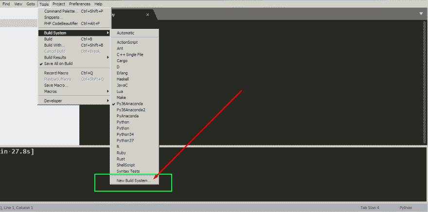
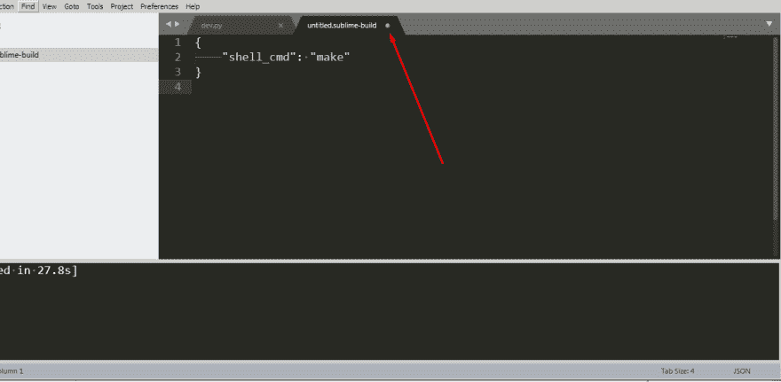
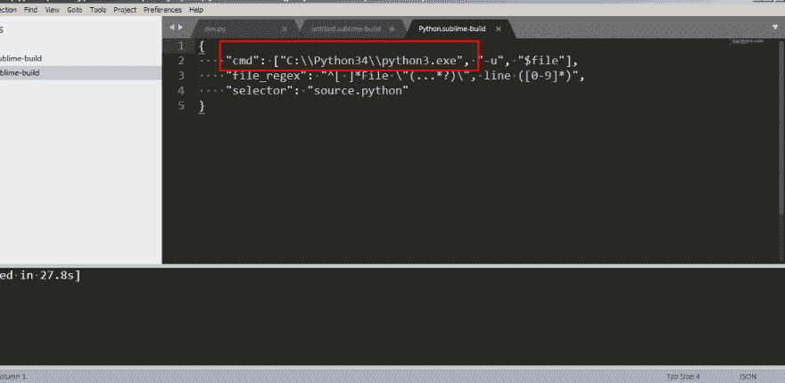
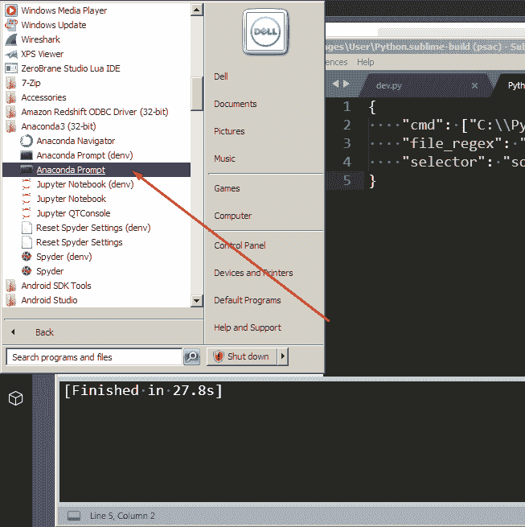
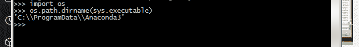
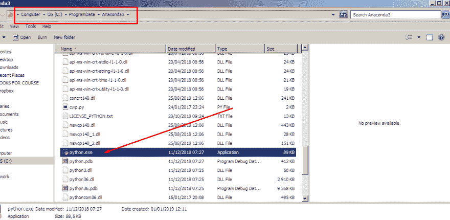
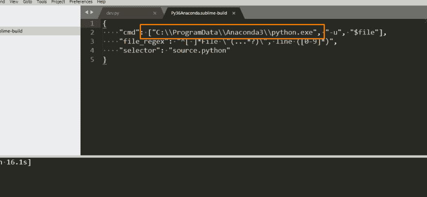
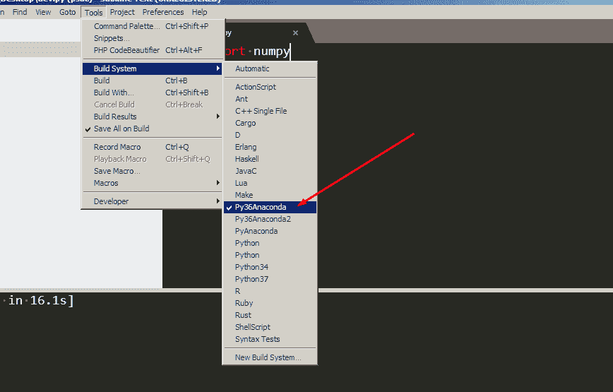
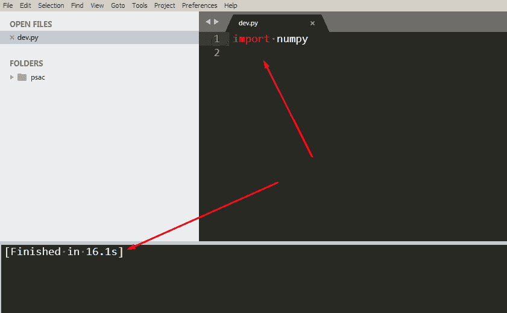

# 在 Sublime 文本上使用 Anaconda(不安装任何包)

> 原文：<https://dev.to/abdurrahmaanj/using-anaconda-on-sublime-text-39le>

在 sublime text 上运行 python 一直是我的梦想。但是一个更大的梦想是在崇高的文本上运行 Anaconda。这里是你如何在 windows 上做到这一点！

## 第一步:理解崇高的文本构建

默认情况下，崇高文本提供构件选项。如果你安装 python，它会尝试获取可执行文件的路径，从这个意义上来说，它是相当智能的。

为了检查 python 如何配置构建系统，让我们尝试构建一个新的构建系统

将打开一个包含一些配置的新文件

但是让我们试着拯救它，看看它如何拯救它，在哪里拯救它

现在让我们打开一个原始的构建文件

我们看到它需要可执行文件的路径

## 第二步:查找 Anaconda 可执行文件

我们必须找到蟒蛇的可执行文件，但不能找到任何 python.exe。要发现这一点，我们可以使用 anaconda 命令提示符

我们键入以下内容

接下来，我们转到文件夹，找到 python 可执行文件的名称

然后我们构建一个新的包，配置它，然后保存它

下次我们在菜单上选择时

然后控制+ b 运行

接下来，我们感觉到力量在我们的血管中流动++ *++* ++__++

注意:这个帖子流量很大。如果你在的话，作者会很感激的！