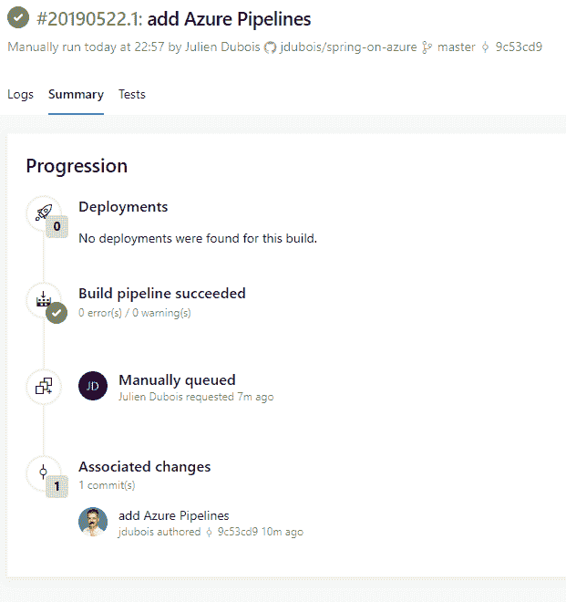
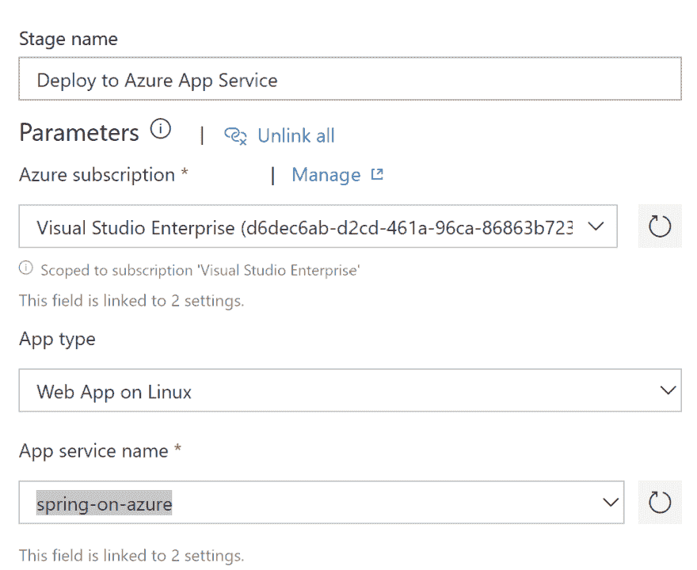
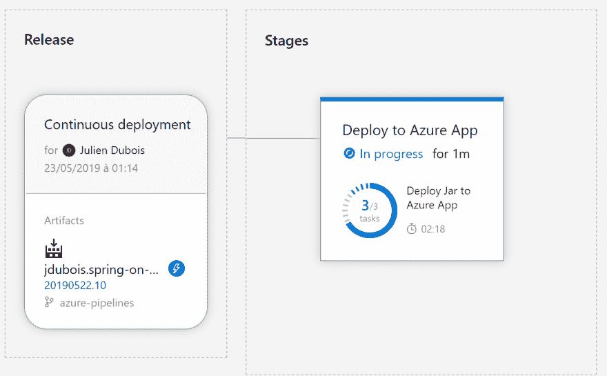

# 使用 Azure Pipelines 构建、测试和部署 Spring Boot 和 Angular 应用程序(3/7)

> 原文：<https://dev.to/azure/using-azure-pipelines-to-build-test-and-deploy-a-spring-boot-and-angular-application-3-7-593j>

这篇博客文章是“在 Azure 上部署 Spring Boot 和 Angular 应用程序”系列文章的一部分，下面是完整的文章列表:

*   [为 Azure (1/7)创建 Spring Boot 和角度应用程序](https://dev.to/jdubois/creating-a-spring-boot-and-angular-application-for-azure-1-7-2mb8)
*   [创建和配置 Azure Web App 和 MySQL 来托管 Spring Boot 应用程序(2/7)](https://dev.to/jdubois/creating-and-configuring-azure-web-app-and-mysql-to-host-a-spring-boot-application-2-7-1n13)
*   使用 Azure Pipelines 构建、测试和部署 Spring Boot 和 Angular 应用程序(3/7)
*   [与 Spring Boot 一起使用 Azure Application Insights(4/7)](https://dev.to/azure/using-azure-application-insights-with-spring-boot-4-7-263i)
*   [使用 Azure Application Insights 和 Angular (5/7)](https://dev.to/azure/using-azure-application-insights-with-angular-5-7-4kej)
*   [配置 Azure CDN 以提升角度性能(6/7)](https://dev.to/azure/configuring-azure-cdn-to-boost-angular-performance-6-7-5ebe)
*   [配置 Azure Redis 缓存以提升 Spring Boot 性能(7/7)](https://dev.to/azure/configuring-azure-redis-cache-to-boost-spring-boot-performance-7-7-52dl)

## 将 Spring Boot 应用部署到 Azure

有几种方法可以将 Spring Boot 应用程序部署到 Azure。最简单的方法之一是使用 Azure 应用服务的 [Maven 插件。对于我们的用例，我们希望超越简单的“Hello，world”应用程序，因此我们将使用](https://docs.microsoft.com/en-us/java/api/overview/azure/maven/azure-webapp-maven-plugin/readme?view=azure-java-stable&WT.mc_id=devto-blog-judubois) [Azure Pipelines](https://azure.microsoft.com/en-us/services/devops/pipelines/?WT.mc_id=devto-blog-judubois) 建立一个完整的 CI/CD(持续集成/持续部署)解决方案。

和往常一样，我们在这里很注重预算:Azure Pipelines 提供了一个慷慨的免费层，对我们来说基本上足够了，所以我们不应该支付任何费用。

## 创建 azure-pipelines.yml 文件

为了用 Azure Pipelines 构建和测试我们的应用程序，我们需要在项目的根目录下有一个`azure-pipelines.yml`文件。

有了 JHipster，我们很幸运，我们只需要运行`jhipster ci-cd`并回答几个问题，就可以拥有一个非常完整的 Azure Pipelines 配置。

您可以在[这个提交](https://github.com/jdubois/spring-on-azure/commit/9c53cd911001eee2a77daaf43f5f2398cd5c281f)上检查生成的文件。

这个管道将构建和测试应用程序(Spring Boot 后端和 Angular 前端)，因此它是一个“持续集成”管道。如果你需要更多关于 Azure Pipelines 任务的信息，你应该参考 Azure Pipelines 文档。创建一个简单的 Maven 构建非常容易，然后像我们用 JHipster 做的那样做更复杂的配置可能需要更多的时间。

## 通过 Azure 管道自动部署到 Azure Web App

在上一节中，我们创建了一个`azure-pipelines.yml`文件:我们将向其中添加一个新任务，以便在所有测试都通过后发布一个产品构建。因此，它将不再只进行“持续集成”，而是进行全面的“持续部署”。

打开`azure-pipelines.yml`文件，在文件末尾添加:

```
 - script: ./mvnw package -Pprod -DskipTests
        displayName: 'BUILD: creating production build'
      - task: CopyFiles@2
        inputs:
          SourceFolder: 'target'
          Contents: '*.jar'
          TargetFolder: '$(Build.ArtifactStagingDirectory)'
      - task: PublishBuildArtifacts@1
        inputs:
          pathtoPublish: '$(Build.ArtifactStagingDirectory)'
          artifactName: bugtracker 
```

事实上，我们使用了 3 个任务:

*   一个用于使用 JHipster 进行产品构建。请注意，在这里我们跳过了之前应该已经通过的测试。
*   另一个是将生成的文件 JAR 文件复制到存储工件的目录中。
*   也是最后一个拿到艺术品并出版的人。

这将自动在 Azure Pipelines 中发布您的产品构建的人工制品。

**警告**由于 Azure Web App 使用了一个应该被命名为`app.jar`的人工制品，我们必须正确地命名我们的人工制品。最简单的方法是使用正确的名称直接创建它，使用您的`pom.xml` :
中的`finalName`属性

```
 <build>
        <finalName>app</finalName>
        ...
    </build> 
```

您可以查看我们刚刚所做的更改，以便在[提交](https://github.com/jdubois/spring-on-azure/commit/1bf7e3325aefb95c328b47150256a716217c7d04)时设置“连续部署”。

## 将应用推送到 GitHub，设置 Azure 管道

如果你还没做，把你的应用推给 GitHub:如果你不想让你的应用公开，记住 GitHub 提供免费的无限私有库。

一旦你的应用程序在 GitHub 上，进入 [GitHub marketplace](https://github.com/marketplace) 安装和设置 Azure Pipelines。

然后，您可以登录到 [Azure Devops](https://dev.azure.com/?WT.mc_id=devto-blog-judubois) 来设置您的 Azure 管道:

*   创建新项目。
*   在左侧菜单中，选择“管道>构建”并创建一个“新管道”。
*   选择“GitHub”，并选择您在上面的步骤中刚刚创建的 GitHub 项目。
*   由于我们在上一节已经创建了一个`azure-pipelines.yml`文件，它将被自动拾取，所以你只需要“运行”它(使用右上角的按钮)来观看你的应用程序被 Azure Pipelines 构建。

因为这个构建是一个“全栈”构建，它将编译、打包和测试你所有的 Spring Boot 和 Angular 代码。正如您所想象的，这是一个相当复杂的过程，需要 5 分钟多一点的时间才能完成。

[](https://res.cloudinary.com/practicaldev/image/fetch/s--XCnKNBfe--/c_limit%2Cf_auto%2Cfl_progressive%2Cq_auto%2Cw_880/https://thepracticaldev.s3.amazonaws.com/i/q27e3nh7d72rnwmzgsm1.png)

## 将应用程序部署到 Azure Web App

一旦 Azure Pipelines 第一次构建了你的应用程序，它就会发布这个项目的一个产品。一个新的“发布”按钮将出现在右上角:点击它创建一个新的发布。

你将在那里看到你发布的人工制品，并能够添加新的“阶段”到它，以便自动部署到生产中。

创建一个新的“stage”并选择“将一个 Java 应用部署到 Azure 应用服务”。创建此阶段后，打开它并:

*   给它一个有意义的名字
*   将它连接到你的 Azure 订阅:你需要点击“授权”按钮，然后按照授权向导进行操作
*   将应用程序类型更改为“Linux 上的 Web App ”,因为这是我们在之前的博客文章中创建的
*   选择您的应用程序服务名称

[](https://res.cloudinary.com/practicaldev/image/fetch/s--Ct1BE3xr--/c_limit%2Cf_auto%2Cfl_progressive%2Cq_auto%2Cw_880/https://thepracticaldev.s3.amazonaws.com/i/rcmgox3wf7fpd10kf0zb.png)

然后，您需要修改为此阶段配置的 2 个任务:

*   删除名为“将 WAR 部署到 Azure 应用服务”的第一个任务，因为我们没有部署 WAR。
*   启用第二个任务，名为“将 JAR 部署到 Azure App Service”。

现在，您可以转到“Pipelines > Releases”并单击“Create release”按钮。这应该采用先前生成的人工制品(由`azure-pipelines.yml`制作)，并将其自动部署到您的 Azure Web App 实例。

现在，您可以连接到您的应用程序，并在生产中使用它。因为这是一个 JHipster 应用程序，所以需要记住以下一些提示:

*   默认有两个账户，`admin`(密码`admin`)和`user`(密码`user`)
*   使用 [Liquibase](https://www.liquibase.org/) 管理数据库模式，因此当应用程序启动时，它会自动更新数据库模式。该模式是在之前的博客文章中使用 MySQL Workbench 创建的。
*   如果您在本地计算机上运行 developement 中的应用程序，JHipster 使用 [faker.js](https://github.com/marak/Faker.js/) 用一些虚拟数据填充您的数据库。在生产模式中，由于您应该使用一些真实数据，所以默认情况下您的数据库没有这些数据。

[](https://res.cloudinary.com/practicaldev/image/fetch/s--mJ_U9fp9--/c_limit%2Cf_auto%2Cfl_progressive%2Cq_auto%2Cw_880/https://thepracticaldev.s3.amazonaws.com/i/5qd6s9271qoyq2z526xw.png)

现在，每次我们的构建通过时，我们的应用程序将被自动部署到生产中，在那里它将由 Azure Web Apps 自动管理。不再有生产问题，只需“git push”即可完成！

## 启动时间的考虑和预算

你可能已经注意到应用程序启动有点慢，它需要一分多钟。我们最坏的情况是 100 秒，所以应该不到 2 分钟，但这仍然是一段很长的时间！

我们这里有两个罪犯:吉普斯特和硬件。通过各种调整(主要是禁用 Liquibase 等功能)，我们确实可以让 JHipster 在大约三分之一的时间内启动。性能的提高可能很重要，因为这里我们已经达到了 JVM 内存的极限，所以垃圾收集器正在努力工作，删除一些特性会对它有很大帮助。

然后，选择的硬件不是很好，因为我们想节省预算，所以选择了“B1”盒子:第一个月免费，然后非常便宜(大约每月 30 美元)。这就是为什么我们的内存太有限，也是为什么我们的 CPU 有限。Azure 以“ACU”计算 CPU 能力，这意味着 Azure 计算单位，而 B1 盒子只有 100 ACUs。

测试一个更强大的实例非常简单:在你的 Azure Web 应用中，选择“向上扩展”，然后选择一个“P2V2”实例。升级是动态完成的！在这个拥有 420 个 acu(是“B1”计算能力的 4 倍多)的新硬件上，启动时间现在只有 15 秒。当然，您可以随时缩小规模，然后回到“B1”实例。