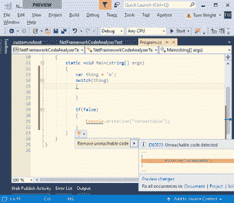
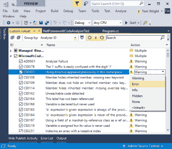

# 在 VS 代码中使用代码分析器——两个难点

> 原文：<https://dev.to/tdwright/using-code-analysers-in-vs-code--a-couple-of-pain-points-3iba>

在我最近的帖子中，我一直在探索基于 Roslyn 的代码分析器如何有助于使您的代码更干净、更健壮。到目前为止，我一直试图保持相对的不可知论。在今天的帖子中，我想谈谈在 VS 代码中使用代码分析器的一些难点，以及社区取得的一些进展。

在我关于基于罗斯林的代码分析器的第一篇和第二篇[文章中，我有意避免提及 IDE 或运行时。然而，正如忠实读者所知，我最近一直在](https://dev.to/tdwright/retrofitting-code-analysis-to-legacy-projects--my-4-step-strategy-for-long-term-success-5ah7-temp-slug-2448321)[使用 VS 代码](http://blog.tdwright.co.uk/2018/08/29/new-tricks-for-an-old-dog-what-i-learnt-from-vs-code/)作为我的主要 IDE。我也主要从事。网芯。以前曾从事过这类工作。Net 框架和 Visual Studio，差异是非常明显的。

### 开始之前…

在我深入“痛点”之前，重要的是要注意，它们都没有阻止我在我的项目中成功地使用代码分析器。因为分析器作为 MSBuild 过程的一部分运行，所以核心功能在任何可以运行`dotnet build`的地方都能正常工作。

我也意识到我正在比较一个巨大的商业应用程序(一个与。Net 生态系统)和灵活、免费、开源的替代方案。这些不可避免地会是非常不同的经历。如果我想要重型体验，我可以(也确实)启动 Visual Studio。

这篇文章并不是呼吁重塑 Visual Studio。相反，这是我对两者之间的差异的反思的延续，也是对开源社区为提供弥合差距的方法所做的工作的庆祝。

### Visual Studio 中的工作原理

好了，我们都在同一页上，让我们回顾一下 Visual Studio 在代码分析器方面提供的功能。

 

<figcaption>曲线、工具提示和代码修复让纠正违规变得轻而易举。</figcaption>

1.  Visual Studio **在编辑器中使用智能感知“曲线”和“灯泡”工具提示来处理代码分析器规则冲突**。这意味着您可以更容易地找到代码中的问题。
2.  当曲线出现时，Visual Studio 通常会以自动纠正/重构的形式**提供快速的“代码修复”**。
3.  Visual Studio 内置了对管理规则集的**支持，通过图形界面控制如何处理违反每个规则的情况。**

 

<figcaption>规则集编辑器可以轻松更改规则违规的处理方式。</figcaption>

这些功能加在一起，形成了一种相当无缝的体验。代码分析师*感觉*像是 Visual Studio 中的一等公民。

这些特性都没有出现在现成的 VS 代码中，或者(目前)甚至没有作为易于安装的扩展提供。

### 痛点# 1–修复违规

作为一个“痛点”，我把上面列表中的前两个功能放在一起:曲线和代码修复。它们都与应对违规行为有关。曲线和工具提示让你很容易知道你在上下文中犯了什么错误。当你在那里时，建议的修复很容易应用。

由于 VS 代码中对代码分析器的支持相当于运行 MSBuild 并显示输出，我们的工作流(开箱即用)在这里有一点不同。更少的“与我的机器人同事结对编程”，更多的“涂肥皂，冲洗，重复，在修正一条新规则的时候不小心违反了一条新规则”。

如果你愿意稍微修改一下你的设置，你可以更接近 Visual Studio 的体验。通过[屠杀 Visual Studio 的 Roslynator 插件](https://github.com/JosefPihrt/Roslynator/blob/master/docs/RoslynatorForVisualStudioCode.md)，有可能说服 Omnisharp 提供一些代码修复和重构

我还注意到 Omnisharp 团队的向导们已经朝着直接支持罗斯林分析师的方向迈进了。事实上，[有一个拉动请求](https://github.com/OmniSharp/omnisharp-roslyn/pull/1076)进展顺利。

### 痛点 2——管理规则集

对我来说，第二个主要难点是规则集的管理。换句话说，就是调整应用哪些规则以及违反每个规则的严重性。

如上所述，Visual Studio 为此提供了一个图形界面。(事实上，它至少提供了两个——一个在项目属性中，一个在解决方案浏览器中。)这使得打开和关闭整个规则集以及管理单个规则的严格性变得很容易。

在 VS 代码中，你只能使用自己的设备。当然，您可以创建一个`.ruleset` XML 文件，并在其中放入您喜欢的任何内容，但是这都是非常手动的。

在我的上一篇文章中，我[描述了我的方法](https://dev.to/tdwright/retrofitting-code-analysis-to-legacy-projects--my-4-step-strategy-for-long-term-success-5ah7-temp-slug-2448321),用于管理当你第一次激活遗留项目上的代码分析时出现的大量违规。这个过程的一部分需要创建一个电子表格，将 MSBuilt 的输出转换为我的规则集文件所需的 XML。它可以工作，但是要走几步太多了。

我不知道有任何开源项目针对工作流的这一方面。如果是，请告诉我。

我曾经想过创建我的第一个 VS 代码扩展，为这类活动提供一个 GUI。我还考虑了一个独立的 CLI 工具，它有可能为 VS 代码扩展提供力量。我甚至想知道我是否不应该创建一个基于 web 的规则集管理器…如果你想在这些想法中的任何一个上合作(或者也许你有一个更好的！)那就请联系吧。

### 总结

不要误会，我最喜欢 VS 代码的一点就是没有硝烟和镜子。这是一种剥离的体验，将您与工具重新联系起来。

有时(仅仅是有时)我发现自己渴望 Visual Studio 提供的功能。通常，一些聪明的人已经做出了一个令人挠痒痒的扩展，但可悲的是，当谈到代码分析器时，我们仍然有一些差距。我想这有点太小众了吧？

我将继续在 VS 代码中使用代码分析器，并将密切关注工具如何随着时间的推移而发展。我甚至可能(如果我能开拓出生产能力的话)着手制造一些全新的工具。看好这个空间！

在你从事的 is VS 代码项目中，你使用过代码分析器吗？你进展如何？请在下面的评论中告诉我。