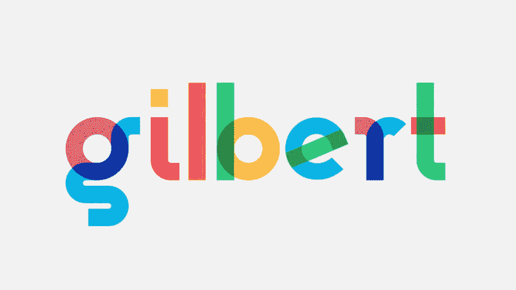
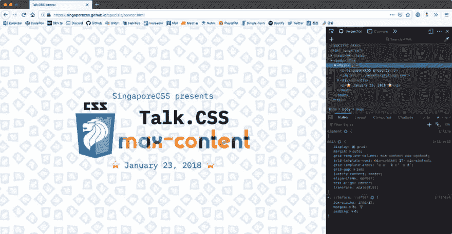
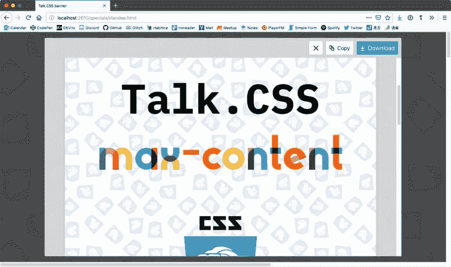
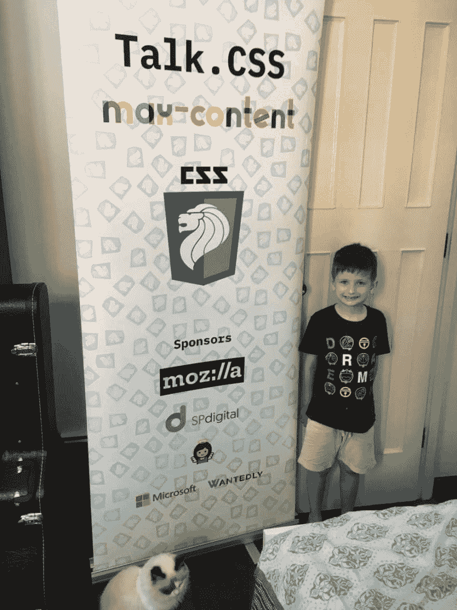

# 使用 CSS 制作打印横幅

> 原文：<https://dev.to/huijing/using-css-to-make-a-print-banner-20bh>

我谈论网络。我经常谈论网络。但有时，我们需要物质世界制造的东西。有时候，我们需要一面旗帜。横幅可以设计成比周日更多的方式，但通常，你友好的邻居打印机会要求某种数字文件。可能是 SVG 或高分辨率 PNG，甚至是 PDF。

无论何种格式，一个像样的打印横幅的关键是文件的分辨率。尽管最终结果很大程度上取决于制作横幅所用的材料，但高分辨率的基础图像肯定会有所帮助。

事情是这样的，我偶然发现了这个叫做[吉尔伯特](https://www.typewithpride.com/)的字体，瞬间就爱上了它。这是一种[彩色字体](https://www.colorfonts.wtf/)，是为了纪念 [Gilbert Baker](https://gilbertbaker.com/) ，LGBTQ 活动家和艺术家，标志性彩虹旗的创造者。

[](https://res.cloudinary.com/practicaldev/image/fetch/s--AiTmCuEh--/c_limit%2Cf_auto%2Cfl_progressive%2Cq_auto%2Cw_880/https://www.chenhuijing.com/asseimg/posts/css-banner/gilbert-1280.jpg)

## 一般使用彩色字体

2017 年，没有 CSSConf。亚洲(可惜 2019 年也不会有)。所以我和克里斯想出了这个愚蠢的主意，举办一个小型的半天会议式的 CSS 活动。我称之为[谈话。CSS `max-content`版](https://singaporecss.github.io/24/)，因为你知道，最大内容？听着，给事物命名很难。

我认为这是用吉尔伯特写文章的绝佳机会。微妙的色彩是我想要的。网站本身进展顺利。彩色字体的工作方式，即使浏览器不支持彩色字体，字体仍然渲染和显示，只是纯黑色而不是彩色。

Gilbert 的彩色字体版本来自 OpenType ( `.otf`)，所以使用它并不难。然后，我想为社交媒体制作横幅图像，但意识到我做不到。我这个穷光蛋显然没有一款 Adobe 产品，而且当时(2018 年 1 月 23 日之前)，Photoshop 和 Illustrator 可能是唯一支持彩色字体的应用程序。

注意:现在至少有 7 个应用程序支持 OpenType-SVG 字体，情况好多了。更多信息，请查看[color fonts . wtf](https://www.colorfonts.wtf/)T3】

## 为社交媒体图片使用彩色字体

我的电脑上只有草图，那是不行的。但我也意识到我使用的是视网膜显示器，因此可以拍摄相对高分辨率的截图。我也非常喜欢用 CSS 做各种事情。一个现代的浏览器和一些 CSS 对我来说和 Photoshop 一样好。

因此，使用浏览器作为截图生成器的第一步是让横幅图像与 Twitter 和脸书一起使用。布局自然是用 CSS 网格完成的。设置并不复杂，看起来像这样:

```
<main>
  <p>SingaporeCSS presents</p>
  
  <div>
    <h1>Talk.CSS</h1>
    <code>max-content</code>
  </div>
  <p>⭐️ January 23, 2018 ⭐️</p>
</main> 
```

Enter fullscreen mode Exit fullscreen mode

我把所有东西都放在一个单独的`index.html`中，这意味着样式都在`<head>`的一个`<style>`标签中。反正也没有那么多款式。但是使用 CSS 进行布局的好处是，嗯，你知道，可以访问框对齐属性、Flexbox 和 Grid、视口单元以及所有这些美味的好东西。

```
html {
  box-sizing: border-box;
}

*,
*::before,
*::after {
  box-sizing: inherit;
  margin: 0;
  padding: 0;
}

body {
  height: 100vh;
  background-image: url('../assets/img/tile.png');
  background-repeat: repeat;
  background-size: 12em;
  display: flex;
}

main {
  display: grid;
  margin: auto;
  grid-template-columns: min-content max-content;
  grid-template-rows: min-content 1fr min-content;
  grid-template-areas: 'a a'
                        'b c'
                        'd d';
  grid-gap: 1em;
  justify-content: center;
  align-items: center;
  text-align: center;
  transform: scale(0.6);
}

p {
  font-family: 'iA Writer Duospace';
  font-size: 3em;
  line-height: 1;
  color: #1572b6;
}

p:first-child {
  grid-area: a;
}

p:last-child {
  grid-area: d;
}

img {
  margin: auto;
  height: 45vh;
  grid-area: b;
}

div {
  grid-area: c;
}

h1 {
  font-family: 'iA Writer Duospace';
  font-size: 7em;
  line-height: 1;
}

code {
  font-family: 'Gilbert Color';
  font-size: 10em;
  line-height: 1;
} 
```

Enter fullscreen mode Exit fullscreen mode

对于这类事情，网格模板区域是我首选的技术，因为我懒得跟踪行号和列号。此外，因为我已经在我的电脑上安装了所有需要的字体，我甚至没有考虑后备字体。

我认为，如果你设法在网上找到这个文件，除非你的机器上安装了 iA Writer Duospace 和 Gilbert Colour，否则它看起来不会那么漂亮。但是这些文件反正是我自己用的，所以我真的不在乎…🤪

[](https://res.cloudinary.com/practicaldev/image/fetch/s--jS0pwZEL--/c_limit%2Cf_auto%2Cfl_progressive%2Cq_auto%2Cw_880/https://www.chenhuijing.com/asseimg/posts/css-banner/banner-1280.jpg)

大部分的调整也可以直接从 DevTools 上进行，所以为不同的社交媒体设置不同的尺寸并不困难。

## 使用彩色字体进行拉起横幅

我们设法得到了一个匿名的天使捐助者，因此有预算去印刷 2 个引体向上的横幅。有一个标准尺寸，我不太记得确切的数字了。但是宽高比大约是 600 毫米×1700 毫米。无论如何，我想知道如何获得比我的 2560 × 1600 屏幕更高的分辨率，当我意识到，没有什么可以限制我设置大于 100vw 的尺寸。

```
html {
  box-sizing: border-box;
}

*,
*::before,
*::after {
  box-sizing: inherit;
  margin: 0;
  padding: 0;
}

body {
  height: 425vw;
  width: 150vw;
  background-image: url('../assets/img/tile.png');
  background-repeat: repeat;
  background-size: 40vw;
  display: flex;
  text-align: center;
}

main {
  width: 100%;
}

img {
  height: 95vh;
}

h1 {
  font-family: 'iA Writer Duospace';
  font-size: 20vw;
  line-height: 1;
  margin-bottom: 0.25em;
  padding-top: 45%;
}

code {
  display: block;
  font-family: 'Gilbert Color';
  font-size: 24vw;
  line-height: 1;
  margin-bottom: 0.75em;
}

h2 {
  font-family: 'iA Writer Duospace';
  font-size: 10vw;
} 
```

Enter fullscreen mode Exit fullscreen mode

所有资产要么是 SVG 图像，要么是文本，它们也可以用视口单位来调整大小。于是我把整个东西放大到 150vw × 425vw，调整了所有的图片和文字大小，直到看起来还过得去。是的，我搞砸了这个设计，起诉我吧。

[](https://res.cloudinary.com/practicaldev/image/fetch/s--D2wW76dE--/c_limit%2Cf_auto%2Cfl_progressive%2Cq_auto%2Cw_880/https://www.chenhuijing.com/asseimg/posts/css-banner/standee-1280.jpg)

最好的部分是 Firefox 有一个内置的截图工具,它可以导出整个页面，而不仅仅是可视区域，所以我最终得到了一个 2160px × 6120px 的文件，如果需要的话，可能还可以做更多的调整。

## 最终结果

令我们惊讶的是，我们新加坡人一般来说期望很低，最终的结果相当不错。考虑到我们甚至没有计划在第一时间有这些横幅，并去了我们能找到的最预算的选项，这是一个 A+的结果！

<figcaption>克里斯之子又名迷你克里斯收录为尺度</figcaption>

[](https://res.cloudinary.com/practicaldev/image/fetch/s--vK22mR7e--/c_limit%2Cf_auto%2Cfl_progressive%2Cq_auto%2Cw_880/https://www.chenhuijing.com/asseimg/posts/css-banner/standee%402x.jpg)

CSS meetup 使用 CSS 来生成所有的东西是很恰当的。但是请记住，视口单位不仅限于视口。

CSS 所有的东西！

(也可能不是…你做你的)