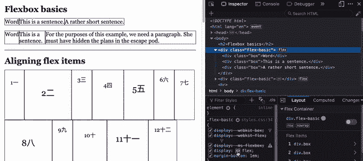
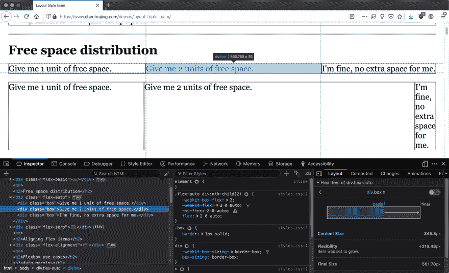
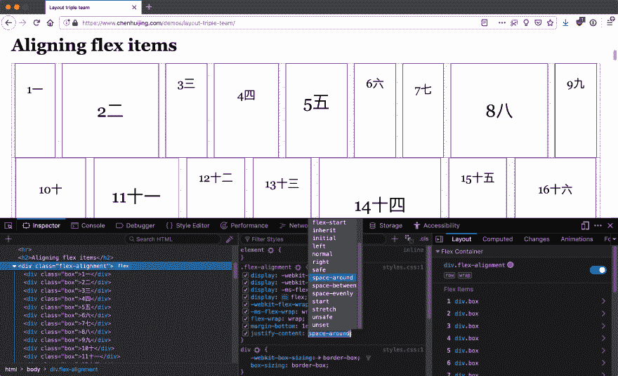
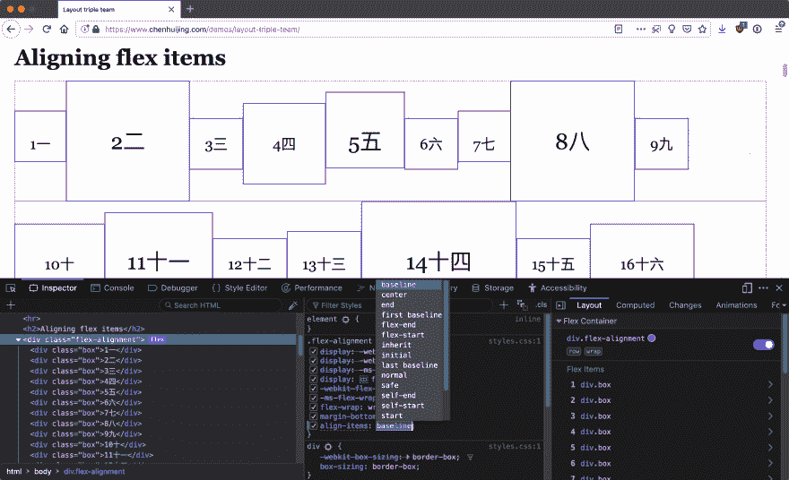
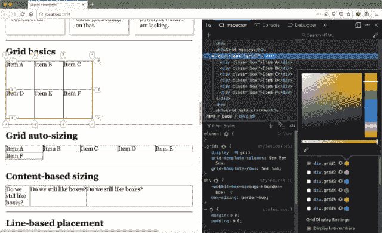
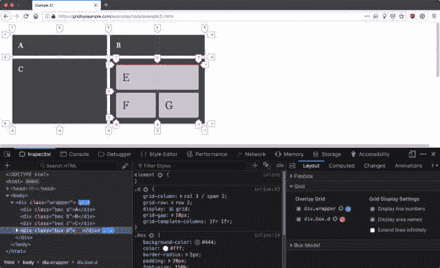
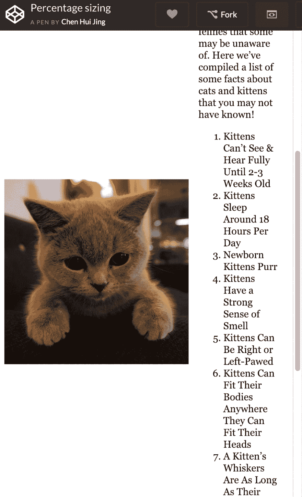
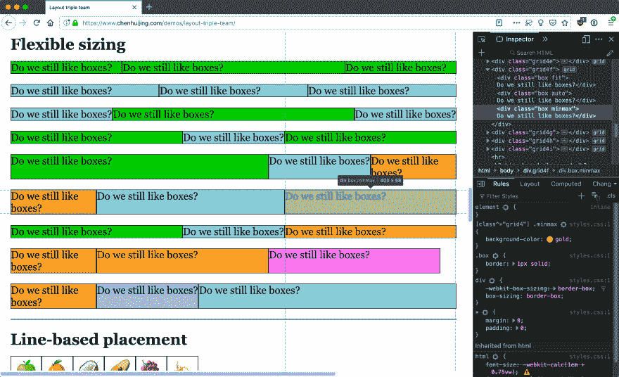

# 使用 DevTools 了解现代布局技术

> 原文：<https://dev.to/huijing/using-devtools-to-understand-modern-layout-techniques-3j4o>

我最近有机会参观了 Jakarta 的 Mozilla 社区空间，并在 MozKopdar JKT 与 T2 的 Alex Lakatos 进行了对话。我没有使用幻灯片，这是我通常的交付方式，我决定通过 DevTools 直接展示我想要分享的概念和技术。结果比我预期的要好。

这让我开始在更广阔的背景下思考 DevTools 的角色。DevTools 的主要作用是调试，但它也可以作为一种可视化的手段，显示浏览器如何解释我们编写的代码，特别是对于 CSS 布局。这对理解新的布局技术有很大的帮助。

Flexbox、网格和盒子对齐的现代布局三人小组引入了某些概念，这些概念可能比以前的布局方法更难想象。这就是火狐开发工具 IMHO 在促进可视化方面做得很好的地方。

## 伸缩检查器工具

先说 Flexbox。如果 Flexbox 的大小对你来说一直是个谜，我强烈推荐阅读 [Rachel Andrew](https://rachelandrew.co.uk/) 的精彩分析， [Flexbox:那个灵活的盒子有多大？](https://www.smashingmagazine.com/2018/09/flexbox-sizing-flexible-box/)砸杂志上。

截至本文撰写之时，唯一一个具有 Flex inspector 工具的浏览器是 Firefox，所有特色示例都使用 Firefox Nightly(v 66.0 a 1(2018-12-19))。它使用的界面与更著名的网格检查器工具类似，通过`display`属性值旁边的图标可以切换该工具。

 

<figure>

<figcaption>切换伸缩叠加</figcaption>

</figure>

在父元素上切换 flex 覆盖之后，我们还可以观察每个 flex 子元素的情况。可以在布局面板上看到关于 flex 子组件的灵活性和大小的信息。

 

<figure>

<figcaption>显示 flex 子</figcaption>

</figure>

的灵活性和大小

当谈到解释概念时，我发现在调整浏览器大小时，通过 DevTools 更改某些值，并立即在屏幕上看到相应的效果，这样更有效。

例如，在浏览器中实时演示时，`max-content`、`min-content`和`fit-content()`的基于内容的大小值更容易掌握。

## 框对齐可视化

flex overlay 也无意中成为各种框对齐属性的可视化工具，这主要是因为它的设计方式。可用空间由虚线和点组成的图案表示，这清楚地表明了当应用不同的值时，可用空间是如何分布的。

 

<figure>

<figcaption>遍历所有可能的值，看它们做什么</figcaption>

</figure>

我发现这特别有助于让人们记住 flex 项目的默认行为是拉伸以填充 flex 线上的可用空间，即线上的每个 flex 项目最终将与线上最高的项目具有相同的高度(在行方向上)。有时文字可能会令人困惑，视觉效果会有所帮助。

 

<figure>

<figcaption>当您的伸缩物品没有达到您预期的高度时</figcaption>

</figure>

当应用网格覆盖时，这种行为也是可以观察到的，并且考虑到 Firefox 也有目前为止所有浏览器中最好的网格检查工具，让我们也来讨论一下。

# 网格检查器工具

Firefox 的 Grid inspector 工具比其他任何浏览器都要早，他们一直在努力增加更多的功能，并根据用户的反馈修复错误。因此，当使用网格设计布局时，网格检查器工具已经成为我工作流程中不可或缺的一部分。

让我们从最有用的基本特性开始。能够看到标有网格编号的网格线。但更重要的是，我们可以自由地改变网格覆盖的颜色，这对于现实世界中的项目非常有用，在这些项目中，背景颜色非常接近默认的覆盖颜色，并且您需要两者之间有更多的对比度才能看到发生了什么。

 

<figure>

<figcaption>改变网格覆盖的颜色以适合你的项目</figcaption>

</figure>

自 Grid 首次发布以来，一个关键的改进是在视口边缘处理行号标签的方式。对于我的一些设计，我构建了网格来包含视口的最大宽度和高度，因此在网格检查器工具的早期迭代中，这些标签被切断。

我非常欣赏的是，DevTools 团队考虑到了用户的反馈，并在首次发布后继续改进该工具。在其他改进中，行号标签的位置已经过调整，因此它们总是可见的。

一个相对较新的特性改进是能够同时显示多个网格覆盖图。这对于以更复杂的方式使用网格的设计尤其有用，可能是重叠网格或嵌套网格。

 

<figure>

<figcaption>多个网格叠加在一个嵌套的网格布局上(示例由雷切尔·安德鲁)</figcaption>

</figure>

## 观察变化的速率

Flexbox 和 Grid 中最有趣的特性之一是如何改变元素的增长率或收缩率，并影响谁先收缩，或尽可能长时间保持它们的大小。

大约一年前，当我在奥斯汀的 Mozilla All-Hands 遇到 Jen Simmons 时，我第一次发现了这种行为。我想我们花了大约一个小时来改变网格值和调整浏览器的大小。我的意思是，一天一千次调整浏览器大小难道不是工作描述的一部分吗？但是我跑题了。

起初，这只是一个有趣的观察，但在 Jen 向世界介绍了固有的网页设计并展示了 6 大概念背后的一些具体例子后，我开始更多地思考这种行为的实际应用。

在灵活调整大小之前，如果我们希望设计能够适应视口的宽度，我们唯一的选择是相对调整大小，用百分比(或者视口单位，如果你喜欢冒险的话)。但是使用这些单位来调整元素的大小意味着它们以相同的速度增长和收缩，而不管它是什么类型的内容。

 

<figure>

<figcaption>百分比需要沿视口范围块进行管理</figcaption>

</figure>

有时，在更极端的视窗尺寸下，图像会放大和缩小太多，或者具有不同字体大小的某些文本块可能无法以舒适的阅读宽度显示。我们可以通过添加更多断点来解决这个问题，这意味着每个断点有多个布局代码块。

这种方法没有错，但我想强调的是，我们现在有更多的选择，变化率是一种新的设计工具，我们可以利用它来进行建筑布局。

### 弹性宽度的强度

强度可能是一种相当糟糕的表达方式，但是我想区分具有不同大小值的项目如何根据相同上下文中其他项目的大小值以不同方式保持其宽度。

 

<figure>

<figcaption>让比赛开始吧！</figcaption>

</figure>

上面的例子使用了 Grid，因为在撰写本文时，它支持我们可以使用的过多的灵活的大小调整值。如果你从 2018 年开始阅读这本书，也许这些值已经可以用在更多的格式化环境中了(让我祈祷)。

对于使用`fr`调整大小的轨迹，因为它被定义为网格容器中剩余空间的一部分，所以当视口继续增长超过非灵活轨迹所需的空间时，它将吸收所有额外的可用空间。

但是，当空闲空间被取走时，它也是第一个失去宽度的，在磁道用其他值调整大小时，它将首先收缩到它的`min-content`。

当您使用`auto`时，当空间充足时，轨道的行为类似于`max-content`。网格格式上下文是一个特例。因为`justify-content`的初始值是`normal`，其行为类似于`stretch`，所以所有的`auto`轨道都伸出，超出了轨道的最大内容宽度。(希望这有意义)

但是当空间有限且不断缩小时，轨道的宽度会变成网格项目中任何内容的最大最小尺寸。所以参考我的演示，如果你不断缩小视窗的尺寸，`auto`轨迹会缩小到单词“盒子”的宽度在溢出之前。

当视窗缩小时，`minmax(min, max)`值被认为是保持其最大宽度的“最强”值。如果有任何大小为`fr`的同伴轨迹，它们将首先收缩。

假设`auto`的行为应该和`max-content`一样，但是因为默认的对齐属性而被拉伸，那么拉伸的空间就是下一个要去的地方。

但是一旦达到最大内容宽度，`auto`轨道将与任何`minmax()`轨道一起收缩。并且他们将同时达到他们的最小尺寸*！您可以通过在逐渐调整视口时使用 DevTools 检查网格项目的宽度来验证这一点。*

 *[https://codepen.io/huijing/embed/GPrQwN/?height=600&default-tab=result&embed-version=2](https://codepen.io/huijing/embed/GPrQwN/?height=600&default-tab=result&embed-version=2)

我们也来谈谈`fit-content()`。这个特定的轨道尺寸将具有最大尺寸`max-content`或括号内的任何宽度，以较小者为准。因此，如果内容很多，可以将最大宽度限制在某个值。如果内容量小于括号内的值，则轨道大小最终为 max-content。

这个例子最好在现场播放，所以我把它移植到 Codepen ☝️.请在一个新窗口中打开它，并调整页面大小，直到你找到所有不同的可用值的行为。我就是这么做的。

## 建筑实际设计

我还写了另一篇关于为 LogRocket 灵活调整大小的文章，并给出了一个功能头的设计示例。我非常依赖 DevTools 来试验我需要的值，以获得我想要的效果，特别是对于间隔轨道。

[https://codepen.io/huijing/embed/YdXMPZ/?height=600&default-tab=result&embed-version=2](https://codepen.io/huijing/embed/YdXMPZ/?height=600&default-tab=result&embed-version=2)

尽管我知道灵活的大小调整在我的脑海中是如何工作的，但是如果不在浏览器中将其可视化，将所有内容放在一个项目重叠并跨越多个灵活轨道的网格中是不可能的。因此，提示 DevTools 来拯救我们。

## 包装完毕

我希望这能帮助那些试图理解灵活大小是如何工作的人，并且希望你自己也能尝试一下。因为没有比调整你的浏览器一千次看看会发生什么更好的老师了。我只是开个玩笑。

但我也很高兴看到，一旦我们都习惯了根据自身的价值和相同上下文中其他项目的价值来确定宽度的大小，设计师和开发人员会创造出什么。我认为这种行为为在大范围的视窗尺寸上设计布局提供了很多选择，而不太依赖断点。

这让我很兴奋。我希望它对你也是令人兴奋的！🤩*