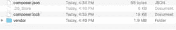
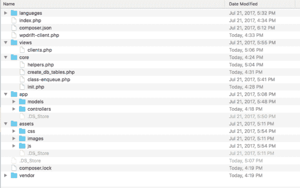

# 在 WordPress 插件开发中使用口才

> 原文：<https://dev.to/upnrunnhq/using-eloquent-in-wordpress-plugin-development-44ll>

WordPress 很棒，但是当我不得不写 SQL 查询时，我真的很讨厌它。我见过的大多数开发人员并不真的喜欢写 SQL 查询。WordPress 附带了$wpdb 类，但是你仍然需要编写 sql 查询。当您有少量查询时，$wpdb 是不错的，但是如果您曾经遇到过这样的情况，您需要处理大量定制的数据库表，并且必须将它们与不同的表连接起来，那么您就知道这有多痛苦了。

我也遇到过类似的情况，我没有写难看的 sql 查询，而是用雄辩提出了一个解决方案。雄辩是由 Laravel 框架开发的 ORM。这很容易操作，如果你愿意，你仍然可以用口才写 sql 查询。我不打算在这篇文章中谈论雄辩的特点。你可以查看官方的口才文档来获得更多关于口才的信息。

### 让我们开始设置我们的插件。

我假设你已经安装了 WordPress 并且你的机器上已经安装了 composer。如果你不确定 composer 是什么，Composer 是 php 的依赖管理器。可以访问 [composer 官方页面](https://getcomposer.org/)了解更多信息并下载。

让我们导航到 WordPress 插件目录并为我们的插件创建一个文件夹，我将把我的插件命名为 _**“WP drift-client”**_。

我在我的机器上全局安装了 composer，如果您的 composer 不是全局的，您可能希望将 composer.phar 文件复制到您的插件目录中，并在发出 composer 命令时使用“***”composer . phar***”而不是“ ***composer*** ”。让我们要求从作曲家照明\数据库包。打开你的终端窗口，将光盘放入插件文件夹*(即 WordPress-installation/WP-content/plugins/WP drift-client)*并输入以下命令:

```
composer require illuminate/database 
```

Enter fullscreen mode Exit fullscreen mode

现在你的插件文件夹应该看起来像这样:

[](https://res.cloudinary.com/practicaldev/image/fetch/s--z1BvECnA--/c_limit%2Cf_auto%2Cfl_progressive%2Cq_auto%2Cw_880/https://i0.wp.com/wpdrift.com/blog/wp-content/uploads/2017/07/Screen-Shot-2017-07-21-at-4.40.55-PM-300x52.png%3Fresize%3D300%252C52%26ssl%3D1)

Composer 生成了*厂商*目录，其中包含 are 包、 *composer.json* 文件和 *composer.lock* 文件。让我们打开 *composer.json* 并设置我们的名称空间。让我们编辑它，看起来像下面的代码:

```
{ "require": { "illuminate/database": "^5.4" }, "autoload": { "psr-4": { "Models\\": "app/models", "Controllers\\": "app/controllers" } } } 
```

Enter fullscreen mode Exit fullscreen mode

从您的终端运行编写器命令

```
composer dump-autoload 
```

Enter fullscreen mode Exit fullscreen mode

我们已经为模型和控制器设置了名称空间，现在让我们创建这些文件夹。我们将创建一个名为 _**“app”**_ 的文件夹，并在其中创建两个文件夹 _ **“模型”** _ 和 _ **“控制器”** _ 分别存储我们的模型和控制器。您可以随意命名您的名称空间。

我们已经成功安装了口才，让我们继续为插件创建其他文件。我们将创建一个主插件文件 *"wpdrift-clients.php"* ，一个空白的 *"index.php"* 文件， *"assets"* 文件夹，它将存储我们的 css、js、图像和字体，我们还将创建一个名为 *views* 的文件夹，它将存储我们插件的视图。我们还将创建一个名为*“core”*的文件夹，它将负责存储其他文件，如插件激活钩子，连接到数据库和助手。

创建完这些文件和文件夹后，你的插件目录应该是这样的:

[](https://res.cloudinary.com/practicaldev/image/fetch/s--wkfvIyxn--/c_limit%2Cf_auto%2Cfl_progressive%2Cq_auto%2Cw_880/https://i2.wp.com/wpdrift.com/blog/wp-content/uploads/2017/07/Screen-Shot-2017-07-27-at-5.08.05-PM-600x377.png%3Fresize%3D600%252C377%26ssl%3D1)

让我解释一下我在这里做了什么:

我们正在创建一个名为“clients”的数据库表(带前缀)，*core/create _ db _ tables . PHP*包括创建数据库的代码， *core/class-enqueue.php* 负责插件所需的样式和脚本。helpers.php 包括助手功能*。几乎大部分东西都包含在 *core/init.php* 中*

以下是这些文件的代码:

***主插件文件:wpdrift-client.php***

```
/\* Plugin Name: WpDrift Clients Plugin URI: http://wpdrift.com Description: Custom plugin using Eloquent Version: 1.0 Author: WPDrift Author URI: http://wpdrift.com License: GPL2 License URI: https://www.gnu.org/licenses/gpl-2.0.html Text Domain: wpdrift-clients Domain Path: /languages \*/ if(! defined('ABSPATH')) exit; if( ! defined('WPDRIFT\_CLIENTS\_URl')){ define('WPDRIFT\_CLIENTS\_URl',plugin\_dir\_url(\_\_FILE\_\_)); } if( ! defined('WPDRIFT\_CLIENTS\_PATH')){ define('WPDRIFT\_CLIENTS\_PATH',plugin\_dir\_path(\_\_FILE\_\_)); } require WPDRIFT\_CLIENTS\_PATH.'/core/create\_db\_tables.php'; register\_activation\_hook(\_\_FILE\_\_,'wpdrift\_clients\_custom\_tables'); if(! class\_exists('Wpdrift\_Clients')){ class Wpdrift\_Clients { function \_\_construct(){ add\_action('plugins\_loaded',[$this,'include\_dependencies']); } function include\_dependencies() { include WPDRIFT\_CLIENTS\_PATH.'/core/init.php'; } } } new Wpdrift\_Clients(); 
```

Enter fullscreen mode Exit fullscreen mode

***core/init . PHP***

```
require WPDRIFT\_CLIENTS\_PATH.'/vendor/autoload.php'; /\*database connection\*/ $capsule = new Illuminate\Database\Capsule\Manager; $capsule-\>addConnection(['driver' =\> 'mysql', 'host' =\> DB\_HOST, 'database' =\> DB\_NAME, 'username' =\> DB\_USER, 'password' =\> DB\_PASSWORD, 'charset' =\> 'utf8', 'collation' =\> 'utf8\_unicode\_ci', 'prefix' =\> '',]); $capsule-\>setAsGlobal(); $capsule-\>bootEloquent(); // enqueue styles and scripts with class-enqueue.php // helper functions helper.php include\_once WPDRIFT\_CLIENTS\_PATH.'/core/helpers.php'; include\_once WPDRIFT\_CLIENTS\_PATH.'/core/class-enqueue.php'; // add ajax actions $actions = new Controllers\ActionController(); add\_action('wp\_ajax\_create\_client',[$actions,'create']); add\_action('wp\_ajax\_delete\_client',[$actions,'delete']); // shortcode add\_shortcode('wpdrift\_clients',function(){ wpdrift\_clients\_load\_view('clients',['title'=\>'Clients list']); }); 
```

Enter fullscreen mode Exit fullscreen mode

***core/class-enqueue . PHP***

```
if(! class\_exists('Wpdrift\_Clients\_Enqueue')){ class Wpdrift\_Clients\_Enqueue { function \_\_construct(){ add\_action('wp\_enqueue\_scripts',array($this,'enqueue')); } function enqueue() { wp\_enqueue\_style('wpdrift-clients',WPDRIFT\_CLIENTS\_URl.'assets/css/wpdrift-clients.css'); wp\_enqueue\_script('jquery'); wp\_enqueue\_script('wpdrift-clients',WPDRIFT\_CLIENTS\_URl.'assets/js/wpdrift-clients.js',array('jquery'),'1.0',true); } } new Wpdrift\_Clients\_Enqueue(); } 
```

Enter fullscreen mode Exit fullscreen mode

***core/helpers . PHP***

```
function wpdrift\_clients\_load\_view($file,$data=[]){ if(! empty($data)){ extract($data); } if(file\_exists(WPDRIFT\_CLIENTS\_PATH.'views/'.$file.'.php')){ include\_once WPDRIFT\_CLIENTS\_PATH.'views/'.$file.'.php'; } else{ echo 'File not found in '.WPDRIFT\_CLIENTS\_PATH.'views/'.$file.'.php'; } } function get\_clients(){ $clients = Models\Client::all(); return $clients; } 
```

Enter fullscreen mode Exit fullscreen mode

基本上，我们只是用短代码显示一个视图。Shortcode 会触发一个函数*WP drift _ clients _ load _ view()(Location:core/helpers . PHP)*，这个函数会从 *views* 文件夹中提取数组参数并包含一个视图。

视图文件包括一个显示动态数据的表格，该表格带有函数*get _ clients()(Location:core/helpers . PHP)*，该函数从*客户端*模型获取数据。

每个动态数据都有一个删除按钮，这是一个带有 ajax 动作的表单，(*动作定义在 core/init.php* 上)，对这些动作的回调存储在*app/controllers/Action controller . PHP*中，这个控制器使用 *app/models/Clinet.php* 与 clients 表进行交互。

***app/controllers/action controller . PHP***

```
namespace Controllers; use Models\Client as Client; class ActionController { function create(){ $name = $\_POST['name']; $email = $\_POST['email']; $phone = $\_POST['phone']; $purchased\_service = $\_POST['service']; $client = new Client; $client-\>name = $name; $client-\>email = $email; $client-\>phone = $phone; $client-\>purchased\_service = $purchased\_service; $client-\>save(); $response = ['response\_type' =\> 'success', 'response\_data' =\> [ 'name' =\> $clinet-\>name, 'email' =\> $clinet-\>email, 'phone' =\> $clinet-\>phone, 'service' =\> $clinet-\>purchased\_service,] ]; return $response; die(); } function delete(){ $client\_id = $\_POST['client\_id']; $client = Client::find($client\_id); if($client){ $client-\>delete(); return 'success'; die(); } return false; die(); } } 
```

Enter fullscreen mode Exit fullscreen mode

***app/models/client . PHP***

```
namespace Models; use Illuminate\Database\Eloquent\Model as Model; class Client extends Model { protected $table; public $timestamps = false; function \_\_construct() { parent::\_\_construct(); $this-\>table = $this-\>get\_table\_name('clients'); } private function get\_table\_name($name) { global $wpdb; return $wpdb-\>prefix.$name; } } 
```

Enter fullscreen mode Exit fullscreen mode

正如你所看到的，我们的模型上没有太多代码，我们告诉模型的只是使用*前缀 _ 客户端*表，默认情况下，雄辩期望表在创建*,在*列更新*。所以，通过定义*public $ timestamps = false；我们正在禁用该功能。concertive 假设您有一个名为 *id* 的主键表，如果您考虑使用其他名称，您将不得不定义一个名为 *$primaryKey* 的属性。例如，如果你正在为 WordPress 本地*用户*表创建一个模型，它看起来会像这样:** 

```
namespace Models; use Illuminate\Database\Eloquent\Model as Model; class User extends Model { protected $table; public $timestamps = false; protected $primaryKey = 'ID'; function \_\_construct() { parent::\_\_construct(); $this-\>table = 'wp\_users'; $this-\>table = $this-\>get\_table\_name('users'); } private function get\_table\_name($name) { global $wpdb; return $wpdb-\>prefix.$name; } function meta() { return $this-\>hasMany('App\Usermeta'); } function posts() { return $this-\>hasMany('App\Post'); } } 
```

Enter fullscreen mode Exit fullscreen mode

在上面的例子中 *meta 和 posts* 方法定义了与其他模型“Usermeta 和 Post”的关系，这些模型可以使用 usermeta 和 posts 表。

我们用雄辩的 orm 构建了一个非常基本的插件。但是这篇文章不是关于插件有多大，而是用 MVC 架构来构建你的插件，并在你的插件中使用雄辩的 orm。这篇文章只关注使用 MVC 和口才，你将不得不实现安全，当你建立你真正的插件。

因此，如果你正在使用创建一个带有大量自定义表格的大型自定义插件，我相信这种方法将非常容易管理，因为我不建议你使用这种方法在*wordpress.org*发布你的插件，因为它会产生额外的数据库连接，并且用户使用 5 个类似方法的插件，他们将有 6 个数据库连接。

**[下载代码](https://wpdrift.com/blog/wp-content/uploads/2017/07/wpdrift-clients-2.zip)**

帖子[在 WordPress 插件开发中使用口才](https://upnrunn.com/blog/2019/05/using-eloquent-in-wordpress-plugin-development/)最早出现在 [upnrunn | Build &部署强大的应用](https://upnrunn.com)上。