# 使用 Galen 框架进行自动跨浏览器布局测试

> 原文：<https://dev.to/lambdatest/using-galen-framework-for-automated-cross-browser-layout-testing-3g77>

Galen 框架是一个[测试自动化](https://www.lambdatest.com/blog/automated-cross-browser-testing/)框架，最初被引入是为了在浏览器中执行 web 应用程序的跨浏览器布局测试。如今，它已经成为一个功能齐全的测试框架，拥有丰富的[报告和测试管理系统](https://www.lambdatest.com/blog/why-your-startup-needs-test-management/)。这个[框架支持 Java 和 Javascript](https://www.lambdatest.com/blog/top-javascript-frameworks-for-2019/) 。

你想知道什么是[跨浏览器布局测试](https://www.lambdatest.com/blog/performing-cross-browser-testing-with-lambdatest/)吗？让我澄清一下，你用谷歌浏览器开发了一个快速运行的网站。一切都按照您的预期功能运行。UI 很整洁，很有成就感。现在，你把这个展示给你的产品经理、利益相关者或任何其他用户，他们的默认浏览器设置为 Mozilla Firefox/ Safari/ Opera 或除 Google Chrome 之外的任何浏览器，然后你会惊讶地注意到网站渲染中的 UI 偏差。这意味着你的网站不是[跨浏览器兼容的](https://www.lambdatest.com/blog/how-to-make-a-cross-browser-compatible-website/)，因为当通过不同的浏览器访问时，它会突然工作。确保一个网站的布局在不同的浏览器上看起来和运行起来都无缝的实践被称为跨浏览器布局测试。我们生活在一个时代，响应式设计正在成为每个网站的必需品。如果您正在寻求解决以下挑战，在移动、桌面等多种设备中进行响应性网站布局。，那么 Galen 框架是最好的开源框架选择之一:

*   你的文字对齐正确吗？
*   徽标是否在左窗格顶部正确对齐？
*   文本框或其他 UI 对象的宽度和高度是否正确？
*   你会玩配色吗？
*   所有 GUI 在不同设备的不同浏览器中适当地显示

在本文中，我们将看看如何使用 IntelliJ 为 Galen 框架建立测试自动化环境，然后继续使用脚本。我还将向您展示如何为您的[自动化测试用例](https://www.lambdatest.com/blog/17-lessons-i-learned-for-writing-effective-test-cases/)生成报告，以及一些故障排除技巧来帮助您开始使用 Galen 框架进行跨浏览器布局测试的浏览器自动化。让我们开始吧。

**第一步:设置环境:**

唯一需要的先决条件是在你的机器上安装 JDK 8。安装 JDK 8(最低 JDK 版本)，请访问官网点击[此处](https://www.oracle.com/technetwork/java/javase/downloads/jdk8-downloads-2133151.html)下载。

下载后，安装简单，点击继续即可完成。
一旦安装完成，你就必须提供一个设置路径。这里是你可以这样做！
转到窗口按钮，寻找“环境变量”。完成后，您需要选择“编辑系统环境变量”选项。之后，单击“新建”按钮，添加“JAVA_HOME”作为您的安装路径。
T3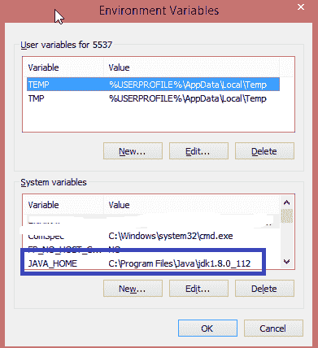T5】

之后，在变量部分找到“Path”并双击。在变量值中，将“%JAVA_HOME%\bin”添加到路径中，以确保在机器中可以访问指定的 JAVA 版本。

[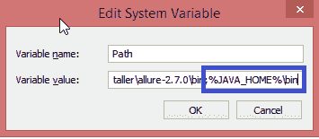](https://res.cloudinary.com/practicaldev/image/fetch/s--N-vxVX-P--/c_limit%2Cf_auto%2Cfl_progressive%2Cq_auto%2Cw_880/https://www.lambdatest.com/blog/wp-content/uploads/2019/01/Adding_JavaHome_in_Path.png)

现在，为了验证 JDK 是否正确安装！在你的 cmd(命令提示符)中提到下面的命令:
`java-version`

[](https://res.cloudinary.com/practicaldev/image/fetch/s--qGTCWnx2--/c_limit%2Cf_auto%2Cfl_progressive%2Cq_auto%2Cw_880/https://www.lambdatest.com/blog/wp-content/uploads/2019/01/Verifying_Java_Version.png)

太棒了。您刚刚在您的计算机上成功安装了 JDK。

**步骤 2–下载 IntelliJ 并设置 Maven 项目**

IntelliJ 是一个免费的开源 Java IDE(集成开发环境),用于开发基于 Java 的计算机软件。您可以从这里下载 IntelliJ 的社区版本。

下载后，安装很容易，只需点击下一步，并以默认值完成。
在 Windows - >中搜索“IntelliJ”->会打开一个窗口“新建项目”。
[](https://res.cloudinary.com/practicaldev/image/fetch/s--LyVy14yO--/c_limit%2Cf_auto%2Cfl_progressive%2Cq_auto%2Cw_880/https://www.lambdatest.com/blog/wp-content/uploads/2019/01/IntelliJ_Launch_Page.png) 
点击创建新项目，选择 Maven 并点击‘下一步’按钮。
[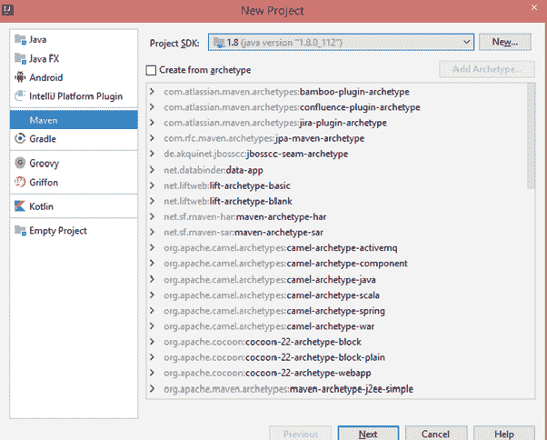](https://res.cloudinary.com/practicaldev/image/fetch/s--fgb1usti--/c_limit%2Cf_auto%2Cfl_progressive%2Cq_auto%2Cw_880/https://www.lambdatest.com/blog/wp-content/uploads/2019/01/Create_New_Maven_Project.png) 
输入 GroupId、ArtifactId 并保留版本默认值，然后点击“下一步”按钮。
[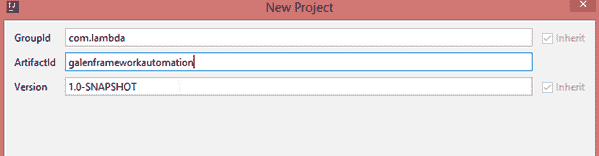](https://res.cloudinary.com/practicaldev/image/fetch/s--H7AG4gke--/c_limit%2Cf_auto%2Cfl_progressive%2Cq_auto%2Cw_880/https://www.lambdatest.com/blog/wp-content/uploads/2019/01/Create_project_Artifact_version.png) 
留下项目名称，选择项目所在的位置。点击【完成】按钮
[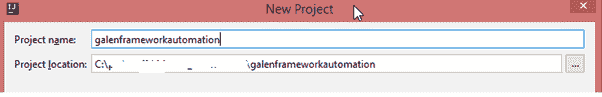](https://res.cloudinary.com/practicaldev/image/fetch/s--acqUTfY5--/c_limit%2Cf_auto%2Cfl_progressive%2Cq_auto%2Cw_880/https://www.lambdatest.com/blog/wp-content/uploads/2019/01/create_Project_Location_project_Location.png) 
所创建的项目在 IntelliJ 中显示为如下快照。请确保启用自动导入。
[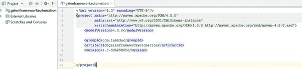](https://res.cloudinary.com/practicaldev/image/fetch/s--QyeXHLcQ--/c_limit%2Cf_auto%2Cfl_progressive%2Cq_auto%2Cw_880/https://www.lambdatest.com/blog/wp-content/uploads/2019/01/POM_xml_in_Intellij.png)

按照以下步骤在 IntelliJ 中添加 Maven 依赖关系
转到 Maven 知识库[https://mvnrepository.com/](https://mvnrepository.com/)并搜索 Galen 框架。
[T6】](https://res.cloudinary.com/practicaldev/image/fetch/s--QyeXHLcQ--/c_limit%2Cf_auto%2Cfl_progressive%2Cq_auto%2Cw_880/https://www.lambdatest.com/blog/wp-content/uploads/2019/01/POM_xml_in_Intellij.png)

选择最新的 Galen 框架支持 Java 测试框架。
[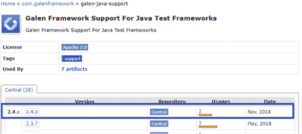T3】](https://res.cloudinary.com/practicaldev/image/fetch/s--IXcrOfTY--/c_limit%2Cf_auto%2Cfl_progressive%2Cq_auto%2Cw_880/https://www.lambdatest.com/blog/wp-content/uploads/2019/01/Choosing_Galen_Framework_Version-1.png)

选择顶部列出的最新版本，并复制下面快照中突出显示的 Galen 框架依赖项。
[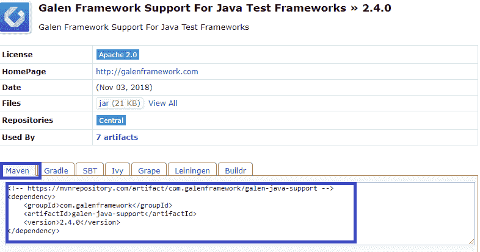T3】](https://res.cloudinary.com/practicaldev/image/fetch/s--5B7wPpcS--/c_limit%2Cf_auto%2Cfl_progressive%2Cq_auto%2Cw_880/https://www.lambdatest.com/blog/wp-content/uploads/2019/01/Copying_Galen_Dependencies.png)

将 pom.xml 中的上述 Maven 依赖项复制到您的项目中。一旦被复制，它的依赖项和临时依赖项就会从 Maven 存储库中下载。例如，像 Galen Framework 这样依赖项和 Selenium 这样的临时依赖项，以及一些公共库。

[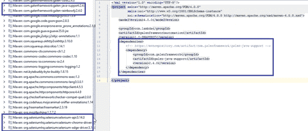](https://res.cloudinary.com/practicaldev/image/fetch/s--n9BWd3d8--/c_limit%2Cf_auto%2Cfl_progressive%2Cq_auto%2Cw_880/https://www.lambdatest.com/blog/wp-content/uploads/2019/01/Galen_Dependencies_in_IntelliJ.png)

```
<dependency>
    <groupId>org.testng</groupId>
    <artifactId>testng</artifactId>
    <version>6.9.10</version>
    <scope>test</scope>
</dependency>

```

maven 项目结构如下图所示。

[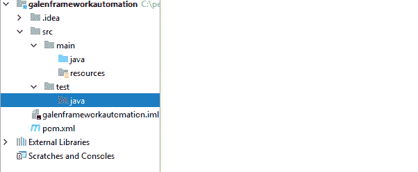](https://res.cloudinary.com/practicaldev/image/fetch/s--rQup0HNW--/c_limit%2Cf_auto%2Cfl_progressive%2Cq_auto%2Cw_880/https://www.lambdatest.com/blog/wp-content/uploads/2019/01/Maven_Project_Structure_In_Intellij.png)

**步骤 3:实现规格文件**

**了解如何编写规范文件** :
Galen 规范语言非常灵活，让您有机会表达您希望您的网站在通过不同设备访问时的确切行为方式。页面规范文件有两个主要部分:对象定义和对象规范。

这个 spec 文件很重要，并且是根据作为预期结果添加的定义运行自动化的先决条件，它在您的应用程序中运行并比较实际结果。

让我为网站[https://www.lambdatest.com/](https://www.lambdatest.com/)写一个简单的规范文件

要创建规格文件，扩展名必须是"。gspec"
[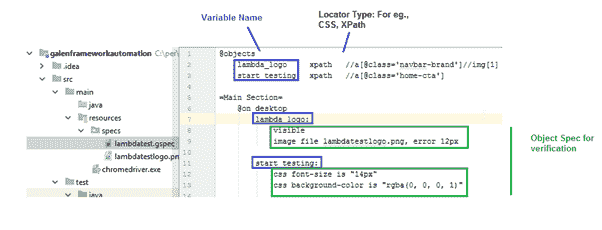](https://res.cloudinary.com/practicaldev/image/fetch/s--M5JL1OAS--/c_limit%2Cf_auto%2Cfl_progressive%2Cq_auto%2Cw_880/https://www.lambdatest.com/blog/wp-content/uploads/2019/01/Implementing_Spec_File.png)

上面的 spec 文件及其图像被复制到 resource 文件夹中的 specs 目录下。

注意:如果一个图像出现在同一个目录中，spec 文件将会理解。如果没有，那么您必须明确地提到文件夹名称/图像文件。但是，请记住，子文件夹必须位于您的规范文件所在的位置。

上面的规范只是用于样本测试执行。为了更加熟悉，请访问该网站并使用更多示例:
[http://Galen framework . com/docs/reference-Galen-spec-language-guide/](http://galenframework.com/docs/reference-galen-spec-language-guide/)

**第四步:编写代码**

我们需要为自动化脚本编写代码，以便与 Galen 框架一起工作。在您开始通过 Galen 框架为浏览器自动化编写代码之前，您需要一个程序目录。您可以通过转到测试中的 Java 目录来创建一个目录。转到 test->java directory->创建一个名为“testsuites”的目录名，并创建一个新类。

下面是一个用 Galen 框架演示浏览器自动化的例子。我将编写代码，以验证标志存在和 LAMBDATEST 标志的像素和背景颜色，按钮的字体大小，说“开始测试”。

[](https://res.cloudinary.com/practicaldev/image/fetch/s--XT2ZeAJC--/c_limit%2Cf_auto%2Cfl_progressive%2Cq_auto%2Cw_880/https://www.lambdatest.com/blog/wp-content/uploads/2019/01/Lamda_page_Screenshot.png)

在您现在看到的 IntelliJ 窗口中，编写以下代码:

**代码(自我说明):**

```
SampleUILayoutTest.java
Last week
Dec 27, 2018
M
Muthuraja Ramakrishnan uploaded an item
Java
SampleUILayoutTest.java
package testSuites;
import com.galenframework.api.Galen;
import com.galenframework.reports.GalenTestInfo;
import com.galenframework.reports.HtmlReportBuilder;
import com.galenframework.reports.model.LayoutReport;
import org.openqa.selenium.WebDriver;
import org.openqa.selenium.chrome.ChromeDriver;
import org.testng.annotations.AfterClass;
import org.testng.annotations.AfterMethod;
import org.testng.annotations.BeforeClass;
import org.testng.annotations.Test;
import java.io.IOException;
import java.util.Arrays;
import java.util.LinkedList;
import java.util.List;
public class SampleUILayoutTest {
    private static final String lambdaTestpage = "src/main/resources/specs/lambdatest.gspec";
    private static final String baseURL="https://www.lambdatest.com/";
    private WebDriver driver;
    private LayoutReport layoutReport;

    /* initialize webdriver, make sure you download chrome driver in http://chromedriver.chromium.org/downloads
    and drop the exe file under resources folder
     */
    @BeforeClass
    public void init() {
        //declaration and instantiation of Objects/variables
        System.setProperty("webdriver.chrome.driver", "src/main/resources/chromedriver.exe");
        driver = new ChromeDriver();
        //triggers chrome to launch for directing it towards the base url
        driver.get(baseURL);
        //Maximize the browser window
        driver.manage().window().maximize();
    }
    @test
    public void checkLogoVisibleAndImageVerification() throws IOException {
        //Executing Layout check and obtaining the Layout report
        layoutReport = Galen.checkLayout(driver, lambdaTestpage, Arrays.asList("desktop"));
    }
    @AfterMethod
    public void reportUpdate() {
        try {
            //Creating a list of tests
            List tests = new LinkedList<>();
            //The object you create will be consisting the information regarding the test
            GalenTestInfo test = GalenTestInfo.fromString("Test Automation Using Galen Framework");
            //Adding layout report to the test report
            test.getReport().layout(layoutReport, "Verify logo present and log image comparison");
            tests.add(test);
            //Exporting all test report to html
            new HtmlReportBuilder().build(tests, "target/galen-html-reports");
        } catch (Exception e) {
            e.printStackTrace();
        }
    }

    @AfterClass
    public void tearDown() {
        //Close and Quit the driver.
        driver.quit();
    }

}

```

**第五步:报告生成:**

一旦运行了上面的代码，报告就会在 target-> Galen-html-reports
Open reports.html 下生成，这将返回下面的报告
[](https://res.cloudinary.com/practicaldev/image/fetch/s--P1oiXIku--/c_limit%2Cf_auto%2Cfl_progressive%2Cq_auto%2Cw_880/https://www.lambdatest.com/blog/wp-content/uploads/2019/01/Galen_Report_Summary.png)

点击左侧的超链接标签。
[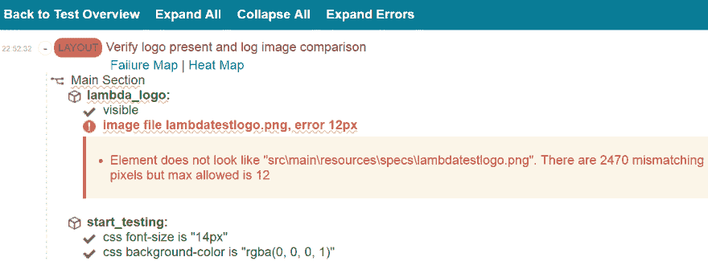T3】](https://res.cloudinary.com/practicaldev/image/fetch/s--WdQbGSC9--/c_limit%2Cf_auto%2Cfl_progressive%2Cq_auto%2Cw_880/https://www.lambdatest.com/blog/wp-content/uploads/2019/01/Galen_Detailed_report.png)

您将在摘要页面上找到详细的报告和故障。单击任何一个链接，例如，我单击了可见的链接&它验证了下面显示的徽标。
[T3】](https://res.cloudinary.com/practicaldev/image/fetch/s--L1D0K5RU--/c_limit%2Cf_auto%2Cfl_progressive%2Cq_auto%2Cw_880/https://www.lambdatest.com/blog/wp-content/uploads/2019/01/LAMBDATEST_Logo.png)

这是另一个例子，当我点击 css“背景色”时，背景色被确认为黑色。

[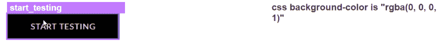](https://res.cloudinary.com/practicaldev/image/fetch/s--XkLfmDav--/c_limit%2Cf_auto%2Cfl_progressive%2Cq_auto%2Cw_880/https://www.lambdatest.com/blog/wp-content/uploads/2019/01/Start-Testing_snapshot.png)

### 故障排除

*   设置项目后，如果您在 IntelliJ 中遇到任何错误，请通过导航到右键单击项目->打开模块设置->模块->选择 JDK 版本 1.8 来仔细检查
*   我们应该在规范文件中保持适当的缩进，否则它可能会抛出一个错误。请访问网站了解更多详情。

[http://Galen framework . com/docs/reference-Galen-spec-language-guide/](http://galenframework.com/docs/reference-galen-spec-language-guide/)

这就是[开始使用浏览器自动化](https://www.lambdatest.com/blog/top-10-books-for-getting-started-with-automation-testing/)所需要知道的全部内容，使用 Galen 框架对您的网站或 web 应用程序进行跨浏览器布局测试。欢迎在下面的评论区分享你对本教程的看法。如果你有任何问题要问我，或者分享你到目前为止使用 Galen 框架进行跨浏览器布局测试的经验，我将不胜感激。测试愉快！

[原始资料来源:lambdatest.com](https://www.lambdatest.com/blog/using-galen-framework-for-automated-cross-browser-layout-testing/)