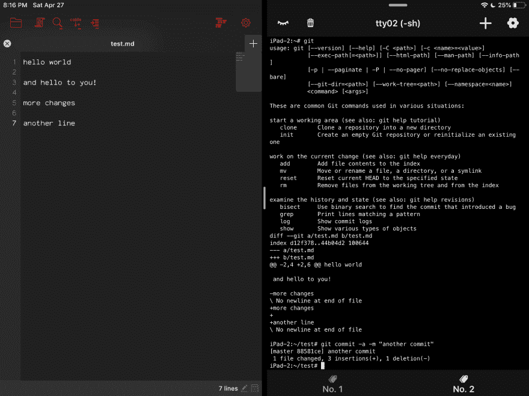

# 在 iOS 上使用 Git(免费方式)

> 原文：<https://dev.to/cookrdan/using-git-on-ios-1l1n>

# 在 iOS 上使用 Git

*我提到了两个应用程序——我没有从属关系...只是分享一些东西*

我最近发现了一个相当新的 iOS 应用，叫做 [iShell](https://itunes.apple.com/ca/app/ishell/id1455946930?mt=8) 。简而言之，它是 Alpine Linux。我很兴奋看到这一点，我不能帮助自己修补它。它附带了一个包管理器(apk)。我可以安装 bash (google it)并改变提示符的外观等等。不是所有你期望的东西都在这里，有些东西可能就是不工作(因为应用程序对设备硬件等的访问是有限的)。

我也很好奇如何让 git 工作。简而言之:是的，有效。像`git log`这样的东西的打印输出有点不稳定，但是它确实工作。我还没试过，但在屏幕更大的 iPad 上可能会更好。随软件包管理器安装的版本是 2.20.1。

(编辑:手动添加较少的分页器使得使用分页器的 git 的输出正常)

### 好吧，但是这对 git 真的有用吗？？

Git 可以工作，但是编辑文件呢？iShell 附带了 Vim，我还安装了 nano，并将其设置为 git 的编辑器。但是用其他 iOS 应用做编辑器呢？

昨天我发现 iShell 作为一个来源出现在 iOS 文件应用程序中。当你浏览结构时，系统上的一切都是可访问的，主文件夹`~/`是`/root`。现在有趣的部分是，正如你可能知道的，这些文件可以通过利用 iOS 文件文档选择器的应用程序访问。

因此，举例来说，通过像 [Kodex](https://itunes.apple.com/ca/app/kodex/id1038574481?mt=8) 这样的编辑器应用程序，你可以访问存储在 iShell 中的文件。进行编辑。然后在 iShell 中执行所有常规的 git 命令。

在 iPad 上，iShell 支持分屏，这样你就可以一边是编辑器，另一边是 iShell，或者滑动屏幕。你知道:触摸触摸点击点击 git。

我没有彻底测试过，但我相信一切都应该正常工作。iShell 和 Kodex 都是免费的，所以这是在 iOS 上使用 git 和远程回购的免费方式。

编辑:这是 ipad 上的截图
