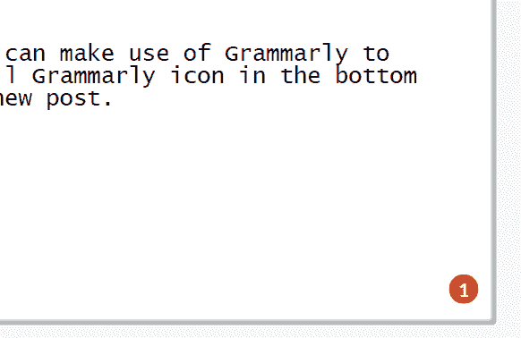

# 在 Opera 浏览器中使用语法

> 原文：<https://dev.to/dowenb/using-grammarly-in-opera-browser-2kdo>

首先，你需要为 Opera 添加[安装 Chrome 扩展](https://addons.opera.com/en-gb/extensions/details/install-chrome-extensions/)插件。

接下来，去 Chrome 网上商店找到[语法扩展](https://chrome.google.com/webstore/search/grammerly)。这就是“安装 Chrome 扩展”插件发挥作用的地方，它允许你直接从 Chrome 网络商店安装 Grammarly 插件。单击 install 后，您将被带到 Opera extensions 屏幕，您需要通过接受权限并单击 Install 来完成该过程。

就是这样！下次你在 Dev.to 上发帖时，你可以利用 Grammarly 来写和评论你的帖子。只需在你的下一篇新帖中点击文本区右下角的小语法图标。

