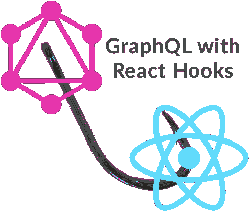

# 使用带挂钩的 GraphQL

> 原文：<https://dev.to/vladimirnovick/using-graphql-with-hooks-1kla>

React Hooks 是一个新的 React api，它出现在 16.8 版本中，从那以后一直受到很多关注。这主要是因为现在我们不需要为使用状态或生命周期方法创建类组件。事实上，你可以完全抛弃生命周期方法，因为有了钩子，你可以使用`useEffect`来处理任何你以前用于生命周期方法的东西。

所以现在，当钩子出来的时候，让我们看看我们是否能把 GraphQL 和钩子一起使用。但在此之前，我们先简单讨论一下如何将 GraphQL 与 React 和 Apollo 结合使用。
这篇文章假设你有 GraphQL 的基础知识，但如果你没有，你可以查看我的免费在线训练营【9.5h 的现场编码和 GraphQL 方面的教学。在下面的代码片段中，我们为查询、突变和订阅设置了我们的`ApolloProvider`。我们的 GraphQL API 端点也有一个访问键，所以我们创建了一个 authLink 并用它包装我们的`httpLink`。对于`WebSocketLink`，我们在`connectionParams`中设置我们的头。