# 在 Postman 中使用 JWT 对请求进行认证和授权

> 原文：<https://dev.to/loopdelicious/using-jwt-to-authenticate-and-authorize-requests-in-postman-3a5h>

当您开始开发可靠的 API 时，让我们看看如何使用 Postman 来授权我们的请求。在这个例子中，我们将使用 JSON Web 令牌来保护和访问我们的 API。

## 什么是 JWT？

[JSON Web Token](https://jwt.io/) (JWT)是一个[开放标准](https://tools.ietf.org/html/rfc7519)，以 JSON 对象的形式在各方之间安全传输信息。它的发音是 *jot* ，或者像我们的荷兰朋友说的那样， *[yaywaytay](https://news.ycombinator.com/item?id=14293602)* 。

JWT 通常用于授权。jwt 可以使用秘密或公钥/私钥对进行签名。用户登录后，每个后续请求都需要 JWT，从而允许用户访问该令牌允许的路由、服务和资源。

[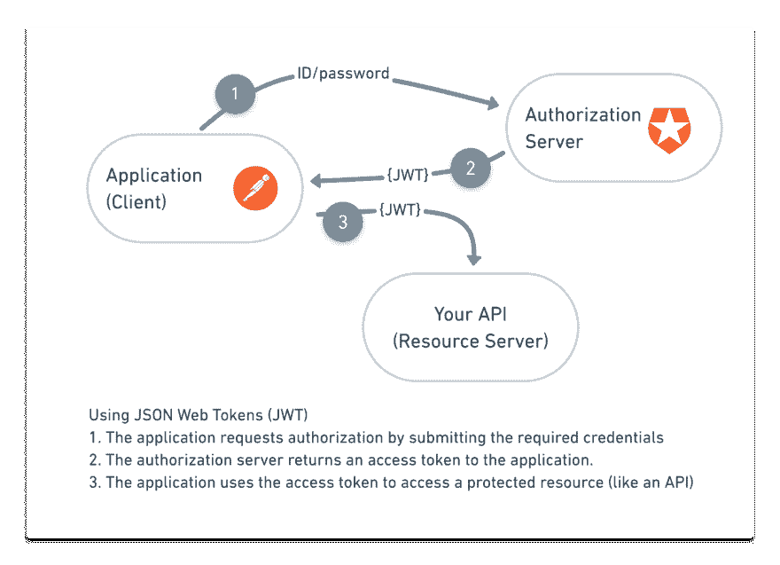](https://res.cloudinary.com/practicaldev/image/fetch/s--vg8UWYt8--/c_limit%2Cf_auto%2Cfl_progressive%2Cq_auto%2Cw_880/https://thepracticaldev.s3.amazonaws.com/i/zxloj1qn8j2iu5qy2ymd.png)

## 设置带 JWT 认证的 API

让我们使用来自 Auth0 的这个[示例 Node.js API](https://github.com/auth0-blog/nodejs-jwt-authentication-sample) ,它支持 jwt 的用户名和密码认证，并且具有返回 Chuck Norris 短语的端点。如果你已经有一个正在开发的 API，你可以跳过这一步。

对于这个例子，确保您的机器上安装了 [Node.js](https://nodejs.org/en/download/) 和 [npm](https://www.npmjs.com/package/download) 包管理器。从克隆存储库开始，用`npm install`安装依赖项，然后用`node.server.js`在本地启动服务器。

[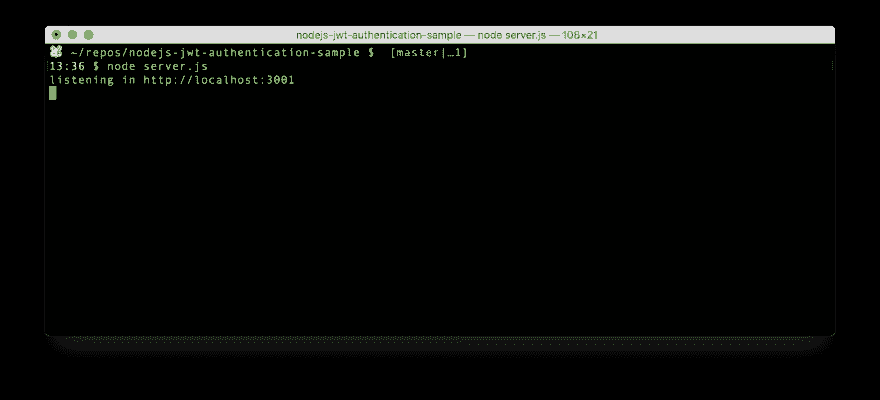](https://res.cloudinary.com/practicaldev/image/fetch/s--QggX6ccO--/c_limit%2Cf_auto%2Cfl_progressive%2Cq_auto%2Cw_880/https://thepracticaldev.s3.amazonaws.com/i/73bb7oc2s8va9tpq41bw.png)

点击[自述文件](https://github.com/auth0-blog/nodejs-jwt-authentication-sample)底部的 *Run in Postman* 按钮，将样本 Postman 集合导入到 Postman app 中。如果您正在使用自己的 API，请用您的端点来代替 Postman 集合中包含的示例。

集合中的第一个请求是创建用户的 POST 请求。如果您已经有一个用户，请使用集合中的第二个请求来创建一个新会话。在这两种情况下，您都会看到 JSON 响应对象中包含的访问令牌。

## 将 JWT 保存为变量

您*可以*从响应中复制访问令牌，以便在下一个请求中使用，但是对您想要授权的每个请求都这样做是很繁琐的。

相反，让我们将 JWT 保存为一个变量，这样我们就可以在将来的请求中反复重用这个令牌。创造新的[环境](https://learning.getpostman.com/docs/postman/environments_and_globals/manage_environments#creating-a-new-environment)。在 Tests 选项卡下，用`pm.environment.set()`将访问令牌[保存为环境变量](https://learning.getpostman.com/docs/postman/scripts/test_examples)，并重新运行请求。

[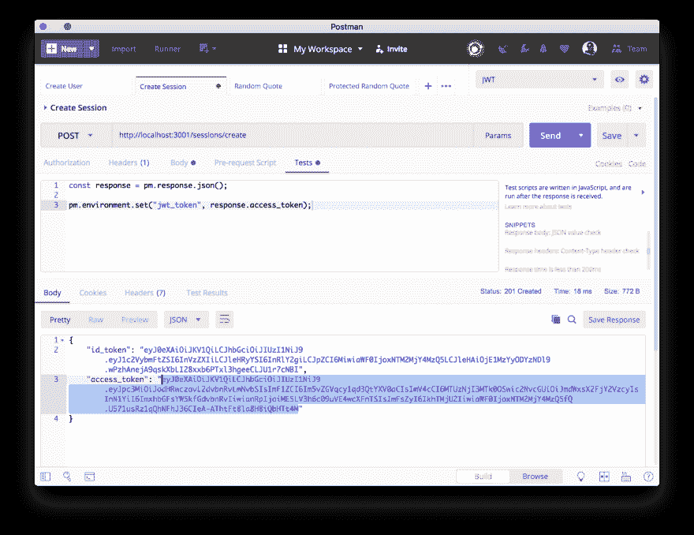](https://res.cloudinary.com/practicaldev/image/fetch/s--W0rJlVOe--/c_limit%2Cf_auto%2Cfl_progressive%2Cq_auto%2Cw_880/https://thepracticaldev.s3.amazonaws.com/i/m21g6tkqnjzv42nvp2mz.png)

在快速查看图标下，我们可以看到我们的 JWT 被保存为一个环境变量。现在我们可以在后续请求中使用我们的令牌。

[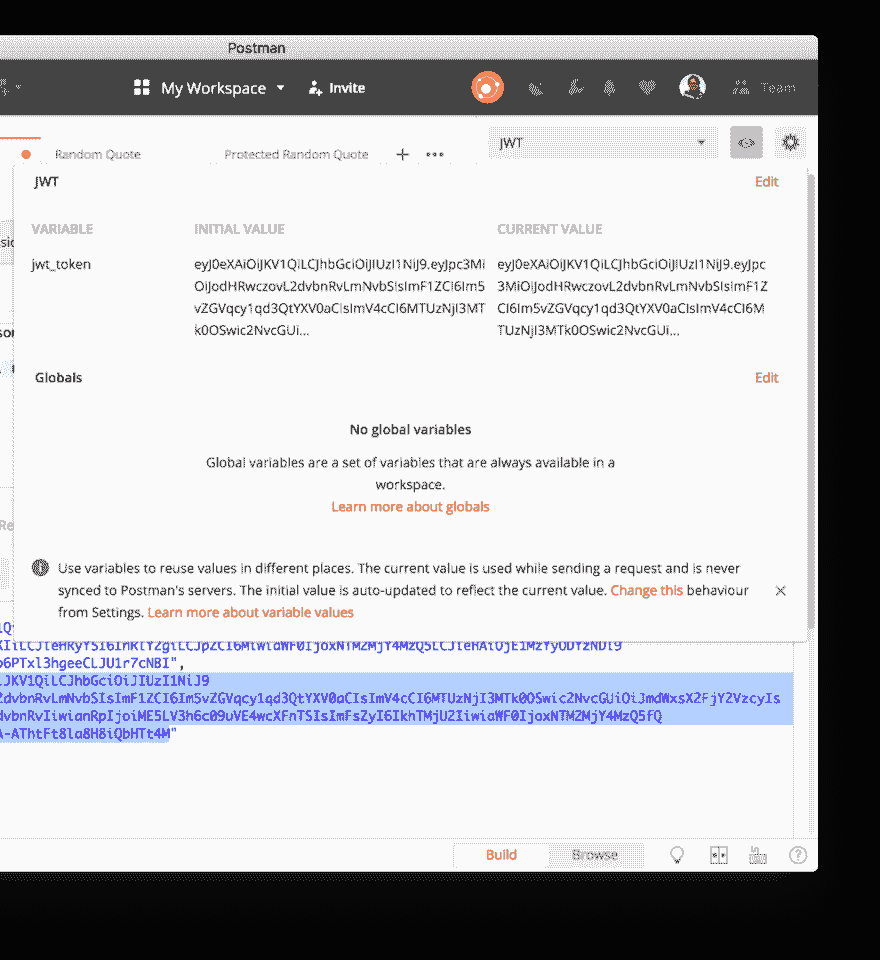](https://res.cloudinary.com/practicaldev/image/fetch/s--oPmW36wn--/c_limit%2Cf_auto%2Cfl_progressive%2Cq_auto%2Cw_880/https://thepracticaldev.s3.amazonaws.com/i/lkducwng1cd47ijxwbof.png)

## 将 JWT 添加到邮递员的邮件头

有两种方法发送您的 JWT 来授权您在 Postman 中的请求:添加标题或使用授权助手。

#### 选项 1:添加授权头

第一个选项是添加标题。在 Headers 选项卡下，添加一个名为`Authorization`的键，值为`Bearer <your-jwt-token>`。使用双花括号语法交换令牌的变量值。

如果您的授权接受自定义语法，您可以在这里手动调整前缀(例如用`Token <your-access-token>`代替`Bearer <your-access-token`)。

[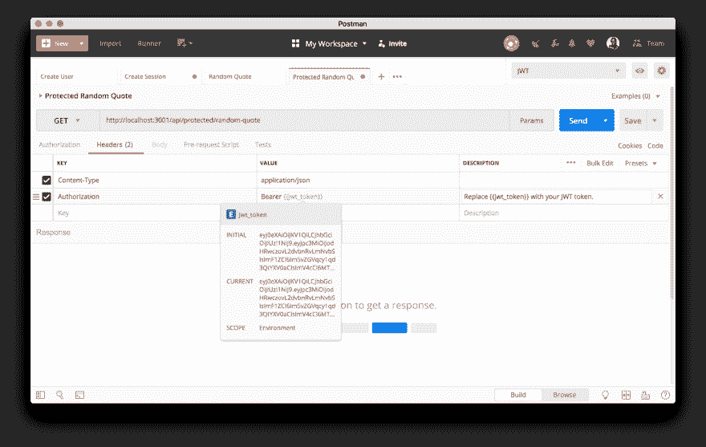](https://res.cloudinary.com/practicaldev/image/fetch/s--GARigUXh--/c_limit%2Cf_auto%2Cfl_progressive%2Cq_auto%2Cw_880/https://thepracticaldev.s3.amazonaws.com/i/3hhbq5mk5khwobwg2ymh.png)

#### 选项 2:使用授权助手

第二种选择是使用授权助手。在“授权”选项卡下，选择不记名令牌授权类型。使用双花括号语法交换令牌的变量值。

[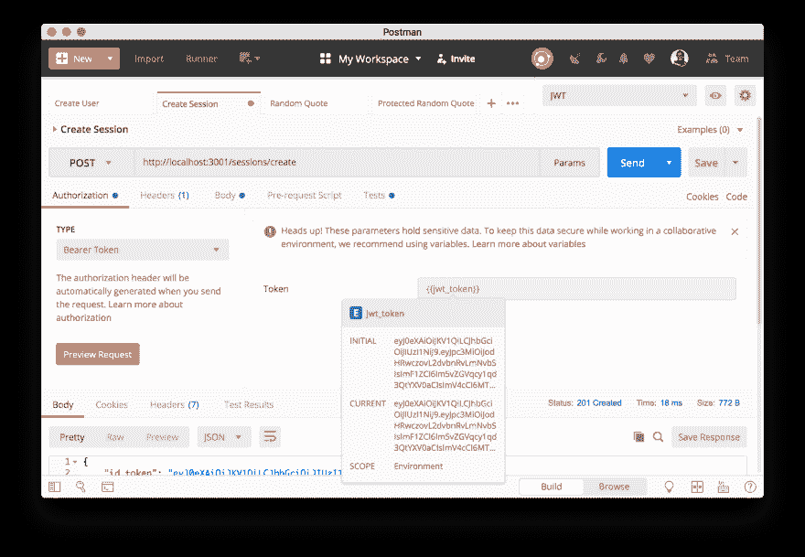](https://res.cloudinary.com/practicaldev/image/fetch/s--ahcHTBqU--/c_limit%2Cf_auto%2Cfl_progressive%2Cq_auto%2Cw_880/https://thepracticaldev.s3.amazonaws.com/i/1nye3act6m1qqwk2i7ju.png)

点击橙色预览请求按钮，查看标题选项卡下是否添加了临时标题。此临时标题不会与您的请求或集合一起保存。

[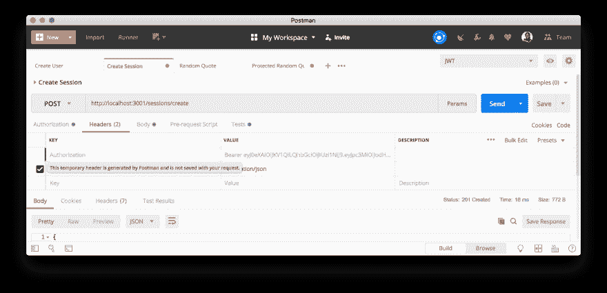](https://res.cloudinary.com/practicaldev/image/fetch/s--NK3zn9E9--/c_limit%2Cf_auto%2Cfl_progressive%2Cq_auto%2Cw_880/https://thepracticaldev.s3.amazonaws.com/i/wavc0bjb8f6f2vzljt1u.png)

这两种方法有什么区别？你使用的方法应该取决于你打算如何使用它。

#### 选项 1:添加授权头

*   用户可以调整前缀(例如用`Token <your-access-token>`代替`Bearer <your-access-token>`)。
*   授权头明确显示在 [API 文档](https://learning.getpostman.com/docs/postman/api_documentation/intro_to_api_documentation)中。
*   通过这两个选项，您可以与您的队友共享请求和集合。Header 与请求和集合一起保存在`header`属性下。

#### 选项 2:使用授权助手

*   可以在集合级、文件夹级或请求级设置授权。很容易为集合或文件夹中的每个请求设置相同的授权方法。
*   通过这两个选项，您可以与您的队友共享请求和集合。授权保存在`auth`属性下。

## 检查令牌过期的脚本

JWT 代币不会永远存在。经过一段时间后，它们就会过期，您需要取回一个新的。

同样，有两种方法来检查你的 JWT 到期。您所选择的方法将取决于您的具体情况。

#### 选项 1:收集开始时单独请求

如果您正在处理一个快速运行的小集合，或者您有一个不太可能在[集合运行](https://learning.getpostman.com/docs/postman/collection_runs/intro_to_collection_runs)结束时过期的长期令牌，那么这个选项是理想的。在这种情况下，在集合开始时创建一个初始请求来检索和存储令牌。您可以在余下的收集运行中使用相同的令牌值。

#### 选项 2:在每次请求前运行的预请求脚本

[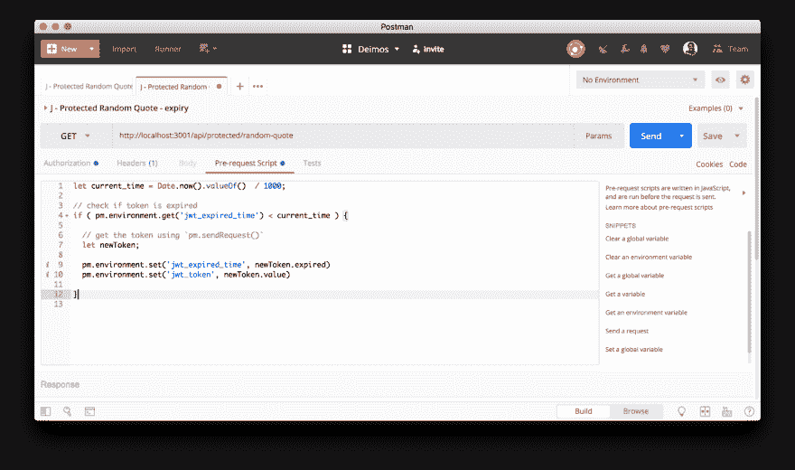](https://res.cloudinary.com/practicaldev/image/fetch/s--bAOgCUT4--/c_limit%2Cf_auto%2Cfl_progressive%2Cq_auto%2Cw_880/https://thepracticaldev.s3.amazonaws.com/i/pcq25va5ekykkxspd3tv.png)

如果您正在处理一个可能需要一段时间才能运行的大型集合，或者您有一个可能很快过期的短期令牌，则此选项很有用。在这种情况下，在[预请求脚本](https://learning.getpostman.com/docs/postman/scripts/pre_request_scripts)中添加一些逻辑来检查当前令牌是否过期。如果令牌过期，请获取一个新的令牌(例如使用 [`pm.sendRequest()`](https://learning.getpostman.com/docs/postman/scripts/postman_sandbox_api_reference/#pmsendrequest) )，然后重新设置新令牌的有效期。使用这种方法，请记住，您可以使用集合级或文件夹级脚本在集合或文件夹中的每个请求之前运行该检查。

## 会话保密

假设您将您的 JWT 保存为 Postman 环境变量，并且因为您正在协作一个项目而与您的队友共享该环境。你能保密吗，这样你的队友就不会接触到了？

是的，你可以！

[Sessions](http://blog.getpostman.com/2018/08/09/sessions-faq/) 是 Postman 应用程序中的一个附加层，用于本地存储变量值。默认情况下，会话不与邮递员服务器同步。在单个会话中捕获的更改将保留在您的 Postman 实例的本地，除非您明确地同步到云。

转到您的设置，并关闭“自动保存变量值”。

[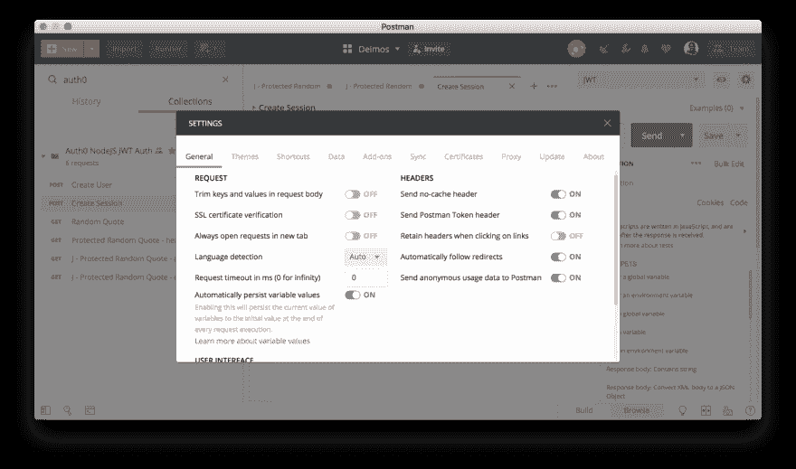](https://res.cloudinary.com/practicaldev/image/fetch/s--WFJlzuLF--/c_limit%2Cf_auto%2Cfl_progressive%2Cq_auto%2Cw_880/https://thepracticaldev.s3.amazonaws.com/i/85tpcwp6o8vyzlwqfyv6.png)

现在，当您发送请求并设置变量时，当前值将被填充。你可以把它看作是存储在本地会话中的一个值。

[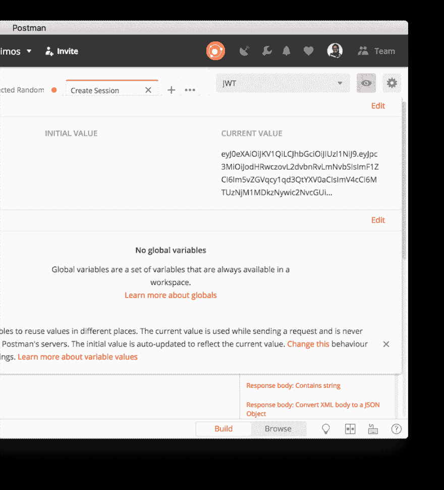](https://res.cloudinary.com/practicaldev/image/fetch/s--TmK9Xfvf--/c_limit%2Cf_auto%2Cfl_progressive%2Cq_auto%2Cw_880/https://thepracticaldev.s3.amazonaws.com/i/lcuu3w9oudyfmujz5rlo.png)

如果您希望与您的团队成员共享这个值，或者将其同步到 Postman 服务器，这需要另一个步骤来显式同步到云。要将所有当前值与初始值同步，请单击全部保留。要仅将单个当前值与初始值同步，请将值从第三列复制并粘贴到第二列。

[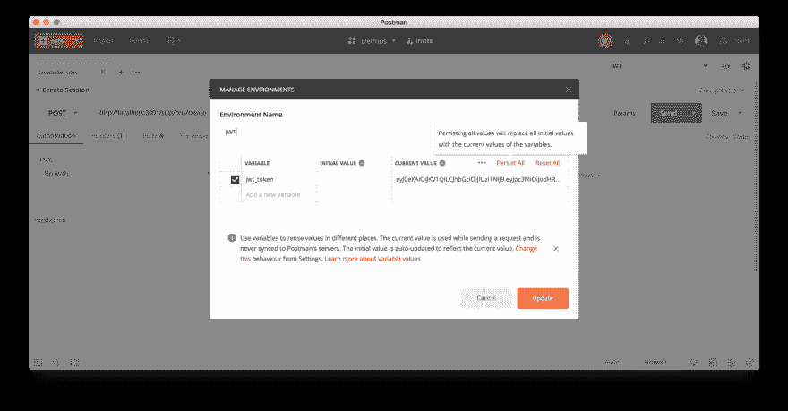](https://res.cloudinary.com/practicaldev/image/fetch/s--8SfYOrhT--/c_limit%2Cf_auto%2Cfl_progressive%2Cq_auto%2Cw_880/https://thepracticaldev.s3.amazonaws.com/i/1fn2extkwaphx67ochyq.png)

会话变量允许您在协作环境中工作时重用数据并保证其安全。它们允许您更精确地控制与服务器的同步或与您的队友共享信息。了解更多关于[会话](http://blog.getpostman.com/2018/08/09/sessions-faq/)或观看[关于与会话](https://youtu.be/JcSZtVwH69w)合作的视频。

* * *

想要将 API 安全可靠地与其他 API 安全指导原则结合起来吗？

**阅读[邮递员工程博客](https://medium.com/postman-engineering/tuck-in-your-apis-safe-and-sound-with-these-guiding-principles-for-api-security-cd69f71c291e)上的完整文章。**