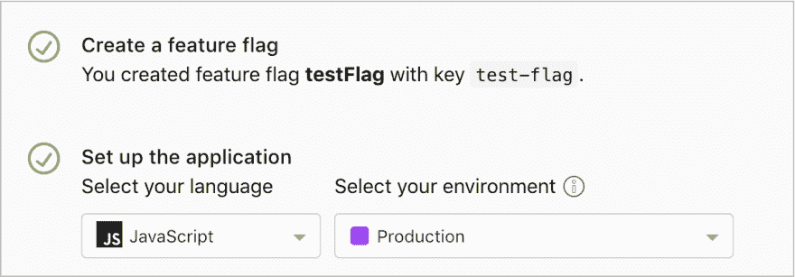
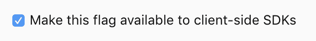
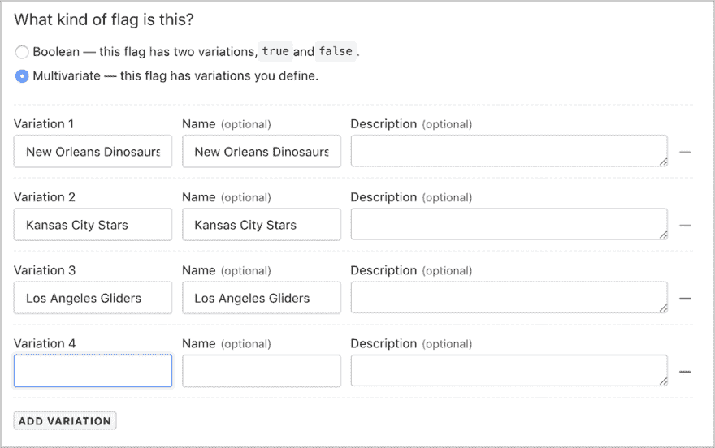

# 使用带有 React 的 launch crystally 特性标志来显示实时信息

> 原文：<https://dev.to/roseanna/using-launchdarklys-feature-flags-with-react-to-display-real-time-information-400>

您是否曾经需要在短时间内更新网页上的信息，但发现整个过程复杂、缓慢且容易出错？编辑代码，重新部署...如果您可以在一个简单的管理控制台中做到这一点而无需更改任何代码，那岂不是很棒？嗯，你可以用 LaunchDarkly！

launch crystally 是一个允许用户在他们的项目中轻松实现特性标志的服务。功能标志可用于通过启动加密管理控制台修改正在运行的应用程序中的用户定义功能。

如果您想在产品中添加一个特性，但又想在部署后控制它，这是非常强大的，如果您发现事情没有按计划进行，可以避免重新部署的需要。

[](https://i.giphy.com/media/iGXT1ysFt9bXy/giphy.gif)

功能标志还可以用于向特定比例的用户或满足特定要求的用户推出功能，从而实现超级简单的 canary 启动。

除了 devops 和功能部署，LaunchDarkly 还有许多其他真实的用例。在本帖中，我们将介绍如何使用 LaunchDarkly 来显示某个著名体育赛事的结果(**虽然没有明确指出是谁，但它与一些超级事件有关🏈**)没有可用的 API，需要手动更新信息。

launch crystally 帮助您将部署从发布中分离出来，并且还为非技术人员提供了一种机制来管理您正在运行的服务的行为。

[](https://i.giphy.com/media/2YnDKIixZwdLJ4WNln/giphy.gif)

所以，请喝一杯，和我一起坐下来，我们一起探索特色标志的力量。
这个例子使用 Create React App 来启动一个空项目，并使用 [Netlify](https://www.netlify.com) 来托管。❤️

让我们从[快速入门](https://app.launchdarkly.com/default/production/quickstart/tutorial)教程开始。这将引导您完成创建特征标志的第一步。

[](https://res.cloudinary.com/practicaldev/image/fetch/s--qm1U_BS0--/c_limit%2Cf_auto%2Cfl_progressive%2Cq_auto%2Cw_880/https://thepracticaldev.s3.amazonaws.com/i/ota4w1ickpsbk05zqwt3.png)

首先创建一个特征标志并选择一个名称。然后选择您计划使用的应用程序语言，并选择它将用于的环境。

因为这个例子使用 React，所以我选择使用一个集成来支持使用 LaunchDarkly 和 React [LD-React](https://github.com/yusinto/ld-react) 。
它遵循惯用的 React 模式，并使用 web socket launch crystally API，因此功能标志的更改将被推送到客户端，而无需刷新页面。

#### 注

> 使用客户端 SDK 需要注意的一点是，您**必须**通过选中 LaunchDarkly 管理控制台中设置部分的一个框来手动启用用于客户端的功能标志。**见下文**否则你可能会发现自己在一段时间内挠头问自己“但是为什么呢？。嗯，这就是原因。

[](https://res.cloudinary.com/practicaldev/image/fetch/s--jRBN5o-y--/c_limit%2Cf_auto%2Cfl_progressive%2Cq_auto%2Cw_880/https://thepracticaldev.s3.amazonaws.com/i/q1ecncnhs0fo65q1fsht.png)

下面的代码片段显示了一个标志，它是一个名为 showCountDown 的简单布尔变量。它打开和关闭倒计时反应组件。

```
{
  this.props.flags.showCountDown ? (
    <H1Title>
      <Countdown date={"Sun, 03 Feb 2019"} />
    </H1Title>
  ) : (
    <div />
  );
} 
```

第二个标志称为多元标志。它允许用户定义许多返回字符串值而不是布尔值的变量。它有八个变体来代表这个例子所基于的体育赛事中的所有参赛队。滑翔机加油！

[](https://res.cloudinary.com/practicaldev/image/fetch/s--dp-nJ7cI--/c_limit%2Cf_auto%2Cfl_progressive%2Cq_auto%2Cw_880/https://thepracticaldev.s3.amazonaws.com/i/hm576i1k3obnxbxyqsu4.png)

当您使用第一个标志时，您可能会注意到，页面信息会在不重新加载页面的情况下更新。如果有人等待页面更新而没有定期刷新，这是非常好的。这可以确保他们立即获得正确的信息。

[](https://i.giphy.com/media/3o84U6421OOWegpQhq/giphy.gif)

除了特性标志，launch crystally 还提供了对 A/B 测试和跟踪目标的支持。能够显示特定群体的某些信息/功能，然后对用户交互进行分析是非常有用的。

所以，继续实现这些标志吧！我很想知道你是如何在应用程序中使用特性标志的。

为了更好地了解这个项目，请点击这里查看回购协议，或者访问 T2 的现场版本。

黑客快乐。