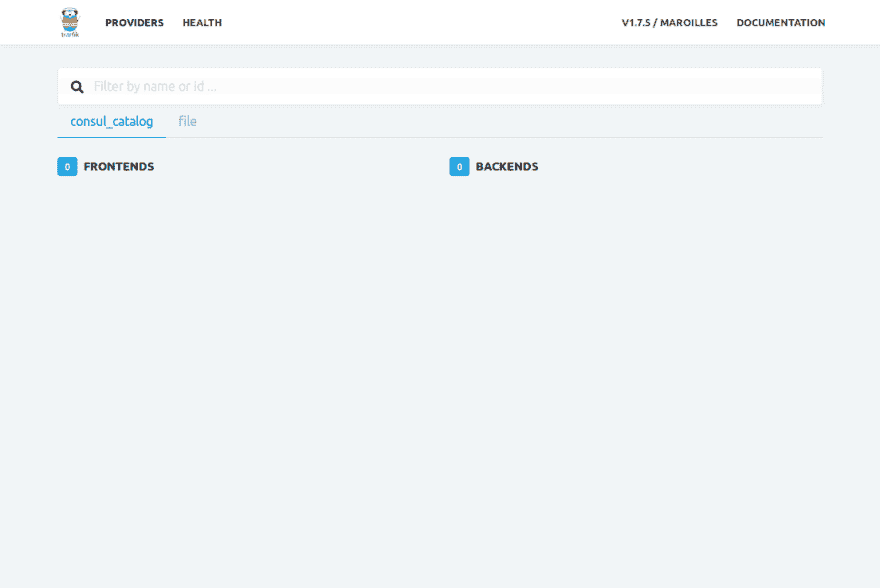
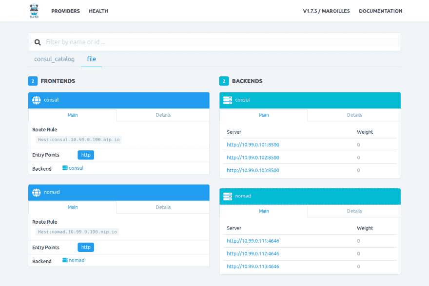
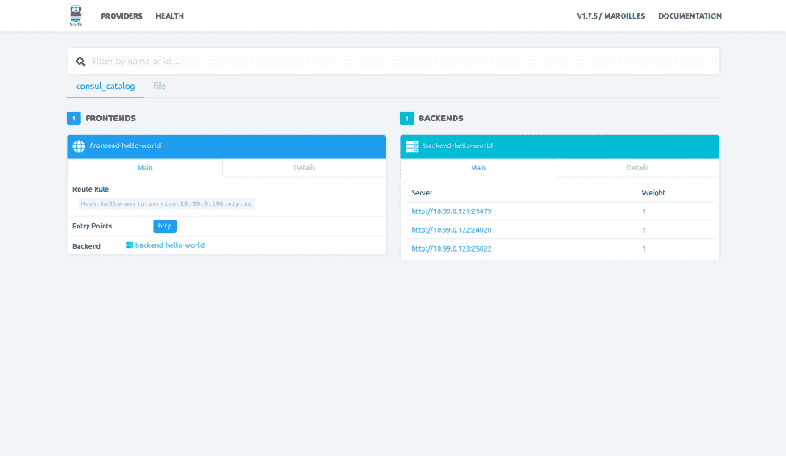

# 用 LXD 和 Ansible 模拟基础设施

> 原文：<https://dev.to/livioribeiro/using-lxd-and-ansible-to-simulate-infrastructure-2g8l>

当处理像 [Kubernetes](https://kubernetes.io/) 、 [Openshift](https://www.okd.io/) 和 [Rancher](https://rancher.com/) 这样的软件时，在本地测试一个应用程序可能具有挑战性。的确，我们有像 [minikube](https://github.com/kubernetes/minikube) 和 [minishift](https://www.okd.io/minishift/) 这样的工具，但是如果我们使用基础设施，用虚拟机模拟集群会很快消耗掉我们所有的可用 RAM。

LXD 可以通过使用容器来帮助解决内存问题，就像它们是完全成熟的虚拟机一样！与 Docker 不同，Docker 使用容器来运行单个进程直到它结束，LXD 使用容器来生成操作系统映像，并将其用作完整的服务器。

要安装 LXD，你可以按照官方网站上的[说明，但是安装后我们必须初始化它:](https://linuxcontainers.org/lxd/getting-started-cli/) 

```
# The default values are good enough
$ sudo lxd init 
```

Enter fullscreen mode Exit fullscreen mode

如果您遵循了[入门](https://linuxcontainers.org/lxd/getting-started-cli/)，您可能已经使用 cli 创建了一些容器，但是现在有趣的部分来了:我们可以使用 [Ansible](https://www.ansible.com/) 来自动创建和供应我们的服务器！

对于我们的 LXD/Ansible 项目，我们将创建一个由[领事](https://www.consul.io/)和 [Traefik](https://traefik.io/) 组成的[游牧](https://www.nomadproject.io/)集群。

我选择 Nomad 是因为它的简单性和多功能性:它可以像 Kubernetes 一样作为 docker 容器运行服务，也可以运行 java 应用程序和主机中可用的任何可执行文件，使用操作系统资源(例如 linux 上的 cgroups、namespaces 和 chroot)进行隔离。你可以在文档中看到 Nomad 能够运行什么。

Nomad 使用 Consul 进行服务发现、键值存储和引导集群。没有执政官，游牧者也可以逃跑。

Traefik 将请求代理到集群中部署的服务。它将使用 Consul 服务目录作为配置后端，因此到服务的路由将被自动配置。

完整的教程可以在这个库中找到[。](https://github.com/livioribeiro/nomad-lxd-ansible)

## 索引

*   [第 0 步:计划](#step-0-planning)
*   [第一步:咨询](#step-1-consul)
*   第二步:流浪者
*   [step 3: Traefik](#step-3-traefik)
*   [步骤 4:部署服务](#step-4-deploying-services)
*   [结论](#conclusion)

## 第 0 步:计划

我们的集群将需要以下内容:

*   3 个以服务器模式运行的咨询节点
    *   consul1: `10.99.0.101`
    *   consul2: `10.99.0.102`
    *   consul3: `10.99.0.103`
*   3 个以服务器模式运行的流动节点
    *   游牧服务器 1: `10.99.0.111`
    *   游牧服务器 2: `10.99.0.112`
    *   游牧服务器 3: `10.99.0.113`
*   3 个以客户端模式运行的游牧节点
    *   游牧客户端 1: `10.99.0.121`
    *   游牧客户端 2: `10.99.0.122`
    *   游牧客户端 3: `10.99.0.123`
    *   移动客户端将安装 docker 和 openjdk
*   1 Traefik node
    *   代理:`10.99.0.100`

所有非咨询节点将具有在客户端节点中运行的咨询。

对于 ansible，我们将创建一个结构如下的项目:

```
~/projects/nomad-lxd-ansible
├── cache/
├── inventory/
│   └── hosts
├── roles/
├── ansible.cfg
└── playbook.yml 
```

Enter fullscreen mode Exit fullscreen mode

该结构可通过以下命令创建:

```
mkdir -p ~/projects/nomad-lxd-ansible
cd ~/projects/nomad-lxd-ansible
mkdir cache inventory roles
touch ansible.cfg playboook.yml inventory/hosts 
```

Enter fullscreen mode Exit fullscreen mode

有了`cache`目录，我们将在主机中只下载 Consul、Nomad 和 Traefik 二进制文件一次。这样，我们避免了在每个主机中再次下载。

在`ansible.cfg`中，我们将告诉 ansible 使用我们的库存:

```
# ansible.cfg [defaults]
inventory = inventory 
```

Enter fullscreen mode Exit fullscreen mode

将我们的集群节点添加到清单:

```
# inventory/hosts proxy           ip_address=10.99.0.100

[consul_servers]
consul1         ip_address=10.99.0.101
consul2         ip_address=10.99.0.102
consul3         ip_address=10.99.0.103

[nomad_servers]
nomad-server1   ip_address=10.99.0.111
nomad-server2   ip_address=10.99.0.112
nomad-server3   ip_address=10.99.0.113

[nomad_clients]
nomad-client1   ip_address=10.99.0.121
nomad-client2   ip_address=10.99.0.122
nomad-client3   ip_address=10.99.0.123

[all:vars]
ansible_connection=lxd
ansible_python_interpreter=/usr/bin/python3 
```

Enter fullscreen mode Exit fullscreen mode

`ip_address`变量将在剧本中被引用。

为了创建容器，将以下内容添加到`playbook.yml` :

```
# playbook.yml
--------
- hosts: localhost
  # run this task in the host
  connection: local
  tasks:
    - name: create containers
      # get all host names from inventory
      loop: "{{  groups['all']  }}"
      # use lxd_container module from ansible to create containers
      lxd_container:
        # container name is the hostname
        name: "{{  item  }}"
        state: started
        source:
          type: image
          mode: pull
          server: https://images.linuxcontainers.org
          alias: ubuntu/bionic/amd64
        config:
          # nomad clients need some privileges to be able to run docker containers
          security.nesting: "{{  'true'  if  item  in  ['nomad-client1',  'nomad-client2',  'nomad-client3']  else  'false'  }}"
          security.privileged: "{{  'true'  if  item  in  ['nomad-client1',  'nomad-client2',  'nomad-client3']  else  'false'  }}"
        devices:
          # configure network interface
          eth0:
            type: nic
            nictype: bridged
            parent: lxdbr0
            # get ip address from inventory
            ipv4.address: "{{  hostvars[item].ip_address  }}"
        # # uncomment if you installed lxd using snap
        # url: unix:/var/snap/lxd/common/lxd/unix.socket 
```

Enter fullscreen mode Exit fullscreen mode

现在运行`ansible-playbook playbook.yml`用 lxd 创建我们的节点。

## 第一步:领事

让我们告诉 ansible 下载并设置 Consul。

编辑剧本如下:

```
# playbook.yml
--------
- hosts: localhost
  # run this task in the host
  connection: local
  # set urls as variables
  vars:
    consul_version: "1.4.0"
    consul_url: "https://releases.hashicorp.com/consul/{{  consul_version  }}/consul_{{  consul_version  }}_linux_amd64.zip"
  tasks:
    - name: create containers
      # get all host names from inventory
      loop: "{{  groups['all']  }}"
      # use lxd_container module from ansible to create containers
      lxd_container:
        # container name is the hostname
        name: "{{  item  }}"
        state: started
        source:
          type: image
          mode: pull
          server: https://images.linuxcontainers.org
          alias: ubuntu/bionic/amd64
        config:
          # nomad clients need some privileges to be able to run docker containers
          security.nesting: "{{  'true'  if  item  in  ['nomad-client1',  'nomad-client2',  'nomad-client3']  else  'false'  }}"
          security.privileged: "{{  'true'  if  item  in  ['nomad-client1',  'nomad-client2',  'nomad-client3']  else  'false'  }}"
        devices:
          # configure network interface
          eth0:
            type: nic
            nictype: bridged
            parent: lxdbr0
            # get ip address from inventory
            ipv4.address: "{{  hostvars[item].ip_address  }}"
        # # uncomment if you installed lxd using snap
        # url: unix:/var/snap/lxd/common/lxd/unix.socket

    # ensure cache directory exists
    - name: create cache directory
      file:
        path: cache
        state: directory

    - name: fetch applications
      unarchive:
        src: "{{  item.url  }}"
        dest: cache
        creates: "cache/{{  item.file  }}"
        remote_src: yes
      loop:
        - url: "{{  consul_url  }}"
          file: consul

- hosts: consul_servers
  roles:
    - consul_server 
```

Enter fullscreen mode Exit fullscreen mode

属于`consul_servers`组的主机将具有角色`consul_server`。我们还将创建另一个名为`consul_service`的角色，它将把 consul 二进制文件复制到主机并设置服务。我们以这种方式划分角色，以便有一个角色`consul_client`，它也需要 consul 二进制文件和服务，但是具有不同的配置。

角色位于`roles`目录下，对于 Consul 的三个角色，我们将具有以下结构:

```
roles/
├── consul_client
│   ├── tasks
│   │   └── main.yml
│   └── templates
│       └── consul.hcl.j2
├── consul_server
│   ├── tasks
│   │   └── main.yml
│   └── templates
│       └── consul.hcl.j2
└── consul_service
    ├── files
    │   └── consul.service
    └── tasks
        └── main.yml 
```

Enter fullscreen mode Exit fullscreen mode

您可以使用以下内容创建结构:

```
mkdir -p \
  roles/consul_service/tasks \
  roles/consul_service/files \
  roles/consul_server/tasks \
  roles/consul_server/templates \
  roles/consul_client/tasks \
  roles/consul_client/templates \
&& touch \
  roles/consul_service/tasks/main.yml \
  roles/consul_service/files/consul.service \
  roles/consul_server/tasks/main.yml \
  roles/consul_server/templates/consul.hcl.j2 \
  roles/consul_client/tasks/main.yml \
  roles/consul_client/templates/consul.hcl.j2 
```

Enter fullscreen mode Exit fullscreen mode

### 角色:领事 _ 服务

编辑`roles/consul_service/tasks/main.yml` :

```
# roles/consul_service/tasks/main.yml
--------
- name: install consul
  copy:
    src: cache/consul
    dest: /usr/local/bin/
    mode: 0755

- name: create consul service
  copy:
    src: consul.service
    dest: /etc/systemd/system/

- name: create consul directories
  file:
    path: "{{  item  }}"
    state: directory
  loop:
    - /etc/consul.d
    - /var/consul 
```

Enter fullscreen mode Exit fullscreen mode

编辑`roles/consul_service/files/consul.service` :

```
# roles/consul_service/files/consul.service [Unit]
Description="HashiCorp Consul - A service mesh solution"
Documentation=https://www.consul.io/
Requires=network-online.target
After=network-online.target
ConditionFileNotEmpty=/etc/consul.d/consul.hcl

[Service]
Restart=on-failure
ExecStart=/usr/local/bin/consul agent -config-dir=/etc/consul.d
ExecReload=/usr/local/bin/consul reload
KillMode=process
Restart=on-failure
LimitNOFILE=65536

[Install]
WantedBy=multi-user.target 
```

Enter fullscreen mode Exit fullscreen mode

### 角色:领事 _ 服务器

编辑`roles/consul_server/tasks/main.yml` :

```
# roles/consul_server/tasks/main.yml
--------
- import_role:
    name: consul_service

- name: copy consul config
  template:
    src: consul.hcl.j2
    dest: /etc/consul.d/consul.hcl

- name: start consul
  service:
    name: consul
    state: restarted
    enabled: yes 
```

Enter fullscreen mode Exit fullscreen mode

编辑`roles/consul_server/templates/consul.hcl.j2` :

```
# roles/consul_server/templates/consul.hcl.j2
data_dir = "/var/consul"

server = true
advertise_addr = "{{ ansible_eth0.ipv4.address }}"

client_addr = "127.0.0.1 {{ ansible_eth0.ipv4.address }}"
enable_script_checks = true


ui = true
bootstrap_expect = 3

retry_join = [ "{{ hostvars.consul1.ansible_hostname }}" ]
 
```

Enter fullscreen mode Exit fullscreen mode

### 角色:领事 _ 客户

编辑`roles/consul_client/tasks/main.yml` :

```
# roles/consul_client/tasks/main.yml
--------
- import_role:
    name: consul_service

- name: copy consul config
  template:
    src: consul.hcl.j2
    dest: /etc/consul.d/consul.hcl

- name: start consul
  service:
    name: consul
    state: restarted
    enabled: yes 
```

Enter fullscreen mode Exit fullscreen mode

编辑`roles/consul_client/templates/consul.hcl.j2` :

```
# roles/consul_client/templates/consul.hcl.j2
data_dir = "/var/consul"
server = false

advertise_addr = "{{ ansible_eth0.ipv4.address }}"
client_addr = "127.0.0.1 {{ ansible_eth0.ipv4.address }}"
enable_script_checks = true
retry_join = [ "{{ hostvars.consul1.ansible_hostname }}" ] 
```

Enter fullscreen mode Exit fullscreen mode

## 第二步:游牧

游牧设置将非常类似于执政官。

编辑战术手册以包含游牧者:

```
# playbook.yml
--------
- hosts: localhost
  # run this task in the host
  connection: local
  # set urls as variables
  vars:
    consul_version: "1.4.0"
    nomad_version: "0.8.6"
    consul_url: "https://releases.hashicorp.com/consul/{{  consul_version  }}/consul_{{  consul_version  }}_linux_amd64.zip"
    nomad_url: "https://releases.hashicorp.com/nomad/{{  nomad_version  }}/nomad_{{  nomad_version  }}_linux_amd64.zip"
  tasks:
    - name: create containers
      # get all host names from inventory
      loop: "{{  groups['all']  }}"
      # use lxd_container module from ansible to create containers
      lxd_container:
        # container name is the hostname
        name: "{{  item  }}"
        state: started
        source:
          type: image
          mode: pull
          server: https://images.linuxcontainers.org
          alias: ubuntu/bionic/amd64
        config:
          # nomad clients need some privileges to be able to run docker containers
          security.nesting: "{{  'true'  if  item  in  ['nomad-client1',  'nomad-client2',  'nomad-client3']  else  'false'  }}"
          security.privileged: "{{  'true'  if  item  in  ['nomad-client1',  'nomad-client2',  'nomad-client3']  else  'false'  }}"
        devices:
          # configure network interface
          eth0:
            type: nic
            nictype: bridged
            parent: lxdbr0
            # get ip address from inventory
            ipv4.address: "{{  hostvars[item].ip_address  }}"
        # uncomment if you installed lxd using snap
        url: unix:/var/snap/lxd/common/lxd/unix.socket

    # ensure cache directory exists
    - name: create cache directory
      file: { path: cache, state: directory }

    - name: fetch applications
      unarchive:
        src: "{{  item.url  }}"
        dest: cache
        creates: "cache/{{  item.file  }}"
        remote_src: yes
      loop:
        - url: "{{  consul_url  }}"
          file: consul
        - url: "{{  nomad_url  }}"
          file: nomad

- hosts: consul_servers
  roles:
    - consul_server

- hosts: nomad_servers
  roles:
    - consul_client
    - nomad_server

- hosts: nomad_clients
  roles:
    - consul_client
    - nomad_client 
```

Enter fullscreen mode Exit fullscreen mode

类似于领事，我们将有角色`nomad_service`、`nomad_server`和`nomad_client`。但是现在我们有两个组，`nomad_servers`和`nomad_clients`，每个组都有各自的角色，但是都有`consul_client`的角色。

我们也将有一个类似的游牧角色结构:

```
roles/
├── nomad_client
│   ├── tasks
│   │   └── main.yml
│   └── templates
│       └── nomad.hcl.j2
├── nomad_server
│   ├── tasks
│   │   └── main.yml
│   └── templates
│       └── nomad.hcl.j2
└── nomad_service
    ├── files
    │   └── nomad.service
    └── tasks
        └── main.yml 
```

Enter fullscreen mode Exit fullscreen mode

我们可以用以下命令创建这个结构:

```
mkdir -p \
  roles/nomad_service/tasks \
  roles/nomad_service/files \
  roles/nomad_server/tasks \
  roles/nomad_server/templates \
  roles/nomad_client/tasks \
  roles/nomad_client/templates \
&& touch \
  roles/nomad_service/tasks/main.yml \
  roles/nomad_service/files/nomad.service \
  roles/nomad_server/tasks/main.yml \
  roles/nomad_server/templates/nomad.hcl.j2 \
  roles/nomad_client/tasks/main.yml \
  roles/nomad_client/templates/nomad.hcl.j2 
```

Enter fullscreen mode Exit fullscreen mode

### 角色:流浪者 _ 服务

编辑`roles/nomad_service/tasks/main.yml` :

```
# roles/nomad_service/tasks/main.yml
--------
- name: install nomad
  copy:
    src: cache/nomad
    dest: /usr/local/bin/
    mode: 0755

- name: create nomad service
  copy:
    src: nomad.service
    dest: /etc/systemd/system/

- name: create nomad directories
  file:
    path: "{{  item  }}"
    state: directory
  loop:
    - /etc/nomad.d
    - /var/nomad 
```

Enter fullscreen mode Exit fullscreen mode

编辑`roles/nomad_service/files/nomad.service` :

```
# roles/nomad_service/files/nomad.service [Unit]
Description="HashiCorp Nomad - Application scheduler"
Documentation=https://www.nomadproject.io/
Requires=network-online.target
After=network.target
ConditionFileNotEmpty=/etc/nomad.d/nomad.hcl

[Service]
Restart=on-failure
ExecStart=/usr/local/bin/nomad agent -config=/etc/nomad.d/nomad.hcl
ExecReload=/bin/kill -HUP $MAINPID

[Install]
WantedBy=multi-user.target 
```

Enter fullscreen mode Exit fullscreen mode

### 角色:流浪者 _ 服务器

编辑`roles/nomad_server/tasks/main.yml` :

```
# roles/nomad_server/tasks/main.yml
--------
- import_role:
    name: nomad_service

- name: copy nomad config
  template:
    src: nomad.hcl.j2
    dest: /etc/nomad.d/nomad.hcl

- name: start nomad
  service:
    name: nomad
    state: restarted
    enabled: yes 
```

Enter fullscreen mode Exit fullscreen mode

编辑`roles/nomad_server/templates/nomad.hcl.j2` :

```
# roles/nomad_server/templates/nomad.hcl.j2
data_dir  = "/var/nomad"

advertise {
  http = "{{ ansible_eth0.ipv4.address }}"
  rpc  = "{{ ansible_eth0.ipv4.address }}"
  serf = "{{ ansible_eth0.ipv4.address }}"
}

server {
  enabled          = true
  bootstrap_expect = 3
  raft_protocol    = 3
} 
```

Enter fullscreen mode Exit fullscreen mode

### 角色:游牧者 _ 客户端

编辑`roles/nomad_client/tasks/main.yml` :

```
# roles/nomad_client/tasks/main.yml
--------
- import_role:
    name: nomad_service

- name: update apt cache
  apt:
    update_cache: yes

- name: install docker and openjdk
  apt:
    name: "{{  packages  }}"
    state: present
  vars:
    packages:
      - docker.io
      - openjdk-11-jdk-headless

- name: start docker service
  service:
    name: docker
    state: started

- name: copy nomad config
  template:
    src: nomad.hcl.j2
    dest: /etc/nomad.d/nomad.hcl

- name: start nomad
  service:
    name: nomad
    state: restarted
    enabled: yes 
```

Enter fullscreen mode Exit fullscreen mode

编辑`roles/nomad_client/templates/nomad.hcl.j2` :

```
data_dir  = "/var/nomad"

bind_addr = "{{ ansible_eth0.ipv4.address }}"

client {
  enabled = true
  network_interface = "eth0"
} 
```

Enter fullscreen mode Exit fullscreen mode

## step 3: Traefik

设置 Traefik 将类似于 Consul 和 Nomad，但稍微简单一点:将只有一个名为`proxy`的角色。

编辑剧本以包括 Traefik:

```
# playbook.yml
--------
- hosts: localhost
  # run this task in the host
  connection: local
  # set urls as variables
  vars:
    consul_version: "1.4.0"
    nomad_version: "0.8.6"
    traefik_version: "1.7.5"
    consul_url: "https://releases.hashicorp.com/consul/{{  consul_version  }}/consul_{{  consul_version  }}_linux_amd64.zip"
    nomad_url: "https://releases.hashicorp.com/nomad/{{  nomad_version  }}/nomad_{{  nomad_version  }}_linux_amd64.zip"
    traefik_url: "https://github.com/containous/traefik/releases/download/v{{  traefik_version  }}/traefik_linux-amd64"
  tasks:
    - name: create containers
      # get all host names from inventory
      loop: "{{  groups['all']  }}"
      # use lxd_container module from ansible to create containers
      lxd_container:
        # container name is the hostname
        name: "{{  item  }}"
        state: started
        source:
          type: image
          mode: pull
          server: https://images.linuxcontainers.org
          alias: ubuntu/bionic/amd64
        config:
          # nomad clients need some privileges to be able to run docker containers
          security.nesting: "{{  'true'  if  item  in  ['nomad-client1',  'nomad-client2',  'nomad-client3']  else  'false'  }}"
          security.privileged: "{{  'true'  if  item  in  ['nomad-client1',  'nomad-client2',  'nomad-client3']  else  'false'  }}"
        devices:
          # configure network interface
          eth0:
            type: nic
            nictype: bridged
            parent: lxdbr0
            # get ip address from inventory
            ipv4.address: "{{  hostvars[item].ip_address  }}"
        # # uncomment if you installed lxd using snap
        # url: unix:/var/snap/lxd/common/lxd/unix.socket

    # ensure cache directory exists
    - name: create cache directory
      file: { path: cache, state: directory }

    - name: fetch applications
      unarchive:
        src: "{{  item.url  }}"
        dest: cache
        creates: "cache/{{  item.file  }}"
        remote_src: yes
      loop:
        - url: "{{  consul_url  }}"
          file: consul
        - url: "{{  nomad_url  }}"
          file: nomad

    - name: fecth traefik
      get_url:
        url: "{{  traefik_url  }}"
        dest: cache/traefik
        mode: 0755

- hosts: consul_servers
  roles:
    - consul_server

- hosts: nomad_servers
  roles:
    - consul_client
    - nomad_server

- hosts: nomad_clients
  roles:
    - consul_client
    - nomad_client

- hosts: proxy
  roles:
    - consul_client
    - proxy 
```

Enter fullscreen mode Exit fullscreen mode

`proxy`角色所需的结构如下:

```
roles/
└── proxy
    ├── files
    │   └── traefik.service
    ├── tasks
    │   └── main.yml
    └── templates
        └── traefik.toml.j2 
```

Enter fullscreen mode Exit fullscreen mode

您可以使用以下内容创建结构:

```
mkdir -p \
  roles/proxy/tasks \
  roles/proxy/files \
  roles/proxy/templates \
&& touch \
  roles/proxy/tasks/main.yml \
  roles/proxy/files/traefik.service \
  roles/proxy/templates/traefik.toml.j2 
```

Enter fullscreen mode Exit fullscreen mode

编辑`roles/proxy/tasks/main.yml` :

```
# roles/proxy/tasks/main.yml
--------
- name: install traefik
  copy:
    src: cache/traefik
    dest: /usr/local/bin/
    mode: 0755

- name: create traefik service
  copy:
    src: traefik.service
    dest: /etc/systemd/system/

- name: create traefik config directory
  file:
    path: /etc/traefik
    state: directory

- name: copy traefik config
  template:
    src: traefik.toml.j2
    dest: /etc/traefik/traefik.toml

- name: start traefik
  service:
    name: traefik
    state: restarted
    enabled: yes 
```

Enter fullscreen mode Exit fullscreen mode

编辑`roles/proxy/files/traefik.service` :

```
# roles/proxy/files/traefik.service [Unit]
Description="Traefik Proxy"
Documentation=https://traefik.io
Requires=network-online.target
After=network-online.target
ConditionFileNotEmpty=/etc/traefik/traefik.toml

[Service]
Restart=on-failure
ExecStart=/usr/local/bin/traefik --configfile=/etc/traefik/traefik.toml
ExecReload=/bin/kill -HUP $MAINPID

[Install]
WantedBy=multi-user.target 
```

Enter fullscreen mode Exit fullscreen mode

编辑`roles/proxy/templates/traefik.toml.j2` :

```
# roles/proxy/templates/traefik.toml.j2
[file]

# Backends
[backends]
  [backends.consul]
    [backends.consul.servers]
    
      [backends.consul.servers.{{ host }}]
        url = "http://{{ hostvars[host].ansible_eth0.ipv4.address }}:8500"
    

  [backends.nomad]
    [backends.nomad.servers]
    
      [backends.nomad.servers.{{ host }}]
        url = "http://{{ hostvars[host].ansible_eth0.ipv4.address }}:4646"
    

# Frontends
[frontends]
  [frontends.consul]
  backend = "consul"
    [frontends.consul.routes.route1]
    rule = "Host:consul.{{ ansible_eth0.ipv4.address }}.nip.io"

  [frontends.nomad]
  backend = "nomad"
    [frontends.nomad.routes.route1]
    rule = "Host:nomad.{{ ansible_eth0.ipv4.address }}.nip.io"

[consulCatalog]
endpoint = "127.0.0.1:8500"
exposedByDefault = false
domain = "service.{{ ansible_eth0.ipv4.address }}.nip.io"

[api]
dashboard = true
debug = true 
```

Enter fullscreen mode Exit fullscreen mode

Traefik 配置授予对 Consul 和 Nomad 仪表板的访问权限，并配置 Consul 目录后端。这样，服务可以被自动发现和公开。

我们设置了`exposedByDefault = false`,这样只有标有特定标签的服务才会被公开，从而降低了意外公开内部服务的风险。

## 步骤 4:部署服务

现在一切就绪，我们可以构建我们的集群并观察它的工作:

```
ansible-playbook playbook.yml 
```

Enter fullscreen mode Exit fullscreen mode

如果一切正常，我们现在可以访问 Trafik 仪表板，网址为:

[](https://res.cloudinary.com/practicaldev/image/fetch/s--16xLJ_ki--/c_limit%2Cf_auto%2Cfl_progressive%2Cq_auto%2Cw_880/https://thepracticaldev.s3.amazonaws.com/i/cuigf8sxb1dfczr35tid.png)

印象不深，因为我们还没有部署任何服务，但是如果我们转到`file`选项卡:

[](https://res.cloudinary.com/practicaldev/image/fetch/s--YQQpQ6g_--/c_limit%2Cf_auto%2Cfl_progressive%2Cq_auto%2Cw_880/https://thepracticaldev.s3.amazonaws.com/i/puyp77rswsyvbqdxyow1.png)

在那里！它显示执政官和游牧民族！...仍然不是很令人印象深刻，我们在 Traefik 配置中静态地配置了它们。让我们做一些更有趣的事情:

1.  输入任何 nomad 服务器节点:

```
lxc exec nomad-server1 -- bash 
```

Enter fullscreen mode Exit fullscreen mode

1.  创建移动服务定义

```
cat > hello.nomad <<EOF job "hello-world" {
  datacenters = ["dc1"]

  group "example" {
    count = 3
    task "server" {
      # we will run a docker container
      driver = "docker"

      # resouces required by the task
      resources {
        network {
          # require a random port named "http"
          port "http" {}
        }
      }

      config {
        # docker image to run
        image = "hashicorp/http-echo"
        args = [
          "-listen", ":8080",
          "-text", "hello world",
        ]

        # map the random port to port 8080 on the task
        port_map = {
          http = 8080
        }
      }

      # exposed service
      service {
        # service name, compose the url like 'hello-world.service.myorg.com'
        name = "hello-world"
        # service will bind to this port
        port = "http"
        # tell traefik to expose this service
        tags = ["traefik.enable=true"]
      }
    }
  }
} EOF 
```

Enter fullscreen mode Exit fullscreen mode

在`service`部分中，`tags = ["traefik.enable=true"]`将告诉 Traefik 公开服务。

1.  部署！

```
nomad job run hello.nomad 
```

Enter fullscreen mode Exit fullscreen mode

它将输出如下内容:

```
root@nomad-server1:~# nomad job run hello.nomad 
==> Monitoring evaluation "be583c44"
    Evaluation triggered by job "hello-world"
    Allocation "a19978c9" created: node "d9d3daa0", group "example"
    Allocation "0e0e0015" created: node "7fdbbd1f", group "example"
    Allocation "690efcc2" created: node "ab36a46e", group "example"
    Evaluation status changed: "pending" -> "complete"
==> Evaluation "be583c44" finished with status "complete" 
```

Enter fullscreen mode Exit fullscreen mode

现在，如果我们再次转到 Traefik 仪表板:

[](https://res.cloudinary.com/practicaldev/image/fetch/s--r5pTrxO1--/c_limit%2Cf_auto%2Cfl_progressive%2Cq_auto%2Cw_880/https://thepracticaldev.s3.amazonaws.com/i/6i7exlpz4tn39hn5n45i.png)

它在那里！

我们可以通过打开[http://hello-world . service . 10 . 99 . 0 . 100 . nip . io](http://hello-world.service.10.99.0.100.nip.io)来访问服务。

但是等一下，那个`10.99.0.100.nip.io` url 是什么？这是一种服务，它指向你放在它前面的 ip 地址。测试起来非常方便。请访问[nip.io]了解更多信息。

然而，这项服务相当无聊，让我们部署一些更有趣的东西:

1.  创建移动服务定义

```
cat > gitea.nomad <<EOF job "gitea" {
  datacenters = ["dc1"]

  group "gitea" {
    count = 1

    ephemeral_disk {
      # try to deploy this service on the same node every time
      sticky  = true
      # try to migrate the ephemeral disk if possible 
      migrate = true
      # set the ephemeral disk size to 2GB 
      size    = "2048"
    }

    task "server" {
      driver = "docker"

      config {
        image = "gitea/gitea:1.6"

        port_map = {
          http = 3000
        }

        # with docker driver, it is possible to mount volumes insinde the container from the ephemeral disk
        volumes = [
          "local/gitea-data:/data"
        ]
      }

      resources {
        network {
          port "http" {}
        }
      }

      service {
        name = "gitea"
        port = "http"
        tags = ["traefik.enable=true"]
      }
    }
  }
} EOF 
```

Enter fullscreen mode Exit fullscreen mode

1.  规划工作部署

```
nomad job plan gitea.nomad 
```

Enter fullscreen mode Exit fullscreen mode

它将输出如下内容:

```
+ Job: "gitea"
+ Task Group: "gitea" (1 create)
  + Task: "server" (forces create)

Scheduler dry-run:
- All tasks successfully allocated.

Job Modify Index: 0
To submit the job with version verification run:

nomad job run -check-index 0 gitea.nomad

When running the job with the check-index flag, the job will only be run if the
server side version matches the job modify index returned. If the index has
changed, another user has modified the job and the plan's results are
potentially invalid. 
```

Enter fullscreen mode Exit fullscreen mode

我们在这里有点不同。我们计划了部署，或者换句话说，我们验证了部署配置(gitea.nomad)并生成了一个索引号(在新部署的情况下为`0`)，因此我们不会冒险在另一个操作员完成了自己的部署后更新部署。

要部署这项服务，只需按照 nomad 给我们的指示:

```
nomad job run -check-index 0 gitea.nomad 
```

Enter fullscreen mode Exit fullscreen mode

几分钟后，它将出现在 Traefik 仪表板中，并可通过[http://gitea . service . 10 . 99 . 0 . 100 . nip . io:](http://gitea.service.10.99.0.100.nip.io:)访问

[](https://res.cloudinary.com/practicaldev/image/fetch/s--Luus4vOo--/c_limit%2Cf_auto%2Cfl_progressive%2Cq_auto%2Cw_880/https://thepracticaldev.s3.amazonaws.com/i/wgmzvf51ulr88gqztvgl.png)

## 结论

LXD 是一个非常有用的工具，可以用来测试那些用虚拟机不可能或不切实际的解决方案。当与 Ansible 结合使用时，您可以快速创建测试环境来评估这些解决方案，其方式比 minikube 或 minishift(如果您只关注这些解决方案中部署的应用程序，它们仍然是完全有效的工具)等按比例缩小的工具更接近生产环境。

Nomad 是一个伟大的软件。除了 Consul，您还有一个简单但非常强大的解决方案来编排您的服务。它可以运行 docker、rkt 和 lxc 容器、打包在`.jar`文件中的 java 应用程序([像 Spring Boot 应用程序](http://spring.io/))，甚至二进制文件([像火箭应用程序](https://rocket.rs/))、[，它们可以由 nomad 在作业定义](https://www.nomadproject.io/docs/job-specification/artifact.html)中检索，并使用操作系统提供的[隔离原语执行。它不像 Kubernetes 那样功能齐全，但操作起来容易得多。](https://www.nomadproject.io/docs/drivers/exec.html)

Traefik 集成了许多服务来提供自动配置。它的 Consul 目录集成为游牧集群提供了一个不可思议的解决方案。