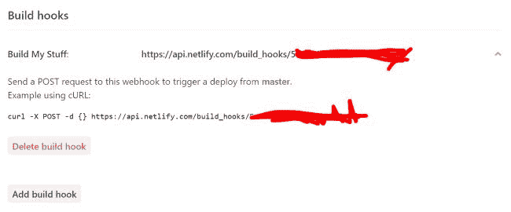
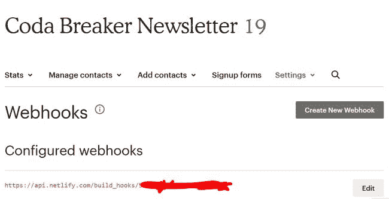

# 对有些静态的数据使用 Netlify 的构建过程

> 原文：<https://dev.to/raymondcamden/using-netlifys-build-process-for-somewhat-static-data-2gf7>

几天前，我写了一篇博客，讲述了我如何在 Netlify 使用无服务器函数为 MailChimp 构建 API 代理([“向 Netlify 静态站点添加无服务器函数”](https://dev.to/raymondcamden/adding-serverless-functions-to-your-netlify-static-site-41om))。这对我来说非常有效，我利用这个功能为我的网站构建了一个简单的“单页”页面。但是有些事情真的折磨着我。

尽管它工作得很好，速度也很快，但是加载一个月只更改两次的数据似乎有些过头了。我并不担心被收费——我很容易就达到了 MailChimp 的免费限额，也很容易达到 Netlify 的免费等级——但这似乎还是太多了。就在那时，我想起了 Netlify 让你指定一个脚本，在你的网站建立时运行。

这是一个我已经使用了一段时间的功能——但基本上只是告诉 Jekyll 建立我的页面(在此之前，Hugo，但我们不要谈论 Hugo)。我真的没有考虑过如何将它用于更复杂的逻辑。Phil Hawksworth 写了一个很好的例子([“用最近的 Tweets 保持 JAMStack 新鲜”](https://www.hawksworx.com/blog/keeping-a-jamstack-site-feeling-fresh-with-recent-tweets/))，其中他描述了他如何使用一个构建脚本来更新他的静态站点生成器使用的数据文件。

我的单页站点不需要静态站点生成器，但是我仍然可以使用类似的过程。我首先创建了一个简单的 Node.js 脚本，它几乎是我的无服务器 API 包装器的副本:

```
console.log('Running build script');

const axios = require('axios');
const fs = require('fs');

const apiRoot = 'https://us6.api.mailchimp.com/3.0/campaigns?list_id=d00ad8719a&fields=campaigns.long_archive_url,campaigns.send_time,campaigns.settings.title&status=sent';

axios({
    method:'get', 
    url:apiRoot,
    auth:{
        'username':'anythingreally',
        'password':process.env.MC_API
    }
}).then(res => {
    fs.writeFileSync('./static.json', JSON.stringify(res.data), 'UTF-8');

})
.catch(err => {
    console.log('Error getting stuff', err);
}); 
```

我想在这里指出几件事。首先，我的`console.log`消息将出现在 Netlify 构建网页中，这对于调试来说很好。其次，注意我如何使用`process.env.MC_API`。这是我为存储 MailChimp API 而构建的环境变量。我为无服务器功能构建了它，但它在这里也可用。

最后，我简单地点击远程 API，将内容以 static.json 的形式写入我的站点。最后一点是更新我的 Vue.js 应用程序，以点击`/static.json`而不是无服务器 API。你可以在我和 Brian 为音乐时事通讯建立的非常棒的网站上看到这一点:

[https://coda breaker . rocks](https://codabreaker.rocks)

我快完成了。我做的下一件事是更新我在`netlify.toml` :
中设置的构建脚本命令

```
[build]
    Functions = "lambda"
    Command = "npm run build" 
```

这是我的`package.json` :
中的相关行

```
"scripts": {
    "start:lambda": "netlify-lambda serve functions",
    "build:lambda": "netlify-lambda build functions",
    "build":"netlify-lambda build functions; node build.js"
}, 
```

是的，我仍然在网站上“总体”使用无服务器功能，但现在主要是作为实验的测试平台。由于该网站只是一个“一页纸”,我不介意用它来玩其他把戏。

好了，我差不多完成了。最后一步是配置 MailChimp 来触发 Netlify 上的构建。在我的 Netlify 站点的“部署设置”中，我转到“构建钩子”并创建了一个新的钩子。这会创建一个唯一的 URL，该 URL 可以在 POST 调用时触发构建:

[](https://res.cloudinary.com/practicaldev/image/fetch/s---xBXbVzL--/c_limit%2Cf_auto%2Cfl_progressive%2Cq_auto%2Cw_880/https://static.raymondcamden.cimg/2019/01/nf22.jpg)

然后我把它作为一个钩子添加到 MailChimp:

[](https://res.cloudinary.com/practicaldev/image/fetch/s--ECfp1w6E--/c_limit%2Cf_auto%2Cfl_progressive%2Cq_auto%2Cw_880/https://static.raymondcamden.cimg/2019/01/nf23.jpg)

就是这样！现在，当我们发布下一篇时事通讯时，MailChimp 将发布到 Netlify，Netlify 将创建一个新版本，运行我的简单脚本，更新 JSON，就这样。

是的…你完全可以证明使用 Vue 和 Ajax 做这件事是*也是*矫枉过正。我可以读入`index.html`，寻找某种标记，并用 HTML 替换它，而不是写出到`static.json`。那么页面就会真的，*真的*静态。一如既往，这里有多种剥猫皮的方法。

让我知道你对这种方法的想法，别忘了看看我的[令人敬畏的设计技能](https://codabreaker.rocks)。