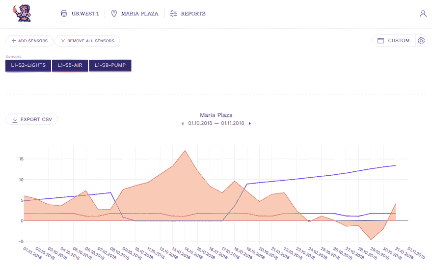

# 将 Plotly.js 图表用于仪表板

> 原文：<https://dev.to/jellene4eva/using-plotlyjs-charts-for-dashboards-2g5l>

今天我们要看一个非常强大的图表库，它非常容易使用和设置。 [Plotly 开源图形库](https://plot.ly/javascript/)支持多种编程语言，包括 Python、Matlab、R，最重要的是 Javascript！

我不得不为物联网公司建立一些仪表板，图表无疑是视图中最大的元素之一。还需要我多说一下图表对销售、网络监控、股票等业务相关报告的重要性吗？

Plotly 提供多种图表和地图，但我最常用的是:

*   折线图
*   条形图
*   步骤图表

下面我将介绍如何在实际项目中使用 plotly.js 的基本知识。

* * *

## 安装

与其他图表库非常相似，您可以通过 CDN 或 npm 包获得它们。更详细的指南在他们的 [github 页面](https://github.com/plotly/plotly.js)中。

### CDN

将脚本插入`index.html`的头部

```
 <head>
        <script src="https://cdn.plot.ly/plotly-latest.min.js"></script>
    </head> 
```

### NPM

要安装 npm，只需执行

```
 $ npm install plotly.js-dist 
```

注意是`plotly.js-dist`而不是 plotly.js

### 导入

现在把它导入到你的项目中去做

```
 import Plotly from 'plotly.js-dist'

    ...

    Plotly.newPlot('div-id', data, layout, options); 
```

在 html 中，您需要一个 div，它带有您想要指向的`id`。

```
 <div id="div-id"></div> 
```

非常简单的东西！

* * *

## 绘制基本图表

现在让我们做一个基本的折线图。

@ [Codepen 基本折线图](https://codepen.io/jellene4eva/pen/JzrKYW)

这个小图表的 javascript 很简单，我们想要分解一些你需要的重要标志。

```
 var trace1 = {
      name: 'Energy consumption',
      x: ['1-3-2019', '2-3-2019', '3-3-2019', '4-3-2019', '5-3-2019', '6-3-2019', '7-3-2019'],
      y: [10, 15, 13, 17, 19, 10, 11, 13],
      type: 'line',
      line: {
        color: '#45B5C6'
      }
    };

    var trace2 = {
      name: 'Cold water consumption',
      x: ['1-3-2019', '2-3-2019', '3-3-2019', '4-3-2019', '5-3-2019', '6-3-2019', '7-3-2019'],
      y: [16, 5, 11, 9, 0, 4, 0],
      type: 'line'
    };

    var data = [trace1, trace2];

    layout = {
        showlegend: false
    }

    Plotly.newPlot('myDiv', data, layout, { 
      responsive: true,
      displaylogo: false
    }); 
```

### 痕迹

图表中的每个系列被称为一个轨迹。*x 轴*通常是时间范围，*y 轴*是数值。在这里，我特意使用`string`作为我的 *xaxis* ，因为我希望能够将其解析为不同的本地化格式，例如，美国的 2019 年 2 月 2 日，芬兰的 2019 年 2 月 2 日。甚至进入四分之一决赛，例如 Q1/2018。

```
 @note: Plotly has locale config, but I wanted more control. 
```

如果你把每一个*x 轴*项目当作一个*类别*，那么一切都会好的。如果 *xaxis* 是一个由`Date\`项组成的数组，Plotly 会自动将其解析成一个 *timeseries 图表。*

您可以指定每个跟踪的线条颜色。如果您忽略它，Plotly 将根据索引提供一种颜色。要改变颜色，添加一个条目

```
 line: { 
        color: '#fff' 
    } 
```

注意`data`需要一个对象数组。这与其他图表库有一点不同，比如[谷歌图表](https://developers.google.com/chart/)或[高图表](https://www.highcharts.com/)。

### 布局

布局是 Plotly 的常规设置。在这里，我们通过在对象中添加这个来隐藏图例。

```
 showlegend: false 
```

图例允许你显示/隐藏每个轨迹，这很方便，但是我决定关闭它。在我的应用程序中，我在图表外有其他按钮来控制每个数据的显示和隐藏，所以我不需要图例。

我通常用于布局的其他配置有`font`、`autosize`、`margin`，以使图表适合您的容器。

完整文档在此:[https://plot.ly/javascript/reference/#layout](https://plot.ly/javascript/reference/#layout)

### 配置

这些配置是图表中其他功能的额外选项，例如:

*   允许滚动和缩放
*   模式栏显示/隐藏

对我有用的有

```
 {
        responsive: true, 
        displaylogo: false
    } 
```

这应该是不言自明的——该配置允许图表根据窗口改变宽度，并且还从模式栏中删除了 Plotly 的徽标。

完整文档在此:[https://plot.ly/javascript/configuration-options/](https://plot.ly/javascript/configuration-options/)

* * *

## 多轴

我们现在探索如何在同一个绘图中使用不同的图表类型。

@ [Codepen 多线图表](https://codepen.io/jellene4eva/pen/aMLmMM)

```
 var trace1 = {
      name: "Energy consumption",
      x: [
        "1.3.2019 00:00",
        "1.3.2019 03:00",
        "1.3.2019 06:00",
        "1.3.2019 09:00",
        "1.3.2019 12:00",
        "1.3.2019 15:00",
        "1.3.2019 18:00",
        "1.3.2019 21:00"
      ],
      y: [20, 50, 92, 82, 14, 20, 50, 62],
      text: ['20 kw/H', '50 kw/H', '92 kw/H', '82 kw/H', '14 kw/H', '20 kw/H', '50 kw/H', '62 kw/H'],
      hoverinfo: 'x+text+name',
      type: "bar",
      marker: {
        color: '#270657'
      }
    };

    var trace2 = {
      name: "Air pressure",
      x: [
        "1.3.2019 00:00",
        "1.3.2019 03:00",
        "1.3.2019 06:00",
        "1.3.2019 09:00",
        "1.3.2019 12:00",
        "1.3.2019 15:00",
        "1.3.2019 18:00",
        "1.3.2019 21:00"
      ],
      y: [81.32, 72.1, 121.41, 71.31, 40.98, 30.96, 51.2, 71.92],
      text: ['81.32 Pa', '72.1 Pa', '121.41 Pa', '71.31 Pa', '40.98 Pa', '30.96 Pa', '51.2 Pa', '71.92 Pa'],
      hoverinfo: 'x+text+name',
      type: "line",
    };

    var trace3 = {
      name: "Lights",
      x: [
        "1.3.2019 00:00",
        "1.3.2019 03:00",
        "1.3.2019 06:00",
        "1.3.2019 09:00",
        "1.3.2019 12:00",
        "1.3.2019 15:00",
        "1.3.2019 18:00",
        "1.3.2019 21:00"
      ],
      y: ["off", "on", "on", "on", "off", "off", "on", "on"],
      type: "line",
      line: {
        shape: "hv",
        color: '#45b5c6'
      },
      yaxis: "y2"
    };

    var data = [trace1, trace2, trace3];

    layout = {
      showlegend: false,
      yaxis2: {
        type: "category",
        side: "right",
        overlaying: "y"
      }
    };

    Plotly.newPlot("myDiv", data, layout, {
      responsive: true,
      displaylogo: false
    }); 
```

### 图表类型

这里我们有三种基本的图表类型——折线图、阶跃图和条形图。您可以为每个跟踪
配置它们

```
 type: "line"

    ...

    type: "bar"

    ...

    // step chart
    type: "line",
    line: {
        shape: "hv",
    }, 
```

还要注意，通过设置第二个*轴 2* ，我们可以在图表的右侧为基于文本的类别设置第二个轴。

```
 {
        ...
        text: ['81.32 Pa', '72.1 Pa', '121.41 Pa', '71.31 Pa', '40.98 Pa', '30.96 Pa', '51.2 Pa', '71.92 Pa'],
        hoverinfo: 'x+text+name',
        ...
    } 
```

自定义文本可用于向值中插入单位。`hoverinfo`允许您自定义当鼠标悬停在该值上时您想要显示的内容。如果我们使用`text`而不是`y`，那么我们可以显示单位。

* * *

## 拼凑

[](https://res.cloudinary.com/practicaldev/image/fetch/s--0rcYLQC9--/c_limit%2Cf_auto%2Cfl_progressive%2Cq_auto%2Cw_880/https://cdn.filestackcontent.com/tP9CA4PTMnidOQtrS3wa)

演示物联网仪表板

这是一个真实的物联网仪表盘示例，用于显示实时传感器数据的值变化。

希望有了它，你可以在未来的项目中轻松地使用 Plotly。

点击这里查看更多 plotly 的例子:[https://plot.ly/feed/#/](https://plot.ly/feed/#/)

### 其他图表库

*   [高图表](https://www.highcharts.com/)
*   [D3.js](https://d3js.org/)
*   [谷歌图表](https://developers.google.com/chart/)
*   [Chart.js](https://www.chartjs.org/)

*也发表在我的博客[jellenekhoh . io](//jellenekhoh.io)T3】*