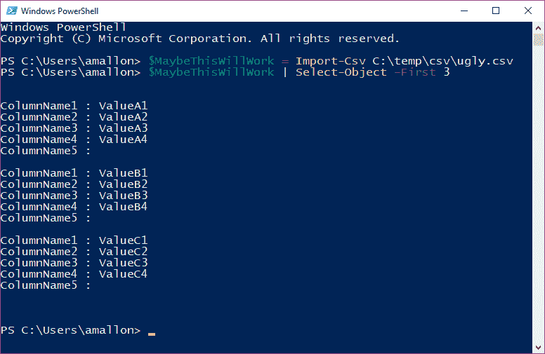
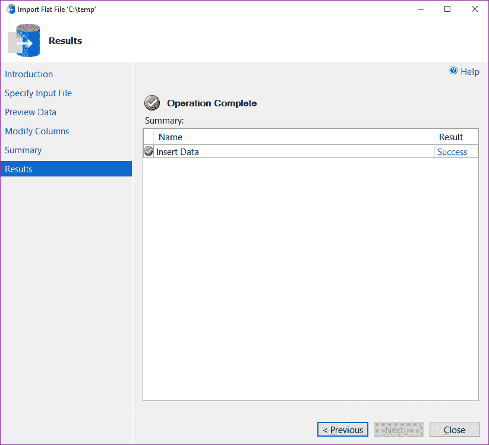

# 使用 PowerShell 整理 CSV 文件

> 原文：<https://dev.to/am2/using-powershell-to-tidy-up-csv-files-3kno>

[](https://www.youtube.com/watch?v=ptM7FzyjtRk) 我最近在为一个列数不一致的 CSV 文件而烦恼。呃。有一堆历史数据有 4 列，然后最近的数据有一个新的属性，增加了 5 列。我花了几分钟时间诅咒该为此负责的人，然后继续前进。

首先，这是数据的简化版本。注意，第一行末尾应该有一个悬空的逗号，表示第五个值为空:

```
ColumnName1,ColumnName2,ColumnName3,ColumnName4,ColumnName5
ValueA1,ValueA2,ValueA3,ValueA4
ValueB1,ValueB2,ValueB3,ValueB4
ValueC1,ValueC2,ValueC3,ValueC4
<1000s more rows>
ValueX1,ValueX2,ValueX3,ValueX4
ValueY1,ValueY2,ValueY3,ValueY4,ValueY5
<1000s more rows>
ValueZ1,ValueZ2,ValueZ3,ValueZ4,ValueZ5 
```

恶心吧。

SSMS 平面文件导入向导对此表示赞同。它使用前 50 行来确定导入的文件格式。因为前 50 行只有 4 列，所以它尝试使用该文件格式进行导入，然后在尝试插入 5 列数据时出错。
T3[T5](http://am2.co/wp-content/uploads/CSV-FlatFileImportFail.png)

## 本想修好。

我只是在摆弄数据，所以我真的不需要任何完美的东西…但我确实想要一些足够好的可重复的东西，以防我想再做一次。

手动修复数千行听起来像是一种折磨。见鬼。号码

这些数据来自公开的数据集，所以修复文件格式似乎既不快速也不容易。依赖他人可能是一个死胡同，虽然这将是确保未来稳定修复的“最正确”的解决方案，但对于我的休闲娱乐时间来说，这是过度的。

## PowerShell 呢？

我已经用了一大堆。我想知道它是否能处理不稳定的文件布局。最快的方法就是尝试一下。让我们尝试将 CSV 文件放入 PowerShell 对象，看看会发生什么:

```
$MaybeThisWillWork  =  Import-Csv  C:\temp\csv\ugly.csv 
```

成功了？！就这样？没有错误？让我惊喜(但怀疑)吧！为了确保万无一失，我们来看看数据是什么样子的:

```
$MaybeThisWillWork  |  Select-Object  -First  3 
```

看起来没错！它有第五列，包含空值:

<figure>[](http://am2.co/wp-content/uploads/Csv-PowerShellFirst3.png) 

<figcaption id="caption-attachment-1621">真管用！我喜欢事情顺利进行。</figcaption>

</figure>

所以现在我可以使用`Export-Csv`将 PowerShell 对象导出到文件中，这样就完成了:

```
$MaybeThisWillWork  |  Export-Csv  C:\temp\csv\pretty.csv  -NoTypeInformation 
```

果然，文本文件现在在末尾多了一个逗号。还引用了，我一点都不介意。事实上，我希望更多的人始终引用他们的 CSV，以避免以后出现问题。

```
"ColumnName1","ColumnName2","ColumnName3","ColumnName4","ColumnName5"
"ValueA1","ValueA2","ValueA3","ValueA4",
"ValueB1","ValueB2","ValueB3","ValueB4",
"ValueC1","ValueC2","ValueC3","ValueC4",
<1000s more rows>
"ValueX1","ValueX2","ValueX3","ValueX4",
"ValueY1","ValueY2","ValueY3","ValueY4","ValueY5"
<1000s more rows>
"ValueZ1","ValueZ2","ValueZ3","ValueZ4","ValueZ5" 
```

如果成功了，我应该可以使用平面文件导入向导导入我的 pretty.csv 文件，现在:

[](http://am2.co/wp-content/uploads/CSV-FlatFileImportSuccess.png) 

成功了！厉害！

现在，如果我需要再次做同样的事情，我知道我可以一步到位

```
Import-Csv  C:\temp\csv\ugly.csv  |  Export-Csv  C:\temp\csv\pretty.csv  -NoTypeInformation 
```

如果这是一个至关重要的过程，我宁愿正确地修复源文件。玩随机数据不是关键任务。不过，也许我应该玩一些格式更好的数据，比如这些 [UFO 目击事件](https://github.com/planetsig/ufo-reports)，或者[亚马逊产品评论](http://jmcauley.ucsd.edu/data/amazon/)。

### Azure Data Studio 怎么样？

***更新:*** 在发布了这个之后，Vicky Harp 建议我在 Azure Data Studio 中尝试一下，看看那里是否有同样的问题。事实证明，Azure Data Studio 使用相同的库，也有相同的问题。我已经在 GitHub 上记录了[的一个问题以解决这个问题。您可以投票支持该问题，以帮助提高知名度来解决它！](https://github.com/Microsoft/azuredatastudio/issues/3654)

使用 PowerShell 整理 CSV 文件的帖子[最早出现在](https://am2.co/2018/12/using-powershell-to-tidy-up-csv-files/) [Andy M Mallon - AM](https://am2.co) 上。