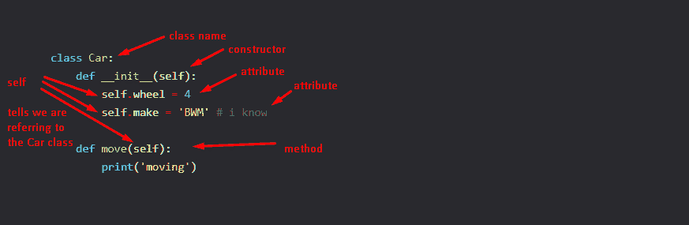

# 使用 Python 函数作为类

> 原文：<https://dev.to/abdurrahmaanj/using-python-functions-as-classes-10j0>

在 Python 中，可以使用函数作为类。在 py 中，一切都是对象。怎么会？我不是间谍专家。我们是这样做的！

## 一个无辜的 Python 函数

一个函数是这样的

```
def devdotto():
    pass 
```

而一节课就是这样:

```
class Car:
    def __init__(self):
        self.wheel = 4
        self.make = 'BWM' # i know 
    def move(self):
        print('moving') 
```

更多信息:

[](https://res.cloudinary.com/practicaldev/image/fetch/s--2uuFQblw--/c_limit%2Cf_auto%2Cfl_progressive%2Cq_auto%2Cw_880/https://thepracticaldev.s3.amazonaws.com/i/va7qakwzwhwzy2oi975w.png)

制作和轮子是属性
,而移动是方法

一些测试

```
car = Car()

print(car.wheel)
print(car.make)

car.move() 
```

发出

```
4
BWM
moving 
```

## 现在让我们添加属性

向函数添加属性

```
devdotto.name = 'dev.to'
devdotto.users = 1123234 
```

测试

```
print(devdotto.name)
print(devdotto.users) 
```

发出

```
dev.to
1123234 
```

## 更疯狂:给函数添加方法

添加添加方法:

```
devdotto.add = lambda x,y: x+y 
```

一些信息:

[](https://res.cloudinary.com/practicaldev/image/fetch/s--c6OJtfP0--/c_limit%2Cf_auto%2Cfl_progressive%2Cq_auto%2Cw_880/https://thepracticaldev.s3.amazonaws.com/i/fh92725hznxskdu19qow.png)

测试

```
print(devdotto.add(1,2)) 
```

发出

```
3 
```

## 结论

由于一些一个线性库利用 IEF(立即执行的函数)使用 lambdas 编译偶数循环，这些可能是有用的，但我想不出任何用例(使用函数作为类)，这说，这是 py 的一个聚会把戏，因此封面图片。

img 鸣谢:照片由 Jason Leung 在 Unsplash 上提供

有什么想法吗？请在下面注释掉它们！