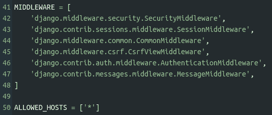
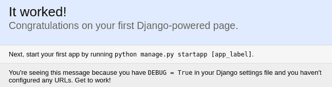

# 在云中使用 Python 的 Django 框架

> 原文：<https://dev.to/nexttech/using-python-s-django-framework-in-the-cloud-f3>

Django 是一个用于构建 web 应用的 Python 框架。他们的网站是这样描述的:

> Django 是一个高级 Python Web 框架，它鼓励快速开发和干净、实用的设计。由经验丰富的开发人员构建，它解决了 Web 开发的许多麻烦，因此您可以专注于编写应用程序，而无需重新发明轮子。它是免费和开源的。

在本帖中，我们将介绍如何使用下一个沙盒，在不下载任何东西的情况下开始使用 Django！我们将介绍如何启动 Python 沙盒，然后在其中安装 Django。

首先，点击[这里](https://nt.dev/python)启动一个 Python 沙盒(如果你还没有，你需要创建一个免费的 Next Tech 账户)。

一旦你的沙箱加载完毕，在沙箱的终端运行以下命令来安装 Django:

```
sudo apt update
sudo apt install -y python3-django 
```

然后，创建一个新的 Django 项目:

```
django-admin startproject project . 
```

现在您可以运行初始的 Django 迁移:

```
python3 manage.py migrate 
```

这里详细解释了 Django 的移民。

要启动 Django web 服务器，请在您的终端中运行以下命令:

```
python3 manage.py runserver 0.0.0.0:8000 
```

注意`0.0.0.0:8000`的使用。这是允许远程连接所必需的，从技术上讲，您将对您的沙箱进行远程连接。

您还需要对`project/settings.py`文件进行一些修改。首先，将`MIDDLEWARE`列表的内容替换为:

```
MIDDLEWARE = [
    'django.middleware.security.SecurityMiddleware',
    'django.contrib.sessions.middleware.SessionMiddleware',
    'django.middleware.common.CommonMiddleware',
    'django.middleware.csrf.CsrfViewMiddleware',
    'django.contrib.auth.middleware.AuthenticationMiddleware',
    'django.contrib.messages.middleware.MessageMiddleware'
] 
```

这将移除默认情况下添加的阻止网页嵌入的选项，这是沙盒中的 web 浏览器可以加载它所需要的。

然后，您需要将这一行添加到文件:

```
ALLOWED_HOSTS = ['*'] 
```

这将允许任何主机连接，因此您的沙箱运行的域将能够。

文件的这一部分现在应该看起来像这样:

[](https://res.cloudinary.com/practicaldev/image/fetch/s--4hwQPV2M--/c_limit%2Cf_auto%2Cfl_progressive%2Cq_auto%2Cw_880/https://thepracticaldev.s3.amazonaws.com/i/tdij5pnt2nzo04qnesg3.png)

好了，都准备好了！现在，点击`+`并选择一个浏览器，然后在地址栏输入`localhost:8000`。您将看到以下内容:

[](https://res.cloudinary.com/practicaldev/image/fetch/s--y9dW4DCg--/c_limit%2Cf_auto%2Cfl_progressive%2Cq_auto%2Cw_880/https://thepracticaldev.s3.amazonaws.com/i/i37dy11pcwc46rq4chul.png)

干得好！你现在可以继续探索姜戈了。我推荐通读 Django 快速入门指南，它涵盖了我们在这篇文章中的一些内容，以及更多！

有问题或意见吗？在下面给我们留言吧！