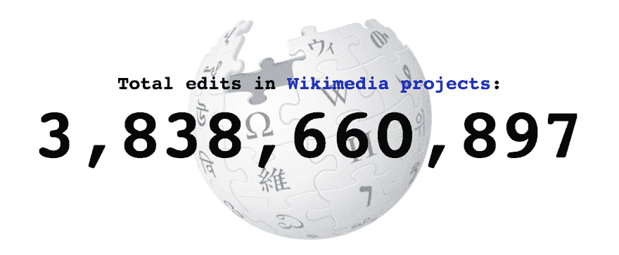
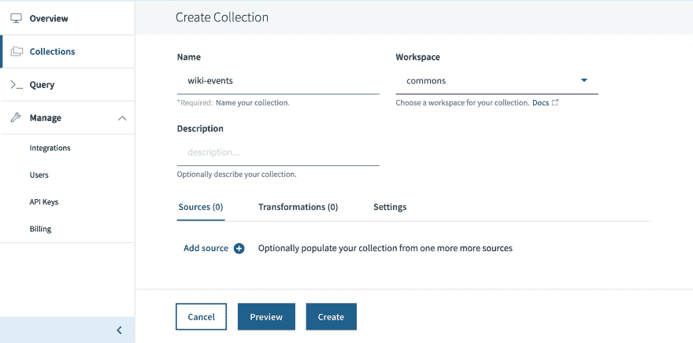

# 将 Tableau 用于事件数据的实时仪表板

> 原文：<https://dev.to/rocksetcloud/using-tableau-for-live-dashboards-on-event-data-30p9>

*作者为[哈尼什·雷迪·波德都托里](https://www.linkedin.com/in/haneeshreddy/)T3】*

实时仪表板可以帮助组织理解他们的事件数据，并实时了解他们的业务发生了什么。营销经理经常想知道在过去的一个小时、一天或一周内有多少注册。产品经理总是希望了解哪些产品功能运行良好，使用最多。在许多情况下，能够根据实时事件数据立即采取行动非常重要，例如电子商务中的[限时销售](https://rockset.com/blog/fynd-e-commerce-portal-responds-to-consumer-behavior-in-real-time/)或管理联络中心服务水平的。随着企业认识到可以从实时数据中提取的价值，许多已经在 Tableau for BI 上实现标准化的组织也在寻求在其事件流上实现 live Tableau 仪表板。

### **入门**

在这篇博客中，我将使用 Tableau 逐步实现一个关于事件数据的实时仪表板。我们将跟踪的事件将是包括维基百科在内的各种维基媒体项目的最新变化。

对于这个项目，我们需要:

*   [Tableau 桌面](https://www.tableau.com/products/desktop)，有活动账户
*   活跃的 [Rockset](https://rockset.com/) 账户
*   [Rockset Java 客户端库和 JDBC 驱动](https://github.com/rockset/rockset-java-client)

### **从维基媒体事件流摄取数据**

我将首先创建一个集合，我们将把来自[维基媒体流](https://wikitech.wikimedia.org/wiki/Event_Platform/EventStreams)的事件写入其中。

一旦我们在 Rockset 中设置了集合，我就可以运行一个脚本来订阅来自 Wikimedia 流的事件，并将它们写入 Rockset 中的`wiki-events`集合。