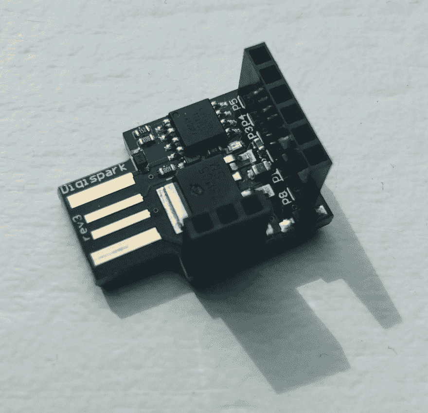
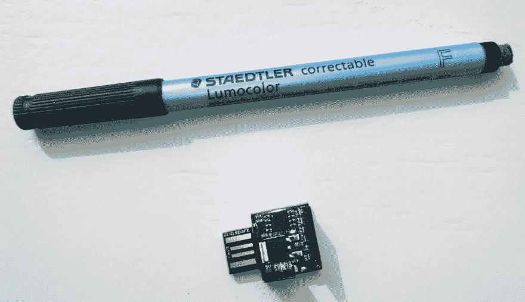
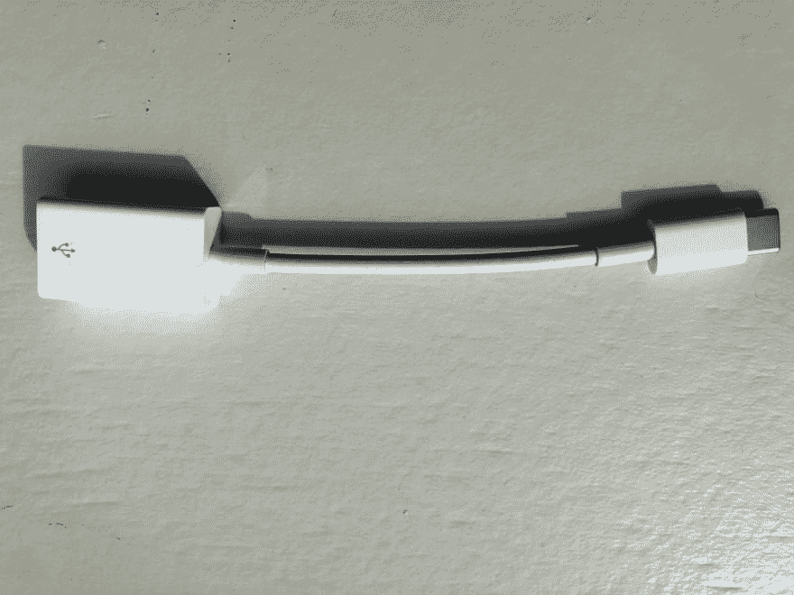
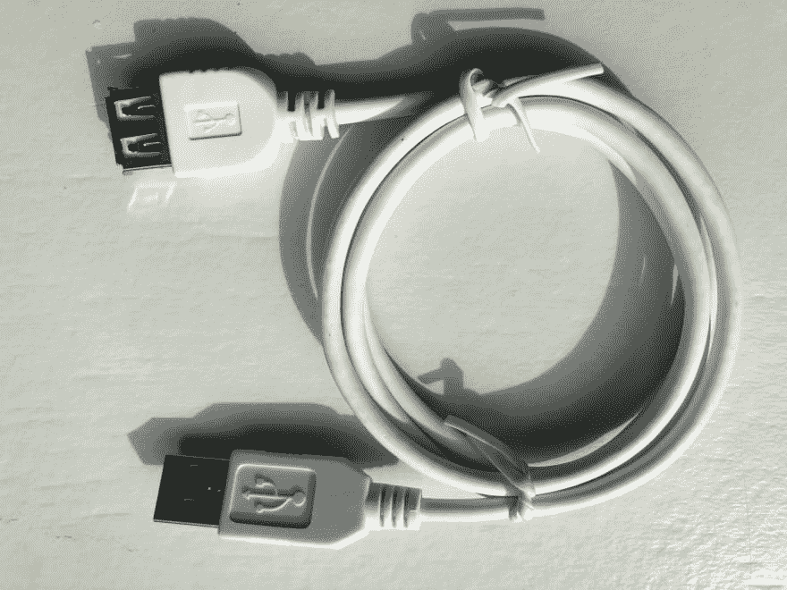

# 将 Digispark 用作廉价的 USB 橡皮鸭

> 原文：<https://dev.to/petereysermans/using-the-digispark-as-a-cheap-usb-rubber-ducky-29cf>

**免责声明:这篇文章是为了娱乐、学习和实验。明智地使用这些工具，我绝不鼓励恶意使用它们。**

最初于 2019 年 4 月 5 日发布在我的[博客](https://eysermans.com/post/using-the-digispark-as-a-cheap-usb-rubber-ducky)上。

上周，我偶然发现了一个有趣的设备，USB 橡皮鸭。它看起来像一个普通的 u 盘，但当你把它插入电脑时，它就像一个键盘。你可以将一个脚本加载到橡皮鸭上，它会在插有记忆棒的电脑上击键执行脚本。因为它每分钟执行超过 1000 个单词，所以从运行 pentest task 到安装后门之类的恶意操作，可能性是无穷无尽的。

我想玩玩它，但不幸的是，运送棍子到欧洲/比利时的费用几乎和棍子一样多。幸运的是，Hackernoon 上有一个关于如何用 Digispark 制作自己的 USB 橡胶鸭子的[帖子。](https://hackernoon.com/low-cost-usb-rubber-ducky-pen-test-tool-for-3-using-digispark-and-duck2spark-5d59afc1910) [Digispark](http://digistump.com/products/1) 类似于 Arduino，但它更便宜、更小、功能更弱。最终结果实际上看起来更好，因为它比橡胶鸭子小得多。一个缺点是，Digispark 没有微型 SD 插槽，因此没有磁盘空间可供使用。

[](https://res.cloudinary.com/practicaldev/image/fetch/s--Rshfl92P--/c_limit%2Cf_auto%2Cfl_progressive%2Cq_auto%2Cw_880/https://eysermans.cimg/articles/using-the-digispark-as-a-cheap-usb-rubber-ducky/digispark-up-close.jpg)

在这里，它在一支钢笔旁边。我还是很惊讶它有多小。

[](https://res.cloudinary.com/practicaldev/image/fetch/s--AmxT8XYb--/c_limit%2Cf_auto%2Cfl_progressive%2Cq_auto%2Cw_880/https://eysermans.cimg/articles/using-the-digispark-as-a-cheap-usb-rubber-ducky/digispark-vs-pen.jpg)

购买这些低预算组件可能会很有挑战性。我的印象是，在美国买到它们要容易得多，也便宜得多。在某些情况下，亚马逊德国站有其他选择。但是 Digispark 太便宜，运输成本太高。最终我在 T2 当地的一家网店上找到了它们，售价 649 欧元。我需要一些其他的东西，这样我可以降低运输成本。

首先，互联网上有很多资源。但是大多数脚本和博客文章都是针对 Windows 的。不过，我发现了一篇很棒的博文，里面有一个 hello world 的例子，关于如何在 Mac OS X 上把 Digispark 设置成橡皮鸭。这是将使用的 hello world 脚本:

```
#include "DigiKeyboard.h"

boolean didRun = false;

void setup() {}

void loop() {
  while (didRun == false) {
    DigiKeyboard.sendKeyStroke(KEY_SPACE, MOD_GUI_LEFT);
    DigiKeyboard.delay(500);
    DigiKeyboard.println("terminal");
    DigiKeyboard.delay(500);
    DigiKeyboard.println("say Hello World");
    didRun = true;
  }
} 
```

该脚本使用默认快捷键激活 Spotlight，键入`terminal`并按 enter 键。这将打开终端，等待半秒钟后，它将输入并执行命令`say Hello World`。当我试图通过 Arduino IDE 上传这个脚本时，它永远找不到我的 Digispark。

[](https://res.cloudinary.com/practicaldev/image/fetch/s--oOrN9slz--/c_limit%2Cf_auto%2Cfl_progressive%2Cq_auto%2Cw_880/https://eysermans.cimg/articles/using-the-digispark-as-a-cheap-usb-rubber-ducky/apple-adapter.jpg)

我使用苹果 USB 转 USB-C 适配器将 Digispark 连接到我的 Macbook pro。经过一些谷歌搜索后，我发现 Digispark 的 USB 连接器的中间引脚非常短，在某些情况下，它不会正确连接。挖出一根 USB 延长线后，Digispark 连接上了，脚本上传了。

[](https://res.cloudinary.com/practicaldev/image/fetch/s--D-A_Ia-3--/c_limit%2Cf_auto%2Cfl_progressive%2Cq_auto%2Cw_880/https://eysermans.cimg/articles/using-the-digispark-as-a-cheap-usb-rubber-ducky/usb-cable.jpg)

因此，如果设备现在被插入目标机器，脚本将运行。在测试 hello world 脚本时，我意识到有很多地方可能出错:

*   如果 Spotlight 键快捷键被更改了怎么办？
*   在我的笔记本电脑上，当在 Spotlight 中输入`terminal`时，另一个文件出现在最上面。结果，这个脚本什么也没做。
*   当在具有 azerty 键盘布局的计算机中测试脚本时，字符是用 qwerty 键盘布局键入的。

但最后，它确实起作用了。脚本在几秒钟内从一个硬币大小的设备上运行。相当酷。在做一些研究时，我发现了相当多的其他资源和示例脚本。制作一台笔记本电脑说 Hello World 只是冰山一角。更多资源:

*   [各种 Digispark 脚本的集合](https://github.com/topics/digispark-scripts)
*   [Bash Bunny，类似于 USB 橡皮鸭的产品](https://shop.hak5.org/products/bash-bunny)
*   [duck2spark，将橡胶 Ducky 有效载荷转换为 Digispark](https://github.com/mame82/duck2spark/)
*   [digi quak，Digispark 有效载荷转换器的另一个 ducky script](https://cedarctic.github.io/digiQuack/)