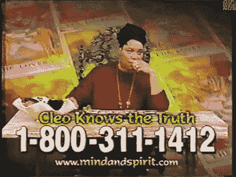
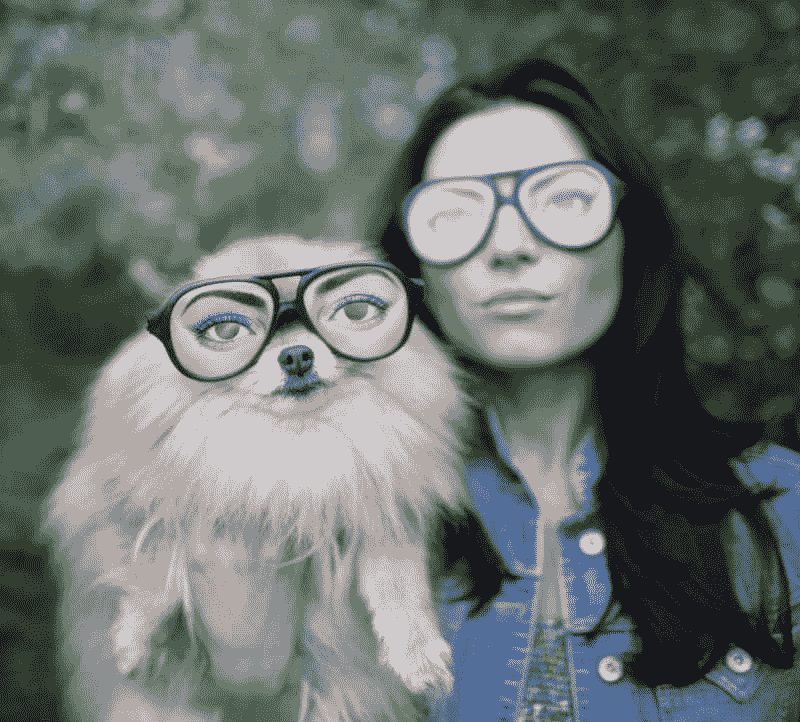
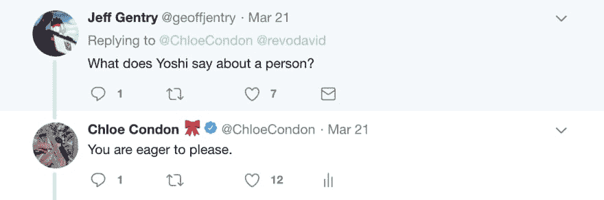
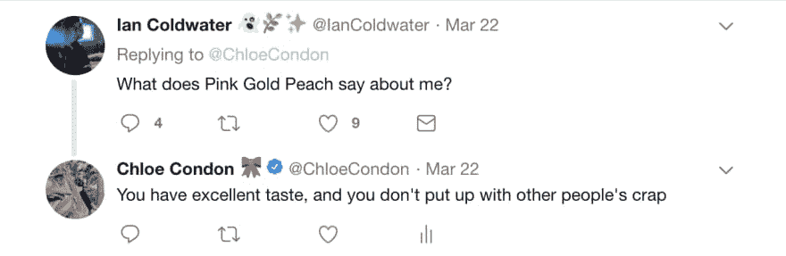
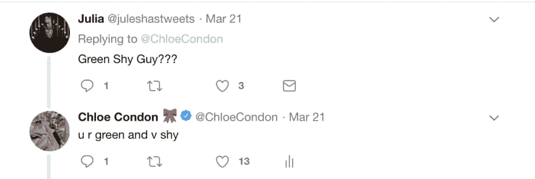
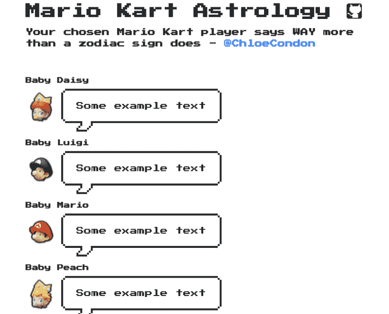
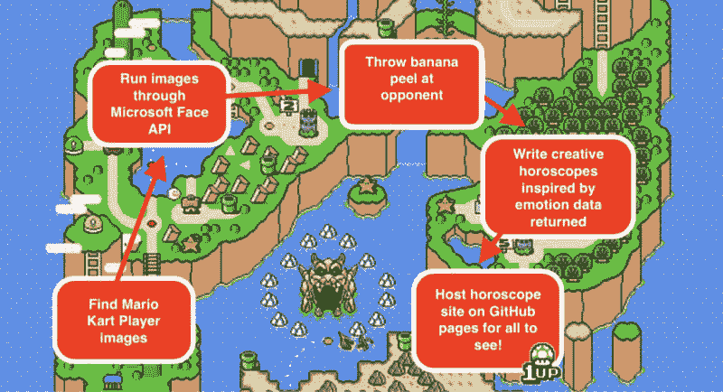
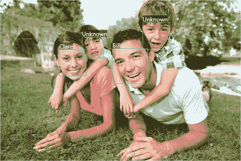
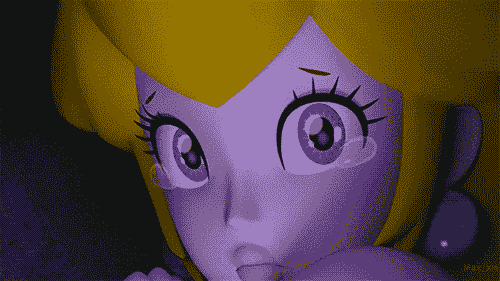

# 使用 Microsoft Face API 创建马里奥赛车占星术

> 原文：<https://dev.to/azure/using-the-microsoft-face-api-to-create-mario-kart-astrology-3hap>

下面这篇博文将带你了解如何使用微软 Azure [Face API](https://docs.microsoft.com/en-us/azure/cognitive-services/face/?WT.mc_id=devto-blog-chcondon) 从图像中检测情绪。如果你正在寻找一个关于 Face API 的快速总结和概述，我建议从这里开始阅读我们的[文档](https://docs.microsoft.com/en-us/azure/cognitive-services/face/?WT.mc_id=devto-blog-chcondon)，或者花 5 分钟完成一个[快速入门教程](https://docs.microsoft.com/en-us/azure/cognitive-services/face/?WT.mc_id=devto-blog-chcondon)，这样你就有了一些关于如何使用 API 和将 React 应用部署到 GitHub 页面的背景知识。你也可以在这里查看 [GitHub 回购](https://github.com/ChloeCodesThings/Mario-Kart-Astrology)。

*如果您想直接跳到代码，请向下滚动到“让我们进入代码！下面的部分。*

*🍄⭐️🏁或者，如果你想跳过这一步，看看你的马里奥赛车玩家是如何评价你的(基于我个人非常不科学的分析)，请点击这里:[https://chloecodesthings.github.io/Mario-Kart-Astrology/](https://chloecodesthings.github.io/Mario-Kart-Astrology/)🏁⭐️🍄*

*快乐学习！*

*——克洛伊*

**附:对于喜欢听/看的人来说，在 [YouTube](https://youtu.be/2JkebaN5CW0) 上有一个我谈论这个的视频！🍿🎬**

[https://www.youtube.com/embed/2JkebaN5CW0](https://www.youtube.com/embed/2JkebaN5CW0)

###### 👉[随意的声音](https://www.youtube.com/watch?v=ve8r3OjrZhM)一口让这个派对开始。🍄⭐️🕹

## 这一切都始于几个月前的一条推特:

> 可儿康登🎀[@ chloecondon](https://dev.to/chloecondon)在我看来，你选择的马里奥卡丁车玩家比黄道十二宫更能说明问题。如果他们选择蟾蜍，你会说“好吧，你是个内向的人”，如果他们选择布瑟，你会说“好吧，谁伤害了你？”。2019 年 3 月 21 日下午 14:351321003

这是我想在互联网上分享的一些愚蠢而有趣的事情(作为背景，[我的大多数推文](https://twitter.com/ChloeCondon)实际上都是[糟糕的工程老爸笑话](https://twitter.com/ChloeCondon/status/980816863344050176))。我一直对占星术感兴趣——这绝不是科学，但我觉得有趣的是，人们在历史上赋予星星以意义。虽然我觉得星座和占星术很有趣，但我从来没有赋予它们太多的价值。这感觉像是基于我的出生日期的许多概括，而我对此毫无控制。另外，也许我有点受不了在整个小学和中学被称为“Cleo 小姐”……感谢 90 年代的电视广告😑

然而，在我看来，选择一个马里奥赛车玩家比我的星座有更多关于我性格的准确数据。你的玩家不是随机分配给你的，这是一个很大的个人选择(马里奥赛车比赛)。这不仅说明了你的个性，也说明了你对一名球员的评价。对我来说，我一直走小/可爱/粉色路线。通常我扮演桃子，Toadette，或者偶尔的“狂野”时刻我扮演 Yoshi。我喜欢这些角色，因为他们重量轻，移动快。我一直注意到我的男朋友泰·史密斯扮演了布瑟、瓦里奥和枯骨——都是非常“邪恶”和有点大的角色。我问他为什么选择这些，他说“它们很有趣——卡丁车上有一只大蜥蜴的想法很有趣”。所以，简而言之，我的男朋友又大又邪恶…开个玩笑，他是个非常好的小家伙。所以，虽然我不认为它们准确地表达了人们的喜好/情绪/等等。，思考它们并建立关联是很有趣的。就像注意到和他们的狗长相相似/性格相似的人很有趣一样。

我越是阅读我推文中的评论，就越是对这种相关性感兴趣。人们开始评论，询问他们的球员对他们说了些什么，当我开玩笑时，我开始回应这样的评论:

这导致了斯蒂芬·拉达奇制作了这个:

> 斯蒂芬·拉达奇@ Stephen Radachy[@ ChloeCondon](https://twitter.com/ChloeCondon)10 下 33 上🤓😂！[docs.google.com/spreadsheets/d…](https://t.co/TF8HaLHixR)2019 年 03 月 04:4507

然后做出[这个惊艳](https://stephenradachy.github.io/Mario-Kart-Astrology/):

> 斯蒂芬·拉达奇@ Stephen Radachy[@ ChloeCondon](https://twitter.com/ChloeCondon)更新:Google sheets 是 2000 及以后，静态 GH 页面是 3008🤓[stephenradachy.github.io/Mario-Kart-Ast…](https://t.co/mDy4htTfLC)2019 年 03 月 08:01 分26

是的，Twitter 有时可能是垃圾，但这样神奇的事情就会发生。🔮斯蒂芬用 React、 [NES.css](https://nostalgic-css.github.io/NES.css/) 、 [nes-react](https://www.npmjs.com/package/nes-react) 和[超级马里奥维基](https://www.mariowiki.com/Mario_Kart_8_Deluxe#Characters)制作了[这个可爱的网站](https://stephenradachy.github.io/Mario-Kart-Astrology/)，并把它发布在 Twitter 上。下面是截图:

最神奇的部分？他把它全部开源了！引用 Stephen 的话，“开源是最好的资源”！所以，经过一段时间的旅行，和玩了微软的 Face API 之后，我终于开始使用微软的 Face 算法、GitHub 页面和一点创意来制作我自己的马里奥赛车占星术。我是这样做的！

我们走吧⭐️🍄

在我们进入技术细节之前，这里有一个我构建的图表，我将带您了解一下:

## 🏁让我们进入代码！🏁

### 第一步:使用微软 Face API

###### 来自微软文档的人脸 API 示例图片

如果你不熟悉 Azure [Face API](https://docs.microsoft.com/en-us/azure/cognitive-services/face/?WT.mc_id=devto-blog-chcondon) ，它是一种认知服务，提供检测、识别和分析图像中人脸的算法。它的功能包括人脸检测、人脸验证、寻找相似人脸、人脸分组和个人识别。对于我的项目，我希望能够检测情绪(然后自己翻译成一个愚蠢的“星座”类型的信息)。

在今年早些时候与 [Suz Hinton](https://twitter.com/noopkat) 一起学习了 Face API，并在蒙特利尔看了 [Susan Ibach](https://twitter.com/HockeyGeekGirl) 的 Confoo talk(她使用曲棍球运动员的图像来分析情感和情绪——你可以在这里查看[代码示例和幻灯片)，我知道我必须用它来创建一些有趣和有创意的东西。在阅读了](https://github.com/hockeygeekgirl/TextandSentimentAnalytics) [Face API](https://docs.microsoft.com/en-us/azure/cognitive-services/face/?WT.mc_id=devto-blog-chcondon) 文档，并在[上完成了一个免费的](https://docs.microsoft.com/en-us/azure/cognitive-services/face/?WT.mc_id=devto-blog-chcondon) [Python 快速入门](https://docs.microsoft.com/en-us/azure/cognitive-services/face/QuickStarts/Python/?WT.mc_id=devto-blog-chcondon)之后，微软学会了(不要担心——也有[其他语言]((https://docs.microsoft.com/en-us/azure/cognitive-services/face/?WT.mc_id=devto-blog-chcondon))的快速入门！)，我准备评估我的数据并开始构建！

但是我很快遇到了一个问题…它无法从一张动画卡通的脸上检测出任何东西。😭

所以，我戴上我的创意帽子，找到了一个变通办法:我不能使用动画马里奥角色，但我**可以**使用马里奥 cosplay 图像！所以，我在各种角色扮演者的网址上做了如下测试:

下面是代码(不要担心——我们很快就会分解它！)