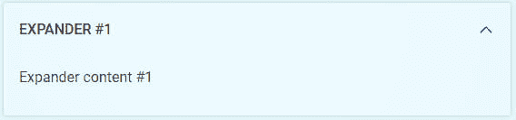
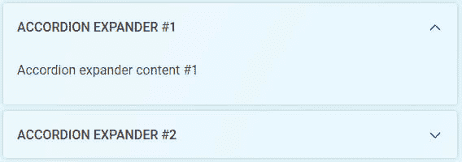

# 使用 ORGENIC UI 扩展器组件

> 原文：<https://dev.to/tikri/using-the-orgenic-ui-expander-component-46dc>

ORGENIC UI 是一个不断发展的 web 组件集，专注于 UX 和设计。本教程展示了如何使用扩展器组件。

扩展器是一个组件，可用于在可扩展块中组织大量内容。这些块可以通过折叠隐藏起来，这样只有标题是可见的。常见的用例是带有一些专家参数的 FAQ 或设置页面，这些参数在默认情况下是隐藏的。

## 扩展器

使用 ORGENIC UI，你所要做的就是用标题作为属性`name`和将被包含到`slot`中的内容作为`og-expander`标记:

```
<og-expander name="Expander #1">
    <p>Expander content #1</p>
</og-expander> 
```

如果您希望扩展器在默认情况下被扩展，您可以简单地添加一个“扩展”属性。

```
<og-expander name="Expander #1" expanded>
    <p>Expander content #1</p>
</og-expander> 
```

结果看起来像这样:

[](https://res.cloudinary.com/practicaldev/image/fetch/s--ClBeeQz2--/c_limit%2Cf_auto%2Cfl_progressive%2Cq_auto%2Cw_880/https://thepracticaldev.s3.amazonaws.com/i/wway5916wa5hjrqfmk54.png)

这很简单...但是还有更多...

## 手风琴

如果您考虑一个 FAQ，您可能只想一个接一个地打开展开器，以关注用户选择的一个元素。具有这种行为的组件的通用名称是*手风琴*。在 ORGENIC UI 中，我们避免了仅为这个用例创建一个新组件。相反，您可以简单地添加一个`group`属性，将多个扩展器添加到一个类别中。

```
<og-expander name="Accordion Expander #1" group="accordion" expanded>
    <p>Accordion expander content #1</p>
</og-expander>
<og-expander name="Accordion Expander #2" group="accordion">
    <p>Accordion expander content #2</p>
</og-expander> 
```

这些扩展器现在表现得像一架手风琴。

[](https://res.cloudinary.com/practicaldev/image/fetch/s--myJAcHZK--/c_limit%2Cf_auto%2Cfl_progressive%2Cq_auto%2Cw_880/https://thepracticaldev.s3.amazonaws.com/i/q1yuk3c2dda2d0pxf0a5.png)

这种方法为您提供了在整个页面上展开扩展器的灵活性，并且它们不必被 accordion 组件包围。

看看这个代码笔:

[https://codepen.io/orgenic-team/embed/VOwNWL?height=600&default-tab=result&embed-version=2](https://codepen.io/orgenic-team/embed/VOwNWL?height=600&default-tab=result&embed-version=2)

请访问我们的网站:

*   [https://orgenic.org](https://orgenic.org)
*   [https://github.com/orgenic/orgenic-ui](https://github.com/orgenic/orgenic-ui)
*   [https://twitter.com/orgenicUI](https://twitter.com/orgenicUI)