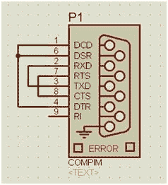

# 在 Proteus 中使用虚拟串口

> 原文：<https://dev.to/oscar37921395/using-virtual-serial-ports-in-proteus-2ak0>

Proteus 是一个被开发者和工程师广泛使用的模拟电路的应用程序。在对微处理器和微控制器等可编程器件进行建模和设计时，经常会用到 Proteus。
我们提供这个简短的教程，展示如何使用 Eltima 的[虚拟串行端口驱动](https://www.virtual-serial-port.org/)软件在 Proteus 中创建虚拟串行接口。
 
我们的演示将涉及测试微控制器应用的功能。“主机程序”将用于通过 UART 通信协议向微控制器发送数据。我们选择用 MAX232 芯片(一种 UART-COM 转换器)来实现这种通信，以将微控制器连接到计算机。

文章:[https://www . virtual-serial-port . org/article/com-port-in-Proteus/](https://www.virtual-serial-port.org/article/com-port-in-proteus/)