# 使用 Wordpress 和 React.js

> 原文：<https://dev.to/iam_timsmith/using-wordpress-with-reactjs-2nfo>

在本文中，我们将介绍如何在构建项目时，通过利用 WordPress API 和 React js，将 WordPress 用作一个无头 CMS。

如果你想知道你是否能在 Wordpress 中使用 React，答案是肯定的。如果你以前建立过 wordpress 网站，那么解决方案可能不像你想象的那么明显。

# 什么是无头 CMS

在我们进入代码之前，解释一下我们将如何处理这个问题可能是有用的。如果你一直在寻找一种简单的方法来管理 react js 项目的内容，你可能听说过这个时髦的词*“headless CMS”*。因为这个术语正变得越来越流行，所以尽早定义它可能是有益的。

> 无头 CMS 是一个后端内容管理系统，不提供前端解决方案。

默认情况下，Wordpress 使用主题和模板为我们的 Wordpress 站点提供一个前端。建立这样一个网站使用与数据库互动，并创建我们的用户可以查看的结构。使用这种方法构建前端会有一些缺点。

首先，它可以创建性能不是特别好的站点。虽然 PHP 是一种通用的语言，但是有更好的解决方案来为我们的用户构建 ui。第二，Wordpress 驱动了大约三分之一的互联网。正因为如此，黑客喜欢尝试进入 Wordpress 网站访问敏感数据。拥有一个独立的前端可以防止用户或黑客知道这是一个 Wordpress 网站。

## 好的，那么我如何使用 React js 来做这件事呢？

Wordpress 公开了一个 REST api，允许访问站点创建的数据。我们可以将这种技术与 Axios 这样的库结合使用，从我们的 Wordpress 站点获取数据，并将其引入我们的 React.js 项目。这意味着我们可以同时拥有这两个词的优点:使用 Wordpress 管理内容的便利性和使用 React js 构建的乐趣。

# 使用 Wordpress 作为我们的后端

让我们来看看 Wordpress 网站，这样你就能明白我在说什么了。你可以使用任何 Wordpress 站点来做这件事，甚至是一个托管在子域上的站点。在这篇文章中，我将关注 TechCrunch 网站。

只需在 url 的末尾添加`/wp-json/wp/v2/posts`,我们将看到所有最新帖子的 JSON 输出。只需将`posts`改为`pages`，[，我们就可以看到 TechCrunch 网站](https://techcrunch.com/wp-json/wp/v2/pages)的页面数据。

[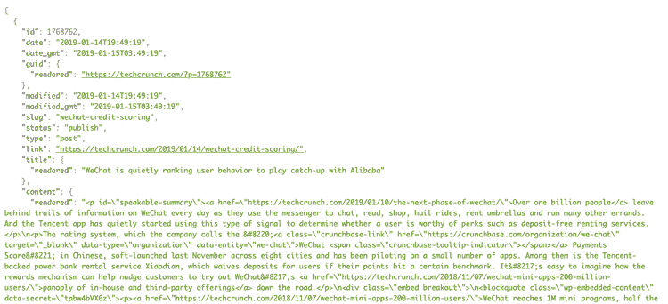](https://res.cloudinary.com/practicaldev/image/fetch/s--sFs_Pe3_--/c_limit%2Cf_auto%2Cfl_progressive%2Cq_auto%2Cw_880/https://d33wubrfki0l68.cloudfront.net/91befd6efc0390046829b0c7eb88c1fa4ca07e43/166ec/static/dc5bb46f97eec1032c16225b69860ef0/9c5b2/techcrunch_posts_api.png)

我们可以[尝试不同的选项](https://developer.wordpress.org/rest-api/reference/)，比如`posts`、`pages`、`users`等等。继续玩下去，看看你能找到什么数据。这将允许我们决定我们想用什么，不想用什么。

# 我们的 React js 入门 App

我已经创建了一个反应[启动器，你可以从这里下载](https://github.com/iamtimsmith/using-react-with-wordpress-demo.git)。解决方案也在另一个分支上。你可以下载文件，运行`yarn`或`npm install`(随你选)，然后运行`yarn start`或`npm run start`。您将看到我们的简单页面，但会注意到没有任何内容。让我们开始添加一些内容。

## 安装必要的软件包

如果我们打开`package.json`文件，我们可以看到我已经包含了`react`、`react-dom`和`bulma`来构建我们的前端。在我们进一步使用 react js 应用程序之前，我们需要再添加几个包。

我们可以添加 [Axios](https://github.com/axios/axios) ，它是一个包，允许我们从应用程序发出 http 请求，没有任何麻烦。 [React-router](https://github.com/ReactTraining/react-router) 可以用来创建路由，这意味着我们可以在不刷新浏览器的情况下切换页面或组件。要安装这两个包，我们可以在终端中使用以下代码:

[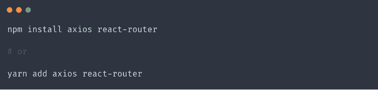](https://res.cloudinary.com/practicaldev/image/fetch/s--Zh5DS52C--/c_limit%2Cf_auto%2Cfl_progressive%2Cq_auto%2Cw_880/https://d33wubrfki0l68.cloudfront.net/57a30b90e99d23375f13854cf9a8ee7f66982bba/6c27a/static/a63b2f68f5a2e30bf59069932da18282/9c5b2/code1.png)

## 将 React 路由器添加到 App.js 文件

现在我们已经安装了新的包，我们需要在 app.js 文件中设置`react-router`,告诉浏览器在地址栏中输入不同的路径时应该显示什么。首先，我们需要从文件顶部的`react-router`导入我们需要的片段。在导入的底部，添加以下代码:

[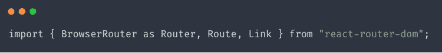](https://res.cloudinary.com/practicaldev/image/fetch/s--K5QHMRGj--/c_limit%2Cf_auto%2Cfl_progressive%2Cq_auto%2Cw_880/https://d33wubrfki0l68.cloudfront.net/af04a7ae68a8a21788752d07cc165cc6273e7f79/8d7cd/static/aec12b098c15134e83febf03d45bf0f7/9c5b2/code2.png)

现在我们已经导入了`react-router`，我们可以使用这些组件来设置路线。我们当前的 app.js 文件如下所示:

[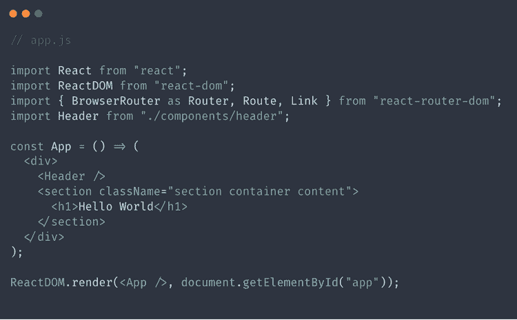](https://res.cloudinary.com/practicaldev/image/fetch/s--uegH3bfk--/c_limit%2Cf_auto%2Cfl_progressive%2Cq_auto%2Cw_880/https://d33wubrfki0l68.cloudfront.net/944c0c45923d031a7a5d66c789a62fe92e432cb5/6f704/static/0a1a9e2fa4ac816805187231a2f35d7d/9c5b2/code3.png)

为了给我们的`app.js`组件添加一个路由器，我们需要将最外面的`
`包装在一个`<Router>`组件中，这样我们就可以设置应用程序的路由。然后我们可以用这两条路由替换我们的`<h1>`标记:

[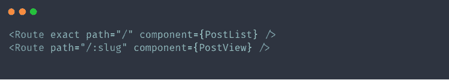](https://res.cloudinary.com/practicaldev/image/fetch/s--05zJkW6j--/c_limit%2Cf_auto%2Cfl_progressive%2Cq_auto%2Cw_880/https://d33wubrfki0l68.cloudfront.net/7b3f4a260eab3bc2b797b29da734d0533ff0ef7d/e7bc7/static/650e5bc14eb3edc7359ae032d3cc3aaf/9c5b2/code4.png)

让我们来分解一下:

我们的第一条路由告诉 reactjs，当用户访问本地路由时，显示一个名为`PostList`的组件( [http://localhost:1234](http://localhost:1234) )。`exact`属性意味着它需要与这条路线**完全匹配**，这意味着如果在那之后有任何东西，它都不会去这条路线。

当用户访问通配符路由时，第二条路由将显示一个名为`PostView`的组件。`:slug`表示斜杠后面的任何字符串在我们的应用程序中都将是不同的路径。在我们的例子中，这个字符串或`slug`(因为这是我们给它起的名字)将是 TechCrunch 博客文章的鼻涕虫。我们的`app.js`文件现在应该是这样的:

[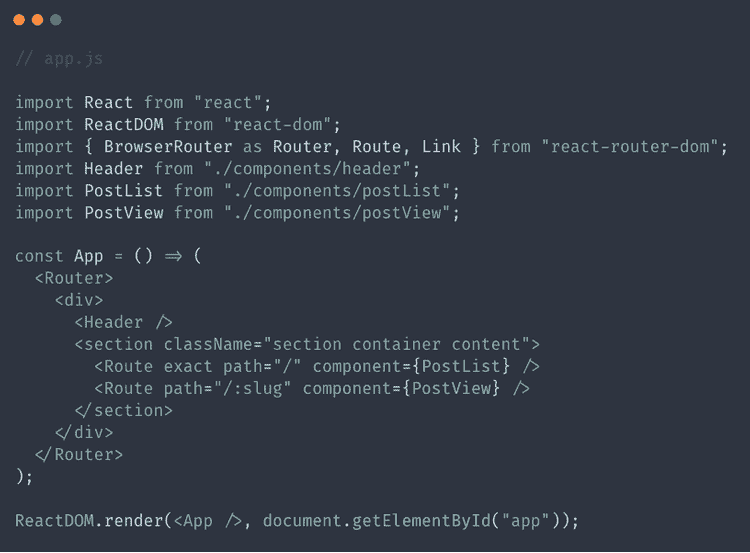](https://res.cloudinary.com/practicaldev/image/fetch/s--H2I8E17Y--/c_limit%2Cf_auto%2Cfl_progressive%2Cq_auto%2Cw_880/https://d33wubrfki0l68.cloudfront.net/cb8683b5777da7c08e132bb49496bda5ad7f66c3/03942/static/01262472b8dfe0e28da10e24a48e3773/9c5b2/code5.png)

接下来，我们需要创建`PostList`和`PostView`组件，并将它们导入到`app.js`组件中。

# 创建我们的 PostList 组件

在开始创建我们的`PostList`组件之前，我们应该花一点时间考虑一下[我们应该使用什么样的组件](https://www.iamtimsmith.com/blog/class-components-vs-stateless-functional-components/)。我们将使用`componentDidMount`生命周期方法向 axios 发出 http 请求，然后[我们可以将它存储在状态](https://www.iamtimsmith.com/blog/this-state-how-to-use-state-in-react/)中。我们可以在一个类组件中同时使用状态和生命周期方法。现在我们已经知道了如何构建这个组件，我们可以开始了。首先，我们应该为组件创建文件:

[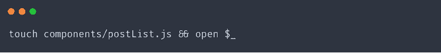](https://res.cloudinary.com/practicaldev/image/fetch/s--LjagfNjZ--/c_limit%2Cf_auto%2Cfl_progressive%2Cq_auto%2Cw_880/https://d33wubrfki0l68.cloudfront.net/79461a9c7f8cd5df927bcf0bccc55ce0cd887ade/677e5/static/ebef24a8c583a37b8f840f68613efde6/9c5b2/code6.png)

接下来，我们应该导入构建这个组件所需的材料。将这些导入语句添加到`PostList.js`文件的顶部:

[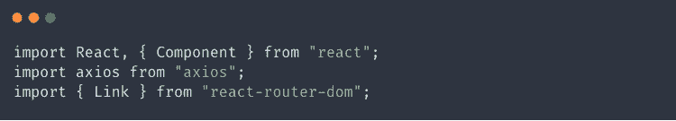](https://res.cloudinary.com/practicaldev/image/fetch/s--sB549oj4--/c_limit%2Cf_auto%2Cfl_progressive%2Cq_auto%2Cw_880/https://d33wubrfki0l68.cloudfront.net/29080b0955b99ad9730b2f488a4a60daed905a85/8b41b/static/db307a08334e87656ec174d7c728aaa4/9c5b2/code7.png)

之后，我们可以创建一个名为`PostList`的类组件，并为我们博客的索引页面设置构造函数和状态。我们的州应该有一个我们将要显示的帖子的列表。我们在这个组件中编写的任何自定义函数都将被绑定到这个构造函数中的关键字`this`。

既然我们有了存放帖子数据的地方，我们应该创建一个生命周期方法来获取数据并将其分配给我们的状态。通过在构造函数后添加以下代码，我们可以非常容易地做到这一点:

[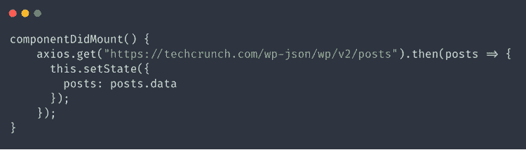](https://res.cloudinary.com/practicaldev/image/fetch/s--hyUoDJxm--/c_limit%2Cf_auto%2Cfl_progressive%2Cq_auto%2Cw_880/https://d33wubrfki0l68.cloudfront.net/587d9db01f064c5c4c3a868881a9cf9e7d368402/d65c2/static/6cba40e157b47eae5aff89ee854748c6/9c5b2/code9.png)

如果你经常开发 React 应用程序，我建议在你选择的浏览器中安装 [React DevTools](https://github.com/facebook/react-devtools) 。这使得 react js 的开发非常简单，并且可以跟踪通过状态和道具传递的数据。

我们现在可以检查我们的状态，以确保它是由我们的`componentDidMount`生命周期方法正确填充的。为此，在浏览器中打开开发者工具，并转到 react 选项卡。然后我们可以在结构中向下钻取，直到找到我们的`PostList`组件，右边的窗格显示我们的状态和道具。

[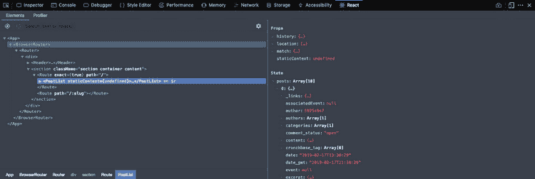](https://res.cloudinary.com/practicaldev/image/fetch/s--EwuNP_YR--/c_limit%2Cf_auto%2Cfl_progressive%2Cq_auto%2Cw_880/https://d33wubrfki0l68.cloudfront.net/7c35626f955294bf314849fde3b9fc823b9d2480/666b8/static/a4ffd90e0c70b0b74dc69a187aae691a/9c5b2/devtools.png)

因为我们的状态中有所有的文章，所以我们可以为页面创建一个具有结构的呈现方法。为了简单地做到这一点，我们可以使用一个`map()`函数来迭代数组中的每一项。我们的 render 方法可以在我们的`componentDidMount`方法之后使用下面的代码。

[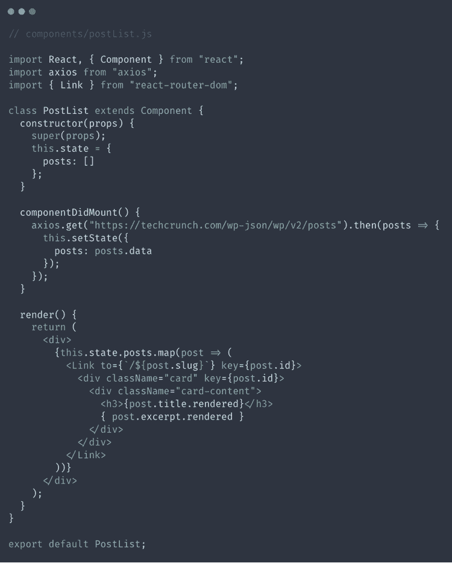](https://res.cloudinary.com/practicaldev/image/fetch/s--9nh-o8nL--/c_limit%2Cf_auto%2Cfl_progressive%2Cq_auto%2Cw_880/https://d33wubrfki0l68.cloudfront.net/d8230aa355e007bd180f2d8a1991d647c0901c16/d9091/static/57e106f4a239261665cfa546bac25e4a/9c5b2/code10.png)

如果我们用`npm run start`或`yarn start`运行我们的站点，我们可以看到我们的博客文章被正确显示，但是我们可以看到 HTML 标签被渲染。这可不酷。为了正确地渲染，我们应该创建一个函数来使用`dangerouslySetInnerHTML`属性。

让我们在我们的`componentDidMount`之后但在`render`方法之前添加一个函数来做这件事。我们还需要在构造函数中绑定`this`关键字。然后我们可以使用`dangerouslySetInnerHtml`属性在`
`中呈现文章摘录。我们完成的`PostList`组件应该是这样的:

[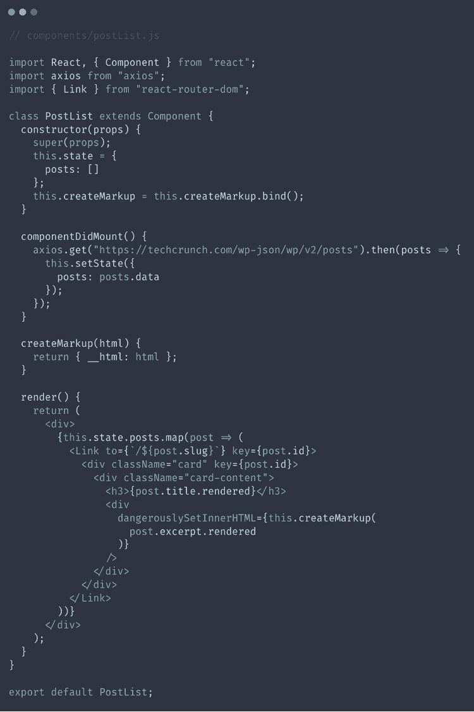](https://res.cloudinary.com/practicaldev/image/fetch/s--9cj9WQck--/c_limit%2Cf_auto%2Cfl_progressive%2Cq_auto%2Cw_880/https://d33wubrfki0l68.cloudfront.net/7cac993a63fde0f3b6dff0cca5469ced2a635004/4c408/static/2e0859abb4a54aad125e9377cffcb16d/9c5b2/code11.png)

# 创建后视图组件

如果我们回头看一下我们的`app.js`文件，我们可以看到博文将使用一个`PostView`组件来呈现，所以让我们继续创建它吧！

[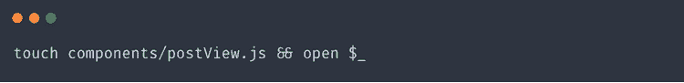](https://res.cloudinary.com/practicaldev/image/fetch/s--lQSFuCz0--/c_limit%2Cf_auto%2Cfl_progressive%2Cq_auto%2Cw_880/https://d33wubrfki0l68.cloudfront.net/e929df62d7ddd4d124122e82aae891a396734153/72181/static/2a212a9312bf9e27833507aef05aa9dc/9c5b2/code12.png)

上面的代码将创建一个文件来存放我们的`PostView`组件，并在默认的代码编辑器中打开它。为了简单起见，我们可以复制`PostList`组件的公式。我们可以从我们的`PostList`组件中复制并粘贴代码，并做一些小的修改。

首先，我们需要确定并将组件的名称从`PostList`更改为`PostView`。接下来我们需要稍微修改一下`componentDidMount`方法。我们可以添加一行代码，它将从地址栏的 url 中获取`:slug`，并使用它来过滤 Wordpress API 返回的帖子，使之成为一个单独的帖子。最后，我们需要修改`render`方法，如果存在完整的文章就显示，如果不存在就不显示错误。

下面的代码将用于我们完成的`PostView`组件。看一看它，看看你是否能发现不同之处，并找出我们为什么以这种方式处理它们。

[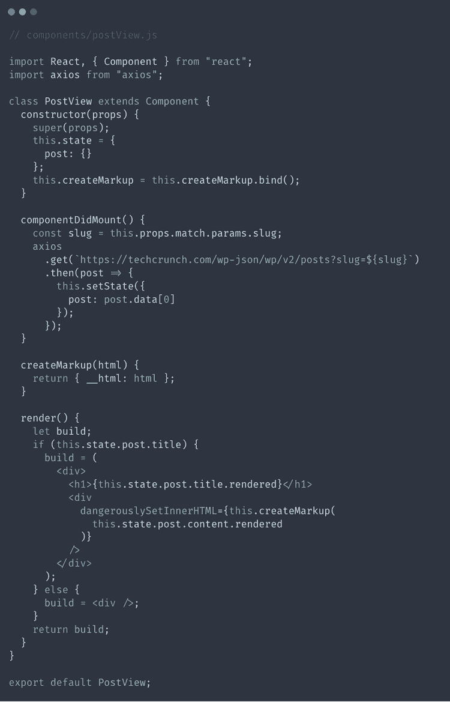](https://res.cloudinary.com/practicaldev/image/fetch/s--SVTJ7TxZ--/c_limit%2Cf_auto%2Cfl_progressive%2Cq_auto%2Cw_880/https://d33wubrfki0l68.cloudfront.net/f4b9298ca95dec4a24464d0876220b9aed6063ff/a95ef/static/8202ee35cbc9b6379dbb26c61b6b75d6/9c5b2/code13.png)

# ReactJS 博客的最后一步

我们的博客已经准备好了。要让我们的应用程序按照我们想要的方式工作，我们还需要做一些小事情。首先，它期望一个标志或网站标题链接回主页。由于我们在项目中使用了`react-router`,我们甚至可以不刷新页面就完成这项工作。为此，我们可以打开`components/header.js`文件并将其修改为如下所示:

[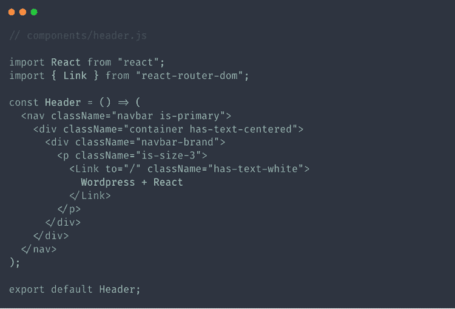](https://res.cloudinary.com/practicaldev/image/fetch/s--BcpePoE4--/c_limit%2Cf_auto%2Cfl_progressive%2Cq_auto%2Cw_880/https://d33wubrfki0l68.cloudfront.net/e7ca9ff5bbd6353f6f7c1516170d9822a57eae80/d4ec8/static/52232383bbb71c90fd72aad0db0172ac/9c5b2/code14.png)

我们的 Wordpress 和 React js 博客的最后一步是为我们的两个组件`PostList`和`PostView`在`app.js`文件中添加导入语句，这样 React 就知道从哪里获取它们。一旦你做到了这一点，你就应该能够运行这个应用程序并看到来自 TechCrunch 的最新博客文章了。

# React js 的性能问题

你可能会注意到加载速度的一些问题，或者在显示内容之前屏幕会有一秒钟的空白感。这是因为内容是在组件挂载后呈现的，所以会有一点延迟。此外，搜索引擎爬虫很难阅读像这样的网站上的内容，因为它是在页面呈现后通过 javascript 加载的。有一些流行的方法来处理这些问题:

## Gatsby.js，静态站点生成器

Gatsby js 是 react js 生态系统中我最喜欢的工具之一。它允许我们使用 React、React-router 和 Graphql 构建一个现成的站点或应用程序！然后，当我们实际构建应用程序时，Gatsby js 会创建静态文件，使我们的应用程序变得愚蠢而快速。

因为我们的应用程序的文件是静态提供的，所以它们可以非常快，因为内容都是预先创建的，而不是在页面呈现时创建的。这可能有点棘手，因为我们必须找到一种方法在更新内容时触发构建。Netlify 是我的首选服务，因为它非常容易使用，当你进入某个 git 分支时，它会重建 Gatsby js 项目。

## Next.js，服务器端渲染 React js

处理这些问题的另一个流行的解决方案叫做 [Next js](https://nextjs.org/) ，它为 react js 应用程序提供服务器端渲染。Next js 没有在组件挂载后使用`componentDidMount`获取数据，而是公开了一个名为`getIntialProps`的新方法，它允许我们在组件呈现前获取数据。

Next js 提供服务器端渲染的事实也解决了爬虫读取内容有困难的问题。此外，他们网站上的教程也非常棒。如果你正在使用 MERN 堆栈构建一个应用[，这将是一个很好的解决方案，因为它可以处理频繁变化的数据。](https://www.iamtimsmith.com/blog/what-is-the-mern-stack-and-how-does-it-work/)

# 结束我们的 Wordpress 和 React js 项目

正如你所看到的，在享受 React js 前端的同时，利用 Wordpress 提供的令人敬畏的 UI 真的很容易。您可以在您的个人项目、企业解决方案或自由职业工作中利用这些工具。这是少有的两全其美的机会之一！