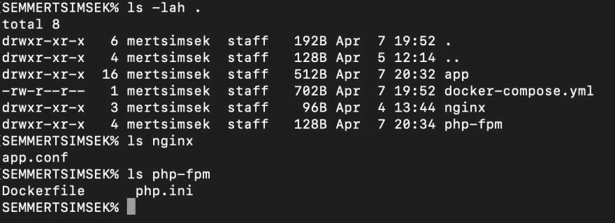
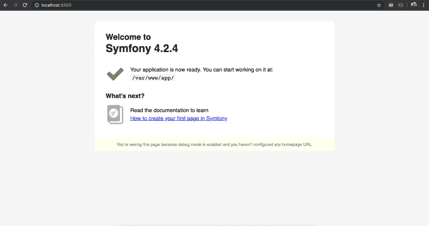
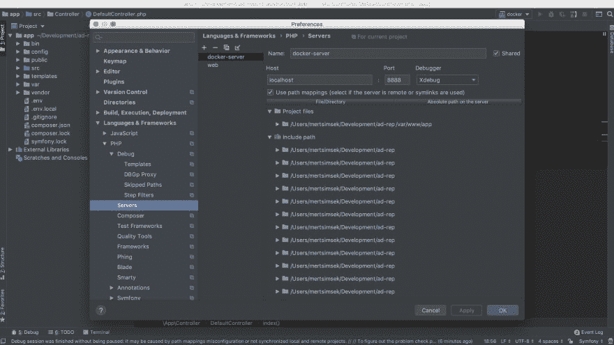
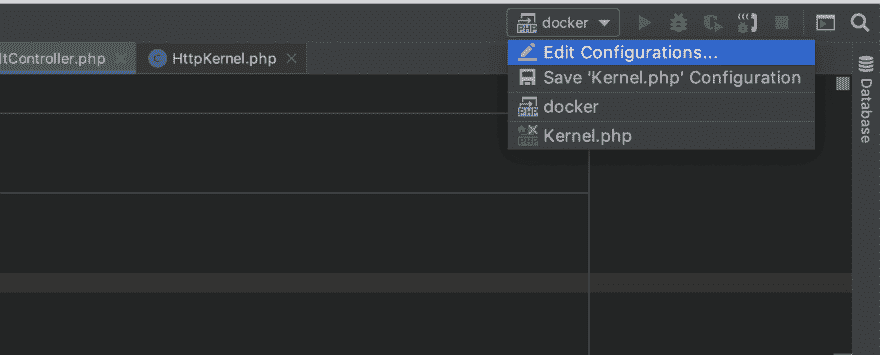
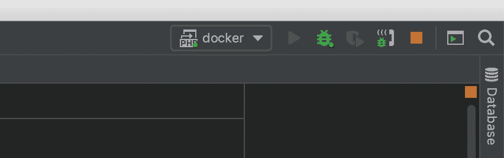
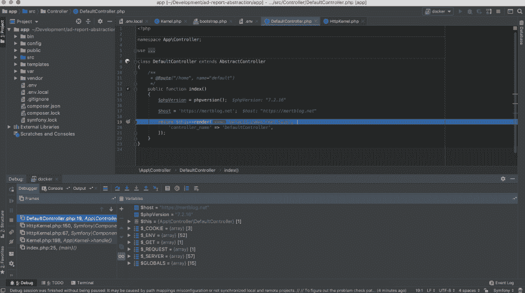

# 通过 Docker 使用 Xdebug

> 原文：<https://dev.to/_mertsimsek/using-xdebug-with-docker-2k8o>

我将展示如何使用 Xdebug 和 Docker。因为，只要你喜欢在 Docker 的开发工作区上使用 Xdebug，你就必须创建 Xdebug 的远程连接。首先，你必须有一个 Xdebug 客户端。为此，我宁愿使用 PhpStorm。通过这种方式，我将提到一些提示和顺利使用的方法。开始吧！

我想开始一个 Symfony 项目是在 Docker 上运行。我将告诉这独立于 Symfony。通过 Docker Compose 帮助我了解它。我的结构如下。

[](https://res.cloudinary.com/practicaldev/image/fetch/s--hcjFymtx--/c_limit%2Cf_auto%2Cfl_progressive%2Cq_auto%2Cw_880/https://thepracticaldev.s3.amazonaws.com/i/bvt2h351i7m1zf2acuyl.png)

我分享我的码头资产。给您这是 **php.ini** 文件。

```
[PHP]
engine = On
short_open_tag = On
precision = 14
output_buffering = Off
zlib.output_compression = Off
implicit_flush = Off
unserialize_callback_func =
serialize_precision = 100
disable_functions = dl
disable_classes =
zend.enable_gc = On
expose_php = Off
max_execution_time = 30
max_input_time = 60
memory_limit = 256M
error_reporting = E_ALL & ~E_NOTICE
display_errors = On
display_startup_errors = Off
log_errors = On
log_errors_max_len = 1024
ignore_repeated_errors = Off
ignore_repeated_source = Off
report_memleaks = On
track_errors = Off
html_errors = On
error_log = error_l
variables_order = "EGPCS"
request_order = "GP"
register_argc_argv = On
auto_globals_jit = On
post_max_size = 64M
auto_prepend_file =
auto_append_file =
default_mimetype = "text/html"
default_charset = "UTF-8"
include_path = ".:/opt/php72/lib/php"
doc_root =
user_dir =
enable_dl = Off
file_uploads = On
upload_max_filesize = 64M
max_file_uploads = 20
allow_url_fopen = On
allow_url_include = On
default_socket_timeout 
cli_server.color 
date.timezone = Asia/Riyadh
pdo_mysql.cache_size = 2000
pdo_mysql.default_soc
sendmail_path = /usr/sbin/sendmail -t 
mail.add_x_header 
sql.safe_mode =
odbc.allow_persistent = Off
odbc.check_persistent = Off
odbc.max_persistent = -1
odbc.max_links = -1
odbc.defaultlrl = 4096
odbc.defaultbinmode
ibase.allow_persistent = 1
ibase.max_persistent = -1
ibase.max_links = -1
ibase.timestampformat = "%Y-%m-%d %H:%M:%S"
ibase.dateformat = "%Y-%m-%d"
ibase.timeformat = "%H:%M"
mysqli.max_persistent = -1
mysqli.allow_persistent = Off
mysqli.max_links = -1
mysqli.cache_size = 2000
mysqli.default_port = 3306
mysqli.default_socket =
mysqli.default_host =
mysqli.default_user =
mysqli.default_pw =
mysqli.reconnect =
mysqlnd.collect_statistics = Off
mysqlnd.collect_memory_statistics =
pgsql.allow_persistent = Off
pgsql.auto_reset_persistent = Off
pgsql.max_persistent = -1
pgsql.max_links = -1
pgsql.ignore_notice = 0
pgsql.log_notice
bcmath.scale
session.save_handler = files
session.save_path = "/tmp"
session.use_strict_mode = 0
session.use_cookies = 1
session.use_only_cookies = 1
session.name = PHPSESSID
session.auto_start = 0
session.cookie_lifetime = 0
session.cookie_path = /
session.cookie_domain =
session.cookie_httponly =
session.serialize_handler = php
session.gc_probability = 1
session.gc_divisor = 100
session.gc_maxlifetime = 1440
session.referer_check =
session.cache_limiter = nocache
session.cache_expire = 180
session.use_trans_sid = 0
session.hash_function = 0
session.hash_bits_per_character = 5
url_rewriter.tags = "a=href,area=href,frame=src,input=src,form=,fields"
zend.assertions 
tidy.clean_output =
soap.wsdl_cache_enabled=1
soap.wsdl_cache_dir="/tmp"
soap.wsdl_cache_ttl=86400
soap.wsdl_cache_limit
ldap.max_links 
```

第二个是 **nginx.conf** 。

```
server {
    listen 80;
    server_name web;
    root /var/www/app/public;

    location / {
        # try to serve file directly, fallback to index.php
        try_files $uri /index.php$is_args$args;
    }

    location ~ ^/index\.php(/|$) {
        #fastcgi_pass unix:/var/run/php7.2-fpm.sock;
        fastcgi_pass php:9000;
        fastcgi_split_path_info ^(.+\.php)(/.*)$;
        include fastcgi_params;
        fastcgi_param SCRIPT_FILENAME $realpath_root$fastcgi_script_name;
        fastcgi_param DOCUMENT_ROOT $realpath_root;
        fastcgi_buffer_size 128k;
        fastcgi_buffers 4 256k;
        fastcgi_busy_buffers_size 256k;
        internal;
    }

    location ~ \.php$ {
        return 404;
    }

    error_log /var/log/nginx/project_error.log;
    access_log /var/log/nginx/project_access.log;
} 
```

第三个是 **Dockerfile** 。重点在这里。

```
FROM php:7.2-fpm-alpine

RUN apk update \
    && apk add  --no-cache git mysql-client curl libmcrypt libmcrypt-dev openssh-client icu-dev \
    libxml2-dev freetype-dev libpng-dev libjpeg-turbo-dev g++ make autoconf \
    && docker-php-source extract \
    && pecl install xdebug redis \
    && docker-php-ext-enable xdebug redis \
    && docker-php-source delete \
    && docker-php-ext-install pdo_mysql soap intl zip \
    && echo "xdebug.remote_enable=on" >> /usr/local/etc/php/conf.d/docker-php-ext-xdebug.ini \
    && echo "xdebug.remote_autostart=off" >> /usr/local/etc/php/conf.d/docker-php-ext-xdebug.ini \
    && echo "xdebug.remote_port=9001" >> /usr/local/etc/php/conf.d/docker-php-ext-xdebug.ini \
    && echo "xdebug.remote_handler=dbgp" >> /usr/local/etc/php/conf.d/docker-php-ext-xdebug.ini \
    && echo "xdebug.remote_connect_back=0" >> /usr/local/etc/php/conf.d/docker-php-ext-xdebug.ini \
    && echo "xdebug.idekey=mertblog.net" >> /usr/local/etc/php/conf.d/docker-php-ext-xdebug.ini \
    && echo "xdebug.remote_host=docker.for.mac.localhost" >> /usr/local/etc/php/conf.d/docker-php-ext-xdebug.ini \
    && curl -sS https://getcomposer.org/installer | php -- --install-dir=/usr/local/bin --filename=composer \
    && rm -rf /tmp/*

CMD ["php-fpm", "-F"]

WORKDIR /var/www/app

EXPOSE 9000 
```

如果你没有 Mac OS，你应该把 **xdebug.remote_host** 改成你的机器 IP。此外，如您所见，我的 idekey 是 mertblog.net 的**，我的 remote_port 是 **9001** 。你能够改变它。最后，我来展示一下 **docker-compose.yml** 文件。** 

```
version: '3'
services:
    php:
        build:
            context: ./php-fpm/.
        volumes:
            - ./app:/var/www/app
            - ./php-fpm/php.ini:/usr/local/etc/php/php.ini
        depends_on:
            - mysql
    web:
        image: nginx:latest
        ports:
            - "8888:80"
        volumes:
            - ./app:/var/www/app
            - ./nginx/app.conf:/etc/nginx/conf.d/default.conf
        depends_on:
            - php
    mysql:
        image: mysql:5.7
        environment:
            MYSQL_ROOT_PASSWORD: symf0ny
        ports:
            - "3333:3306" 
```

我安装了 Symfony 应用程序，我在本文中提到过。我使用这个命令启动了我的 web 应用程序。

```
docker-compose up --build 
```

[](https://res.cloudinary.com/practicaldev/image/fetch/s--fm6efKgd--/c_limit%2Cf_auto%2Cfl_progressive%2Cq_auto%2Cw_880/https://thepracticaldev.s3.amazonaws.com/i/wn9uw7o12s4aae8rku2t.png)

从现在开始，我可以配置 Xdebug 客户端了。为此，请遵循界面中的路径。 **Phpstorm >首选项> PHP >调试**。你将会看到 **Xdebug 调试端口**。你应该换成 **9001** 港。之后，按照这个路径**PHP storm>Preferences>PHP>Servers**。您将看到这个屏幕。

[](https://res.cloudinary.com/practicaldev/image/fetch/s--EX_1Yiby--/c_limit%2Cf_auto%2Cfl_progressive%2Cq_auto%2Cw_880/https://thepracticaldev.s3.amazonaws.com/i/oxbpqozlwm7ku8pir69b.png)

我已经设置了名字 **docker-server** 。我的主机是 localhost，我的 web 服务器帖子是 **8888** 。点击`Use path mappings`。你得把`Absolute path on the server`定义成 **/var/www/app** 。它链接到本地机器上我们的项目目录。嗯，在这之后，你关闭这个屏幕，点击左边的`Edit Configurations`部分。

[](https://res.cloudinary.com/practicaldev/image/fetch/s--bmqLrOuA--/c_limit%2Cf_auto%2Cfl_progressive%2Cq_auto%2Cw_880/https://thepracticaldev.s3.amazonaws.com/i/aexdyrsabyqrq108ec32.png)

[](https://res.cloudinary.com/practicaldev/image/fetch/s--PO5vGq7---/c_limit%2Cf_auto%2Cfl_progressive%2Cq_auto%2Cw_880/https://thepracticaldev.s3.amazonaws.com/i/hkq9udylhswkltn5xzgv.png)

在这一部分，我们将在 **PHP 远程调试**下创建一个配置。我已经把名字设为`docker`。我的服务器是我刚刚创建的`docker-server`。和 Ide 键在`Dockerfile`里是一回事。

我点击电话图标开始监听 **PHP 调试连接**。

[](https://res.cloudinary.com/practicaldev/image/fetch/s--LSJWpk7K--/c_limit%2Cf_auto%2Cfl_progressive%2Cq_auto%2Cw_880/https://thepracticaldev.s3.amazonaws.com/i/y503q2otcrjy1dvkofx8.png)

对，我可以通过获得这个 url 来启动我的 Xdebug 会话。 [http://localhost:8888/home？XDEBUG _ SESSION _ START = mert blog . net](http://localhost:8888/home?XDEBUG_SESSION_START=mertblog.net)

我把红点放在第 19 行了。从现在开始，我可以在 PHPStorm 接口上调试我的变量了。这确实有助于我们，通过这种方式我们可以很容易地注意到错误。

[](https://res.cloudinary.com/practicaldev/image/fetch/s--35etwvb4--/c_limit%2Cf_auto%2Cfl_progressive%2Cq_auto%2Cw_880/https://thepracticaldev.s3.amazonaws.com/i/ichtz0s3lxua9yhlxo2g.png)**