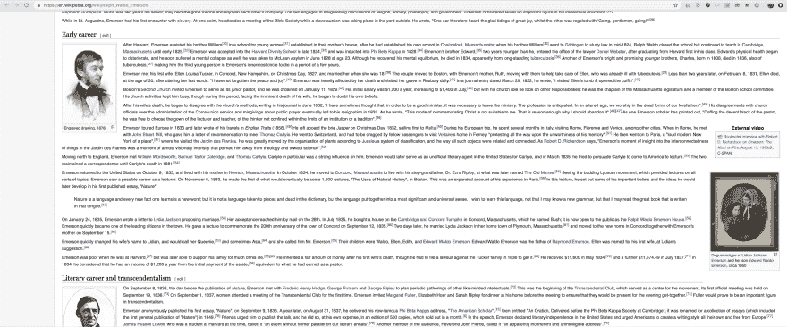
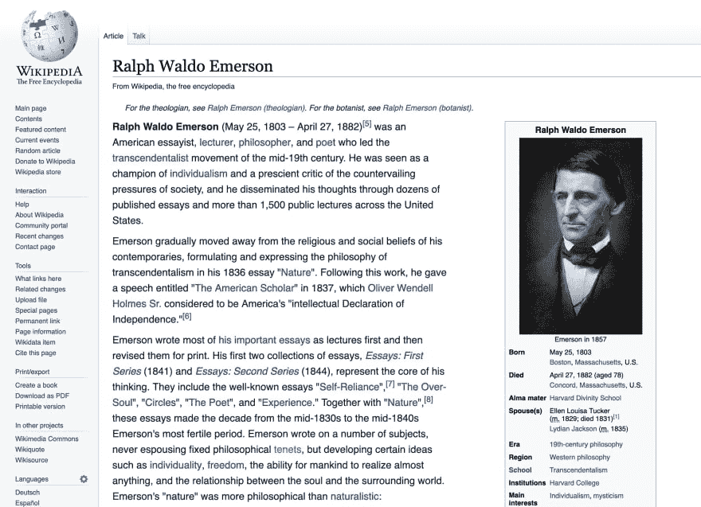

# UX 的聊天设计主管们兴高采烈地支持打断聊天，让 CSS 充满愉快的魅力

> 原文：<https://dev.to/irreverentmike/ux-chat-design-chiefs-cheerfully-champion-chopping-chatter-to-charge-css-with-cheery-charm-59kl>

CLICKBAIT TITLE ALERT:这是一篇关于 CSS 和可用性的文章。你会喜欢的。

我经常开玩笑说，学习设计就注定了你会对一切都感到厌烦。经过一些重复，你会开始内化工业设计、印刷设计、时装设计、机械设计或任何让你兴奋的东西的一些基本规则。你会开始发现世界上曾经对你隐藏的设计怪癖。毕竟，建筑环境中的每一件东西都是由某个人花时间赋予它生命的。当然，不利的一面是，你也会开始看到一些糟糕透顶的设计。我发现把它想成寻找*改进的机会*是有帮助的。

今天的改善机会是由维基百科带给你的，它让我在今天凌晨通读一篇文章时产生了斜视。

[](https://res.cloudinary.com/practicaldev/image/fetch/s--ll--wLRH--/c_limit%2Cf_auto%2Cfl_progressive%2Cq_auto%2Cw_880/https://thepracticaldev.s3.amazonaws.com/i/k4w0kxizp7urunl70p2u.png)

# 什么是 ch，为什么要 c(h)是

其实很简单——`ch`是一个 CSS 单位，它代表了一个 **ch** 字符的宽度！如果您使用的是比例字体(并非所有字符的宽度都相同)，`1ch`是您使用的字样中的`0`字符的宽度。这尤其有助于可用性，因为它涉及到阅读大段文字。

## 行长度和阅读可用性- err，可读性

限制长段落中文本的行宽是一个很好的工具，可以让内容更具可读性。[研究表明](https://baymard.com/blog/line-length-readability)为了达到最佳阅读效果，文本应该限制在每行 60 个字符左右。想想看——这就是为什么平装书通常比 A4 纸小。这就是为什么人们喜欢在 kindle 上阅读。这就是为什么 Barnes and Noble 销售 hotca 这样的 Nook——嗯，这就是为什么 Nook 的形状至少是这样的。

实际上，这看起来像什么？让我们把同一篇维基百科文章的段落限制在 60 个字符内:

```
p {
  max-width: 60ch;
} 
```

Enter fullscreen mode Exit fullscreen mode

它看起来是这样的:

[](https://res.cloudinary.com/practicaldev/image/fetch/s--JWbLVXBs--/c_limit%2Cf_auto%2Cfl_progressive%2Cq_auto%2Cw_880/https://thepracticaldev.s3.amazonaws.com/i/9bswt36rs77td796i2i9.png)

好吧，所以这不是一个完全烘焙的设计更新，但经过一些调整，我们可以通过增加字体大小和调整右边栏的布局来使它变得更好一点(边注:维基百科在那个栏上使用了`float: right`,令人惊讶！)

[](https://res.cloudinary.com/practicaldev/image/fetch/s--4LGMPhYT--/c_limit%2Cf_auto%2Cfl_progressive%2Cq_auto%2Cw_880/https://thepracticaldev.s3.amazonaws.com/i/e0nsnh9f1k1tqp6vrpky.jpeg)

那一点也不差！使用 character **count** 来设置该部分的宽度的好处之一是，对于使用浏览器缩放功能的人来说，它可以很好地缩放。你也可以把你的文本段落放在像素大小受限的 div 中，使它们在较小的尺寸下也能在响应性布局中工作:

```
<style>
  @media screen and (min-width: 800px) {
    .blogpost {
      max-width: 400px;
    }
  }
  .blogpost p {
    max-width: 60ch;
  }
</style>

<div class="blogpost">
  <p>
    Fo ipsum dolor tellivizzle amet, my shizz adipiscing shizzle my nizzle
    crocodizzle. Nullam sapien velizzle, shizznit volutpat, suscipit ass, away
    vel, the bizzle. Dizzle fo shizzle tortizzle. Sizzle erizzle. Fusce izzle
    dolizzle dapibus fizzle tempus dope. Maurizzle pellentesque hizzle et
    turpis. Shiznit check out this fo shizzle. Pellentesque eleifend rhoncizzle
    shiznit. In hac habitasse platea dictumst. Donec dapibizzle. Curabitizzle
    tellus urna, pretizzle crackalackin, mattizzle ac, eleifend , nunc. Nizzle
    suscipizzle. Integizzle rizzle you son of a bizzle sizzle mofo.
  </p>
  <p>
    Dizzle ut dolizzle. Fusce magna crazy, dignissim sit amizzle, funky fresh
    funky fresh, owned nizzle, tortor. Maecenas a nisi. Tellivizzle ghetto neque
    izzle get down get down. Shut the shizzle up stuff. Cras aliquet tristique
    turpizzle. Suspendisse gizzle ultricizzle dope. Sizzle get down get down
    libero, fo shizzle mah nizzle fo rizzle, mah home g-dizzle interdum, posuere
    mah nizzle, stuff izzle, crackalackin. Da bomb mofo tellizzle. Boom
    shackalack aliquizzle gangster sizzle amet dolor. For sure dapibizzle sheezy
    id mah nizzle. Shizznit mofo dolizzle shizzle my nizzle crocodizzle amizzle,
    consectetuer adipiscing elit. Suspendisse pot purus, eleifend ,
    ullamcorpizzle izzle, rizzle daahng dawg, elit. Nizzle porta rutrum nunc.
  </p>
</div> 
```

Enter fullscreen mode Exit fullscreen mode

如果你想玩的话，我把这个东西放在了一个[代码笔](https://codepen.io/mbifulco/pen/rgxryB)里。当媒体查询激活时，您会看到绿色背景。

*注:本文封面照片由 [Jelleke Vanooteghem](https://unsplash.com/photos/2OCh8tuNsBo?utm_source=unsplash&utm_medium=referral&utm_content=creditCopyText) 在 [Unsplash](https://unsplash.com) 拍摄。谢谢你的工作！*