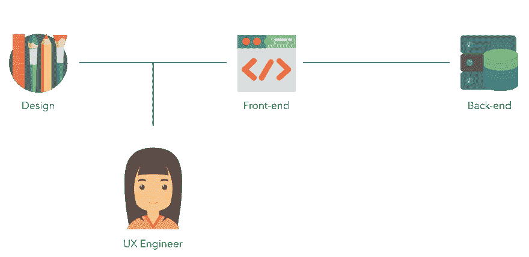
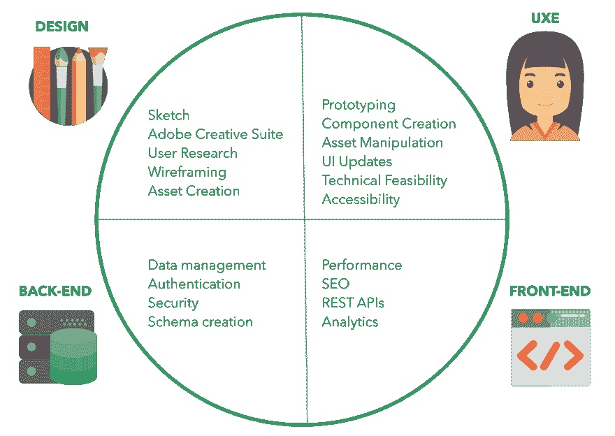

# UX 工程

> 原文：<https://dev.to/emmabostian/ux-engineering-3hem>

几个月前，我兴奋地被正式认定为 LogMeIn 的“UX 工程师”(UXE)。我将有机会建立设计系统！但一旦兴奋消退，我很快意识到 UXE 的角色是多么不明确。我试着用谷歌搜索这个职位，但一无所获。

尽管一些公司，如谷歌和 Etsy，开始雇佣 uxe，但不同公司之间的职位差别很大。因此，在对这个领域做了大量研究后，我相信我最终缩小了 UXE 的角色、成功所需的技能和责任。

请注意，这个角色不仅来自我完成的所有研究，还来自我的个人经历。如果你正在考虑 UXE 的一个职位，请和你潜在的雇主一起回顾这个职位的要求。

# 什么是 UX 工程师？

UX 工程师(UXE)是跨职能设计团队中的前端工程师，帮助促进设计和工程之间的协作。

UXEs 拥有前端工程师的技能，但具备 UX 设计原则的工作知识。他们的主要领域集中在应用程序的设计/UI 组件层，而不是前端和后端开发之间的中间件层。

### uxe 在流程中处于什么位置？

uxe 介于设计和前端工程之间。
[T3】](https://res.cloudinary.com/practicaldev/image/fetch/s--UwpqjH81--/c_limit%2Cf_auto%2Cfl_progressive%2Cq_auto%2Cw_880/https://cdn-images-1.medium.com/max/1600/1%2A2xFn0paLMjLGZmbvgmww9w.png)

### 他们的技能和前端工程师有什么不同？

由于 uxe 是他们的核心前端工程师，所以他们之间应该有重叠，但是 uxe 使用设计技能，并且比中间件层更关注 UI。

# 设计系统

一般来说，UXEs 工作于建筑设计系统，所以让我们花点时间来定义什么是设计系统。

设计系统是一套指导方针和资产，在多个旗舰产品或应用程序中传达一种身份感。它由三部分组成:设计语言、组件库和风格指南。

### 设计语言

创建系统所需的视觉设计资产和品牌指南。这里有一些你可能会看到的品牌指南的例子。

*   调色板
*   无障碍指南
*   排版比例
*   动画库

### 组件库

用于赋予设计语言生命的编码组件。这些组件是使用 HTML、CSS 和 JavaScript 构建的。一些最流行的设计系统使用以下 JavaScript 库和框架，但也可能包含本地(普通 JS) web 组件:

*   反应
*   view . js-检视. js
*   有角的
*   聚合物

### 风格指南

记录和封装设计语言和组件库的网站。 [IBM Carbon](https://www.carbondesignsystem.com/) 是一个很棒的风格指南，我推荐去看看。

# UXEs 是做什么的？

这是一个因公司而异的领域，但这里有几个 UXEs 的主要工作职责:

*   将设计语言变成一个用流行的 JavaScript 框架或库编码的活的、会呼吸的组件库。
*   使用组件库将低保真度设计原型化为高保真度原型。
*   努力改善设计团队和工程团队之间的协作和沟通。
*   在整个组织中推广设计系统的价值和采用。
*   为设计系统建立风格指南网站。

# UXE 角色的资格

UXE 的资格因公司而异，但是它们主要包括前端开发技能和少量的用户体验知识。

### UX 设计技巧

以下是一些 UXE 可能需要了解的 UX 设计知识的例子:

*   能够看到一个组件，并理解为什么这些组件会像现在这样组合在一起。为什么文本是左对齐的(文本应该与目标读者阅读的方向对齐。由于世界上大多数人是从左向右阅读的，这就是为什么当你的文本块大于三行时，最好是从左对齐。)
*   为什么段落每行不应该超过 50-70 个字符(行宽越长，用户的眼睛越容易疲劳。)
*   为什么深色文本放在浅色背景上比浅色背景更好(这种组合的对比更加鲜明)。
*   为什么不应该在没有背景覆盖、投影或降低图像对比度或不透明度的背景图像上放置文本(文本，无论是黑白的还是彩色的，都将融入图像的不同色调；如果图像上有白色文本，它将在图像的较暗区域中清晰地显现出来，并逐渐消失在图像较亮部分的背景中。)

### UI 设计技巧

您可能还想熟悉设计团队使用的一些工具。这些可能包括以下内容。

*   素描
*   Adobe 创意套件
*   菲格玛

一般来说，如果你有使用这些工具的经验，一般的技能会转移到其他工具上；Sketch 和 Figma 是最容易学的工具。

如果你正在寻找一个 UXE 角色，我强烈推荐莎拉·德拉斯纳的《重构用户界面》这本书和《为开发者设计 T2》这门课。

### 前端开发技能

由于 UXEs 的主要知识集是前端开发，您应该对基本的工程原理和前端开发技能感到满意。

在申请 UXE 职位之前，这里有一些你可能想温习的技能:

*   **HTML、CSS、JavaScript:** 不要把这些“基础”想当然。学会有效而正确地使用这些技能并不难，但却非常重要。
*   构建工具:你需要有使用 [Webpack](https://webpack.js.org/) 或 [Gulp](https://gulpjs.com/) 的经验，因为这些组件的构建过程很重要。
*   CSS 预处理器&工具:在一个 UI 框架和组件库中经常会看到 [Sass](https://sass-lang.com/) 或 [Less](http://lesscss.org/) ，因此你应该能够很好地使用它们。此外，我建议学习一种命名架构，如[Block-Element-Modifier](http://getbem.com/)(BEM)或[Scalable and Modular Architecture for CSS](http://smacss.com/)(smcss)。使用上面的工具时，它们会派上用场。
*   **可访问性:**你应该了解如何使用语义标记，以确保你的组件库符合 [W3C](https://www.w3.org/) 。
*   算法*: 我在这个技能上加了一个星号，因为正如我们将在这篇文章的采访部分看到的，你应该对算法、它们的运行时和优化技术有所了解。也就是说，你不像开发团队的前端工程师那样，在日常工作中可能不会使用那么多算法。
*   **问题解决:**你必须能够在构件库的构建中应用良好的问题解决技巧。
*   设计模式:了解一些设计模式(我们设计组件的方式)可能是有用的。Addy Osmani 出版了一本[关于设计模式的不可思议的书](https://addyosmani.com/resources/essentialjsdesignpatterns/book/)，我强烈推荐。
*   响应式设计:您正在构建响应式 web 组件，这些组件必须在不同的分辨率下运行。因此，你必须知道响应式设计的原则。
*   **测试&调试:**熟悉测试组件。 [Jest](https://jestjs.io/) 是一种流行且简单易学的 JavaScript 测试技术。它通常与[酶](https://github.com/airbnb/enzyme)一起使用来测试反应成分。Sentry.io 是另一个学习调试和捕捉组件错误的好工具。
*   版本控制:你必须对使用版本控制感到舒适。 [Git](https://git-scm.com/) 是最受欢迎的一个，所以一定要温习你的技能！
*   **包&依赖管理器:**你将致力于创建一个包，你的工程团队可以在他们的工作流程中利用这个包，所以你应该了解 [npm](https://www.npmjs.com/) 和 [yarn](https://yarnpkg.com/en/) 。

### 软技能

作为一名 UXE，你将与设计系统的利益相关者接触:设计团队、工程团队和产品管理。因此，你必须有很好的沟通技巧。

以下是成为一名有效的 UXE 所需的一些其他技能:

*   **书面沟通:**你将创作组件和风格指南文档
*   作为一个 UXE，你可能对你的日常工作或目标有更多的自主权。因此，你必须积极寻找工作，并能够分清主次。
*   **同理心:**我们必须对我们的用户有同理心。归根结底，它们是我们构建这些不可思议的应用程序的原因。

# 面试流程

由于 UXE 是一个如此新的领域，面试过程还没有明确的定义。我没有经历 UXE 面试过程，因为我已经在 LogMeIn 工作了，所以我很容易就进入了这个角色。

要了解你在面试前应该掌握的技能，请参考前面的章节:UXE 角色的资格。一般来说，面试过程和前端工程师差不多，所以好好学习你的算法和 JavaScript。

# 相关 UXE 文章&招聘信息

有几家公司雇佣 UXEs。下面是一些 UXEs 的招聘信息，可以让你对这个职位有更深入的了解。

*   [谷歌招聘](https://careers.google.com/jobs/results/4617646772518912-ux-engineer-front-end-web/)
*   [我的谷歌 UX 工程师面试](https://medium.com/@DementedScript/my-google-ux-engineer-interview-d79bb5854c06)
*   谁是 UX 工程师？
*   [2019 年成为 UX 工程师所需的 20 项技能](https://uxengineer.com/skills-needed-become-a-ux-engineer/)
*   [UX 十大工程师组合](https://uxengineer.com/ux-engineer-portfolios/)

# 结论

UX 工程公司给了我一份礼物。它让我将我对设计的热爱与开发的技术方面结合起来。我喜欢拥有与设计师和工程师有效沟通的技能。

如果你认为 UXE 是适合你的角色，我鼓励你去争取；我从未如此开心过。

如果你找不到大量的 UXE 工作，不要气馁；该领域仍处于起步阶段，并将继续发展。

我很高兴看到这条职业道路将带我走向何方。