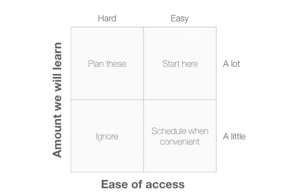
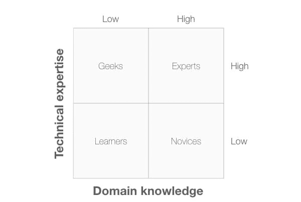
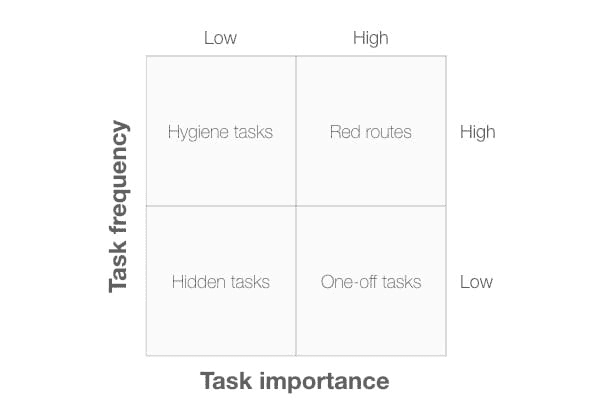
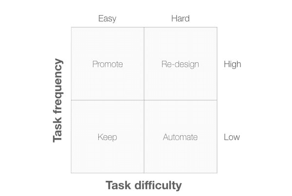
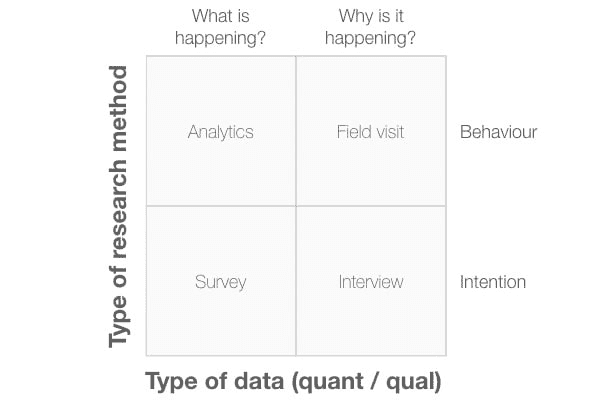

# UX 研究-第一部分

> 原文：<https://dev.to/abhishekalbert/ux-research-part-1-4lke>

你好。！希望你们都很好..

今天我将发布一篇关于“借助一些图表，你能够思考 UX 研究”的文章。最初，我是在 2018 年 12 月 3 日由[大卫·特拉维斯](https://twitter.com/userfocus)撰写的网站 USERFOCUS 上读到这篇文章的。

所以让我们开始吧。
 **帮你理清 UX 研究思路的 10 张图**

> 作为 UX 的研究人员，我们研究的一些问题很简单，通过让用户站在我们的产品前就可以很容易地解决。但是其他问题可能很复杂，很难知道如何开始解决它们。在这种情况下，一个简单的 2x2 图表可以穿过“如果”、“怎么样”和边缘案例，并提供一种简单的方法来看待问题。这里有 10 个 2x2 图表的例子来简化 UX 的研究讨论。—大卫·特拉维斯

我们在产品开发中处理的问题有时是多因素和复杂的。在这种情况下，我们可能会沉迷于技术问题或业务规则的讨论，而忘记用户及其目标的重要性。如果您在下次会议中发现这种情况，请转向白板，尝试使用这些图表之一来简化问题，并将用户需求放在讨论的最前面。
 **如何决定先研究哪些用户群:**

<figure>

当我们想到我们的产品或服务的所有不同的用户类型时，有时会显得不知所措。不清楚我们应该从哪里开始研究。当我在那个位置找到一个团队时，我画出了图 1。纵轴是我们通过访问一个特定的用户群将学到(或期望学到)的量。一些用户组会告诉我们很多关于他们如何在产品领域工作的知识，还有一些我们可能已经很了解了。横轴表示到达该用户组的难易程度。有些小组很容易找到(他们可能和我们在同一个镇上)，而其他小组可能因为地理位置或工作时间表等因素而难以接近。

<figcaption> Diagram 1: A 2x2 plot with the axes,"Amount we will learn" and "Ease of access".</figcaption>

</figure>

这四个象限是:

*   忽略:这个象限中的用户群很难接近，并且不会教给我们什么，所以我们可以忽略他们。
*   在方便的时候安排时间:这个象限中的用户组很容易找到，但是我们不会从他们那里学到很多东西。只有当您在访问其他用户组之间有一些空闲时间时，安排对这些用户组的访问才有意义。
*   计划这些:我们期望从这些用户群中学到很多，但是由于这样或那样的原因，他们很难接触到。我们应该开始计划这些访问，以确保我们在未来看到这些群体。
*   从这里开始:这些用户群很容易接近，我们希望从他们那里学到很多东西。从这里开始我们的研究是有意义的，因为我们可以立即开始，并为开发团队提供一些真正的价值。

<figure>

**如何创建人物角色:**
从你的研究中识别人物角色的一个简单方法是识别在你的研究中最重要的两个维度，然后将你的研究参与者分组到适当的象限中。在图 2 中，我选择了两个在许多项目中很重要的维度:人们对技术的专业知识和他们对感兴趣领域的知识。

<figcaption> Diagram 2: A 2x2 plot with the axes,"Technical expertise" and "Domain knowledge".</figcaption>

</figure>

这四个象限是:

*   学习者:这个角色的技术专业知识和领域知识都很少。
*   极客:这个角色有很高的技术专长和很少的领域知识。
*   专家:这个角色有很高的技术专长和领域知识。
*   新手:这个角色的技术专长低，领域知识高。

<figure>

假设您有来自实地访问的数据，您应该能够创建比这些更有意义的维度。如果没有，这些维度通常可以很好地生成假设人物角色。
 **如何识别红色路线** 
一个 2x2 的绘图可以很容易地识别红色路线——用户执行的关键任务。在这个例子中，两个维度是任务频率(即用户执行任务的频率)和任务重要性(即任务对用户有多重要)。

<figcaption> Diagram 3: A 2x2 plot with the axes,"Task frequency" and "Task importance".</figcaption>

</figure>

这四个象限是:

*   隐藏任务:这些是低频率、低重要性的任务。花很多时间研究或优化这些任务是没有意义的。
*   卫生任务:这些是高频率、低重要性的任务:用户在做他们真正想做的事情之前必须完成的普通任务(比如认证)。
*   一次性任务:这些是低频率、高重要性的任务:例如软件安装或创建帐户。
*   红色路线:这些是高频率、高重要性的任务:我们必须优化系统中这些任务的可用性。

<figure>

 **如何决定修复什么**
可用性评估完成后，开发团队需要对问题进行优先级排序，这样他们就知道先修复哪些问题。图 4 显示了一个 2x2 的图，在这里可以有所帮助。两个维度分别是“任务频率”(任务执行的频率)和“任务难度”(任务完成的难度)。把我们的时间花在困难的、高频率的任务上是有意义的。

<figcaption> Diagram 4: A 2x2 plot with the axes,"Task frequency" and "Task difficulty".</figcaption>

</figure>

这四个象限是:

*   保持:这些是容易完成的低频率任务。我们需要确保我们所做的任何改变不会对这些任务产生负面影响。
*   促销:这些是容易完成的高频率任务:我们应该鼓励营销人员在描述我们的产品时多做这些。
*   自动化:这些是低频率、困难的任务。我们需要问是否有一种方法可以自动完成这些任务，这样系统就可以代表用户来完成这些任务。如果没有，向导设计模式可能会简化用户的任务。
*   重新设计:这些是高频率、困难的任务。这个象限中的任务是我们需要首先修复的。

<figure>

 **如何选择一种 UX 研究方法**
我们也可以用一个 2x2 的图来决定我们应该进行什么样的研究方法。图表 5 显示了一个 2x2 的图表，其中“研究方法类型”与“数据类型”相对应。根据“研究方法的类型”,我们可以将研究方法分为基于行为的方法和基于意图(或观点)的方法。通过“数据类型”，我们可以将研究方法分为定量的(“发生了什么？”)和定性(“为什么会发生？”).

<figcaption> Diagram 5: A 2x2 plot with the axes,"Type of research method" and "Type of data".</figcaption>

</figure>

在这个例子中，我在每个象限中放置了特定的研究方法，但这些不是您可以使用的唯一方法。仅将这些视为示例。

<figure>

希望你喜欢这篇文章，并会有所帮助。我把这篇文章分成两部分，因为我相信我们只读过一点点，通过练习就能让这一点点知识变得清晰。

<figcaption> Thank you for reading !! So see you all in next one !!!</figcaption>

</figure>

祝你好运，继续学习，快乐编码！！！