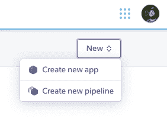
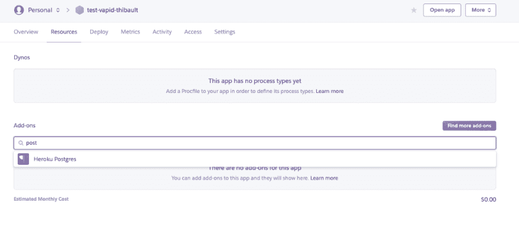
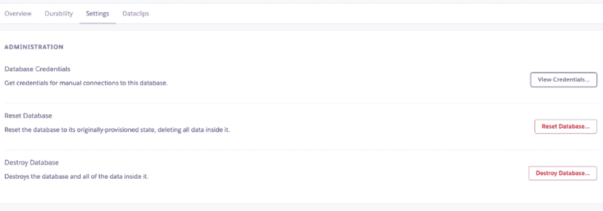

# Heroku 上乏味的主机

> 原文：<https://dev.to/clawfire/vapid-hosting-on-heroku-44oo>

#### 如何在 Heroku 上部署一个乏味的网站并配置数据库，传输您的数据，但仍然存在文件存储问题。

<figure> 

<figcaption>照片由[礼萨·南达里](https://unsplash.com/@rezanamdari?utm_source=medium&utm_medium=referral)上传 [Unsplash](https://unsplash.com?utm_source=medium&utm_medium=referral)</figcaption>

</figure>

Vapid 是一个 CMS，它提供了一个仪表板来输入内容，运行许多不同类型的数据库，并让你从你正在编写的 HTML 中完成所有这些工作(感谢像语法一样的[小胡子](http://mustache.github.com) / [手柄](https://handlebarsjs.com/))。这是我对任何小项目的新尝试，即使我有一个主要问题:进入生产。

因为 Vapid 是一个节点包，它让你铲出一个开发服务器并在其上工作，但当涉及到生产时，你有官方付费服务(从 7 美元/月/站点开始),它当然支持软件的开发，但当你与你现在拥有的所有解决方案相比时，似乎有点昂贵:Now.sh，Heroku，AWS，…

由于很多人都在考虑如何在这些类型的服务上进行部署，我用 Heroku 进行了尝试。这是我的旅程。

### 创建新应用

让我们从创建一个新的应用程序开始，使用服务提供的免费层。

这足以开始部署，但我建议改用付费计划来保持您的网站运行，否则它会在活动期间暂停，并需要时间再次启动)。

一旦完成，你应该添加一个免费的 *PostgreSQL* 插件。进入*资源*选项卡，搜索 postgres。使用 *Heroku Postgres* 并选择*业余爱好开发-免费*版本。

### 准备 vapid 安装

现在，我假设您已经有了一个本地制作的 vapid 站点，并且只想部署它。

#### 编辑 package.json 文件

因为我们将使用 *PostgreSQL* 我们需要告诉 vapid 我们正在使用默认的 *SQLite* 数据库之外的东西。由于开始时检查似乎很乏味，我们正在为它安装节点包(即使我们在这里不需要它),我们也将添加它。

您应该在 vapid 部分添加方言配置。我们将使用 Heroku 默认传递给应用程序的环境变量 DATABASE_URL 作为连接字符串。

看到 pg 依赖了吗？就是我之前跟你说的 *PostgreSQL* 包。可悲的是我至今没有找到摆脱它的方法。我在 Vapid 的 Github repo 上打开了一个 bug。

#### 部署 app

Heroku 提供了 3 种部署方法:

*   使用 Heroku 的 GIT
*   使用 Github
*   使用容器注册表

我选择第一个，因为它基本上只是在你的项目中添加了一个 Heroku 遥控器，你可以随时按下它。我发现这真的很方便。

我只需要运行一个 git push heroku master 并等待几秒钟。我的应用程序现已部署完毕，可供🥳.公众访问

### 可选:导入您的数据

由于我已经将一些数据输入到我的 Vapid 网站中，并且不想重新创建所有内容，所以我是这样做的:

1.  连接到 SQLite 并将数据导出到几个 CSV 文件中
2.  连接到 PostgreSQL 并导入我的文件

#### 导出数据

我在 Mac 上，所以我很快在互联网上找到了一个 SQLite 客户端，它有一个名为 [DB Browser for SQLite](https://sqlitebrowser.org/) 的 GUI，是免费的💰。

打开 data/vapid.sqlite，然后浏览每个表并导出它们。我个人选择了同一个数据文件夹中的 tableName.csv。只是为了保持有序。

#### 导入数据

这有点棘手，但是不要惊慌。首先，您必须访问您部署的网站并创建一个管理员帐户。它构建仪表板，并在数据库中创建不同的表。

回到你的应用程序的 Heroku 管理面板。找到*资源*选项卡。你应该有你的 *Heroku Postgres* 插件。点击它打开，在一个新的窗口中，这个附加组件的管理员。

进入*设置*选项卡，你应该会发现一个*查看凭证……*按钮。点击它！

在这一点上，我使用了共享软件 Postico，但它可以导入我的数据而无需付费。使用这些凭证，我连接到我的 Heroku DB 并将我的 CSV 文件导入到 PostgreSQL 的每个表中。

就这样👍🏼

### 房间里的大象

不，我不会谈论 PHP😅但事实上，你不能用这个方法使用图像数据类型。为什么？因为文件存储在 Heroku 中是短暂的。这意味着每次你的应用程序进入睡眠状态，文件存储就会被删除。事实上，您的整个应用程序会被删除，直到有人再次尝试访问它，然后一个新的容器会被创建并提供服务。数据库中的数据是安全的，因为数据库不是存储在容器中，而是一个独立的、持久的服务。

那怎么办呢？将文件存储在单独的文件存储器上似乎是一个不错的方法。不幸的是，Vapid 当时没有提供一些能够将数据上传到其他地方的机制。这应该不难做到，但如果他们想真正对每个人开放，他们需要开发一个连接器方法或依赖第三方工具，就像他们对数据库抽象所做的那样，以与 AWS S3 和其他提供商兼容。