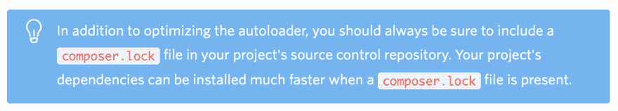

# 是否对 composer.lock 文件进行版本控制？

> 原文：<https://dev.to/rafaelcg/versioning-or-not-the-file-composer-lock-3ki3>

许多开发人员忽略了 composer.lock。gitignore，因为它是自动生成的文件。通过分析。gitignore 的目的这个理论是正确的，但是，这是管理这个文件的版本控制的一个很好的实践，并且使用 composer install 命令来准备一个环境，而不是 composer update，让我们检查一下支持这个想法的基础，以便将这个更改应用到您的项目中。

-您可以在 [Composer 文档](https://getcomposer.org/doc/01-basic-usage.md#commit-your-composer-lock-file-to-version-control)中找到这样一句话:

> “您应该将 composer.lock 文件提交到您的项目存储库中，以便所有参与该项目的人员都锁定到相同版本的依赖项。”

-有了 composer.lock 文件，它将成为 composer 依赖项的安装速度**快了两倍**。

-您可以使用参数来优化自动加载，通过源代码优先选择包，并避免在生产环境中获得开发依赖关系，从而使它更加优化。

-由于每次安装将使用 composer.lock 文件，它将为每个开发人员安装相同的包分发版本，避免了著名的句子**“它在我的机器上工作”**。

-根据 [Composer 文档](https://getcomposer.org/doc/02-libraries.md#lock-file)，不建议库采用这种做法。

> 对于您的库，如果您愿意，可以提交 composer.lock 文件

-不要在您的产品中使用 composer update，它可能会更新您尚未在 UAT 更新的软件包，因此，UAT 环境失去了它的用途。

您正在对 composer.lock 进行版本控制吗？请在下面的评论中告诉我！