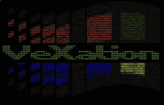
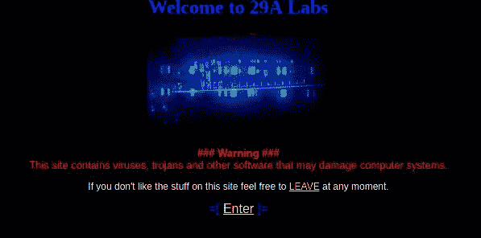
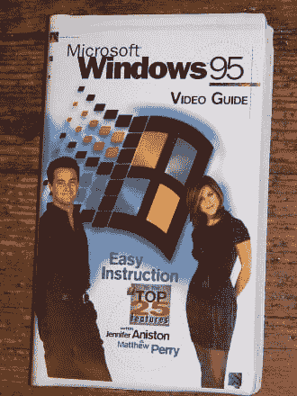

# 烦恼-让我们写一个病毒

> 原文：<https://dev.to/cpu/vexation---lets-write-a-virus-51e0>

2018 年圣诞节假期，我决定坐下来开始一个我想了很久的项目:编写一个 90 年代的计算机病毒。我决定开这个博客来记录我的进步，希望能激发你对复古计算机病毒的兴趣。

<figure>

<figcaption>Welcome to VeXation</figcaption>

</figure>

## VX？

从小到大，我一直迷恋于。txt 文件，这些文件来自当时被称为“地下计算机”的东西。在这个焦虑的青少年和早期互联网文化的空间里，我特别喜欢一个通常被称为“VX”的角落:病毒交换。在这里，你会发现像“Julus 勋爵”这样的人写帖子，名字像[“反调试器&反仿真器巢穴”](http://download.adamas.ai/dlbase/Stuff/VX%20Heavens%20Library/static/vdat/tuantant.htm)和像 [29a](http://dsr.segfault.es/stuff/website-mirrors/29A/) (十六进制 666-我希望你已经能看到吸引力)这样的团体发布 [ezines](http://dsr.segfault.es/stuff/website-mirrors/29A/29A-1.html) 和 virii 原型。

<figure>

<figcaption>Remember when websites all had landing pages?</figcaption>

</figure>

这个时代的大部分都被精心编目在一个名为“VX 天堂”的网站上。虽然它原来的家[遭遇了不公平的消亡](https://nakedsecurity.sophos.com/2012/03/28/vx-heavens-virus-writing-website-raided/)，但仍有[镜像在线](https://cryptohub.nl/zines/vxheavens/lib/-index=OT&lang=en.htm)和[档案](https://archive.org/details/vxheavens-2010-05-18)可供下载。当然，VX 也有问题的方面，我无法称赞，但创新、发现和分享知识的精神确实是独一无二的。

## 为什么写一个 90 年代的病毒？

更广泛地说，1995 年我 7 岁。当我第一次开始阅读 vx 文件时，我可能接近 12 岁。我当时所读的任何东西，大概只有不到 2%能理解。作为一个有着十年职业经验的 30 岁的人，重温这个话题是非常有趣的。现在，我既可以享受小时候吸引我的精神，也可以欣赏和实现技术方面。

尽管已经有 20 多年的历史了，但那个时代的伟大实践者所详述的许多技术仍然是相关的基础。许多文章中提到的核心技术仍然存在并在使用中。事实上，我敢打赌，无论你现在在哪台电脑上阅读这篇文章，它都还在执行 PE 或 ELF 可执行文件。

这可能不会反映在引文和 RSA 会议上，但现在计算机安全和逆向工程的基础领域的主题不是由学术界或工业界开创的，而是由无聊的青少年开创的，他们想让别人的计算机展示一片杂草叶子。

## 为什么要写 Windows 95 病毒？

为了开始编写一个病毒，我需要决定支持的平台和目标。我选择 Windows 95 是出于实际和情感两方面的原因。

从历史的角度来看，95 年的胜利标志着 VX 舞台上一个有趣的转折点。DOS 时代有大量的病毒和 VX 出版物，但随着 Win95 的发布，社区的许多知识都变得过时了。刚开始 Win95 有[一个全新的可执行格式](https://msdn.microsoft.com/en-us/library/ms809762.aspx)，运行在[保护模式](https://en.wikipedia.org/wiki/Protected_mode)，操作系统功能通过一个新的 API 而不是[原始中断](http://stanislavs.org/helppc/int_21.html)访问。

<figure>

<figcaption>There are a lot of great Windows 95 resources available</figcaption>

</figure>

Windows 95 也是我记忆中探索的第一个操作系统。我的第一台电脑是 Tandy 1000，但它相当原始，我还太小，无法深入探索。当我家有一台 Win95 机器时，我就被它迷住了。我花了很多时间查看每个控制面板设置和文件系统的每个角落。那时我们还没有家庭网络，所以在电脑上被认为是“有趣”的东西肯定比今天更广泛。我相信在这个时代长大的你们中的许多人都记得在 mspaint.exe 失去的时光。

从实用的角度来看，Win95 很有吸引力，因为它足够现代，有一些东西可以让我的生活更轻松(TCP/IP、文件共享、易于使用的开发工具、扁平的内存空间、基本上没有安全功能)。它在 VirtualBox 上也运行得相当好，所以我们可以避免在易贝上购买任何米黄色的怪物。

为了挑战和匹配 VXer 的偏好，我将在纯 x86 汇编中编写我的病毒。我编写汇编的经验有限，所以我想确保我选择的平台不会太深奥。有大量关于汇编程序中 Win95 Win32 编程的资源，以及针对 Win95 的 VX 特定资源。我职业生涯的大部分时间都专注于 Linux 和 UNIX 系统，所以对于我来说，在 Windows 上和为 Windows 编程还有很多新的领域。

最后，在扩展支持结束后的 18 年，瞄准一个操作系统[意味着我可以进行实验，而不用太担心破坏性后果和道德障碍。不要在现实世界里运行 Windows 95，我求你了。](https://support.microsoft.com/en-us/lifecycle/search?alpha=Microsoft%20Windows%2095)

## 从哪里开始？

问完一些“为什么”之后，让我们来谈谈短期目标和我想开始建立的目标。

1.  **香草感染者。**我的目标是感染 PE 可执行文件，在不影响被感染应用程序功能的情况下传播病毒。简而言之，如果你运行一个被感染的程序，它应该像预期的那样工作，以避免怀疑，但也通过寻找新的程序来传播病毒。
2.  **亲吻**。首先，我将忽略高级技术(多态性、加密器、反调试等),并专注于最小的可行 PE 感染源。这意味着我将在很大程度上忽略反病毒检测开始。我会指出我在哪里作出有助于避免的决定，但我会推迟制定对策。(剧透:即使使用 90 年代的技巧而不考虑规避，也会绕过数量惊人的反病毒引擎的检测)
3.  仅与 Windows 95 兼容。支持 Windows NT 和 Windows 98 并不太难，但我已经做了很多，所以专注于一个平台将有助于管理复杂性。
4.  没有硬编码偏移！尽管我忽略了 Windows NT 和 98，但我希望有理由相信该病毒可以在不同补丁级别的 Windows 95 上运行。
5.  **100%组装。**使用 C 语言很有诱惑力，但为了让这更具挑战性，也为了符合这个时代 VX 人的偏好，我将只使用 x86 汇编(可能针对 80386 或 80486)。
6.  **时期精确的工具。**我非常想成为 90 年代的 Windows VXer，这意味着不使用 vim 和熟悉的工具集。相反，我会找到一个 90 年代的文本编辑器，并使用当时可用的编译器/调试器。

这是雄心勃勃的，我倾向于在项目完成之前放弃它们，所以我希望
通过保持最初的范围限制，并专注于分享正在进行的工作，我可以完成以上内容，并转移到更有趣的高级主题:-)

## 接下来

我的下一篇文章将着重于设置 Windows 95 VM、配置它的 internet 访问、设置文件共享以及安装 x86 开发环境。

我很想听到关于这个项目的反馈，特别是如果你是活跃在 90 年代 vx 场景中的人。请随时在推特( [@cpu](https://twitter.com/cpu) )或电子邮件(【daniel@binaryparadox.net】T2)上给我留言。

直到下一次，