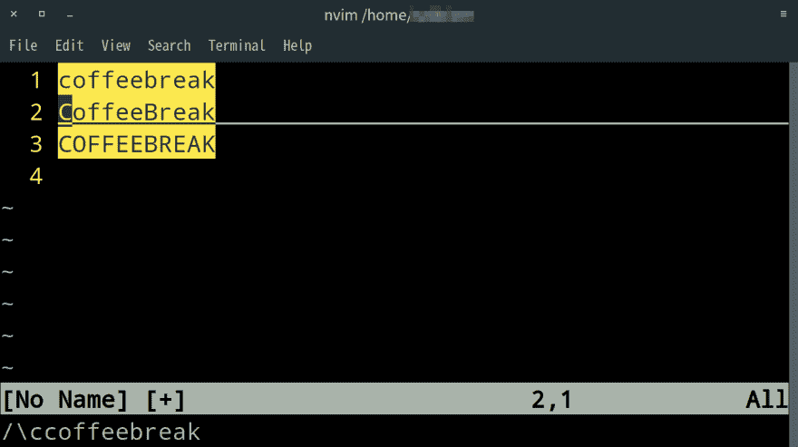

# Vim:动态不区分大小写/区分大小写搜索

> 原文：<https://dev.to/nabbisen/vim-dynamic-case-insensitivesensitive-search-4ohd>

你好🙂
这篇文章是关于在 [Vim](https://www.vim.org/) / [Neovim](https://neovim.io/) 中搜索单词的小技巧。

开始搜索一些单词后，我有时想忽略大小写；在默认设置`noignorecase`和`nosmartcase`下没有应用(至少在 [OpenBSD](https://www.openbsd.org/) 6.4 的包中)。

我很难定制一个配置文件，也就是当时的`~/.vimrc` / `~/.config/nvim/init.vim`。此外，我不喜欢停止搜索来键入`:set ignorecase`，因为每次我遇到这种情况时，可能都要重新设置。
此外，如果我已经习惯于根据需要使用`-u`选项:`vim -u %config-file%` / `nvim -u %config-file%`重新启动程序，我的生活会更加艰难。

我终究找到了方法:
`\c` / `\C`都是神奇的词汇😊

**`\c`** 启用大小写不敏感**动态搜索:** 

```
/\c%keyword(s)% 
```

**`\C`** 正相反，即**灵敏**搜索:

```
/\C%keyword(s)% 
```

请记住，这些选项在配置设置之前。

[](https://res.cloudinary.com/practicaldev/image/fetch/s--O60oBZ-m--/c_limit%2Cf_auto%2Cfl_progressive%2Cq_auto%2Cw_880/https://thepracticaldev.s3.amazonaws.com/i/3k8u2lthwexo6yaudqnh.png)

例如，在`noignorecase`和`nosmartcase`环境下:

| (关键词) | “咖啡时间”是 | “咖啡时间”是 | “咖啡时间”是 |
| --- | --- | --- | --- |
| `coffeebreak` | 打 | 未命中* | 未命中* |
| `CoffeeBreak` | 未击中 | 打 | 未击中 |
| `\ccoffeebreak` | 打 | 打 | 打 |
| `\cCoffeeBreak` | 打 | 打 | 打 |
| `\Ccoffeebreak` | 打 | 未击中 | 未击中 |
| `\CCoffeeBreak` | 未击中 | 打 | 未击中 |

*在`ignorecase`和`smartcase`下，命中。(因此，当自定义配置文件可用时，这些设置的组合可能会很有用。)

如果您想在官方文档中阅读这些选项，请键入 Vim:

```
:help ignorecase
:help smartcase 
```

门开了！

谢谢你的阅读😄祝你和 Vim 生活愉快。**