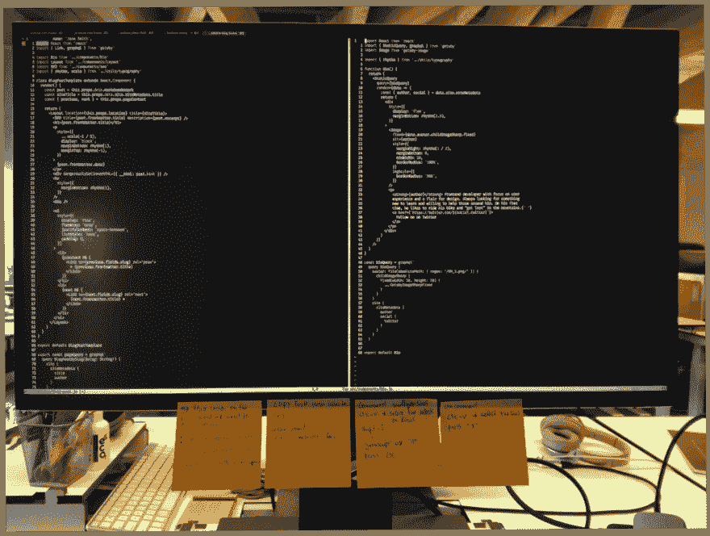

# 维姆不是怪物。

> 原文：<https://dev.to/fmmricardo/vim-is-not-a-monster---3p1p>

第一次听说 Vim 的时候，我甚至不知道它是什么。我开始搜索并四处询问……一般来说，人们都避免使用这个词。有些人说学习 vim 很费时间，有些人不想受苦，有些人说你真的可以让你的工作流程更有效率，但总的来说，人们不想深入其中。

## 我为什么选择 Vim

关于原子“终结”的谣言让我开始思考我应该开始使用 VS 代码，但是我想尝试一些不同的东西。在我工作的公司，有很多人在使用 Vim，这让我对学习它更加好奇。

两周前，我有机会与一位 vim 爱好者进行了一次 Vim 会议，但在开始之前，他问我是否真的真的想这样做。他警告我，我将面临一定程度的挫折……但这并没有阻止我去做。

Vim 对我来说并不完全陌生。在这个环节之前，我已经知道了一些通过使用 Vimtutor 学到的基础知识。为了实践我在 vim tutor 和 Atom 上学到的东西，我安装了一个 vim 插件来开始使用一些命令。这种体验出奇的好。如果我的工作流程没有重大变化，我可以尝试一下，但是很快我就发现了一个问题。

通过使用 vim 插件，我从来没有离开过我的舒适区，我仍然可以像以前一样使用代码编辑器。有时我发现有两种使用编辑器的方式(atom 方式或 vim 方式)令人困惑，出于懒惰，我选择继续使用我通常的快捷键。

但是，如果我真的想使用 vim，更好的方法是使用并配置它。

那是一个转折点，从那以后我强迫自己只使用 vim。我知道这会在一段时间内减慢我的工作流程，但是我相信很快我就会知道如何使用 vim。

## 痛点和发现

在我做出这个决定后，因为我是一名前端开发人员，我开始寻找一个满足我前端需求的 vim 设置，我找到了一个。()
当时我觉得这个很牛逼，就开始用了。

在那次 vim 会议之后，我的朋友建议我卸载那个现成的设置，从基本插件开始。事实上，我安装了太多插件，以至于我都不知道它们的功能是什么。我只知道一切正常。我也意识到我的插件越少越好，有些命令是个人的。随着时间的推移，如果我喜欢，我会创建自己的命令。

我开始使用 vim 已经快一个月了。我还在努力，可能还会有一段时间，但是我已经看到了一些进步。除此之外，我正在提高我在终端上的技能，我开始收集信息来创建“我的”。点文件和 git 脚本。

## 学习 vim 的一些小技巧

使用便利贴来学习命令，并把它们放在屏幕的底部。一旦你记住了这些命令，就把它们去掉，这样你就不需要再看便利贴了，很简单！！事实上，这对其他事情也很有用，比如记忆 git 脚本。

我刚刚开始学习 vim，这只是我学习的“头几周”。虽然我总是被劝阻不要使用 vim，但我会继续这个传奇，很快我就知道这是值得的。
感谢您的阅读。

查看 vim 教程和截屏
→我从 Thoughtbot([https://www.thoughtbot.com/upcase](https://www.thoughtbot.com/upcase))
→Youtube 频道找到了一个很酷的教程，有很好的截屏([https://www.youtube.com/channel/UCXPHFM88IlFn68OmLwtPmZA](https://www.youtube.com/channel/UCXPHFM88IlFn68OmLwtPmZA))