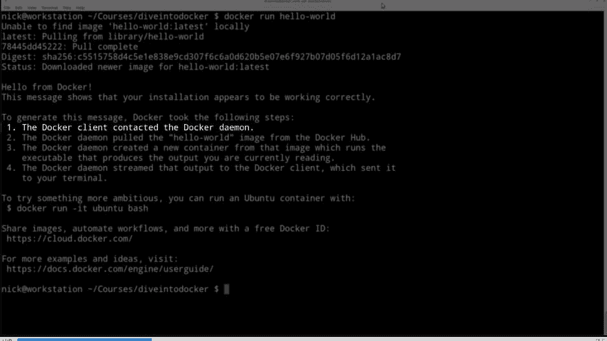
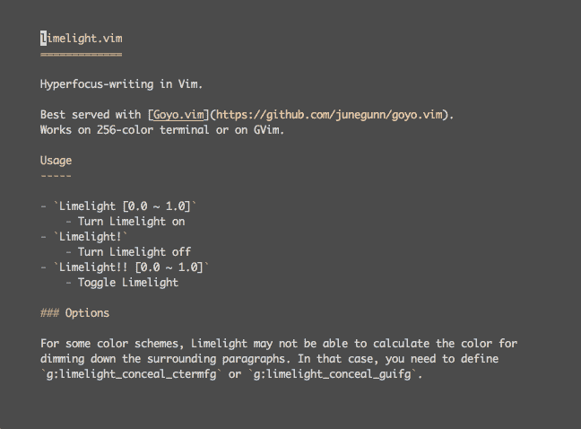

# Vim 在写书和课程时节省了我的工作时间

> 原文：<https://dev.to/nickjj/vim-is-saving-me-hours-of-work-when-writing-books--courses-c56>

**本文最初发布于 2019 年 2 月 12 日:[https://nickjanetakis . com/blog/vim-is-saving-me-hours-of-work-when-writing-books-and-courses](https://nickjanetakis.com/blog/vim-is-saving-me-hours-of-work-when-writing-books-and-courses)**

* * *

当我接近完成我正在学习的课程时，我会努力想办法改进我的工作流程，这样下一个课程就更容易创建了。

这意味着评估一切，从音频和视频硬件，到代码编辑器，甚至是操作系统。

**这篇文章的重点是组织和处理大量文本**。这可以适用于书籍，课程，笔记或任何东西。

在 WSL 中一起使用了终端 Vim + tmux 两个星期后，我已经比以前设置 VSCode 时更有效率了。

tmux 对于那些处理多个项目的人来说尤其有用。我总是在自由开发工作、我的博客、开源项目、兼职项目和课程之间切换。能够点击一个 tmux 热键来切换到任何给定的项目，并且让所有的东西都被立即加载并准备好，这是非常棒的。

我以前用 tmux 和 VSCode 也是这样做的，但是打开 VSCode 并移动到合适的大小总是我必须手动完成的事情。

这听起来可能微不足道，但事实并非如此。每次你这样做的时候，它都会让你陷入一种消极的心态，你认为*“唉，现在我不得不再次视觉化地组织这个”*。

Windows 最大的缺点之一是管理窗口布局是多么的乏味，这很有趣，因为这个操作系统叫做 Windows。自从我在 Linux 上尝试使用 i3 作为窗口管理器后，我就再也回不到其他地方了。

因此，在过去的几周里，我在写我的课程时，一直在寻找在 Windows 中尽可能多地复制 i3 的方法，在 WSL 中使用 terminal Vim 和 tmux 使我更接近于在终端中做任何事情。

所以这是我选择给 Vim 一个机会的主要原因之一。这并不一定是因为 VSCode 作为编辑器的局限性太大，尽管在我真正考虑改进我的课程创建工作流程后，我最终发现它并不合适。

## 创建课程涉及哪些内容？

这是一个数月的投资，相当于写一本书，除了有额外的复杂性，因为你不只是写一些人们会读的东西。

例如，对于一本书，你有一个目录、章节和属于每个章节的文本。您可以用您喜欢的任何格式编写图书，然后在完成后将其导出为 PDF。你只需要担心 PDF 是什么样子的。

一门课程与此非常相似。它有一个目录、章节和课程的表格。这些部分只是对课程进行分组的一种方式，而这些课程是基于文本的脚本，您计划在视频中讲授。

例如，我现在正在学习的课程有 24 个部分和 158 课。每一课大约有 2000 个单词。大约有 300，000 字的课文，课程还没有结束。

这些课程中的每一课最终都将被制作成 2 到 20 分钟长的视频。这实际上取决于那一课写了多少单词。

所以现在来说说我处理的一些问题来组织这个内容。

下面所有的问题都是在我开始使用 Vim 之前我正在做的事情的背景下出现的，最后我将回顾一下我是如何用 Vim 解决这些问题的。

## 处理文件名

我目前的做法是为特定课程创建一个`scripts`文件夹，在该文件夹中，我为每个部分创建单独的文件夹，在这些部分文件夹中，我为每节课创建单独的文件。

看起来是这样的:

```
├── 001-introduction-and-setup
│   ├── 001-welcome.txt
│   ├── 002-downloading-the-starter-files.txt
│   ├── 003-tooling-setup.txt
├── 002-foobar
│   ├── 004-example.txt 
```

换句话说，我用一个数字手动排序每个部分和课程，每个部分的课程编号不会重置。从 1 一直到最后一课。

事情变得更加有趣，因为我也有一个单独的 git repo，它有与特定课程匹配的编号文件夹。课程编号和 git repo 文件夹编号最后对齐非常重要。

但是，正如你可能看到的，当你需要在课程中间增加一课时，这种方法是很糟糕的。想象一下，在数字 50(现在是 51)后添加一课。这意味着你需要在 50 节课之后手动增加 1，这很糟糕。

就这一点而言，几乎不可能事先为一门课程列出最终的目录，因为课程是不可能预测的。

我需要写剧本，边走边玩。在我写完之前，我甚至不会想出一课的标题，因为视频的持续时间很重要，所以一课的字数决定了一课什么时候进入下一课。

为了帮助解决这个问题，我现在通常做的是为每个部分创建一个文件，写出整个部分的所有课程脚本，当我真的很满意时，我会将它分成手动编号的文件。

这就是我现在处理事情的方式。我手动给东西编号，尽量减少以后不得不增加课程的机会。如果我必须添加一个(到目前为止，在本课程中已经发生了两次)，我会硬着头皮手动重命名所有内容。

这种方法的另一个难点是，如果我想更改课程标题，我需要进入文件系统并手动更改文件名。这看起来似乎是一件小事，但它增加了写作过程中的摩擦。确实如此。

最后，在常规的基础上，我总是确保一课很好地进入下一课，所以如果我正在学习第 5 课，我经常打开第 4 课，滚动到文件的底部，阅读我写的内容，然后确保我以自然的方式开始第 5 课。在文件之间跳来跳去。

#### 用我现有的工具潜在地解决这些问题

我曾想过不要对它们进行编号，同时保留一个单独的 YAML 目录文件。然后，我可以编写一个小 Python 脚本来读取 TOC 文件，并在课程结束时对所有章节和课程进行编程编号。

我确信我可以让它工作，但是现在我需要保持一个单独的目录与实际文件同步。处理文件名本身已经够烦人的了，这个解决方案不能解决这个问题。这似乎只是火上浇油。

尽管值得一提的是，与书籍不同，课程不仅仅是一个导出的 PDF 文件。我希望人们能够在我的网站上播放课程，这意味着需要在课程平台的后端创建一个目录。

最终，人们将与之交互，而不是直接与这些脚本文件交互，所以我的开发箱上的这些分区文件夹和课程文件不需要存在。它们只需要编号，这样我就可以在 git repo 中将它们与文件夹编号相关联。

#### 完美世界中的理想方案

如果除了代码编辑器中出现的顺序之外，我不必考虑章节和课程的顺序，那就太好了。

基本上，如果我有一个像这样的课程列表:

1.  欢迎
2.  下载启动文件
3.  工具设置

我只想以人类可读的方式处理课程标题，而不是处理数字。如果我想重命名一节课，它只在那个位置被重命名，如果我想下移一节课，我只需下移一行，课号就会自动更新。

就这一点而言，如果我在中间添加一个新的课程，它下面的所有其他课程的编号都会调整。这也适用于章节号。但是请记住，课程编号将在所有部分中进行索引。每个部分都没有自己单独的课程索引。

我也不想手动创建一个`tooling-setup.txt`文件。

另一件重要的事情是课程隔离。如果我点击进入或展开工具设置课程，我只想看到该课程的文本，但同时，有时我可能想看到上一课或下一课的文本，这样我就可以快速看到它们是如何开始和结束的。

也就是说，这不仅仅是孤立让我保持专注。如果能够跳到课程的开头、中间或结尾，而不是应用于整个部分或课程，那就太好了。尤其是在搜索文本时。

但是就这一点而言，有时能够操作整个课程的文本将会非常方便。例如，我可以搜索像“例如”这样的短语，看看我说了多少次，并尝试使用替代短语使事情听起来不那么系统。

说实话，当我发布视频时，我没有逐字逐句地阅读这些脚本。它们主要是帮助我组织我的想法，但是我在录制视频的时候会用它们作为指导。

#### 用 Vim 解决问题

在我甚至不知道我将要使用什么编辑器和工具之前，我写了上面的理想解决方案。我认为这是一个很好的方法，不仅可以发现问题是什么，还可以发现如何解决问题。

我读过的唯一一本技术书籍是 SICP 的《计算机程序的结构和解释》，在那本书里，他们谈到了一个叫做“一厢情愿”的概念。

在这本书的上下文中，他们讨论了在假设某些库或函数在你编写它们之前就已经存在的情况下设计你的软件。这让您可以专注于设计应用程序的 API，并在以后填充细节。

这就是我在这里所做的，但在不同的背景下。

##### 创建一个 30 万字的大文件:

我开始参考我的理想解决方案来思考这个问题。我的整个问题的一个重要组成部分是处理单个文件名。

那么，为什么不首先删除这些文件，而使用 1 个大文件呢？

我没有一个巨大的文件来测试这一点，但它只花了几秒钟就创建了一个基于我已经有的文件。我刚刚在 WSL 中打开了一个 Bash 提示符并运行了`cat */*.txt > all.md`。

现在我有一个 300，000 字的减价文件，大小大约为 1.5 兆。我决定用我现有的 VSCode 设置和 Vim 打开它。在这两种情况下，我都启用了插件，两个编辑器都有插件来处理 markdown。

令人惊讶的是，VSCode 很快打开了这个文件。它只花了大约 3 秒钟，甚至输入文件感觉就像一个小文件一样快。

然而，在 i5 3.2ghz 四核电脑上，仅打开文件而不做任何事情就占用了我总 CPU 的 50%，打字时则跃升至 65%。

这并不能真正解决问题。这是一个文件，几个月来我每天都要打开它。它无法超越我的整个电脑。顺便说一下，它也使用了 800MB 的内存，但老实说，我不介意太多，因为我有 16GB 的内存。

**于是我在 Vim** 中打开了同一个文件。Vim 花了差不多相同的时间打开，但是它使用了不到 10MB 的 RAM，打开时使用了 0%的 CPU，在文档中间打字时使用了 3-4%的 CPU。

感觉输入和输入小文件一样快。它甚至可以处理输入**用 markdown 开始粗体文本，它是即时的，即使它是粗体的 300，000 个单词。

这是一个比我要求的好得多的结果，尤其是因为 Vim 直接运行在 WSL 内部，而众所周知 WSL 非常慢。我想在原生 Linux 系统上它会更快。

##### 设定现实的最坏情况场景:

如果我有一个 90 万字的文件呢？我真的没有办法在一门课上学到超过 500，000 个单词，但是我觉得看看会发生什么是个好主意。

用 Vim 打开 90 万字花了 10 秒钟，但一旦我进入，一切都和 30 万字的文件一样好。进入和退出插入模式大约有半秒钟的延迟，但这是唯一的区别。RAM 和 CPU 的使用量大致相同。

如果你好奇的话，VSCode 的表现和它处理 30 万个单词的表现差不多。在这种情况下，VSCode 实际上打开文件的速度比 Vim 快得多，但话说回来，这完全是因为 Vim 在 WSL 中运行，而 VSCode 直接在 Windows 中运行。

##### 在单个大文件中浏览章节和课程:

比较 VSCode 已经没有意义了，因为我不打算使用它，所以这里将特别关注 Vim。

vim-markdown 插件非常棒，让这一切变得可行。

**我是一个通常不喜欢代码折叠的人，但代码折叠被证明是这种方法有史以来最好的事情**, vim-markdown 插件为处理基于 markdown 头的折叠提供了一流的支持。

这意味着我可以在关闭所有折叠的情况下打开文件，然后跳到我想要学习的课程，并在几秒钟内展开它。效果很好。

这个插件还支持使用`[[`和`]]`在标题之间跳转，所以我可以很容易地跳到上一课和下一课。

Vim 也知道代码折叠是如何工作的，所以您可以只对打开的折叠执行搜索和操作文本。这给了我从我的理想解决方案中想要的一切，因为如果我想对整个文件采取行动，我可以只按一个热键来展开一切。

此外，在所有这些之上，还有 [fzf.vim](https://github.com/junegunn/fzf.vim) ，它可以让您模糊缓冲区中的搜索行(以及其他内容)。这是寻找短语的绝佳选择。说真的， [junegunn](https://github.com/junegunn) 是一位出色的开发者生产力工具作者。他制作了 FZF 和其他一些工具。

史诗。

##### 编号章节和教训:

vim-markdown 插件碰巧也有一个叫做`:Toc`的便利命令，它会根据你的标题创建一个完整的目录。这个 TOC 是在一个单独的缓冲区中生成的，你甚至可以点击标题跳转到真正的 markdown 文件中的区域。

这种行为正是我想要的。我不需要一直知道课程编号。只有当我想知道计数，或者想把一个课程编号绑定到 Vim 之外的 git 文件夹编号时才需要。

目前插件不支持对 TOC 输出中的标题进行编号，所以我[在 GitHub](https://github.com/plasticboy/vim-markdown/issues/413) 上提出了一个问题，但这个问题目前是可以解决的，只是集成性稍差。

例如，我所有的章节都使用`#`，我所有的课程都使用`##`，所以只需要一点 Bash 魔法就可以解析文件。例如，您可以快速浏览文件并提取以`#`开头的行，现在您有了所有部分的列表，等等..

我还没有想出一个完美的剧本，但我 100%肯定这是可能的，这是我现在唯一关心的。谁知道呢，等我完成我目前的课程，也许 vim-markdown 的作者会把这个嵌入到他的插件中。

##### 提高大文件的滚动速度:

在 WSL 中，我注意到相对行号，即使是 100 行的小文件滚动起来也很慢。我们说的是在滚动和看到光标移动之间有几秒钟的延迟。

原来相对行号是主要原因，但我不想失去它们。在应用了下面的两个设置后，滚动速度又变快了，即使是在一个 90 万字的文件中。看到一个超过 100，000 行的文件很有趣。

```
set lazyredraw
set regexpengine=1 
```

##### 加速码折叠:

默认情况下，300，000 字文件中的代码折叠慢得令人无法忍受。即使只是打开文件也使它几乎无法使用，但是经过一点点研究，我发现了一个运行良好的插件。

将 [FastFold](https://github.com/Konfekt/FastFold) 插件添加到我的 vimrc 中，立即修复了这个问题。从不能用变成了牛逼。基本上是褶皱更新了就变了。

说到 vimrc 文件，如果你想查看我的整个配置，它在 GitHub 上我的[点文件报告](https://github.com/nickjj/dotfiles)中。

## 给未经编辑的截屏添加润色

当涉及到创建编程等技术主题的课程时，您会发现自己花了很多时间来编写代码编辑器。

这是你看视频、写代码和解释代码的地方。

录制时，我经常使用非常大的字体和明显的光标，这样更容易理解我在说什么，但最近我开始做的一件事是在录制视频后添加特殊效果来强调文本。

[](https://res.cloudinary.com/practicaldev/image/fetch/s--bcr9whF4--/c_limit%2Cf_auto%2Cfl_progressive%2Cq_auto%2Cw_880/https://nickjanetakis.com/assets/blog/post-production-highlight-text-e2ce658d64b02568810f4e27fc4bd0421a2d620ae9e220bc40aeb0af04a6cdb6.jpg)

例如，在我录制完视频后，在编辑阶段，我通常会将屏幕的大部分变暗，并突出显示代码的特定区域，以使我们谈论的内容更加清晰。

我让很多人说他们真的很喜欢这种效果，很多人说我的[钻研 Docker 课程](https://diveintodocker.com/?utm_source=nj&utm_medium=devto&utm_campaign=vim-saving-hours)是他们上过的最高制作质量的课程。

然而，这种生产质量是有代价的。浏览数小时的视频并手动突出显示我想要的区域需要很长时间。

恰好 Vim 有一个插件叫做[limeline . Vim](https://github.com/junegunn/limelight.vim)可以让你实时做到这一点。它是由《FZF》的作者写的。

[](https://camo.githubusercontent.com/fa4e9321be0b4a565ae84a66bae36e97545c101b/68747470733a2f2f7261772e6769746875622e636f6d2f6a756e6567756e6e2f692f6d61737465722f6c696d656c696768742e676966)

它会自动突出显示光标所在的区域，你可以调整暗颜色和不透明度，这样你就可以让它在任何颜色主题下看起来都很棒。

这意味着我可以打开聚光灯，而不必在后期制作编辑中手动添加调光和高光。仅此一项就节省了几个小时。目前，VSCode 还没有类似的东西，但我认为它是可以制造出来的。我知道有一个 Emacs 端口。

当我准备好录制我即将开始的课程时，我会尝试一下。

最后，我真的很高兴给了维姆第二次机会。我很久以前就放弃了它，但是现在它已经成为我编写代码和创建课程的工具链中最重要的工具之一。预计未来会有更多的 Vim 帖子出现。

你有什么写作的小窍门？下面让我知道。