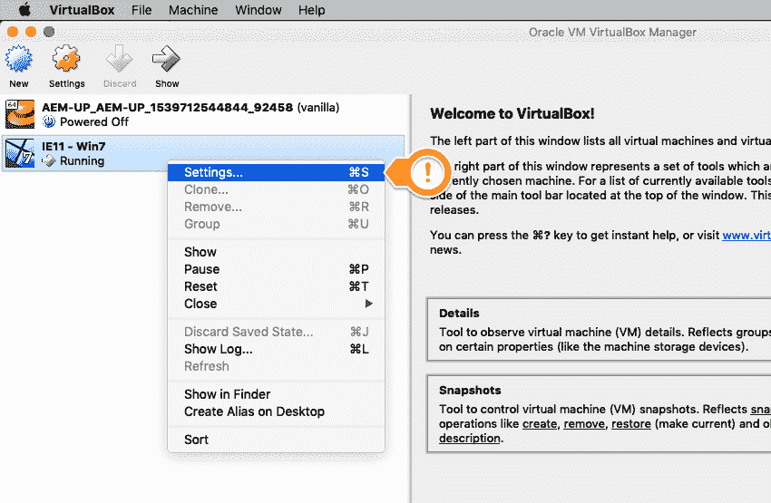
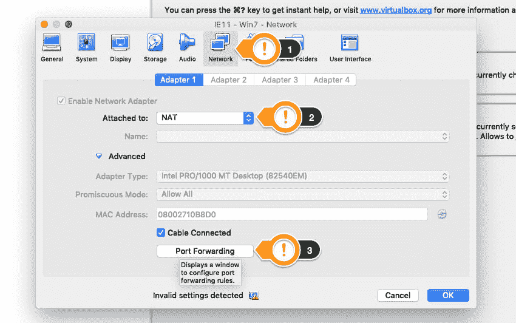
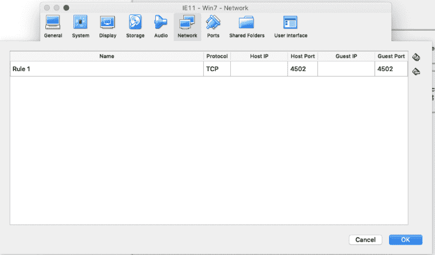

# VirtualBox:如何从来宾访问主机端口

> 原文：<https://dev.to/ahmedmusallam/virtualbox-how-to-access-host-port-from-guest-i6n>

> 最初发布在[我的网站](https://ahmedmusallam.com/blog/virtualbox-how-to-access-host-port-from-guest/)

我总是在 Mac 电脑上工作，但有时我需要调试一个只影响 windows 电脑，尤其是 IE 的问题。为此，我通常使用带有微软免费虚拟机[的](https://developer.microsoft.com/en-us/microsoft-edge/tools/vms/) [VirtualBox](https://www.virtualbox.org/) 进行调试。

我从来不记得如何从我的 Windows 虚拟机访问运行在我的 Mac 上的服务器。所以我写这个，为了我自己。我想你也是！

## 端口转发

*   关闭您的虚拟机
*   打开虚拟机的`settings`并选择`network`
*   确保`Attached to`下拉菜单设置为`NAT`
*   展开`Advanced`
*   点击`Port Forwarding`
*   添加新规则。在我的例子中，我想将我的客户机上的端口`4502`转发到我的主机上的端口`4502`。将 IP 字段留空

## 查找您的主机本地 IP

现在你需要找到你的路由器分配给你的主机(Mac)本地 IP，这通常从`192`开始

你可以在 MacOs 中找到这个按照这个 [SO 回答](https://apple.stackexchange.com/a/212207/255822)点 **#3**

基本上，运行以下命令之一来获取您的本地 IP:

> *   `ipconfig getifaddr en0` If the connection is made through wireless connection.
> *   `ipconfig getifaddr en1` If connected via Ethernet.
> *   `ipconfig getifaddr en3` If connected through Thunderbolt-to-ethernet adapter.

## 从您的客户访问运行在您主机上的服务器

现在您已经有了 IP，您可以使用它从您的来宾虚拟机访问转发的端口。

在我的例子中，主机的 IP 原来是`192.168.10.20`，所以在我的 windows VM 中，我可以访问 URL: `http://192.168.10.20:4502`！