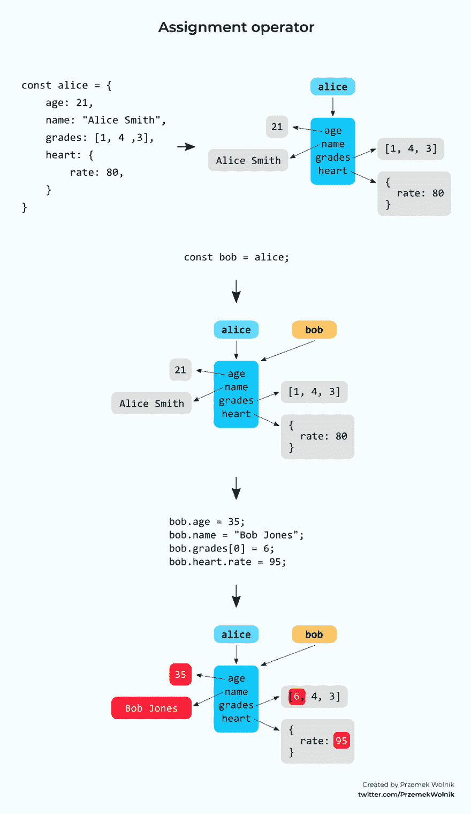
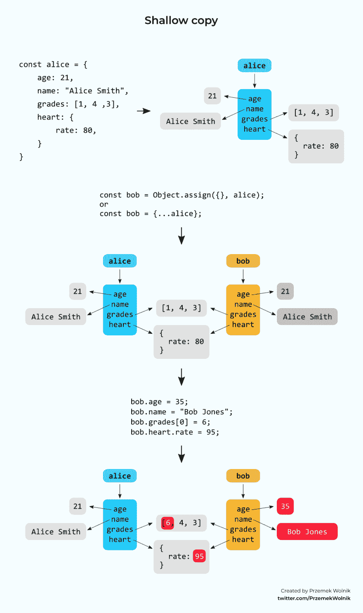
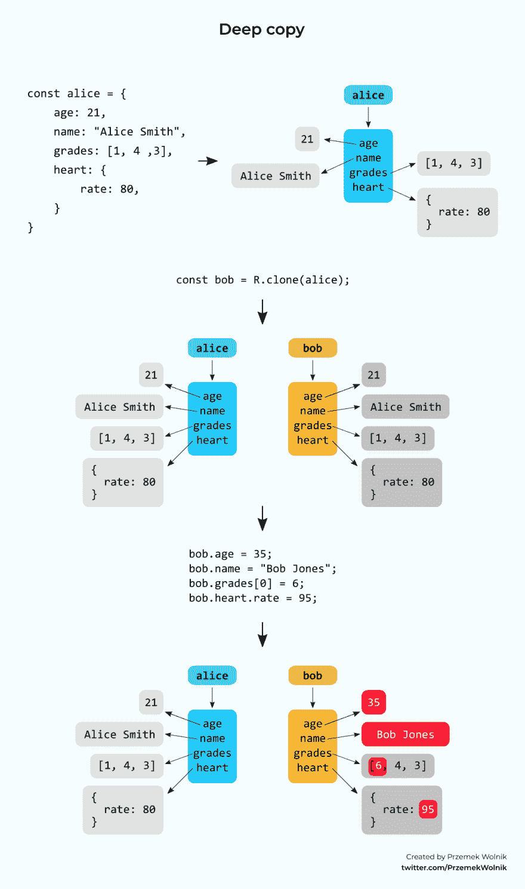

# 为什么抄袭会很棘手？

> 原文：<https://dev.to/przemwo/visual-comparison-between-shallow-copy-deep-copy-and-assignment-operator-575d>

在每个程序员的一生中，都有那么一个时刻，你必须回到基础。两天前，当我想做出不同的反应时，我有了这样的想法。组件和**做出反应。PureComponent** 出现在脑海中。这次回归的结果就是这篇短文。

## JavaScript 中复制的陷阱

用 JavaScript 复制对象可能会令人惊讶。举例？给您

这是关于我的车 ***超级跑车*** :
的信息

```
const myCar = {
    make: "SuperCar",
    year: 2016,
    details: {
        color: "blue"
    }
}; 
```

你买了一辆新车(还有 ***超跑*** )，想用`myCar`作为模板保存相关信息。你知道简单的赋值操作符不是一个好的选择。这就是为什么你使用对象扩展操作符并写:

```
const yourCar = {...myCar}; 
```

然后你完成关于**你的**车:
的相关数据

```
yourCar.year = 2019;
yourCar.details.color = "red";

console.log(yourCar.make); // "SuperCar"
console.log(yourCar.year); // prints 2019
console.log(yourCar.details.color); // prints "red" 
```

一切似乎都运转正常。直到我试着写关于我的车
的数据

```
console.log(myCar.make); // "SuperCar"
console.log(myCar.year); // prints 2016
console.log(myCar.details.color); // prints "red" ?! WRONG!!! 
```

发生了什么事？通过创建`yourCar`，我们做了`myCar`的**浅拷贝**。保存原始值的变量(例如`numbers`、`strings`)实际上是被复制的。然而，对于那些存储复杂数据的对象(`objects`)，只复制对相同对象的引用。

这个机制的详细描述你可以在这里找到[。](https://medium.freecodecamp.org/copying-stuff-in-javascript-how-to-differentiate-between-deep-and-shallow-copies-b6d8c1ef09cd)

下面我将展示一个可视化的备忘单，展示这个机制在 JavaScript 中是如何工作的。每当我不得不重新思考它是如何工作的时候，我都会回到这篇文章。我希望你也会觉得有用。

## 例子

所有示例都基于相同的任务。我创建了`alice`对象。然后我在`alice`的基础上创建了`bob`对象。我用这个:

1 **赋值操作符**
2 `Object.assign`方法(或**对象传播操作符** )
3 `clone`方法来自 [Ramda 库](https://ramdajs.com/docs/#clone)

### 1。赋值运算符

赋值运算符创建对同一对象的引用:

[](https://res.cloudinary.com/practicaldev/image/fetch/s--ln0hZB_o--/c_limit%2Cf_auto%2Cfl_progressive%2Cq_auto%2Cw_880/https://user-images.githubusercontent.com/7883624/58387097-f9789100-8009-11e9-84a5-2844172014d6.png)

你可以在这里玩代码:
[](https://codesandbox.io/s/blissful-jepsen-ivzn7?expanddevtools=1&fontsize=14&hidenavigation=1&moduleview=1)

### 2。Object.assign /对象扩展运算符

`Object.assign`创建对象的浅层副本:

[](https://res.cloudinary.com/practicaldev/image/fetch/s--J0fzxomh--/c_limit%2Cf_auto%2Cfl_progressive%2Cq_auto%2Cw_880/https://user-images.githubusercontent.com/7883624/58387297-be2b9180-800c-11e9-9a6c-11f8f9ddb129.png)

[](https://codesandbox.io/s/empty-dew-6eb6v?fontsize=14)

### 3。拉姆达克隆

`R.clone`创建对象的深层副本:

[](https://res.cloudinary.com/practicaldev/image/fetch/s--MeEYtUlT--/c_limit%2Cf_auto%2Cfl_progressive%2Cq_auto%2Cw_880/https://user-images.githubusercontent.com/7883624/58387320-15316680-800d-11e9-8adb-60a7948862f5.png)

[](https://codesandbox.io/s/musing-rgb-rm291?fontsize=14)

* * *

感谢阅读！如果你喜欢这个，让我知道！发表评论，给一个❤️或分享它！

随意查看我的 [Twitter](https://twitter.com/PrzemekWolnik) 账号，有更多这样的内容。