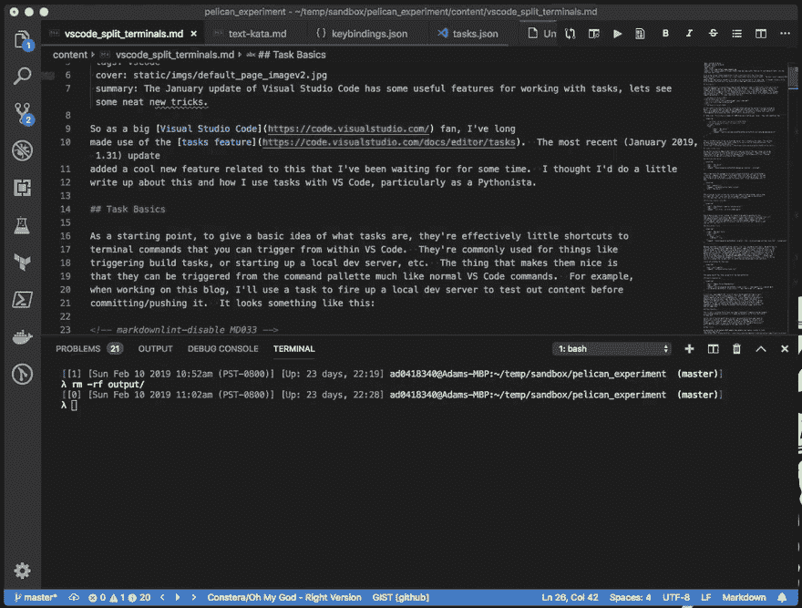

# Visual Studio 代码任务和拆分终端

> 原文：<https://dev.to/pzelnip/visual-studio-code-tasks-and-split-terminals-2ghk>

*本帖原帖发布于 2019 年 2 月 10 日[https://www . codependentcodr . com/visual-studio-code-tasks-and-split-terminals . html # visual-studio-code-tasks-and-split-terminals](https://www.codependentcodr.com/visual-studio-code-tasks-and-split-terminals.html#visual-studio-code-tasks-and-split-terminals)T3】*

所以作为一个 Visual Studio 代码的忠实粉丝，我一直在使用[的任务特性](https://code.visualstudio.com/docs/editor/tasks)。最近的(2019 年 1 月，1.31)更新增加了一个与此相关的很酷的新功能，我已经等了一段时间了。我想我应该写一点关于这个以及我如何使用 VS 代码的任务，特别是作为一个 Pythonista。

## 任务基础知识

首先，为了给出什么是任务的基本概念，它们是可以从 VS 代码中触发的终端命令的有效快捷方式。它们通常用于触发构建任务，或者启动本地开发服务器等。它们的优点是可以从命令面板中触发，就像普通的代码命令一样。例如，在撰写这个博客时，我将使用一个任务来启动一个本地开发服务器，以便在提交/推送内容之前测试内容。它看起来像这样:

<video loop="" controls=""><source src="https://www.codependentcodr.com/static/vids/vscodetask2.mp4" type="video/mp4"> </video> 

此时，我可以转到 [http://localhost:8000](http://localhost:8000) 并查看我正在处理的内容。方便。要创建一个任务，你打开命令面板并选择“任务:配置任务”,你会得到一些默认模板任务的提示，或者选择“从模板创建 tasks.json 文件”,这给你完全的控制权，也是我使用的选项。

一个`tasks.json`文件包含许多定义您的任务的 JSON blobs。它们看起来像:

```
{
    // See https://go.microsoft.com/fwlink/?LinkId=733558
    // for the documentation about the tasks.json format
    "version": "2.0.0",
    "tasks": [
        {
            "label": "Run Server",
            "type": "shell",
            "command": "source $(dirname ${config:python.pythonPath})/activate && make devserver"
        },
    ]
} 
```

Enter fullscreen mode Exit fullscreen mode

这是我在视频中展示的运行本地开发服务器的定义。您可以拥有任意多的任务，`tasks`属性只是这些定义的列表。微软优秀文档中的
[是属性和选项的完整列表。](https://code.visualstudio.com/docs/editor/tasks#_custom-tasks)

## 常见的 Python 任务

现在我们对什么是任务有了一个概念，特别是从 Python 开发者的角度来看，你可以用它们做些什么呢？这些是我建立的一些常见的框架，其中大部分都与 Django 相关，因为我的大部分日常工作都是在这个框架下进行的:

### 运行开发服务器

```
{
    "label": "Run Server",
    "type": "shell",
    "command": "${config:python.pythonPath} manage.py runserver --noreload",
}, 
```

Enter fullscreen mode Exit fullscreen mode

这基本上类似于我之前展示的任务，只是使用了 Django 的`runserver`命令。有一点需要注意:注意这个标签和我的博客项目的标签是一样的。文件是按项目存储的，但是你可以给一个给定的任务分配一个热键。在我的`keybindings.json`中我的
有:

```
{
    "key": "cmd+shift+r",
    "command": "workbench.action.tasks.runTask",
    "args": "Run Server"
}, 
```

Enter fullscreen mode Exit fullscreen mode

这允许我通过简单地点击一个热键来启动一个本地开发服务器，并且只要我在每个项目中将“启动一个本地开发环境”任务命名为相同的，就可以通过相同的按键来启动一个本地开发环境。

### 点击健康检查网址

```
{
    "label": "Healthcheck (requires running server)",
    "type": "shell",
    "command": "curl http://127.0.0.1:6100/health"
}, 
```

Enter fullscreen mode Exit fullscreen mode

一旦我运行了一个本地服务器，就可以很方便地快速点击
[健康检查](https://microservices.io/patterns/observability/health-check-api.html) url(你在你的 API 中添加了健康检查，对吗？).同样，这很小，但是很方便，因为它省去了我切换到终端窗口、输入`curl`命令、意识到这个项目运行在不同的端口上、去查找那个端口等等的麻烦。

### 运行单元测试

```
{
    "label": "Run Unit Tests",
    "type": "shell",
    "group": {
        "kind": "test",
        "isDefault": true
    },
    "command": "${config:python.pythonPath} -m pytest -rxXs --ds=projectname.settings.local_test --random-order"
}, 
```

Enter fullscreen mode Exit fullscreen mode

只要有可能，我就使用 [pytest](https://pytest.org/) 来运行我的单元测试。通常这是从命令行运行的，类似于`pytest <name of directory containing tests>`。问题是 pytest 被安装到一个虚拟环境中，那么我如何给出虚拟环境的完整路径而不使任务机器特定呢？答案是我将它作为一个模块运行，并且只使用`config:python.pythonPath`变量来引用当前的 Python 环境。其他选项是我提供给 pytest 的一些常见选项，例如`--ds`开关用于指定`DJANGO_SETTINGS_MODULE`环境变量。`--random-order`使用 [Pytest 随机顺序插件](https://pypi.org/project/pytest-random-order/)在每次测试运行中以随机顺序运行测试(它在我的代码/测试中发现了错误)。

我还为这个任务设置了一个热键:

```
{
    "key": "shift+cmd+f11",
    "command": "workbench.action.tasks.test"
}, 
```

Enter fullscreen mode Exit fullscreen mode

这利用了任务定义的`kind`属性。

### 更新依赖关系

```
{
    "label": "Update Python Dependencies",
    "type": "shell",
    "command": "${config:python.pythonPath} -m pip install -r requirements.txt --upgrade && ${config:python.pythonPath} -m pip install -r requirements-dev.txt --upgrade"
}, 
```

Enter fullscreen mode Exit fullscreen mode

我现在还在用`requirements.txt`文件(我真的应该花时间去学习 [pipenv](https://github.com/pypa/pipenv) ，但是唉)。通过这项任务，我可以快速更新我的项目的所有依赖项。我还将项目的依赖项和项目的开发依赖项(比如 pytest 或 pylint)分离到单独的文件中。这样做的原因是，我可以让我的开发依赖项“浮动”,并且我工作的大多数项目也在一天结束时构建 Docker 映像，因此分离依赖项允许我只将运行项目所需的依赖项安装到 Docker 映像中，这减少了映像的大小。

### 许多许多更

这只是皮毛，任何时候我发现自己经常在一个项目的终端窗口中运行命令，我都会花一分钟左右的时间把它变成一个 VS 代码任务。

最后，这里的一个关键点是，我对我参与的任何项目都执行基本相同的任务，我只是针对特定的项目调整特定的命令。这为我创建了一个通用/熟悉的工作流，不管它是 Django 项目、Flask，还是完全不同的技术(我有一个带有 REST API 的 Java 项目，我为此创建了许多相同的任务)。

## 新花样

如上所述，在 2019 年 1 月的更新中，他们增加了一个与我非常喜欢的任务相关的新功能:[任务输出分割终端](https://code.visualstudio.com/updates/v1_31#_task-output-support-split-terminals)

这允许您将一个任务衍生到另一个(已经运行的)任务的分割终端窗口中。当您有一个运行开发服务器的任务和另一个跟踪服务器日志文件的任务时，这真的很方便，因为您可以让它们并排出现在集成终端中。

这对于我工作的一个项目特别有用，我有一个基于 Django 的服务器，它通过套接字连接与另一个本地 dev 服务器对话。以前我为这两个设置了任务，我必须单独启动每一个，并在多个终端窗口之间切换以查看每个窗口的输出。现在，我可以让它们在一个视图中并排显示。其工作方式是在任务的`presentation`属性中共享同一个`group`属性:

```
{
    "label": "Run Server",
    "type": "shell",
    "command": "${config:python.pythonPath} manage.py runserver --noreload",
    "presentation": {
        "group": "groupServerStuff"
    }
}, 
```

Enter fullscreen mode Exit fullscreen mode

同一组的所有任务将在同一终端窗口中作为另一个拆分的终端面板打开。非常好。

这让我想到:有没有一种方法可以让任务“调用”或“衍生”其他任务，而不是单独开始每个任务？而事实证明是有的:

```
{
    "label": "Run Server",
    "dependsOn": [
        "Run TCP Server",
        "Run Django Server",
        "Tail Log File"
    ]
},
{
    "label": "Run Django Server",
    "type": "shell",
    "command": "${config:python.pythonPath} manage.py runserver --noreload",
    "presentation": {
        "group": "groupServerStuff"
    }
},
{
    "label": "Run TCP Server",
    "type": "shell",
    "command": "${config:python.pythonPath} scripts/tcp_server.py",
    "presentation": {
        "group": "groupServerStuff"
    }
},
{
    "label": "Tail Log File",
    "type": "shell",
    "command": "tail -f /tmp/logfile.txt",
    "presentation": {
        "group": "groupServerStuff"
    }
}, 
```

Enter fullscreen mode Exit fullscreen mode

看看那个`Run Server`任务——它衍生出了我定义的另外三个任务:“运行 Django 服务器”(这是我之前的“运行服务器”任务)、“运行 TCP 服务器”(模拟的套接字服务器)和“尾日志文件”，它只是跟踪 Django 正在记录的日志文件。

当然，因为它被称为`Run Server`，我之前定义的热键将会产生一个新的终端窗口，随着这些任务的运行分成三部分。只需轻轻一击。这是非常强大的东西！

无论如何，我希望这是对 VS 代码中任务的有用概述。你对它们有什么创造性的用途吗？让我在评论中知道！