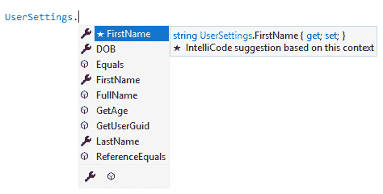
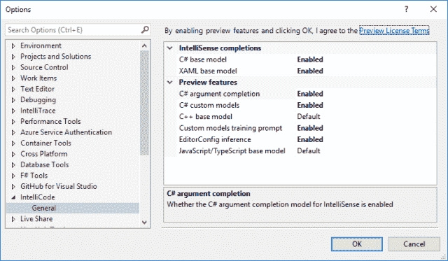
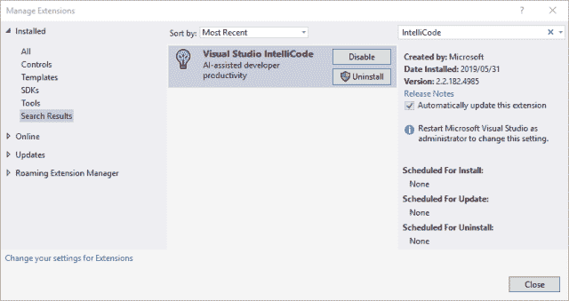
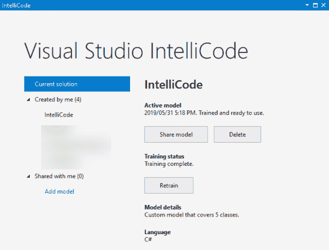

# visual Studio intelli Code–为您的代码提供人工智能

> 原文：<https://dev.to/dirkstrauss/visual-studio-intellicode-ai-for-your-code-68a>

Visual Studio IntelliCode 允许您将人工智能的强大功能添加到代码中。启用 IntelliCode 非常简单，我将向您展示如何做到这一点。

## 找别的？请尝试以下链接:

*   [用 C#扩展方法很容易](https://dev.to/dirkstrauss/extension-methods-are-easy-with-c-235d)
*   [与冒名顶替综合征作斗争？如何思考和克服](https://dirkstrauss.com/struggling-with-imposter-syndrome-think-overcome/)
*   灵活的工作时间——你可以在家工作！
*   [提高代码技能？考虑写博客](https://dirkstrauss.com/improve-code-skills-consider-blogging/)
*   [使用 DevOps 和 Wunderlist 实现 Trello 自动化](https://dirkstrauss.com/automate-trello-using-devops-wunderlist/)

如果你时间有点紧，去看看关于这个话题的视频讲解。

这应该能让你很快上手。如果您喜欢该视频，请考虑订阅该频道，并为该视频竖起大拇指。

## Visual Studio IntelliCode 解释

IntelliCode 是对 Visual Studio 的一个超级令人兴奋的补充。[微软称之为 AI 辅助开发](https://visualstudio.microsoft.com/services/intellicode/)。把你最有可能用到的东西放在完成清单的最前面会节省你的时间。这些建议显示为带星号的建议。

[](https://res.cloudinary.com/practicaldev/image/fetch/s--IxQhzVJQ--/c_limit%2Cf_auto%2Cfl_progressive%2Cq_auto%2Cw_880/https://i1.wp.com/dirkstrauss.com/wp-content/uploads/2019/06/intellicode.png%3Fw%3D640%26ssl%3D1)

IntelliCode 使用 100 星或以上的开源 GitHub 项目为您的代码生成建议。IntelliCode 还将构建一个自定义模型，从您的源代码中提供建议。这些是来自你自己的类的方法或者特定领域的库调用。

注意:默认情况下，IntelliCode 功能是关闭的。要启用这些功能，请进入**工具** > **选项** > **智能代码**并启用这些功能。

[](https://res.cloudinary.com/practicaldev/image/fetch/s--kQi5cBzU--/c_limit%2Cf_auto%2Cfl_progressive%2Cq_auto%2Cw_880/https://i2.wp.com/dirkstrauss.com/wp-content/uploads/2019/06/intellicode-options.png%3Fw%3D640%26ssl%3D1)

这将为您的项目启用 IntelliCode。

## 安装 Visual Studio IntelliCode

如果你还没有安装 IntelliCode，直接到**扩展** > **管理扩展**窗口下载并安装它。

[](https://res.cloudinary.com/practicaldev/image/fetch/s---sfWW5GE--/c_limit%2Cf_auto%2Cfl_progressive%2Cq_auto%2Cw_880/https://i0.wp.com/dirkstrauss.com/wp-content/uploads/2019/06/intellicode-installation.png%3Fw%3D640%26ssl%3D1)

下载后，您需要重新启动 Visual Studio 才能安装 IntelliCode。

## 构建智能代码模型

在 Visual Studio 2019 中，点击 **Ctrl+Q** 并在搜索窗口中键入 **IntelliCode** 。从结果中选择 **IntelliCode 模型管理**或转到**视图** > **其他窗口** > **IntelliCode 模型管理**以访问 Visual Studio IntelliCode 窗口。

[](https://res.cloudinary.com/practicaldev/image/fetch/s--IllwTK1L--/c_limit%2Cf_auto%2Cfl_progressive%2Cq_auto%2Cw_880/https://i2.wp.com/dirkstrauss.com/wp-content/uploads/2019/06/visual-studio-intellicode.png%3Fw%3D640%26ssl%3D1)

从这里，您可以为您的项目构建 IntelliCode 模型。您可以看到与您共享的模型，共享您刚刚构建的模型，重新培训或删除 IntelliCode 模型。

## 可以在我的代码中使用吗？

在这篇文章发表时，IntelliCode 可以在 Visual Studio 2017(15.8 及更高版本)以及 Visual Studio 2019 中运行。它还支持以下语言:

*   C#
*   C++
*   XAML(在 Visual Studio 2019 中)

IntelliCode 也适用于 Visual Studio 代码，并支持:

*   计算机编程语言
*   以打字打的文件
*   Java Script 语言
*   Java 语言(一种计算机语言，尤用于创建网站)

微软正在将人工智能的优点带到 Visual Studio 代码中。这真是太棒了！

## 查看提取的数据

在你生成了你的模型之后，你可以转到下面的文件夹:

```
 %TEMP%\Visual Studio IntelliCode 
```

Enter fullscreen mode Exit fullscreen mode

在这里，您应该会在其中一个创建的文件夹中看到一个 **UsageOutput** 文件夹。寻找一个用法 JSON 文件。这是提取数据的内容。代码分析都发生在客户端。这种数据提取然后被馈送到微软的模型服务，该模型服务被上传到云中的服务。

需要注意的是，微软不会收到你的任何代码。它只上传关于你的代码的数据和信息。所以你的代码保留在你的机器上。

## 获取源代码

如果您想获得这篇博客文章中使用的代码的工作示例，请前往下面的 GitHub repo，并将该 repo 克隆到您的本地机器上。

[dirkstrauss/IntelliCodeDemo](https://github.com/dirkstrauss/IntelliCodeDemo)

如果您有任何意见或建议，请随时在下面的评论区提出。试一试，看看 IntelliCode 能为您做些什么！

帖子[Visual Studio IntelliCode–AI For your Code](https://dirkstrauss.com/visual-studio-intellicode/)首先出现在[编程和技术博客](https://dirkstrauss.com)上。