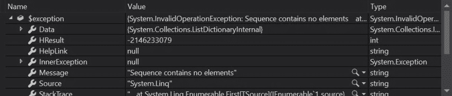

# Visual Studio 提示-查看未捕获的异常

> 原文：<https://dev.to/hutchcodes/visual-studio-tips-view-uncaptured-exception-49m8>

有没有这样的代码，你捕捉一个异常，因为要处理它，但你不需要使用异常本身？也许只需要知道异常类型就足够了。但是后来你有时候想边调试边看？

以前我只是捕获异常，并忍受关于未使用变量的警告，但现在我这样做了。

第一，我说抓到但没抓到是什么意思？在下面的代码中，我捕捉到了试图从空集合中获取第一项时抛出的`InvalidOperationException`。但是我没有捕捉到变量中的异常。

```
var foo = new List<string>();

string bar;
try
{
    bar = foo.First();
}
catch (InvalidOperationException)
{
    //Do something like logging or retry
    bar = null;
} 
```

不需要修改代码，我们可以通过查看包含最近异常值的`$exception`伪变量的内容来查看异常。您可以通过将该值添加到监视列表中或在即时窗口中对其进行评估来获取该值。

[](https://res.cloudinary.com/practicaldev/image/fetch/s--fWywR7HE--/c_limit%2Cf_auto%2Cfl_progressive%2Cq_auto%2Cw_880/https://hutchcodes.net/img/2019/UncapturedExceptionWatch.jpg)