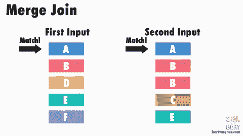
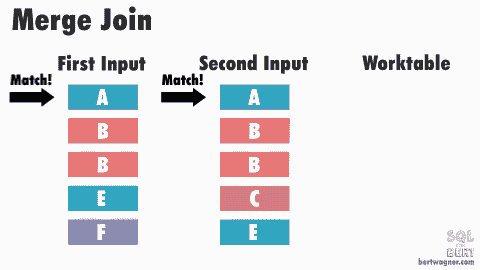

# 可视化合并连接内部并理解其含义

> 原文：<https://dev.to/bertwagner/visualizing-merge-join-internals-and-understanding-their-implications-26nf>

*这篇文章是关于物理连接操作符的系列文章的第 2 部分(请务必查看[第 1 部分——嵌套循环连接](https://dev.to/bertwagner/visualizing-nested-loops-joins-and-understanding-their-implications-130d)，以及[第 3 部分——散列匹配连接](https://bertwagner.com/2019/01/02/visualizing-hash-match-join-internals-and-understanding-their-implications/))。*

[https://www.youtube.com/embed/IFUB8iw46RI](https://www.youtube.com/embed/IFUB8iw46RI)

理论上，合并连接是最快的*物理连接操作符，但是它们要求对来自两个输入的数据进行排序:

[](https://res.cloudinary.com/practicaldev/image/fetch/s--SdGnTwil--/c_limit%2Cf_auto%2Cfl_progressive%2Cq_66%2Cw_880/https://bertwagner.com/wp-content/uploads/2018/12/Merge-Join-1.gif)

基本算法的工作方式如下:SQL Server 比较两个排序输入的前几行。然后，只要值与第一个输入的值匹配，它就继续比较第二个输入的下一行。

一旦这些值不再匹配，SQL Server 将递增具有较小值的输入的行，然后继续执行比较并输出任何连接的记录。(要了解更多详细信息，请务必查看 Craig Freedman 关于合并加入的帖子。)

这是有效的，因为在大多数情况下，SQL Server 不必返回并多次读取任何行。当两个输入表中都存在重复值时(或者更确切地说，SQL Server 没有元数据来证明两个表中都不存在重复值*和*),并且 SQL Server 必须执行多对多合并连接时，就会出现例外:

[](https://res.cloudinary.com/practicaldev/image/fetch/s--j_qhCFYd--/c_limit%2Cf_auto%2Cfl_progressive%2Cq_66%2Cw_880/https://bertwagner.com/wp-content/uploads/2018/12/Merge-Join-many-to-many.gif)

*注意:上面的图片和下面的解释对于理解这个过程的实际用途来说已经“足够好了”——如果你想深入了解前瞻缓冲区、优化和这个过程的其他内部工作方式，我强烈推荐你通读一下[雨果·科尔内利斯关于合并连接的参考资料](https://sqlserverfast.com/epr/merge-join/)。*

多对多联接强制 SQL Server 将第二个表中的任何重复值写入 tempdb 的工作表中，并在那里进行比较。如果这些重复值在第一个表中也是重复的，SQL Server 会将第一个表的值与已经存储在工作表中的值进行比较。

## 归并联接揭示了什么？

了解合并连接的内部工作原理可以让我们推断出优化器对我们的数据和连接的上游操作符的看法，帮助我们集中精力进行性能调优。

下一次在执行计划中看到使用合并联接时，可以考虑以下几种情况:

*   当输入数据已经排序或者 SQL Server 可以以足够低的成本对数据进行排序时，优化器会选择使用合并联接。此外，优化器在计算合并连接的成本时相当悲观([Joe Obbish](https://dba.stackexchange.com/a/166054)的精彩解释)，所以如果合并连接进入了您的计划，这可能意味着它相当高效。

*   虽然合并连接可能是有效的，但它总是值得看一看**为什么**进入合并连接操作符的数据已经被排序:

    *   如果排序是因为合并连接直接从按连接键排序的索引中提取数据，那么就没什么好担心的了。
    *   但是，如果优化器向上游合并连接添加了一个排序，那么可能值得研究一下是否有可能对该数据进行预排序，这样 SQL Server 就不需要自己对其进行排序。这通常很简单，只需将包含的索引列重新定义为键列—如果您将它作为索引中的最后一个键列添加，那么回归影响通常很小，但是您可以允许 SQL Server 使用合并联接，而不需要任何额外的排序。
*   如果您的输入包含许多重复项，那么可能需要检查合并连接是否真的是最有效的连接操作符。如上所述，多对多合并连接需要使用 tempdb，这可能会成为瓶颈！

因此，虽然合并连接通常不是执行计划中的高成本问题点，但调查上游操作符以查看是否可以进行一些额外的改进总是值得的。

*注:规则总有例外。合并联接具有最快的算法，因为每一行只需要从源输入中读取一次。此外，在某些情况下，其他连接操作符中发生的优化可以为这些操作符提供更好的性能。

例如，由于内部循环联接的优化，具有使用嵌套循环联接的索引内部表的单行外部表将优于使用合并联接的相同设置:

```
DROP TABLE IF EXISTS T1;
GO
CREATE TABLE T1 (Id int identity PRIMARY KEY, Col1 CHAR(1000));
GO

INSERT INTO T1 VALUES('');
GO

DROP TABLE IF EXISTS T2;
GO
CREATE TABLE T2 (Id int identity PRIMARY KEY, Col1 CHAR(1000));
GO

INSERT INTO T2 VALUES('');
GO 100

-- Turn on execution plans and check actual rows for T2
SELECT *
FROM T1 INNER LOOP JOIN T2 ON T1.Id = T2.Id;

SELECT *
FROM T1 INNER MERGE JOIN T2 ON T1.Id = T2.Id; 
```

还可能存在这样的情况，即具有许多需要工作表的重复记录的输入可能比嵌套循环连接慢。

正如我提到的，在现实世界中遇到合并连接时，我通常会发现这些类型的场景是例外。

*感谢阅读。你可能也会喜欢在 Twitter 上关注我。T3】*