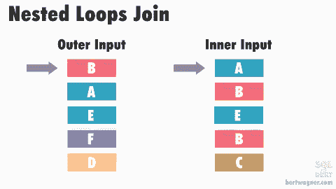
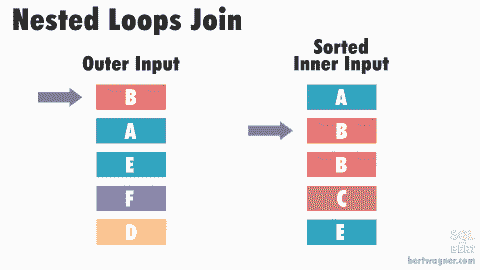

# 可视化嵌套循环连接并理解其含义

> 原文：<https://dev.to/bertwagner/visualizing-nested-loops-joins-and-understanding-their-implications-130d>

## 物理连接运算符告诉我们什么

在对慢速 SQL 查询进行性能调优时，每个人都有自己读取执行计划的方法。我首先想看的是使用了哪种连接操作符:

这三个小图标可能看起来不像是开始对缓慢的查询进行故障排除的最明显的地方，但是对于更大的计划，我特别喜欢从快速浏览连接运算符开始，因为它们允许您推断出 SQL Server 对您的数据的看法。

这将是一个由三部分组成的系列，我们将学习每个连接算法是如何工作的，以及它们可以揭示我们的上游执行计划操作符的什么。

[https://www.youtube.com/embed/0arjvMJihJo](https://www.youtube.com/embed/0arjvMJihJo)

## 嵌套循环连接

嵌套循环联接的工作方式如下:SQL Server 从我们的第一个表(我们的“外部”表–[默认情况下，SQL Server 为我们决定这两个表中的哪一个将是](https://bertwagner.com/2017/11/21/does-the-join-order-of-my-tables-matter/))中获取第一个值，并将其与我们的第二个“内部”表中的每个值进行比较，以查看它们是否匹配。

检查完每个内部值后，SQL Server 将移动到外部表中的下一个值，并重复该过程，直到外部表中的每个值都与内部表中的每个值进行了比较。

该描述是嵌套循环连接性能的最差示例。有几种优化可以使连接更有效。例如，如果对内部表联接值进行排序(由于您创建的索引或 SQL Server 创建的假脱机)，SQL Server 可以更快地处理这些行:

在上面的动画中，SQL Server 对内部输入数据进行了排序，允许它直接查找所需的行，从而减少了需要进行的比较的总数。

关于嵌套循环连接的内部和优化的更深入的解释，我推荐阅读 Craig Freedman 的文章[以及](https://blogs.msdn.microsoft.com/craigfr/2006/07/26/nested-loops-join/) [Hugo Kornelis 关于嵌套循环的参考文献](https://sqlserverfast.com/epr/nested-loops/)。

## 嵌套循环连接揭示了什么？

了解嵌套循环连接的内部工作原理可以让我们推断出优化器对我们的数据和连接的上游操作符的看法，帮助我们集中精力进行性能调优。

下面是下次在执行计划中看到嵌套循环联接时要考虑的几个场景:

*   嵌套循环联接占用大量 CPU 资源；最坏的情况是，每一行都需要与其他行进行比较，这可能需要一些时间。这意味着当您看到嵌套循环连接时，SQL Server *可能*认为两个输入中的一个相对较小。

    *   …如果其中一个输入*相对较小，那就太好了！相反，如果您看到正在移动大量数据的上游操作符，您可能在计划的这一区域遇到了估计问题，可能需要更新统计信息/添加索引/重构查询，以使 SQL Server 提供更好的估计(也许还有更合适的连接)。*
*   嵌套循环有时伴随着 RID 或键查找。我总是检查其中之一，因为它们通常为一些性能改进留下了空间:

    *   如果存在 RID 查找，通常很容易向底层表添加一个聚集索引来挤出一些额外性能。
    *   如果 RID 或 key lookup 存在，我总是检查返回哪些列，看看是否可以使用更小的索引(通过在现有索引的键/列中包含一个列)，或者是否可以重构查询以不返回那些列(例如，去掉 SELECT *)。
*   嵌套循环联接不要求对输入数据进行排序。但是，使用排序的内部数据源可以提高性能(参见上面的动画)，如果两个输入都是排序的，SQL Server 可能会选择更有效的运算符。

    *   至少，嵌套循环连接让我想到检查输入数据是否因为一些上游转换或者因为缺少索引而没有排序。

因此，虽然计划中的嵌套循环总是需要更多的调查，但是观察它们和它们周围的运算符可以很好地洞察 SQL Server 对数据的看法。

*感谢阅读。你可能也会喜欢在 Twitter 上关注我。T3】*