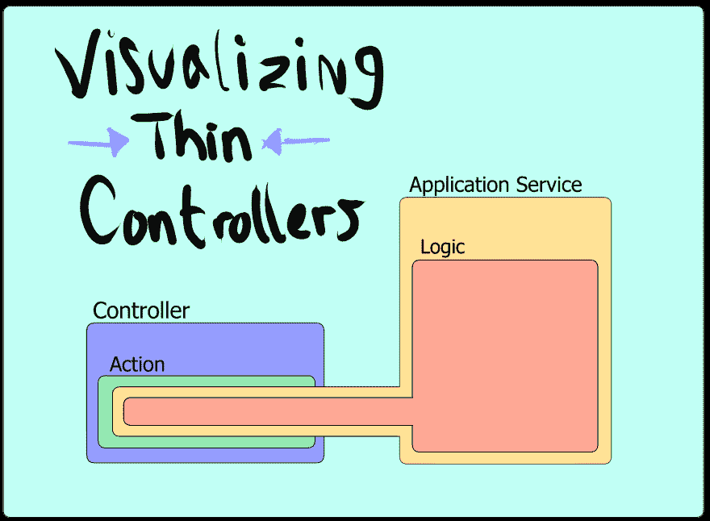
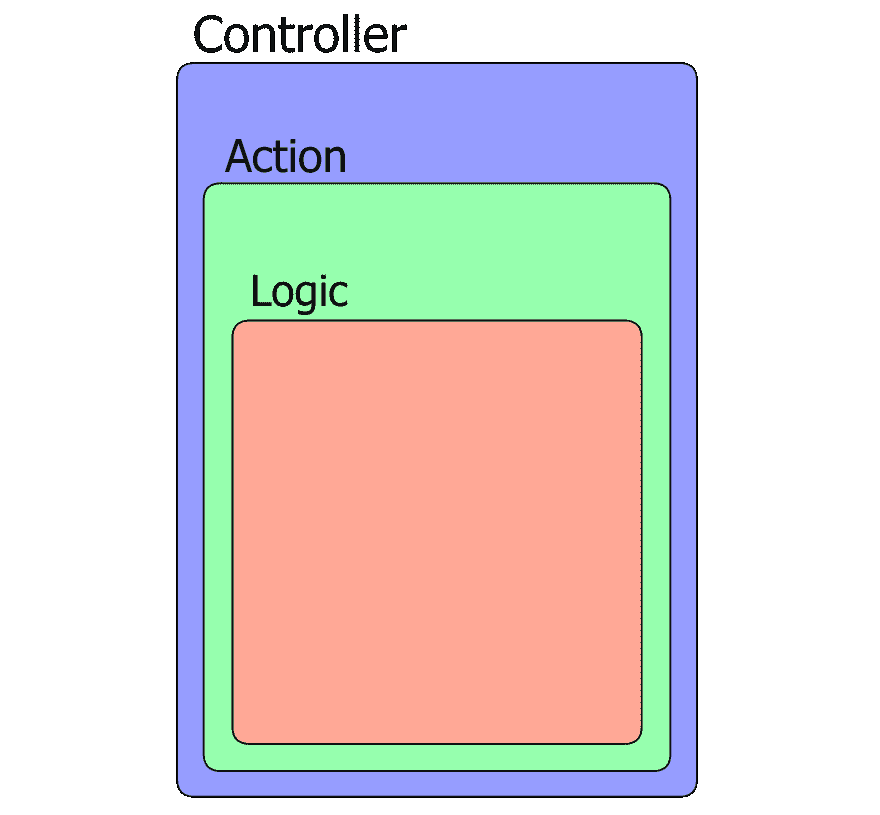
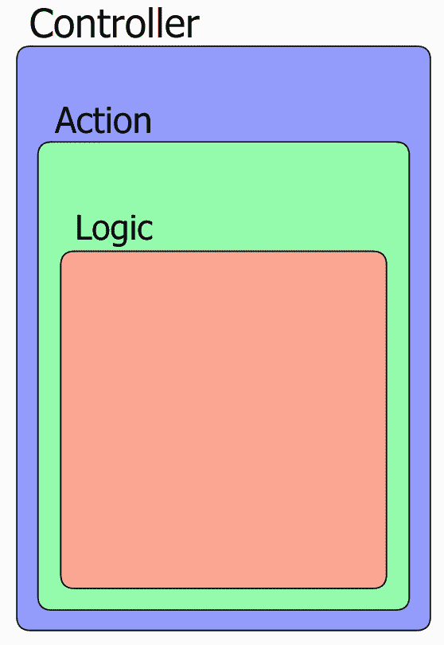
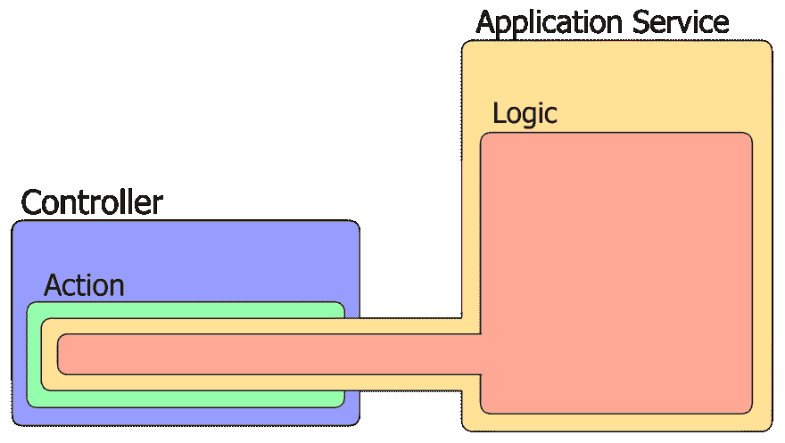
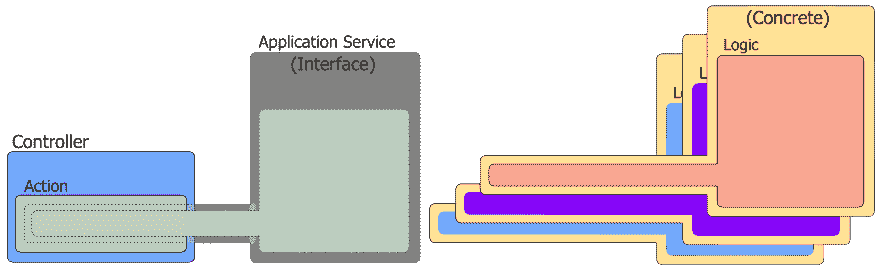
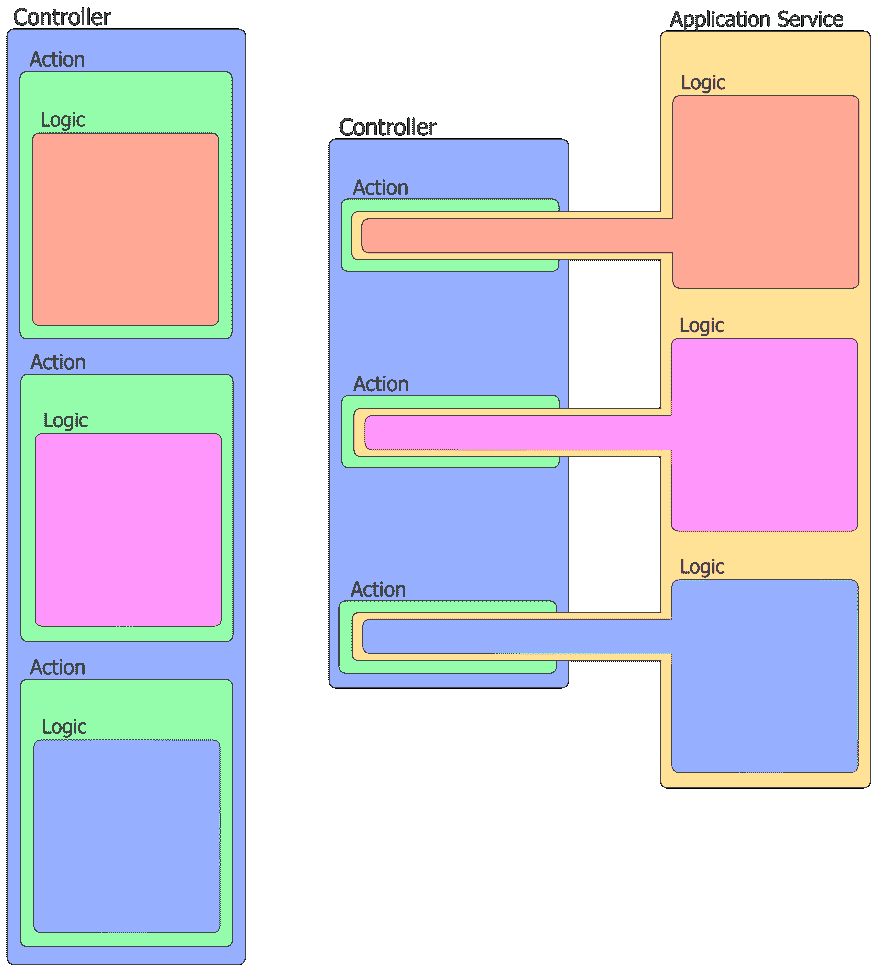
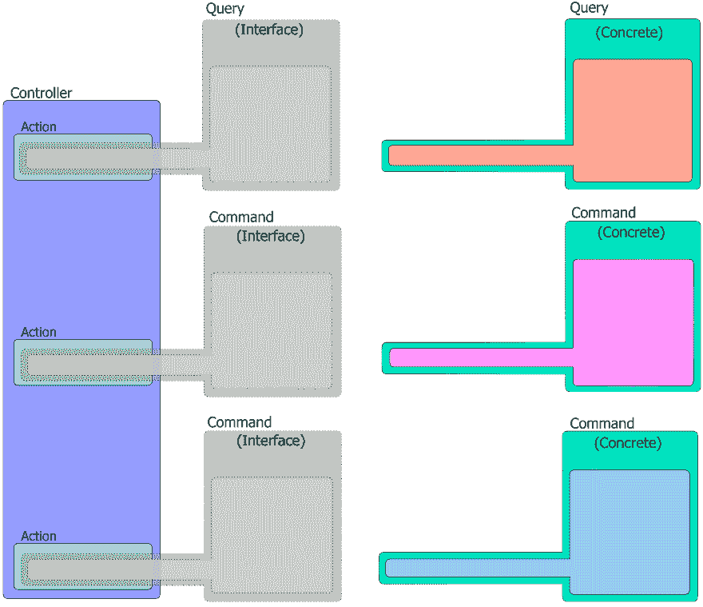

# 通过固体原理可视化瘦 ASP.NET 控制器

> 原文：<https://dev.to/makingloops/visualizing-thin-aspnet-controllers-via-solid-principles-33nl>

[](https://res.cloudinary.com/practicaldev/image/fetch/s--lnFmV1Jl--/c_limit%2Cf_auto%2Cfl_progressive%2Cq_auto%2Cw_880/https://thepracticaldev.s3.amazonaws.com/i/n5qjmssanu75ossseym4.png)

你可以解释一个代码气味像*脂肪*控制器，直到你脸色发青，但有些事情只是*点击*与图片更好。

为了庆祝新推出的[瘦控制器配方](https://makingloops.com/products/thin-controller-recipes)，我想检查一个对许多人来说特别麻烦的问题。NET 开发人员。

> “我不明白为什么要将业务逻辑从控制器转移到服务中……”

如果不清楚为什么您可以从无业务逻辑控制器中获益，那么您可能会错过一些软件设计基础，这些基础在您阅读完本文后会变得更有意义。

也就是说，如果大师们要宣扬瘦控制器的全能状态，我们首先必须理解为什么胖控制器是一种代码气味，瘦控制器的真正含义是什么，为什么它对我们有益。

而且，由于 thin 是一个相对的形容词，我们将使用图片(和一些动画 gif，哇！)来传达。

## 肥胖控制器

在我拿出我可信赖的微软笔之前，让我们来看一些代码，这样你就可以在心里把它映射到图片上(反之亦然)。

下面是一个银行贷款申请的理论控制器。这种方法通过根据请求的金额和个人信用评分计算贷款条件来处理贷款请求。

```
public class LoanController : Controller
{
    private ILoanQuoteRepository _loanQuoteRepository;

    public LoanController(ILoanQuoteRepository repository)
    {
        _loanQuoteRepository = repository;
    }

    [HttpPost, Route("api/loans/quotes/")]
    public IActionResult CreateLoanQuote(LoanQuoteRequest request)
    {
        var quote = new LoanQuote(request.Amount, request.CreditScore);

        quote.CalculateLoanTerms();

        _loanQuoteRepository.SaveQuote(quote); 

        var response = new LoanQuoteResponse();
        response.Amount = quote.Amount;
        response.RequestStatus = quote.Decision;
        response.InterestRate = quote.InterestRate;

        return Ok(response);
    }
} 
```

因此，我们从控制器的动作方法中实现报价创建业务流程的所有逻辑开始。

这是脂肪。

但它不是真空中的脂肪，它是相对于如果应用坚实的原理它可能成为的脂肪。

老实说，上面的控制器相当驯服，但是控制器中的业务逻辑是，**随着时间的推移，它会变得更加强大。必要时，你或者下一个需要沿着相同的代码路径添加一些特性的开发人员会把它放在那里*ri light*。就像下一个，下一个，下一个。**

[](https://res.cloudinary.com/practicaldev/image/fetch/s--zgolIx-x--/c_limit%2Cf_auto%2Cfl_progressive%2Cq_auto%2Cw_880/https://makingloops.com/public/fat-controller.png)

*我不喜欢 UML 图，这些柔和的色彩似乎治愈了我的冬季忧郁……*

我们在同一页上，紫色代表`Controller`类，绿色代表控制器*动作*方法，浅红色代表逻辑。

请特别注意绿色的*动作*，因为它们是控制器*厚度*的最佳视觉指示器(尽管在您的控制器中存在其他*非动作*方法也可能是一种代码气味。)

### 那么，为什么这是一种码味呢？

好代码的定义似乎会随着时代的变化而变化。10 年或 20 年前的好策略如今已不再重要。

今天的重点是*灵活性*。

我们的软件变化*很快*，所以*好的*代码是*容易变化*的代码，而*不*那么容易*破坏*的代码。

我能想到代码在上述控制器的*肥胖度*附近开始发臭的几个原因:

**1)由于许多原因，它可能需要随着实际的代码编辑而改变。**

控制器现在是存储库、请求和响应 dto 以及`LoanQuote`域实体的客户端，因此如果其中任何一个发生变化，它都可能会影响并要求控制器发生变化。

当然，改变不是坏事，但它有风险。可以用一种*风险更小*的方式来写吗？例如，更易测试，还是更容易理解？

你不能孤立地测试控制器。

为了测试控制器，您还必须测试`LoanQuote`的`CalculateLoanTerms()`方法。

包含领域逻辑*邀请*你和其他开发者添加更多本地相关的逻辑。

我之前提到过这个。大方法鼓励懒惰，因此，更大的方法。

你有没有尝试过用一个庞然大物的方法或者一个上帝的物体来缠绕你的脑袋？

一点都不好玩。

控制器内部的代码不容易重用。

我已经稍微改变了我对可重用性的立场，以前我认为在所有情况下这都是一件值得努力的事情，而现在——没那么多了。但是，胖控制器*确实*暗示了这样一种可能性，即你已经为某个进程准备了逻辑，你将不得不把它写在多个地方。

由于控制器位于用户和域之间的屏障，并且应用程序通常有多种方式来执行同一任务，因此您有可能在每条进入路径上都有重复。

### 我们能做些什么呢？

这就是坚实的原则发挥作用的地方。

坚实的原则是作为一套理想而出现的，我们可以以此为目标来保持代码的适应性和灵活性。

口头禅“控制器应该是瘦的”实际上是在召唤一个控制器遵守几个坚实的原则来对抗我上面提到的问题。

应该是“唷老兄，你的控制器做得太多了！”

在这种情况下，我们可以从 **S** 、 **O** 、 **D** 中获益。

## 瘦控制器采用单一责任原则

单一责任原则(SRP)指出，理想情况下，组件应该只有一个变更的理由。

通过*缩小*一个对象的职责范围，你划分了行为，这样**更容易推理**(使未来的改变更容易)，你使**更稳定**，因为它不应该需要被修改，除非有一个特性或错误涉及到那个单一的职责。

在我们的例子中，当您有一个具有多种职责(映射请求、响应、处理报价实体和存储库)的控制器时，您有一个很大的潜在变化面。

[](https://res.cloudinary.com/practicaldev/image/fetch/s--uxuL8QoX--/c_limit%2Cf_auto%2Cfl_progressive%2Cq_66%2Cw_880/https://makingloops.com/public/fat-controller-changes.gif)

我用闪烁的红色和绿色方块来表示变化的区域。绿色表示添加代码，红色表示修改或删除现有代码。

我们如何改进这个设计，使它不那么吸引熵？

## 用应用服务收缩控制器的变化面

一个直接的策略是将协调 dto 和`LoanQuote`之间工作的逻辑转移到通常被称为*应用服务*的地方。

然后，可以为应用服务分配该任务编排的单一职责，**让控制器成为 HTTP 请求和服务方法**之间的简单网关。

[](https://res.cloudinary.com/practicaldev/image/fetch/s--i_r4JhQw--/c_limit%2Cf_auto%2Cfl_progressive%2Cq_auto%2Cw_880/https://makingloops.com/public/app-service.png)

您会注意到一些事情:

1)通过应用更好的关注点分离，控制器(通过绿色动作)明显*更薄*。这意味着控制器本身更容易推理，并且不需要经常更换。

2)我们现在有两个对象，而不是一个。这确实增加了复杂性，所以有一个权衡。

3)我们只是在别处铲掉了控制器的周长。稍后您将看到应用程序服务如何遭受与我们的控制器相同的*膨胀*问题。

在代码中，我们将创建一个看起来很像原始控制器的服务类。

```
public class LoanService
{
    private ILoanQuoteRepository _loanQuoteRepository;

    public LoanService(ILoanQuoteRepository repository)
    {
        _loanQuoteRepository = repository;
    }

    public LoanQuoteResponse CreateQuote(decimal amount, int creditScore)
    {
        var quote = new LoanQuote(amount, creditScore);

        quote.CalculateLoanTerms();

        _loanQuoteRepository.SaveQuote(quote);

        var response = new LoanQuoteResponse();
        response.Amount = quote.Amount;
        response.RequestStatus = quote.Decision;
        response.InterestRate = quote.InterestRate;

        return response;
    }
} 
```

然后通过将控制器的旧工作委托给新服务来缩小控制器。

```
public class LoanController : Controller
{
    private LoanService _loanService;

    public LoanController(LoanService loanService)
    {
        _loanService = loanService;
    }

    [HttpPost, Route("api/loans/quotes/")]
    public IActionResult CreateLoanQuote(LoanQuoteRequest request)
    {
        var loanQuoteResponse = _loanService.CreateQuote(request.Amount, request.CreditScore);

        return Ok(response);
    }
} 
```

所以，这是更好的，但我们可以在这个设计中增加一些 *flex* 吗？

## 编程*到*接口支持扩展，进一步减少变化面

在创建应用程序服务时，我倾向于将实现隐藏在接口后面，以便更容易测试，通过 decorators 进行扩展，并尽可能清楚地表明我的松散耦合意图。

[](https://res.cloudinary.com/practicaldev/image/fetch/s--LMc3GtQ2--/c_limit%2Cf_auto%2Cfl_progressive%2Cq_auto%2Cw_880/https://makingloops.com/public/app-service-interface.png)

*我开始制作覆盖在界面上的实现动画，但最终看起来就像是一大堆控制器的堕落……*

关于这种设计的一个有趣的观察是，如果接口的方法签名保持不变，那么您的变化表面就减少到了注入点。理论上，你只需要添加新的实现或扩展，而不是修改旧的。

我不能说它在现实世界中是否经常如此，但它是开放/封闭固体原理的一个很好的例子。

您的控制器现在可以保持不变，而您的应用程序服务可以通过 decorators 进行扩展或简单地完全换出，所有这些都在您的依赖注入容器的配置站点中进行管理。

界面:

```
public interface ILoanService
{
    LoanQuoteResponse CreateQuote(decimal amount, int creditScore);
} 
```

该服务只是实现了接口。

```
public class LoanService : ILoanService
{
   //...
} 
```

并且控制器指定用于注入的接口而不是具体实现。

```
public class LoanController : Controller
{
    private ILoanService _loanService;

    public LoanController(ILoanService loanService)
    {
        _loanService = loanService;
    }

    //...
} 
```

一个缺点是，通过创建一个只有一个实现的接口，你确实会通过更多需要管理的事情来增加复杂性。

一个流行的软件工程原则是编程抽象，而不是实现，但是如果我们盲目地把一切都放在一个接口后面，我们总是更好吗？有些人认为，如果你发现*确实*需要接口的好处，那么你总是可以在那个时间点创建一个*。*

我认为这是公平的，但我有时仍然会在背后工作，以使我的意图清晰。

好了，现在我们已经将任务委托给了一个接口，我们有了一个更加灵活和模块化的设计。类的职责被更好地定义，我们已经提供了扩展点，我们已经将服务实现从控制器中分离出来。

这都是好的，还是可以酸的？

## 臃肿的应用服务

我在上面提到过，应用服务也会膨胀。

我们得到的不是胖控制器，而是胖应用层。

我认为后者比前者更好，只是因为责任更清晰，但这种结果很可能是应用程序服务做了太多事情的结果。

控制器的现实通常与我在开始时展示的简单的单动作控制器大不相同。我们通常至少有几个动作，每个动作都有膨胀的可能。

[](https://res.cloudinary.com/practicaldev/image/fetch/s--G1IQlUuB--/c_limit%2Cf_auto%2Cfl_progressive%2Cq_auto%2Cw_880/https://makingloops.com/public/multi-action-fat-controller.png)

记住，绿色动作的大小是脂肪的标志。忽略紫色的控制器类包装。

正如你所看到的，一旦你为最初的编排逻辑找到了一个舒适的家，趋势就是把一切都扔在那里，以满足*所有*你的控制器需要执行的工作。

```
public class LoanController : Controller
{
    private ILoanService _loanService;

    public LoanController(ILoanService loanService)
    {
        _loanService = loanService;
    }

    [HttpGet, Route("api/loans/quotes/{id}")]
    public IActionResult GetQuote(int id)
    {
        var quote = _loanService.GetExistingQuote(id);

        return Ok(quote);
    }

    [HttpPost, Route("api/loans/quotes/")]
    public IActionResult CreateLoanQuote(LoanQuoteRequest request)
    {
        var loanQuoteResponse = _loanService.CreateQuote(request.Amount, request.CreditScore);

        return Ok(response);
    }

    [HttpPost, Route("api/loans/quotes/{id}")]
    public IActionResult DeleteQuote(int id)
    {
        _loanService.DeleteQuote(id);

        return NoContent();
    }
} 
```

和应用程序服务，处理这一切:

```
public class LoanService : ILoanService
{
    private ILoanQuoteRepository _loanQuoteRepository;

    public LoanService(ILoanQuoteRepository repository)
    {
        _loanQuoteRepository = repository;
    }

    public LoanQuoteResponse GetExistingQuote(int quoteId)
    {
        var quote = _loanQuoteRepository.GetByID(quoteId);

        var response = new LoanQuoteResponse();
        response.Amount = quote.Amount;
        response.RequestStatus = quote.Decision;
        response.InterestRate = quote.InterestRate;

        return response;
    }

    public LoanQuoteResponse CreateQuote(decimal amount, int creditScore)
    {
        var quote = new LoanQuote(amount, creditScore);

        quote.CalculateLoanTerms();

        _loanQuoteRepository.SaveQuote(quote);

        var response = new LoanQuoteResponse();
        response.Amount = quote.Amount;
        response.RequestStatus = quote.Decision;
        response.InterestRate = quote.InterestRate;

        return response;
    }

    public void DeleteQuote(int quoteId)
    {
        _loanQuoteRepository.Delete(quoteId);
    }
} 
```

当您的应用程序服务有这么多职责时，将其放在接口后面的好处肯定会减少。

你很少会在这么大的东西上修饰一个方法，把它换出来也不太可能，因为你需要一个理由来重新实现每个方法。

对此我们能做些什么？

## 通过 CQRS 拆分 fat 应用服务

对于这些胖服务层，一个好的解决方案是再次应用单一责任原则，将它们分成几个更小的、单一用途的类。

随之而来的一个流行策略是*命令查询责任分离* (CQRS)。

最简单的解释是，与查询相关的逻辑(实际上是数据库`SELECT`的)与修改逻辑(数据库`UPDATE`、`INSERT`和`DELETE`的)是分离的

考虑一下大多数标准语言 API 在 I/O 方面如何区分`Reader`和`Writer`。通过将这些任务分开，它们更容易推理和修改，并且它们不会包含干扰其他任务的代码。

我在 CQRS 看到的一个非常普遍的趋势是使用 Jimmy Bogard 的 Mediatr 库，并创建通过执行管道传播的小型查询和命令类。

*[这条](https://lostechies.com/jimmybogard/2015/05/05/cqrs-with-mediatr-and-automapper/)出自吉米本人的展示手法。*

我还没有接触过 Mediatr，所以我将讨论一种实现 CQRS 的简化方法。

保持 CQRS 的简单仅仅意味着保持查询和命令代码路径的分离，为了修复我们臃肿的应用程序服务，我们可以为每个查询或命令创建单独的类，并将它们注入控制器。

我也很喜欢德里克·科马丁的文章《T2》。

[](https://res.cloudinary.com/practicaldev/image/fetch/s--9Kv0zH99--/c_limit%2Cf_auto%2Cfl_progressive%2Cq_auto%2Cw_880/https://makingloops.com/public/cqrs.png)

啊，它们就像可爱的应用服务迷你版！

这与控制器负责的标准 HTTP 动词非常一致。

处理命令的动作通常与 HTTP POST、PATCH、DELETE、PUT(可能还有一些我记不清的模糊动作)一起工作，而查询往往是您的目标。

这是一个非常基本的代码示例，说明了这些单一用途的命令和查询类。

首先，查询一个:

```
public class QuoteQuery : IQuoteQuery
{
    private ILoanQuoteRepository _loanQuoteRepository;

    public QuoteQuery(ILoanQuoteRepository repository)
    {
        _loanQuoteRepository = repository;
    }

    public void Execute(int quoteId)
    {
        var quote = _loanQuoteRepository.GetByID(quoteId);

        var response = new LoanQuoteResponse();
        response.Amount = quote.Amount;
        response.RequestStatus = quote.Decision;
        response.InterestRate = quote.InterestRate;

        return response;
    }
} 
```

一个用于报价创建命令:

```
public class CreateQuoteCommand : ICreateQuoteCommand
{
    private ILoanQuoteRepository _loanQuoteRepository;

    public CreateQuoteCommand(ILoanQuoteRepository repository)
    {
        _loanQuoteRepository = repository;
    }

    public void Execute(decimal amount, int creditScore)
    {
        var quote = new LoanQuote(amount, creditScore);

        quote.CalculateLoanTerms();

        _loanQuoteRepository.SaveQuote(quote);

        var response = new LoanQuoteResponse();
        response.Amount = quote.Amount;
        response.RequestStatus = quote.Decision;
        response.InterestRate = quote.InterestRate;

        return response;
    }
} 
```

一个用于删除命令:

```
public class DeleteQuoteCommand : IDeleteQuoteCommand
{
    private ILoanQuoteRepository _loanQuoteRepository;

    public DeleteQuoteCommand(ILoanQuoteRepository repository)
    {
        _loanQuoteRepository = repository;
    }

    public void Execute(int quoteId)
    {
        _loanQuoteRepository.Delete(quoteId);
    }
} 
```

为了使用它们，我们将它们注入到控制器中，并对相关对象调用 execute 方法:

```
public class LoanController : Controller
{
    private IQuoteQuery _getQuote;
    private ICreateQuoteCommand _createQuote;
    private IDeleteQuoteCommand _deleteQuote;

    public LoanController(IQuoteQuery quoteQuery, ICreateQuoteCommand createQuote, IDeleteQuoteCommand deleteQuote)
    {
        _quoteQuery = quoteQuery;
        _createQuote = createQuote;
        _deleteQuote = deleteQuote;
    }

    [HttpGet, Route("api/loans/quotes/{id}")]
    public IActionResult GetQuote(int id)
    {
        var quote = _quoteQuery.Execute(id);

        return Ok(quote);
    }

    [HttpPost, Route("api/loans/quotes/")]
    public IActionResult CreateLoanQuote(LoanQuoteRequest request)
    {
        var loanQuoteResponse = _createQuote.Execute(request.Amount, request.CreditScore);

        return Ok(response);
    }

    [HttpPost, Route("api/loans/quotes/{id}")]
    public IActionResult DeleteQuote(int id)
    {
        _deleteQuote.Execute(id);

        return NoContent();
    }
} 
```

## 总结

现在，我们有了一个很好的可见设计演变，它显示了一个胖控制器的逐渐变薄。

通过将单一责任原则应用到膨胀的每个领域，我们将复杂性分解成更小的、更容易管理的类，这些类可以独立地改变。

我们将变更面减少到分割的单元，这将理想地导致更稳定的代码库。

一个改变没有那么大风险并且相对容易的地方。

如果你想更深入地将单一责任应用于其他控制器任务，你可以[跳到最初的帖子](https://makingloops.com/visualizing-thin-controllers/#mc_embed_signup)，在底部进入我的个人列表，我会将瘦控制器配方集中的*映射 dto*配方发送给你。