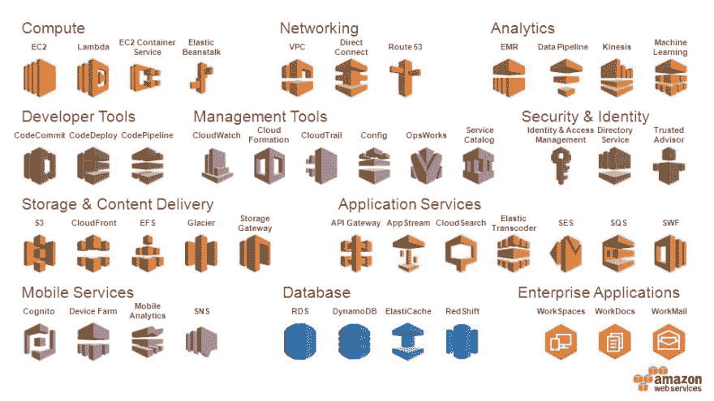

# 词汇不是工作保障

> 原文：<https://dev.to/laurieontech/vocabulary-is-not-job-security-39gb>

为了纪念我在印地的演讲。本周我想谈谈词汇和交流。前几天，我就“舔饼干”现象进行了一场精彩的对话。

> 劳里[@ laurieontech](https://dev.to/laurieontech)[@ MrTurnerj](https://twitter.com/MrTurnerj)哈哈丫，直到最近才发现别人都不用这个词。但是我觉得效果真的很好！舔饼干——当你自己都吃不完的时候，你阻止别人从盘子里拿走一些东西。🍪2019 年 4 月 10 日上午 11:53

这个概念可以用许多方式来应用。从构建应用程序的方式到开发者工作的透明性。然而，我认为大多数舔饼干的例子都是偶然发生的。很多时候，只是没有人能够理解一个特定的工程师在做什么。因此，默认情况下，他们成为唯一能够做这项工作的人。

# 哦，我们忘记得真快！

有人记得刚进入这个行业是什么样子吗？我很幸运，我去学校学了一些。所以我知道什么是 IDE，我知道数据结构的正确术语，等等。但是我工作的第一天仍然是一个不同的世界！

这个清单可以一直列下去。在这么多不同的方向。但是在现实生活的编码环境中存在着如此广度和深度的词汇！有一半的时间人们会谈论他们，我会迷失。

这种情况只增不减。想想所有的云服务提供商工具...
[T3】](https://res.cloudinary.com/practicaldev/image/fetch/s--JeJD77j1--/c_limit%2Cf_auto%2Cfl_progressive%2Cq_auto%2Cw_880/https://images.slideplayer.com/24/7508214/slides/slide_2.jpg)

# 担任守门的 Vocab

这个永无止境的工具、名称和词汇旋转门的问题是，它让我们行业之外的人很难理解我们在谈论什么。

不幸的是，曾经有人故意这样做。因此，学习技术术语就像学习另一种语言，甚至超越了代码本身。所以一旦你知道如何在行话和外行术语之间转换，你就为自己创造了相当好的工作保障。

我不是在咆哮我们不应该推广这个专有词汇的所有理由，而是在这里尝试和帮助！我想把重点放在你和你的公司可以减少工作中必要词汇的几个方面。这将有助于入职，有助于交接，并最终减少系统的瓶颈。

# 缩略词

我有一百万个关于缩写的有趣故事。但事实是，我们已经知道这是一种可怕的交流方式，但我们还是这样做了！如果你在写作，你需要在第一次使用首字母缩写词的时候定义它们。

如果你在说话？我想举一个例子来说明一个广为人知的缩写词，它从实际的术语中被缩短到足以证明它的用途。我肯定有一两个。但是我还是要告诉你第一次用的时候要定义！在大多数情况下，没有足够好的理由用一个缩写词来代替它所代表的术语。

# 产品名称

我们不擅长给事物命名。这是一种讽刺，因为我们总是让计算机科学的学生使用信息丰富的变量名和函数名。然而，某个地方的某个人认为产品名称是为了营销而不是为了理解。

在这个领域，我们有很多这样的例子。如果您正在构建一个仅供内部使用的工具，请不要使用“有趣”的名称。对谁都没有帮助。

如果你在为大众消费制造东西？我希望你的登陆页面的第一行是对它是什么和它做什么的解释。而不是一些营销术语。我在看着你[木偶！](https://puppet.com/)

# 不知道自己不知道什么

现实情况是，工程领域的交流是如此困难和“难以沟通”,部分原因是我们研究了很多人们在日常生活中不会遇到的概念。我们需要这些东西的名字！

这个问题没有灵丹妙药。但好消息是，无论你在职业生涯的哪个阶段，我们都在积极学习。科技发展太快，我们任何人都无法在一个地方停留太久。这其实是一个重大的好处！

怎么学最好？什么样的沟通方式最有效，最不混乱？你知道这些问题的答案。

...当你是领域专家的时候，试着记住这一点？意识到潜在的误解可能会让你慢下来，让你足够专注，从而更容易被理解。更好的是，这种心态和把自己定位为一个学习伙伴让你变得平易近人，促使你周围的人提出问题。

毕竟，我们都在互相学习！

> 莱弗🌵🌺@ deviller due作为一名软件工程师，我最擅长的技能是我愿意打断整个会议，宣布“我他妈的不知道那些话是什么意思，请解释一下”
> 
> 一旦有人首先承认，总会有其他人抱怨困惑21:16PM-05 2019 年 4 月

> 布莱恩·p·霍根[@布霍根](https://dev.to/bphogan)我曾经告诉学生“如果你感到困惑，就问一个问题。我向你保证，其他人也会感到困惑，但不敢问，因为他们不想显得愚蠢。如果你不明白某人在会议中说了什么，就问问题。2019 年 04 月 08 日 22 点 03 分